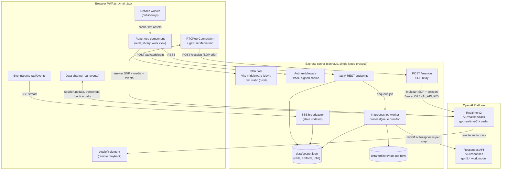
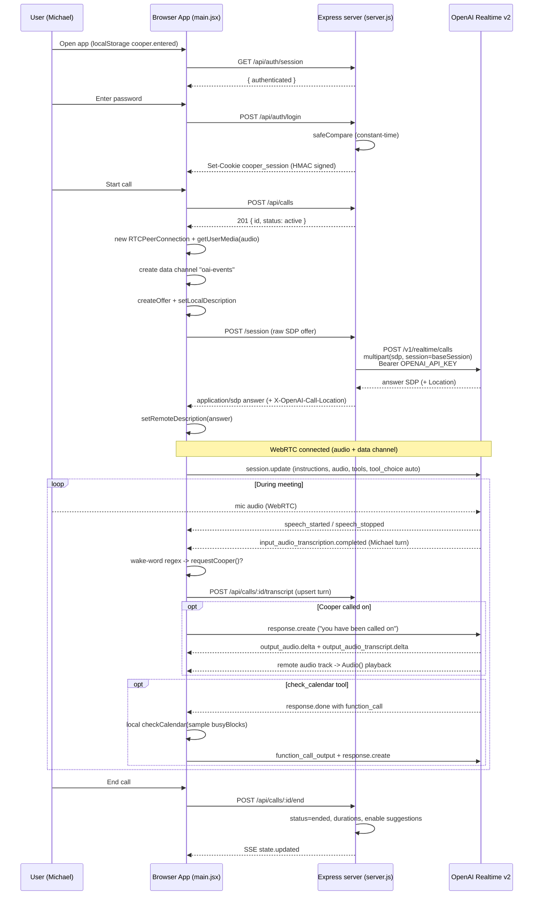
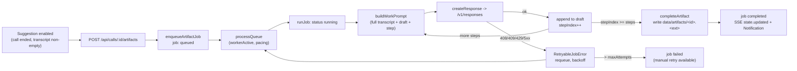

# Cooper — Technical Overview & Architecture

> Engineer-facing reference for the Cooper realtime voice assistant. Grounded in the actual source: `server.js` (1110 lines) and `src/main.jsx` (1707 lines).

---

## Table of Contents

1. [Purpose & Summary](#1-purpose--summary)
2. [High-Level Architecture](#2-high-level-architecture)
3. [Architecture Diagram](#3-architecture-diagram)
4. [Component Inventory](#4-component-inventory)
5. [Voice Call Lifecycle](#5-voice-call-lifecycle)
6. [Call Sequence Diagram](#6-call-sequence-diagram)
7. [Post-Call Job Loop Lifecycle](#7-post-call-job-loop-lifecycle)
8. [Data Model & Persistence](#8-data-model--persistence)
9. [External APIs & Models](#9-external-apis--models)
10. [Tech Stack](#10-tech-stack)
11. [Reliability & Scale Notes](#11-reliability--scale-notes)

---

## 1. Purpose & Summary

**Cooper** is a local-first React + Express progressive web app — an AIRES executive voice assistant built for a single user ("Michael", CTO/CPO), gated behind a single shared password. It uses the **OpenAI Realtime v2 API over WebRTC** to participate in live meeting audio (listening silently by default, speaking only when called on or woken by a wake word), and the **OpenAI Responses API** to generate post-call Markdown and HTML artifacts (operating briefs, execution plans, PRDs, HTML prototypes, etc.) through fixed multi-step prompt chains. All state — calls, transcripts, jobs, and artifact records — persists to a single local JSON file (`data/cooper.json`), with generated artifact files written to `data/artifacts/`. The Express server doubles as the dev/prod web host (mounting Vite in middleware mode for development, or serving the `dist/` build in production) and as a credential-shielding relay to OpenAI: the `OPENAI_API_KEY` never reaches the browser.

---

## 2. High-Level Architecture

Cooper is a single-Node-process system. The browser PWA is the only client; the Express server is the only backend.

- **Browser PWA client** (`src/main.jsx`): a single React 19 `App` component. Handles entry/splash gating, password auth, WebRTC peer connection + microphone capture, the Realtime data-channel event loop, live transcript capture and wake-word detection, the saved-call library, and artifact rendering (Markdown via `markdown-it` + DOMPurify, Mermaid via lazy import, HTML prototypes in a sandboxed `<iframe>`). Installable as a PWA via `public/manifest.webmanifest` and a cache-first `public/sw.js`.

- **Express server** (`server.js`): one Node process that (a) **serves the SPA** — in non-production it mounts Vite in middleware mode (`createViteServer`, `appType: "spa"`, `server.js:1098-1105`); in production it serves the static `dist/` build with SPA fallback to `dist/index.html` (`server.js:1093-1097`); and (b) **proxies OpenAI** — relaying WebRTC SDP for Realtime sessions and driving the Responses API job loop. It also owns auth, the JSON datastore, the SSE event stream, and the in-process job worker.

- **OpenAI Realtime v2 over WebRTC**: the client opens an `RTCPeerConnection`, captures mic audio via `getUserMedia`, creates a data channel named `oai-events`, and POSTs its SDP offer to the server's `/session` endpoint. The server relays that offer (plus the base session config) to `https://api.openai.com/v1/realtime/calls` and returns the answer SDP. Live events flow over the data channel; remote audio plays through an `<audio>` element.

- **Responses API job loop**: after a call ends, the client requests an artifact. The server enqueues a job, and a single in-process worker walks each recipe's fixed steps, calling `https://api.openai.com/v1/responses` per step with pacing, retry/backoff, and crash recovery, finally writing the artifact file to disk.

- **Local JSON persistence**: all durable state lives in `data/cooper.json`, written through a serialized in-process promise queue. Every write broadcasts a `state.updated` event over Server-Sent Events so connected clients refetch `/api/state`.

---

## 3. Architecture Diagram



---

## 4. Component Inventory

| Component | Role | Location |
|---|---|---|
| Express app + config | PORT, data/artifact/db paths, env config | `server.js:11-25` |
| Body parsers | `application/sdp` + `text/plain` 2mb, JSON 4mb | `server.js:33-34` |
| Auth middleware | Gates `/session` and `/api/*` on password set + valid session | `server.js:74-93` |
| `isAuthenticated` | Verifies cookie HMAC (constant-time) and `exp` | `server.js:954-970` |
| `signSession` | Mints `base64url(payload).HMAC-SHA256` cookie value | `server.js:972-982` |
| `safeCompare` | `timingSafeEqual` after length check | `server.js:984-991` |
| `serializeCookie` | Sets HttpOnly, SameSite=Lax, Secure (prod only), Path, Max-Age | `server.js:1012-1020` |
| Auth endpoints | `/api/auth/login`, `/logout`, `/session` | `server.js:954-1019` |
| `cooperInstructions` | System prompt for the Realtime agent | `server.js` (instructions block) |
| `baseSession` | Realtime session config (model, audio, VAD, voice) | `server.js:116-141` |
| `POST /session` | SDP relay to `/v1/realtime/calls` | `server.js:200-243` |
| `artifactRecipes` | 6 fixed multi-step artifact prompt chains | `server.js:143-198` |
| `GET /api/state` / `publicState` | Public state snapshot | `server.js:245-248`, `793-812` |
| `GET /api/events` | SSE event stream | `server.js:250-263` |
| Call REST endpoints | list/get/create/patch/transcript/end | `server.js:265-369` |
| `POST /api/calls/:id/artifacts` | Request artifact → enqueue job | `server.js:371-382` |
| `GET /api/artifacts/:id/content` | Serve artifact file (basename-only) | `server.js:384-398` |
| `POST /api/jobs/:id/retry` | Re-queue a failed job | `server.js:400-422` |
| `enqueueArtifactJob` | Validate + create queued job | `server.js:424-471` |
| `queueWorker` / `processQueue` | Single-worker scheduling + pacing | `server.js:473-477`, `479-514` |
| `runJob` | Per-step recipe execution loop | `server.js:516-611` |
| `completeArtifact` | Write artifact file, mark job complete | `server.js:613-656` |
| `createResponse` | POST `/v1/responses`, model selection, retry classification | `server.js:658-703` |
| `buildWorkPrompt` | Assemble per-step prompt (incl. full transcript) | `server.js:705-745` |
| `extractOutputText` | Read `output_text` / `output[].content[]` | `server.js:747-756` |
| DB init / `readDbRaw` | JSON datastore bootstrap + read | `server.js:758-779` |
| `updateDb` / `writeQueue` | Serialized write + SSE broadcast | `server.js:781-791` |
| `publicJob` | Strip draft, cap logs to last 40 | `server.js:814-817` |
| `defaultSuggestions` | 6 fixed suggestion kinds | `server.js:833-842` |
| `normalizeTranscript` / `normalizeSpeaker` | Transcript entry normalization | `server.js:844-856` |
| `sameTranscriptTurn` | Transcript upsert matcher | `server.js:866-871` |
| `artifactFileName` | Basename `.pop()` (path-traversal mitigation) | `server.js:873-878` |
| `extractHtmlDocument` | Pull HTML from job draft | `server.js:899-916` |
| Crash recovery | Reset stuck `running` jobs → `queued` on boot | `server.js:1063-1090` |
| Vite middleware (dev) | `createViteServer`, `appType: spa` | `server.js:1098-1105` |
| Static/dist host (prod) | Serve `dist/`, SPA fallback | `server.js:1093-1097` |
| React `App` | Single-component frontend | `src/main.jsx:122+` |
| `toolDefinition` | Client-side `check_calendar(date,time)` tool | `src/main.jsx:53-71` |
| `sessionUpdate` | `session.update` payload sent on data-channel open | `src/main.jsx:73-120` |
| `connect()` | RTCPeerConnection + getUserMedia + offer/answer | `src/main.jsx:520+` |
| `handleServerEvent` | Realtime event → UI state mapping + wake word | `src/main.jsx:420-518` |
| `handleFunctionCall` | Local `check_calendar` stub | `src/main.jsx:371-392` |
| `requestCooper` | Force Cooper to speak (call/typed/wake word) | `src/main.jsx:394-418` |
| Artifact rendering | Markdown + DOMPurify, Mermaid, sandboxed iframe | `src/main.jsx:1442`, `1588`, `1594-1615` |
| PWA assets | manifest + service worker + icon | `public/manifest.webmanifest`, `public/sw.js`, `public/icons/cooper.svg` |

---

## 5. Voice Call Lifecycle

The full path from app open to call end:

1. **Entry / splash** — gated by `localStorage["cooper.entered"]`. Auth state is checked via `GET /api/auth/session`.
2. **Auth** — the password gate POSTs to `/api/auth/login` (`credentials: same-origin`). The server compares the password to `appPassword` with `safeCompare` (constant-time) and, on success, mints the HMAC-signed `cooper_session` cookie. All `/session` and `/api/*` routes require both that `appPassword` is configured **and** the request is authenticated.
3. **createCall** — the client creates a call record via the call REST endpoints (`POST /api/calls`, `server.js:280-300`), yielding a `{id, title, status: "active", ...}` row.
4. **RTCPeerConnection + getUserMedia** — `connect()` (`src/main.jsx:520+`) constructs a `new RTCPeerConnection` (no STUN/TURN config — browser defaults), requests microphone audio via `getUserMedia` with `echoCancellation`/`noiseSuppression`/`autoGainControl`, and `addTrack`s it. An `ontrack` handler pipes the remote audio track into an autoplay `Audio()` element.
5. **Data channel `oai-events`** — the client creates the `oai-events` data channel. On `open`, it marks `connected` and sends the `sessionUpdate` payload.
6. **SDP relay via `/session`** — the client creates an SDP offer, calls `setLocalDescription`, then POSTs the raw offer SDP to `/session`. The server (`server.js:200-243`) builds a multipart `FormData` with fields `sdp` (the offer) and `session` (`JSON.stringify(baseSession)`), POSTs it to `https://api.openai.com/v1/realtime/calls` with `Authorization: Bearer OPENAI_API_KEY` and `OpenAI-Safety-Identifier: cooper-local-dev`, and returns the answer SDP (`application/sdp`), relaying the `Location` header as `X-OpenAI-Call-Location`. The client applies the answer via `setRemoteDescription`. **The API key never reaches the client.** (This is a standing-key server relay, not an ephemeral client-token flow.)
7. **`session.update` with tools** — over the data channel, `sessionUpdate` (`src/main.jsx:73-120`) sends a `session.update` with instructions, audio config mirroring `baseSession`, `tools: [toolDefinition]` (the client-side `check_calendar(date,time)` tool), and `tool_choice: "auto"`.
8. **Transcript & wake word** — `handleServerEvent` (`src/main.jsx:420-518`) maps Realtime events to UI state:
   - `session.created` / `session.updated` — connection state.
   - `input_audio_buffer.speech_started` / `speech_stopped` — "hearing" indicator.
   - `conversation.item.input_audio_transcription.completed` — commits a Michael turn and runs the wake-word regex `/\b(cooper|hey cooper|ok cooper|okay cooper)\b/i`; a match triggers `requestCooper()`.
   - `response.created` / `response.output_audio.delta` / `response.output_audio.done` — "speaking" state.
   - `response.output_audio_transcript.delta` / `.done` — Cooper transcript capture (buffered per response/item via `outputTranscriptBuffersRef` / `textTranscriptBuffersRef`, then persisted to the server).
   - `response.done` — collects `function_call` items → `handleFunctionCall`.
   - `error` — surfaced to UI.

   Because `baseSession` sets `turn_detection.create_response: false`, **Cooper is silent by default** — VAD turns do not auto-trigger a response. Cooper speaks only via `requestCooper()` (the "Call Cooper" button, typed prompt, or wake word), which optionally inserts a `conversation.item.create` message then issues `response.create` with "you have been called on" instructions (`src/main.jsx:394-418`). The `check_calendar` tool runs entirely client-side against a hardcoded sample `busyBlocks` calendar and replies via `conversation.item.create` function_call_output + `response.create` (`src/main.jsx:371-392`) — there is no real calendar integration.
9. **End** — `POST /api/calls/:id/end` (`server.js:351-369`) sets `status: "ended"`, `endedAt`/`durationSeconds`, and flips the call's `suggestions[].enabled` to `true` (only when the transcript is non-empty). Transcript turns are upserted throughout the call via `POST /api/calls/:id/transcript` (`server.js:323-349`, matched by `sameTranscriptTurn`).

---

## 6. Call Sequence Diagram



---

## 7. Post-Call Job Loop Lifecycle

A single in-process worker turns ended-call suggestions into artifact files via the Responses API.

1. **Suggestion → request** — after a call ends with a non-empty transcript, the 6 fixed `defaultSuggestions` (`server.js:833-842`) become enabled. The client requests one via `POST /api/calls/:id/artifacts` (`server.js:371-382`).
2. **Enqueue** — `enqueueArtifactJob` (`server.js:424-471`) requires the call to exist **and** have a non-empty transcript (else `400`). It creates a `queued` job with `stepCount = recipe.steps.length` and returns `202` with the `publicJob`. `queueWorker` (`server.js:473-477`) schedules `processQueue` if the worker is not already active.
3. **`processQueue` pacing** — `processQueue` (`server.js:479-514`) is a single worker guarded by a `workerActive` flag. It picks `queued` jobs whose `retryAt` has passed, and enforces global pacing of `lastGenerationAt + jobDelayMs` (`COOPER_JOB_DELAY_MS`, default 15000ms) between model calls — re-scheduling via `setTimeout` when it must wait. When only future-retry jobs remain, it sleeps until the next `retryAt`.
4. **Per-step `/v1/responses`** — `runJob` (`server.js:516-611`) marks the job `running` and loops one recipe step at a time. For each step `buildWorkPrompt` (`server.js:705-745`) assembles the prompt from the call title/times, the current draft, the current step instruction, Michael's optional `customPrompt`, and the **full transcript** joined as `[at] speaker: text`. `createResponse` (`server.js:658-703`) POSTs `https://api.openai.com/v1/responses` with `{ model, instructions (html vs markdown variant), input, reasoning.effort: "medium", max_output_tokens: jobMaxOutputTokens, text.format.type: "text" }`. Model selection is by attempt index across `workModels = [workModel, fallbackWorkModel]`. Each step's output is appended to `job.draft` with an HTML-comment step marker; `stepIndex` increments; the worker waits `jobDelayMs` between steps. A `payload.status: "incomplete"` appends a Cooper note.
5. **Retry / backoff** — `createResponse` throws a `RetryableJobError` on status `408/409/429/500/502/503/504`, honoring any `Retry-After` header; other errors are non-retryable. On a retryable failure (`server.js:588-610`), the job returns to `queued` with `retryAt = now + (Retry-After or jobDelayMs * 2)`, up to `maxAttempts` (`COOPER_JOB_MAX_ATTEMPTS`, default 3); otherwise it is marked `failed`. `POST /api/jobs/:id/retry` (`server.js:400-422`) resets a failed job to `queued` (attempts/failures `0`) and re-queues it.
6. **`completeArtifact` file write** — when `stepIndex >= steps`, `completeArtifact` (`server.js:613-656`) writes `data/artifacts/<uuid>.<md|html>`. For HTML it runs `extractHtmlDocument(draft)` (`server.js:899-916` — last fenced block or `<!doctype>`/`<html>` slice) with `prototypeFallbackHtml` as fallback; for Markdown it runs `normalizeMarkdown` with a `# title`. It pushes the artifact record and marks the job `completed`.
7. **SSE + notification** — every datastore write broadcasts `state.updated` over SSE; the client refetches `/api/state` and fires a `Notification` for completion. The client also exposes a manual retry button for failed jobs.
8. **Crash recovery** — on boot (`server.js:1063-1090`), calls and artifacts are normalized and any job stuck in `running` is reset to `queued` with a recovered log; `queueWorker()` is kicked at startup (`server.js:1091`).



---

## 8. Data Model & Persistence

All durable state is a single JSON file, `data/cooper.json`, of shape `{ calls, artifacts, jobs }` (`readDbRaw` `server.js:770-779`, init `server.js:758-763`). Writes are serialized through an in-process promise chain `writeQueue` (`updateDb` `server.js:781-791`) — there is **no cross-process locking** and each change rewrites the whole file. Every write broadcasts `state.updated` over SSE.

**`call`**
```
{ id (uuid), title, status (active|ended), startedAt, endedAt,
  durationSeconds, transcript[], suggestions[], createdAt, updatedAt }
```

**transcript entry** (`normalizeTranscript` `server.js:844-856`)
```
{ id, at, speaker, text, source, responseId, itemId }
```
`normalizeSpeaker`: blank / `"speaker"` / `"user"` → `"Michael"`; `"assistant"` → `"Cooper"`.

**suggestions** (`defaultSuggestions` `server.js:833-842`) — 6 fixed kinds `{ kind, label, enabled }`; `enabled` flips to `true` when the transcript is non-empty after the call ends.

**`job`**
```
{ id, callId, kind, title, status (queued|running|completed|failed),
  customPrompt, stepIndex, stepCount, attempts, failures, maxAttempts,
  draft, artifactId, error, retryAt, progress, logs[], <timestamps> }
```
`publicJob` (`server.js:814-817`) strips `draft` and caps `logs` to the last 40 entries.

**`artifact`**
```
{ id, callId, jobId, kind, title, outputType (markdown|html),
  extension (md|html), mimeType, file: "data/artifacts/<id>.<ext>", createdAt }
```

Generated artifact files live on local disk under `data/artifacts/`. `GET /api/artifacts/:id/content` (`server.js:384-398`) looks the artifact up by id, reads the file via `artifactFileName` (`server.js:873-878`, which `.pop()`s the path split so directory components are stripped — path traversal mitigated), and serves it with the artifact's MIME type (`404` if missing).

`GET /api/state` / `publicState` (`server.js:245-248`, `793-812`) returns `{ calls, artifacts (public), jobs (public), recipes (kind/title/outputType/stepCount), limits (jobDelayMs, workModel, fallbackWorkModel, jobMaxAttempts, jobMaxOutputTokens) }`.

### Artifact Recipes

Six fixed multi-step prompt chains (`artifactRecipes` `server.js:143-198`):

| Kind | Output | Steps | Purpose |
|---|---|---|---|
| `post_call_kit` | markdown | 3 | Executive operating brief |
| `execution_plan` | markdown | 3 | SDLC execution plan |
| `follow_up` | markdown | 3 | Follow-up memo + checklist |
| `code_sketch` | markdown | 3 | Technical implementation sketch |
| `product_requirements` | markdown | 3 | PRD + prototype brief |
| `html_prototype` | html | 3 | Standalone inline HTML/CSS/JS document |

---

## 9. External APIs & Models

| Concern | Endpoint / value | Notes |
|---|---|---|
| Realtime session | `POST https://api.openai.com/v1/realtime/calls` | Multipart `sdp` + `session`; server relay, standing key (`server.js:200-243`) |
| Realtime model | `gpt-realtime-2` | `baseSession.model` (`server.js:118`) |
| Input transcription | `gpt-4o-mini-transcribe` | With meeting-context prompt (`server.js:124-127`) |
| Output voice | `cedar` | `audio.output.voice` (`server.js:138`) |
| Turn detection | `server_vad`, threshold 0.5, prefix 300ms, silence 700ms | `create_response: false`, `interrupt_response: false` (`server.js:128-135`) — Cooper silent by default |
| Noise reduction | `far_field` | `audio.input.noise_reduction` (`server.js:123`) |
| Realtime reasoning | `reasoning.effort: "low"` | `server.js:120` |
| Work generation | `POST https://api.openai.com/v1/responses` | Per recipe step (`server.js:658-703`) |
| Work model | `gpt-5.4` (`COOPER_WORK_MODEL` default) | + `COOPER_FALLBACK_WORK_MODEL` (default `""`), selected by attempt index |
| Work reasoning | `reasoning.effort: "medium"` | createResponse |
| Output cap | `COOPER_JOB_MAX_OUTPUT_TOKENS` (default 6500) | `max_output_tokens` |
| Auth header | `Authorization: Bearer OPENAI_API_KEY` | Server-side only, never sent to client |
| Safety header | `OpenAI-Safety-Identifier: cooper-local-dev` | On `/session` |

**Client-side tool**: `check_calendar(date, time)` (`src/main.jsx:53-71`) is registered in the `session.update` tool list but executed locally against a hardcoded sample `busyBlocks` calendar — there is no real calendar backend.

---

## 10. Tech Stack

From `package.json` (`type: "module"`, ESM):

- **Frontend**: React 19 + react-dom 19, Vite 6 (+ `@vitejs/plugin-react`), `dompurify`, `markdown-it`, `mermaid` 11, `lucide-react`.
- **Backend**: Express 4.21, `dotenv`. Single Node process; in dev it mounts Vite in middleware mode, in prod it serves `dist/`.
- **Scripts**: `dev = "node server.js"`, `build = "vite build"`, `start = "NODE_ENV=production node server.js"`.
- **Entry**: `index.html` loads `/src/main.jsx` as a module.
- **PWA**: `public/manifest.webmanifest`, cache-first `public/sw.js`, `public/icons/cooper.svg`.
- **Config (env)**: `OPENAI_API_KEY` (required for `/session` + Responses), `COOPER_APP_PASSWORD` (required gate — if unset, all API/realtime routes 500), `COOPER_SESSION_SECRET` (defaults to `appPassword`, `server.js:23`), `COOPER_SESSION_TTL_HOURS` (default 168), `COOPER_WORK_MODEL` (`gpt-5.4`), `COOPER_FALLBACK_WORK_MODEL` (`""`), `COOPER_JOB_DELAY_MS` (15000), `COOPER_JOB_MAX_ATTEMPTS` (3), `COOPER_JOB_MAX_OUTPUT_TOKENS` (6500). Defaults: `PORT` 3000, data dir `./data`, artifacts `./data/artifacts`, db `./data/cooper.json` (`server.js:11-25`).
- **Tooling**: No automated tests, no CI, no linter config. `.gitignore` excludes `node_modules`, `.env`, `data/`.

---

## 11. Reliability & Scale Notes

- **Single JSON datastore**: no concurrency across processes, whole-file rewrite on every change, no durability/backups. Writes are serialized in-process via `writeQueue` but offer no cross-process locking.
- **Single in-process job worker**: no horizontal scale; a process death mid-write can lose a job, partially mitigated by the boot-time `running → queued` recovery (`server.js:1063-1090`).
- **Artifacts on local disk**: no object storage; plaintext at rest in `data/`.
- **No health checks, structured logging, metrics, or tracing**; console errors only.
- **SSE fan-out** broadcasts to all connected clients (acceptable for the single-user model, but unscoped).
- **No automated tests** anywhere in the repo.

> Security posture is documented separately. In brief: the API key is never client-exposed (server relay), password compare is constant-time, session cookies are HttpOnly + SameSite=Lax + HMAC-signed, artifact reads are basename-only, and HTML prototypes render in an `<iframe>` sandbox that omits `allow-same-origin`. Known weaknesses include no login rate limiting, `COOPER_SESSION_SECRET` defaulting to the app password (`server.js:23`), the Secure cookie flag set only in production, and no CSRF tokens on state-changing requests.
