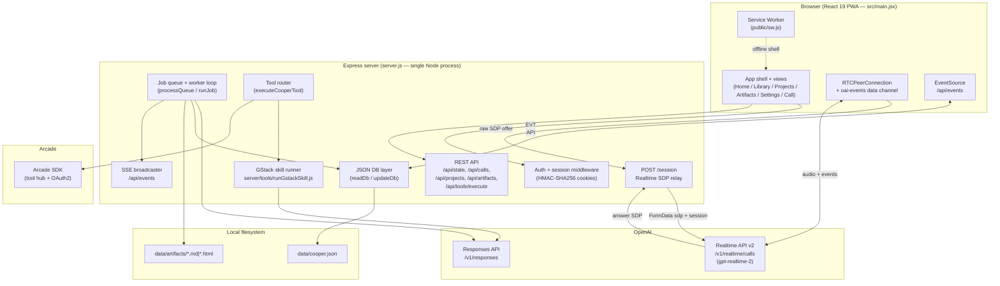
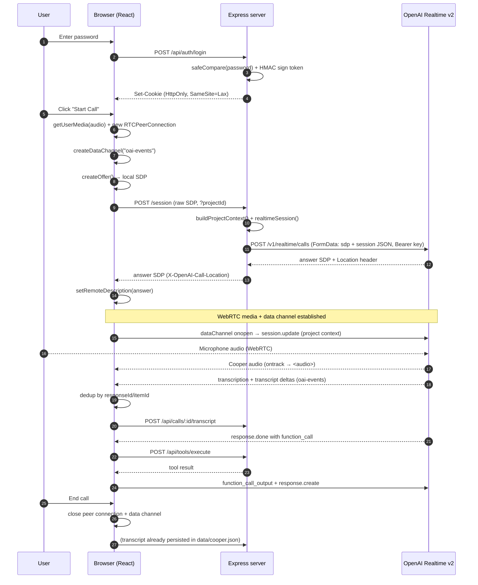
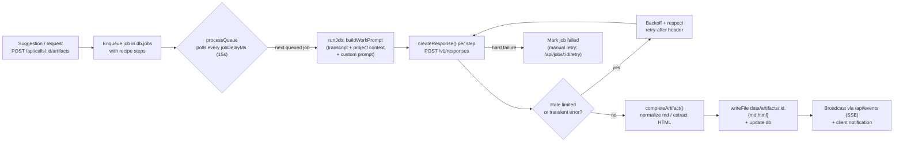

# Cooper — Technical Overview

> Engineer-facing architecture reference for the Cooper realtime voice agent.

## Table of Contents

- [1. Purpose & Summary](#1-purpose--summary)
- [2. High-Level Architecture](#2-high-level-architecture)
  - [2.1 Architecture Diagram](#21-architecture-diagram)
  - [2.2 Architectural Layers](#22-architectural-layers)
- [3. Component Inventory](#3-component-inventory)
- [4. Voice Call Lifecycle](#4-voice-call-lifecycle)
  - [4.1 Call Sequence Diagram](#41-call-sequence-diagram)
  - [4.2 Step-by-Step Walkthrough](#42-step-by-step-walkthrough)
- [5. Post-Call Job Loop Lifecycle](#5-post-call-job-loop-lifecycle)
- [6. Data Model & Persistence](#6-data-model--persistence)
- [7. External APIs & Models](#7-external-apis--models)
- [8. Tech Stack & Dependencies](#8-tech-stack--dependencies)

---

## 1. Purpose & Summary

Cooper is a React + Express progressive web app that acts as an ambient AI co-pilot for AIRES executive calls. It connects the browser to OpenAI's **Realtime API v2 over WebRTC** to capture bidirectional audio, live-transcribe a meeting, and let the model invoke server-side function tools mid-conversation. After a call, Cooper synthesizes **artifacts** (post-call kits, execution plans, PRDs, code sketches, HTML prototypes, Mermaid diagrams, UI wireframes, follow-up summaries) through a rate-limited background job loop driven by the **OpenAI Responses API**. The whole system runs as a single Node.js process with a JSON-file persistence layer (`data/cooper.json` plus artifact files under `data/artifacts/`), a single shared-password auth gate with HMAC-signed session cookies, optional Arcade-integrated tool execution with pre-authorization and write-confirmation gates, and Server-Sent Events for live progress streaming.

---

## 2. High-Level Architecture

### 2.1 Architecture Diagram

### 2.2 Architectural Layers

| Layer | Responsibility | Primary file(s) |
| --- | --- | --- |
| **Client (React 19 PWA)** | Auth/lock screen, view routing, WebRTC peer connection, `oai-events` data channel, transcript dedup buffers, artifact rendering (markdown via DOMPurify + Mermaid; HTML in a sandboxed iframe), SSE consumption, PWA/service worker | `src/main.jsx`, `src/styles.css`, `public/sw.js` |
| **Express server** | HTTP API, auth middleware, Realtime SDP relay, project context assembly, persistence, SSE broadcast | `server.js:1-2239` |
| **OpenAI Realtime v2 (WebRTC)** | Live audio in/out, transcription, function-calling over the data channel | `server.js:227-274` (relay), `cooperPrompt.js`, `cooperTools.js` |
| **Responses API job loop** | Multi-step background artifact synthesis and GStack advisory skills | `server.js:711-945`, `server/tools/runGstackSkill.js` |
| **Local JSON persistence** | Single-file database with serialized writes, plus artifact files on disk | `server.js:1503-1534`, `data/cooper.json`, `data/artifacts/` |

---

## 3. Component Inventory

| Component | Role | Location (`file:line`) |
| --- | --- | --- |
| Authentication & session management | Password verification, HMAC-SHA256 signed tokens, HTTP-only `SameSite=Lax` cookies (Secure in prod), timing-safe compare | `server.js:59-116`, `server.js:2058-2124` |
| `POST /session` (Realtime WebRTC relay) | Accepts raw SDP + injects project context, relays multipart FormData to OpenAI `/v1/realtime/calls`, returns answer SDP | `server.js:227-274` |
| Realtime session builder | Builds the `gpt-realtime-2` session: `cooperInstructions`, tool defs, semantic VAD, project context | `server.js:118-152` |
| Artifact recipes | Hard-coded step definitions for 8 artifact kinds (post_call_kit, execution_plan, follow_up, code_sketch, product_requirements, html_prototype, mermaid_diagram, ui_wireframe) | `server.js:155-225` |
| Tool registration & execution | Defines 7 Cooper tools, routes execution, enforces write confirmation | `server.js:1050-1297`, `cooperTools.js:1-161` |
| Artifact job queue & worker loop | Rate-limited loop (`jobDelayMs`, default 15s) running `/v1/responses` steps, retry/backoff, artifact writes, SSE progress | `server.js:711-900`, worker at `server.js:768-803` |
| Project context management | Stores project metadata, ingests pasted/markdown/PDF sources, truncates and builds a ≤18k-char packet | `server.js:281-385`, `server.js:1565-1663` |
| Persistent data layer | JSON DB (`data/cooper.json`) with serialized write queue | `server.js:1503-1534` |
| GStack skill runner | Advisory, read-only skill executor via `/v1/responses`; returns structured JSON, never mutates code | `server/tools/runGstackSkill.js:1-216` |
| Arcade tool router & authorization | Pre-authorization (OAuth2) flow, execution proxy, write-confirmation gates, status tracking | `server.js:387-465`, `server.js:1193-1381` |
| Event broadcast (SSE) | `/api/events` stream for job progress, state updates, notifications | `server.js:525-538`, `server.js:2146-2151` |
| Transcript & call management | Captures user/Cooper turns, persists full transcript, per-call state | `server.js:555-656`, transcript endpoint at `server.js:610-636` |
| Artifact content delivery | `GET /api/artifacts/:id/content` reads file from `data/artifacts/`, streams md/html with correct MIME | `server.js:671-685` |
| Vite dev/prod switching | Dev: Vite middleware in-process; Prod: serve pre-built `dist/` with SPA fallback | `server.js:2221-2233` |
| React app (root) | State container, auth flow, view routing, WebRTC client | `src/main.jsx:98-1156` |
| Live call UI | Fullscreen call mode, waveform, call dock, live canvas sidebar | `src/main.jsx:1405-1527`, `src/main.jsx:1529-1710` |
| Artifact renderers | Markdown (DOMPurify + Mermaid) and HTML prototype (sandboxed iframe) | `src/main.jsx:2062-2108`, `src/main.jsx:2110-2169` |

---

## 4. Voice Call Lifecycle

### 4.1 Call Sequence Diagram

### 4.2 Step-by-Step Walkthrough

1. **Entry / auth.** The user passes the splash and lock screen and submits the shared app password. `POST /api/auth/login` runs a timing-safe `safeCompare`, then mints an HMAC-SHA256-signed token (base64url JSON payload + signature) and sets it as an HTTP-only, `SameSite=Lax`, Secure-in-prod cookie (`server.js:63-84`, `server.js:2058-2124`). All `/api/*` and `/session` routes are gated by `isAuthenticated()` middleware.
2. **Local WebRTC setup.** The client calls `getUserMedia` (echo cancellation / noise suppression / auto gain), creates an `RTCPeerConnection`, opens the `oai-events` data channel, and generates a local SDP offer.
3. **Session mint / SDP exchange.** The client `POST`s the raw SDP body to `/session` (optionally with `?projectId`). The server loads project context via `buildProjectContext()`, builds the realtime session config with `realtimeSession()`, and relays a multipart FormData (`sdp` + `session` JSON) to `https://api.openai.com/v1/realtime/calls` with `Authorization: Bearer OPENAI_API_KEY` and an `OpenAI-Safety-Identifier` header (`server.js:243-269`). The OpenAI answer SDP and `Location` header are returned to the client, which sets it as the remote description.
4. **Data channel events.** On `onopen` the client sends a `session.update` carrying the project context. Inbound JSON events are parsed and dispatched: audio output is attached to an `<audio>` element via `ontrack`; transcription events (`input_audio_transcription.completed`, `response.audio_transcript.delta/done`) accumulate in dedup buffers keyed by `responseId`/`itemId`.
5. **Transcript capture.** Deduplicated turns are posted to `POST /api/calls/:id/transcript`, normalized server-side, and persisted to `data/cooper.json` (`server.js:610-636`).
6. **In-call tool calls.** When the model emits a `function_call`, the client calls `POST /api/tools/execute`, which routes through `executeCooperTool()` — local lookups (`check_calendar`), advisory skills (`run_gstack_skill` → Responses API), artifact enqueue (`create_canvas_artifact`), or Arcade-mapped tools (subject to pre-authorization and write-confirmation gates). The result is returned to the model as `function_call_output` followed by `response.create`.
7. **End.** The user ends the call; the client tears down the peer connection and data channel. The transcript already lives in the JSON DB, which seeds post-call artifact suggestions.

---

## 5. Post-Call Job Loop Lifecycle

After a call, the user (or Cooper, via `create_canvas_artifact`) requests an artifact. Generation is handled by an in-process, rate-limited worker loop — not inline in the request.

**Lifecycle details:**

- **Enqueue.** `POST /api/calls/:id/artifacts` validates a `kind` against the hard-coded `artifactRecipes` map (`server.js:155-225`) and queues a job carrying the recipe steps and any `customPrompt` (`server.js:658-669`).
- **Polling worker.** `processQueue()` polls the DB every `jobDelayMs` (default 15s) and picks the next `queued` job, enforcing spacing between OpenAI calls (`server.js:768-803`).
- **Multi-step execution.** `runJob` builds the prompt from transcript + project context + custom prompt and calls `createResponse()` once per recipe step against `POST /v1/responses` (model, instructions, input array, reasoning effort, `max_output_tokens`, text format) (`server.js:957-972`).
- **Retry / backoff.** Transient failures and rate limits trigger backoff that respects the OpenAI `retry-after` header (`server.js:977-981`); hard failures mark the job `failed`, recoverable via `POST /api/jobs/:id/retry`.
- **Artifact write.** On completion, `completeArtifact()` normalizes markdown or extracts/escapes HTML and writes the file to `data/artifacts/:id.{md|html}`, updating the DB record (`server.js:910-945`, escaping at `server.js:2007-2056`).
- **Notification.** Progress and completion are broadcast on the `/api/events` SSE stream and surfaced as in-app log entries / push notifications. Running jobs are reset to `queued` on server restart for recovery.

---

## 6. Data Model & Persistence

Persistence is a **single JSON file** (`data/cooper.json`, ~488KB in dev) plus on-disk artifact files. There is no external database or queue broker.

- **DB layer (`server.js:1503-1534`).** `readDb()` parses the JSON file; `updateDb()` serializes writes through a Promise chain to avoid concurrent-write interleaving. `fs.writeFile` is the single-threaded write bottleneck.
- **Collections in `data/cooper.json`:**

  | Collection | Contents |
  | --- | --- |
  | `calls` | Per-call metadata + full transcript arrays |
  | `artifacts` | Artifact records (kind, status, file reference, MIME) |
  | `jobs` | Queued/running/completed/failed job records with logs and step tracking |
  | `toolCalls` | Audit trail: tool name, status, risk level, duration, sanitized args |
  | `gstackRuns` | GStack skill invocation metadata |
  | `arcadeAuthorizations` | Arcade OAuth authorization IDs/tokens and status |
  | `projects` | Project metadata |
  | `projectSources` | Ingested context (pasted text, markdown, parsed PDF), truncated to `projectSourceMaxChars` (≈250k) per source |

- **Artifact files (`data/artifacts/`).** Generated Markdown (`.md`) and HTML (`.html`) documents are written outside the web root. `artifactFileName()` derives the on-disk name (`server.js:1962-1967`), served back with the correct MIME type via `GET /api/artifacts/:id/content` (`server.js:671-685`).
- **Project context assembly.** `buildProjectContext()` selects the top ~8 sources and compacts them into a ≤18k-char packet (`projectContextMaxChars`) for injection into the realtime session and job prompts (`server.js:1637-1663`).

> Operational note: this is a single-point-of-failure store with no replication, backup, or process supervision documented; concurrent writes rely on `fs.writeFile` atomicity and the in-process write queue.

---

## 7. External APIs & Models

| API / model | Usage | Reference |
| --- | --- | --- |
| **OpenAI Realtime API v2** (`gpt-realtime-2`) | `POST https://api.openai.com/v1/realtime/calls` with multipart FormData (`sdp`, `session` JSON), Bearer auth; returns answer SDP + `Location` header. Cedar voice, far-field noise reduction, semantic VAD turn detection, function-calling over the data channel | `server.js:248-254` |
| **OpenAI Transcription** (`gpt-4o-mini-transcribe`) | Live meeting transcription with a CTO/CPO-context custom prompt, configured in the realtime session | `server.js:118-152` |
| **OpenAI Responses API** (`gpt-5.4` / `gpt-5.4-fallback`) | `POST https://api.openai.com/v1/responses` with JSON body (model, instructions, input array, reasoning effort, `max_output_tokens`, text format). Used for multi-step artifact generation (`max_output_tokens` 6500) and GStack skills (2200) | `server.js:957-972`, `runGstackSkill.js:36-44` |
| **Arcade SDK** (`@arcadeai/arcadejs@2.4.1`) | `new Arcade({ apiKey: ARCADE_API_KEY })`; `client.auth.status()`, `client.tools.authorize()`, `client.tools.execute()` with `tool_name`, `input`, `user_id`. OAuth2 pre-authorization required before execution | `server.js:1234-1238`, `server.js:1362` |
| **pdf-parse** | Extracts text from uploaded PDF project sources: `new PDFParse({ data: file.buffer }).getText()`, wrapped in try/finally with `destroy()` | `server.js:1602-1615` |

The 7 Realtime function tools (`cooperTools.js:1-161`) are: `check_calendar`, `search_workspace_context`, `get_customer_context`, `inspect_engineering_context`, `create_followup_action`, `run_gstack_skill`, and `create_canvas_artifact`. Tools are risk-classified read / write / advisory; write tools (e.g. `create_followup_action`) are blocked unless `COOPER_ENABLE_ARCADE_WRITES=true` **and** explicitly confirmed (`confirmed_by_michael=true`).

---

## 8. Tech Stack & Dependencies

**Runtime:** single Node.js process (Express `4.21.2`) serving both API and (in dev) the Vite-built frontend. Package version `0.1.0`.

**Frontend:**

- React `19.0.0` + Vite `6.0.7` (PWA, single bundle `src/main.jsx`)
- `markdown-it` (linkify + typographer, custom Mermaid fence rule)
- `DOMPurify` (sanitizes rendered markdown HTML; `ADD_ATTR: [target, rel]`)
- `mermaid` (dynamically imported, `securityLevel: strict`)
- `lucide` icons
- Service worker (`public/sw.js`, `cooper-shell-v1` cache, network-first for non-API routes; `/api` routes excluded from caching)

**Backend:**

- `express` (HTTP + routing)
- `multer` (multipart project-source uploads, 20MB limit)
- `dotenv` (env config)
- `@arcadeai/arcadejs` `2.4.1` (tool hub)
- `pdf-parse` (PDF text extraction)
- Node `crypto` (HMAC-SHA256 session signing, timing-safe compare)

**Key configuration (`.env.example`, ~28 vars):** `OPENAI_API_KEY`, `ARCADE_API_KEY`, `COOPER_APP_PASSWORD`, `COOPER_SESSION_SECRET` (defaults to the app password if unset — `server.js:32`), `COOPER_SESSION_TTL_HOURS` (default 168h), `jobDelayMs` (default 15s), Responses model names (`gpt-5.4`), project/context character limits (`projectContextMaxChars` ≈18k, `projectSourceMaxChars` ≈250k), and `COOPER_ENABLE_ARCADE_WRITES` (default `false`).

**Key files:**

- `server.js` — main backend (~2239 lines): auth, Realtime relay, REST API, job loop, persistence
- `src/main.jsx` — React app and all UI components (~2532 lines)
- `src/styles.css` — responsive styling and dark call mode (~1802 lines)
- `cooperPrompt.js` — Realtime system instructions for `gpt-realtime-2`
- `cooperTools.js` — the 7 Realtime tool definitions
- `server/tools/runGstackSkill.js` — GStack advisory skill runner
- `public/sw.js`, `public/manifest.webmanifest` — PWA shell
- `data/cooper.json`, `data/artifacts/` — runtime persistence
