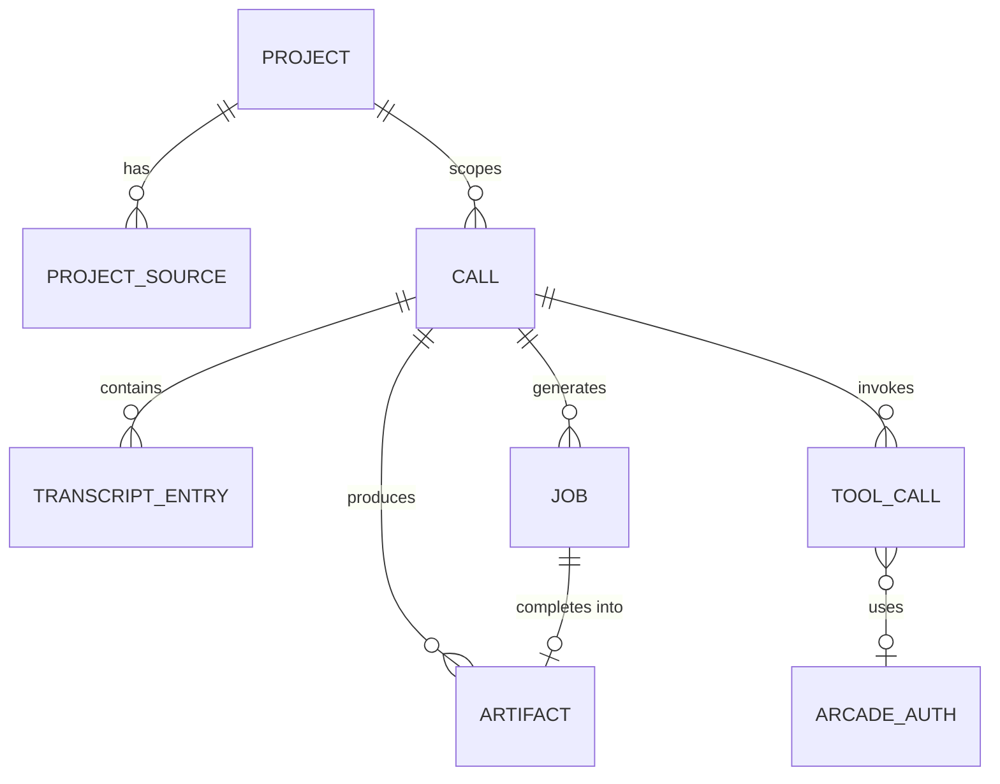

# Cooper — API & Data Model Reference

> Cooper is a React + Express progressive web app for an AIRES executive voice
> assistant built on the **OpenAI Realtime API v2** (over WebRTC) and the
> **OpenAI Responses API**. This document is the authoritative reference for
> every HTTP endpoint, the function tools registered with the Realtime model,
> the `oai-events` data-channel event types the client handles, the on-disk JSON
> data structures, and the environment variables that configure the server.

All citations use the form `file:line` and refer to the repository at the time
of writing. The backend lives in [`server.js`](../server.js); the Realtime tool
schemas live in [`cooperTools.js`](../cooperTools.js); the front-end Realtime
client lives in [`src/main.jsx`](../src/main.jsx).

---

## Table of Contents

1. [Conventions](#conventions)
2. [Authentication & Sessions](#authentication--sessions)
   - [Auth middleware](#auth-middleware)
   - [Auth endpoints](#auth-endpoints)
3. [HTTP Endpoint Reference](#http-endpoint-reference)
   - [Realtime session relay (`POST /session`)](#realtime-session-relay-post-session)
   - [State](#state)
   - [Projects](#projects)
   - [Arcade tooling](#arcade-tooling)
   - [Tool execution](#tool-execution)
   - [Event stream (`GET /api/events`)](#event-stream-get-apievents)
   - [Calls](#calls)
   - [Artifacts](#artifacts)
   - [Jobs](#jobs)
   - [Static / SPA fallback](#static--spa-fallback)
4. [Realtime Model Configuration](#realtime-model-configuration)
5. [Function Tool Schemas (Realtime)](#function-tool-schemas-realtime)
6. [Data-Channel Event Types (`oai-events`)](#data-channel-event-types-oai-events)
7. [On-Disk Data Model (`data/cooper.json`)](#on-disk-data-model-datacooperjson)
   - [Calls & transcript entries](#calls--transcript-entries)
   - [Jobs](#jobs-data)
   - [Artifacts](#artifacts-data)
   - [Projects & project sources](#projects--project-sources)
   - [Tool calls](#tool-calls)
   - [GStack runs](#gstack-runs)
   - [Arcade authorizations](#arcade-authorizations)
8. [Server-Sent Event Stream Format](#server-sent-event-stream-format)
9. [Environment Variables](#environment-variables)

---

## Conventions

- **Auth requirement** is one of:
  - **None** — reachable before login (the auth endpoints themselves).
  - **Session cookie** — protected by the global auth middleware
    (`server.js:97-116`); requires a valid signed `cooper_session` cookie.
- All JSON request bodies are parsed with a **24 MB** limit; raw SDP / plaintext
  bodies use a **2 MB** limit (`server.js:56-57`).
- Project-context and artifact content are returned as plaintext (SDP, Markdown,
  or HTML) rather than JSON where noted.
- Unless stated otherwise, error responses are JSON of the shape
  `{ "error": "<message>" }`.

---

## Authentication & Sessions

Cooper uses a **single shared app password** plus an **HMAC-SHA256 signed,
HTTP-only session cookie**. Session tokens are `base64url(JSON)` payloads with an
expiry, signed and verified with a timing-safe comparison (`server.js:59-116`,
`server.js:2058-2124`). The signing secret defaults to the app password if a
dedicated secret is not configured (`server.js:32`).

Cookie attributes set on login (`server.js:76-82`):

| Attribute  | Value                                   |
|------------|-----------------------------------------|
| `HttpOnly` | `true`                                  |
| `SameSite` | `Lax`                                   |
| `Secure`   | `true` only in production               |
| `Path`     | `/`                                     |
| `Max-Age`  | `COOPER_SESSION_TTL_HOURS` × 3600 (default 168 h) |

### Auth middleware

A global middleware (`server.js:97-116`) runs after the auth endpoints:

- Requests to `/api/auth/*` pass through unauthenticated.
- Requests to `/session` or any `/api/*` path require:
  - `COOPER_APP_PASSWORD` to be configured, otherwise **500**
    `{ "error": "Missing COOPER_APP_PASSWORD on the server." }`.
  - A valid session cookie, otherwise **401**
    `{ "error": "Authentication required." }`.

### Auth endpoints

#### `GET /api/auth/session`
- **Auth:** None.
- **Request:** none.
- **Response 200:** `{ "authenticated": boolean }` (`server.js:59-61`).

#### `POST /api/auth/login`
- **Auth:** None.
- **Request body:** `{ "password": string }`.
- **Responses** (`server.js:63-84`):

| Status | Body | When |
|--------|------|------|
| `200` | `{ "authenticated": true }` + `Set-Cookie: cooper_session=…` | Password matches (timing-safe compare). |
| `401` | `{ "error": "Invalid password." }` | Password mismatch. |
| `500` | `{ "error": "Missing COOPER_APP_PASSWORD on the server." }` | Server misconfigured. |

#### `POST /api/auth/logout`
- **Auth:** None.
- **Request:** none.
- **Response 200:** `{ "authenticated": false }` plus a `Set-Cookie` that clears
  the session cookie (`Max-Age=0`) (`server.js:86-95`).

---

## HTTP Endpoint Reference

### Realtime session relay (`POST /session`)

Bridges the client's WebRTC SDP offer to OpenAI's Realtime endpoint, injecting
active project context into the session config (`server.js:227-274`).

- **Auth:** Session cookie.
- **Query:** `?projectId=<id>` (optional) — when present, the server loads the
  project and builds a compact context packet to inject (`server.js:239-241`).
- **Request body:** raw SDP offer, `Content-Type: application/sdp`
  (the client sends `offer.sdp`, `src/main.jsx:577-583`).
- **Behavior:** builds a multipart `FormData` with the SDP plus the
  serialized Realtime `session` JSON, then `POST`s to
  `https://api.openai.com/v1/realtime/calls` with
  `Authorization: Bearer ${OPENAI_API_KEY}` and
  `OpenAI-Safety-Identifier: cooper-local-dev` (`server.js:243-255`).

| Status | Body / Headers | When |
|--------|----------------|------|
| `200` | answer SDP (`Content-Type: application/sdp`); `X-OpenAI-Call-Location` header echoed from OpenAI `Location` | Success (`server.js:264-269`). |
| `400` | `Expected raw SDP body.` (plaintext) | Body missing or not a string (`server.js:234-237`). |
| `<upstream>` | upstream error text (plaintext) | OpenAI returns non-2xx (`server.js:259-262`). |
| `500` | `Missing OPENAI_API_KEY on the server.` | No API key (`server.js:228-231`). |
| `500` | `Failed to create Realtime session.` | Fetch threw (`server.js:270-273`). |

### State

#### `GET /api/state`
- **Auth:** Session cookie.
- **Response 200:** the full public state object (`server.js:276-279`,
  shaped by `publicState`, `server.js:1536-1563`):

```jsonc
{
  "calls":    [ /* publicCall */ ],
  "projects": [ /* publicProject */ ],
  "artifacts":[ /* publicArtifact */ ],
  "jobs":     [ /* publicJob */ ],
  "toolCalls":   [ /* publicToolCall, newest 20 */ ],
  "gstackRuns":  [ /* publicGstackRun, newest 20 */ ],
  "arcade":   { /* arcadeSettingsState */ },
  "recipes":  [ { "kind", "title", "outputType", "stepCount" } ],
  "limits": {
    "jobDelayMs", "workModel", "fallbackWorkModel",
    "jobMaxAttempts", "jobMaxOutputTokens",
    "gstackModel", "gstackMaxOutputTokens"
  }
}
```

### Projects

#### `POST /api/projects`
- **Auth:** Session cookie.
- **Request body:** `{ "title": string (required), "description"?: string }`.
- **Responses** (`server.js:281-304`):

| Status | Body |
|--------|------|
| `201` | `{ "project": <publicProject> }` |
| `400` | `{ "error": "Project title is required." }` |

#### `PATCH /api/projects/:id`
- **Auth:** Session cookie.
- **Request body:** any of `{ "title"?, "description"?, "status"? }` (strings).
- **Responses** (`server.js:306-324`):

| Status | Body |
|--------|------|
| `200` | `{ "project": <publicProject> }` |
| `404` | `{ "error": "Project not found." }` |

#### `GET /api/projects/:id/context`
- **Auth:** Session cookie.
- **Response 200:** `{ "context": string, "project": <publicProject> }`, where
  `context` is the compact context packet from `buildProjectContext`
  (`server.js:326-334`).
- **404:** `{ "error": "Project not found." }`.

#### `POST /api/projects/:id/sources`
Adds a pasted-text source to a project.
- **Auth:** Session cookie.
- **Request body:** `{ "content": string (required), "title"?, "sourceType"? }`.
- **Responses** (`server.js:336-357`):

| Status | Body |
|--------|------|
| `201` | `{ "source": <publicProjectSource> }` |
| `400` | `{ "error": "Project source content is required." }` |
| `404` | `{ "error": "Project not found." }` |

#### `POST /api/projects/:id/uploads`
Ingests an uploaded **Markdown, plain-text, or PDF** file (multipart, single
`file` field; PDF text extracted via `pdf-parse`) (`server.js:359-385`,
`server.js:1596-1635`).
- **Auth:** Session cookie.
- **Request:** `multipart/form-data`, field `file` (required), optional `title`.
  Upload size is bounded by `COOPER_PROJECT_UPLOAD_MAX_MB` (default 20 MB).
- **Responses:**

| Status | Body |
|--------|------|
| `201` | `{ "source": <publicProjectSource> }` |
| `400` | `{ "error": "Upload a Markdown, text, or PDF file." }` (no file) |
| `400` | `{ "error": "<extraction message>" }` (unsupported type / no text) |
| `404` | `{ "error": "Project not found." }` |

### Arcade tooling

#### `GET /api/tools/arcade/status`
- **Auth:** Session cookie.
- **Response 200:** the `arcadeSettingsState` object (`server.js:387-390`,
  `server.js:1383-1395`):

```jsonc
{
  "configured": boolean,        // ARCADE_API_KEY present
  "userId": string,             // ARCADE_USER_ID
  "gatewayUrl": string | null,
  "writesEnabled": boolean,     // COOPER_ENABLE_ARCADE_WRITES
  "tools": [ /* per-tool mapping + auth status */ ],
  "mappings": { "<toolName>": boolean },
  "recentToolCalls": [ /* publicToolCall, newest 12 */ ]
}
```

#### `POST /api/tools/arcade/authorize`
Starts an OAuth/authorization flow for one Arcade-mapped tool.
- **Auth:** Session cookie.
- **Request body:** `{ "name": string }` (a Cooper tool name with an Arcade
  mapping).
- **Responses** (`server.js:392-411`):

| Status | Body |
|--------|------|
| `200` | `{ "authorization": <publicArcadeAuthorization>, "arcade": <arcadeSettingsState> }` |
| `400` | `{ "error": "No Arcade mapping is configured for <name>." }` |
| `400` | `{ "error": "Missing ARCADE_API_KEY on the server." }` |
| `500` | `{ "error": "Could not start Arcade authorization." }` |

#### `POST /api/tools/arcade/authorize-all`
Starts authorization for every mapped tool (`server.js:413-432`).
- **Auth:** Session cookie.
- **Request:** none required.
- **Responses:**

| Status | Body |
|--------|------|
| `200` | `{ "results": [ { "name", "ok", "authorization"? , "error"? } ], "arcade": <arcadeSettingsState> }` |
| `400` | `{ "error": "Missing ARCADE_API_KEY on the server." }` |

#### `POST /api/tools/arcade/check`
Polls authorization status for one tool (`server.js:434-466`).
- **Auth:** Session cookie.
- **Request body:** `{ "name": string }`.
- **Responses:**

| Status | Body |
|--------|------|
| `200` | `{ "authorization": <publicArcadeAuthorization>, "arcade": <arcadeSettingsState> }` |
| `400` | `{ "error": "No authorization flow has been started for <name>." }` |
| `400` | `{ "error": "Missing ARCADE_API_KEY on the server." }` |
| `500` | `{ "authorization", "arcade", "error" }` |

### Tool execution

#### `POST /api/tools/execute`
Executes a Cooper tool invoked by the Realtime model. Records an audited
`toolCall`, dispatches to `executeCooperTool`, and returns the tool output
(`server.js:468-523`).

- **Auth:** Session cookie.
- **Request body:**

```jsonc
{
  "name": string,        // must be one of the registered Cooper tool names
  "callId": string,      // optional, associates the call with this tool run
  "arguments": object    // tool-specific argument object
}
```

- **Responses:**

| Status | Body | When |
|--------|------|------|
| `200` | `{ "output": <toolOutput>, "recordId": string }` | Tool ran (output `status` may be `executed`, `approval_required`, etc.). |
| `400` | `{ "error": "Unknown Cooper tool: <name>" }` | Name not in the registry. |
| `500` | `{ "output": { "status": "error", … }, "recordId": string }` | Execution threw. |

The recorded tool call's status is mapped from the output: `approval_required`
→ `pending_approval`, `error` → `failed`, otherwise `executed`
(`server.js:501-506`).

### Event stream (`GET /api/events`)

Server-Sent Events stream for live job/state notifications (`server.js:525-538`).

- **Auth:** Session cookie.
- **Response 200:** `Content-Type: text/event-stream` with
  `Cache-Control: no-cache, no-transform`, `Connection: keep-alive`,
  `X-Accel-Buffering: no`. An initial `event: connected` frame is emitted
  immediately; the connection is held open until the client disconnects.
- See [Server-Sent Event Stream Format](#server-sent-event-stream-format).

### Calls

#### `GET /api/calls`
- **Auth:** Session cookie.
- **Response 200:** `{ "calls": [ <publicCall> ] }`, newest first
  (`server.js:540-543`).

#### `GET /api/calls/:id`
- **Auth:** Session cookie.
- **Responses** (`server.js:545-553`):

| Status | Body |
|--------|------|
| `200` | `{ "call": <publicCall>, "artifacts": [ <publicArtifact> ] }` |
| `404` | `{ "error": "Call not found." }` |

#### `POST /api/calls`
Creates a local call record (`server.js:555-587`).
- **Auth:** Session cookie.
- **Request body:** `{ "title"?, "startedAt"?, "projectId"? }`.
- **Response 201:** `{ "call": <publicCall> }`. If a valid `projectId` is given,
  the call captures a `projectTitle` and a `projectContextSnapshot`.

#### `PATCH /api/calls/:id`
Updates a call (`server.js:589-608`).
- **Auth:** Session cookie.
- **Request body:** any of `{ "title"?, "status"?, "durationSeconds"?,
  "transcript"? (array), "endedAt"? }`.
- **Responses:** `200 { "call": <publicCall> }` or `404 { "error": "Call not found." }`.

#### `POST /api/calls/:id/transcript`
Appends or upserts a single transcript entry, deduped by turn
(`server.js:610-636`).
- **Auth:** Session cookie.
- **Request body:** a single transcript-entry object (see
  [transcript entries](#calls--transcript-entries)).
- **Responses:**

| Status | Body |
|--------|------|
| `201` | `{ "entry": <normalizedEntry>, "call": <publicCall> }` |
| `400` | `{ "error": "Transcript text is required." }` |
| `404` | `{ "error": "Call not found." }` |

#### `POST /api/calls/:id/end`
Marks a call ended and refreshes post-call suggestions (`server.js:638-656`).
- **Auth:** Session cookie.
- **Request body:** `{ "transcript"? (array), "endedAt"?, "durationSeconds"? }`.
- **Responses:** `200 { "call": <publicCall> }` or `404 { "error": "Call not found." }`.

#### `POST /api/calls/:id/artifacts`
Enqueues a background artifact-generation job (`server.js:658-669`).
- **Auth:** Session cookie.
- **Request body:** `{ "kind"?: string, "customPrompt"?: string }`. `kind`
  defaults to `post_call_kit` if not a known recipe (`server.js:659`).
- **Responses:**

| Status | Body | When |
|--------|------|------|
| `202` | `{ "job": <publicJob> }` | Job enqueued. |
| `400` | `{ "error": "A transcript or canvas prompt is required…" }` | Empty transcript and no prompt (`server.js:718-720`). |
| `404` | `{ "error": "Call not found." }` | No such call. |

### Artifacts

#### `GET /api/artifacts/:id/content`
Streams the raw artifact file with its correct MIME type (`server.js:671-685`).
- **Auth:** Session cookie.
- **Responses:**

| Status | Body |
|--------|------|
| `200` | Raw file content; `Content-Type` is `text/html` or `text/markdown` per the artifact. |
| `404` | `Artifact not found.` (no DB record) or `Artifact file not found.` (file missing) — plaintext. |

### Jobs

#### `POST /api/jobs/:id/retry`
Re-queues a failed job (`server.js:687-708`).
- **Auth:** Session cookie.
- **Responses:**

| Status | Body | When |
|--------|------|------|
| `200` | `{ "job": <publicJob> }` | Job re-queued (resets `attempts`, `failures`, `error`, `retryAt`). Non-failed jobs are returned unchanged. |
| `404` | `{ "error": "Job not found." }` | No such job. |

### Static / SPA fallback

In production the server serves the built `dist/` directory and falls back to
`index.html` for client routing (`server.js:2222-2223`). In development it mounts
the Vite dev middleware in-process (`server.js:2232`). Neither path is part of
the JSON API surface.

---

## Realtime Model Configuration

The base Realtime session (`server.js:118-152`) is serialized into the
`POST /session` FormData. Key fields:

| Field | Value | Source |
|-------|-------|--------|
| `type` | `"realtime"` | `server.js:119` |
| `model` | `"gpt-realtime-2"` | `server.js:120` |
| `instructions` | `cooperInstructions` (+ project context, when present) | `server.js:121`, `server.js:145-151` |
| `reasoning.effort` | `"low"` | `server.js:122` |
| `audio.input.noise_reduction.type` | `"far_field"` | `server.js:125` |
| `audio.input.transcription.model` | `"gpt-4o-mini-transcribe"` | `server.js:127` |
| `audio.input.transcription.prompt` | meeting-context priming string | `server.js:128` |
| `audio.input.turn_detection` | `semantic_vad`, `eagerness: "low"`, `create_response: false`, `interrupt_response: false` | `server.js:130-135` |
| `audio.output.voice` | `"cedar"` | `server.js:138` |
| `tools` | `cooperToolDefinitions` (see below) | `server.js:141` |
| `tool_choice` | `"auto"` | `server.js:142` |

When a `projectId` is supplied, `realtimeSession()` concatenates the compact
project context onto `cooperInstructions` (`server.js:145-151`).

---

## Function Tool Schemas (Realtime)

Seven function tools are registered with the Realtime model and exposed to the
`POST /api/tools/execute` dispatcher. All are defined in
[`cooperTools.js`](../cooperTools.js); the registry of valid names is
`cooperToolNames` (`cooperTools.js:160`).

### `check_calendar`
Check whether Michael is available at a requested date/time
(`cooperTools.js:2-20`).

| Param | Type | Required | Notes |
|-------|------|----------|-------|
| `date` | string | yes | Ideally `YYYY-MM-DD`. |
| `time` | string | yes | Ideally `HH:MM` with timezone if known. |

### `search_workspace_context`
Search internal workspace context (CRM, docs, tickets, onboarding, etc.)
(`cooperTools.js:21-41`).

| Param | Type | Required | Notes |
|-------|------|----------|-------|
| `query` | string | yes | |
| `sources` | array&lt;enum&gt; | no | `crm`, `docs`, `tickets`, `onboarding`, `github`, `slack`, `calendar`, `memory`. |
| `customer_or_account` | string | no | |
| `time_range` | string | no | |

### `get_customer_context`
CRM / onboarding / support / integration context for an account
(`cooperTools.js:42-60`).

| Param | Type | Required | Notes |
|-------|------|----------|-------|
| `customer_name` | string | yes | |
| `include` | array&lt;enum&gt; | no | `crm`, `onboarding`, `support`, `integrations`, `docs`, `recent_activity`. |

### `inspect_engineering_context`
Inspect GitHub issues/PRs, code refs, tickets, incidents, docs
(`cooperTools.js:61-75`).

| Param | Type | Required | Notes |
|-------|------|----------|-------|
| `query` | string | yes | |
| `repo` | string | no | |
| `ticket_id` | string | no | |
| `include_code` | boolean | no | |

### `create_followup_action`
Prepare or create an approved follow-up (task, ticket, calendar event, CRM note,
email draft, Slack message). **Writes require explicit Michael confirmation.**
(`cooperTools.js:76-100`).

| Param | Type | Required | Notes |
|-------|------|----------|-------|
| `action_type` | enum | yes | `task`, `ticket`, `calendar_event`, `crm_note`, `email_draft`, `slack_message`. |
| `title` | string | yes | |
| `description` | string | no | |
| `owner` | string | no | |
| `due_date` | string | no | |
| `destination` | string | no | |
| `requires_confirmation` | boolean | no | |
| `confirmed_by_michael` | boolean | no | True only after Michael explicitly confirms this exact write. |

### `run_gstack_skill`
Run an advisory GStack-style review skill. **Advisory only — never mutates code
or external systems** (`cooperTools.js:101-129`).

| Param | Type | Required | Notes |
|-------|------|----------|-------|
| `skill` | enum | yes | `ceo_review`, `engineering_review`, `code_review`, `qa_review`, `spec`, `office_hours`, `design_review`. |
| `input` | string | yes | Primary content to review/transform. |
| `context` | string | no | Supporting context (project notes, constraints). |
| `mode` | enum | no | `advisory`, `structured`, `voice_summary`. |

### `create_canvas_artifact`
Queue a background visual artifact for the live call canvas
(`cooperTools.js:130-157`).

| Param | Type | Required | Notes |
|-------|------|----------|-------|
| `kind` | enum | yes | `mermaid_diagram`, `ui_wireframe`, `html_prototype`. |
| `title` | string | no | |
| `prompt` | string | yes | What Cooper should draw/diagram/prototype. |
| `context` | string | no | Relevant meeting/project/UI context. |

---

## Data-Channel Event Types (`oai-events`)

The client opens an `oai-events` data channel and routes inbound Realtime events
through `handleServerEvent` (`src/main.jsx:408-510`, message parsing at
`src/main.jsx:560-566`). On `open` it sends a session-update frame seeded with
project context (`src/main.jsx:558`). Handled inbound event types:

| Event `type` | Handling | Location |
|--------------|----------|----------|
| `session.created` | Session bootstrap. | `src/main.jsx:409` |
| `session.updated` | Session config acknowledged. | `src/main.jsx:414` |
| `input_audio_buffer.speech_started` | User started speaking (sets "hearing" state). | `src/main.jsx:420` |
| `input_audio_buffer.speech_stopped` | User stopped speaking. | `src/main.jsx:426` |
| `conversation.item.input_audio_transcription.completed` | Final user transcript → committed/saved. | `src/main.jsx:432` |
| `conversation.item.input_audio_transcription.failed` | Transcription failure. | `src/main.jsx:451` |
| `response.created` | Cooper response begins. | `src/main.jsx:457` |
| `response.output_audio.delta` / `response.audio.delta` | Streaming audio chunk (speaking state). | `src/main.jsx:462` |
| `response.output_audio.done` / `response.audio.done` | Audio stream finished. | `src/main.jsx:468` |
| `response.output_audio_transcript.delta` / `response.audio_transcript.delta` | Cooper transcript delta accumulation. | `src/main.jsx:473` |
| `response.output_audio_transcript.done` / `response.audio_transcript.done` | Cooper transcript finalized. | `src/main.jsx:478` |
| `response.output_text.delta` | Streaming text delta. | `src/main.jsx:483` |
| `response.output_text.done` | Text output finalized. | `src/main.jsx:488` |
| `response.done` | Response complete; **function-call items dispatched to `executeCooperTool` → `POST /api/tools/execute`**, then `function_call_output` + `response.create` are sent back. | `src/main.jsx:493` |
| `error` | Realtime error surfaced to the UI. | `src/main.jsx:502` |

Non-JSON data-channel messages are caught and logged as a generic event
(`src/main.jsx:563-565`).

---

## On-Disk Data Model (`data/cooper.json`)

State is persisted to a single JSON file, [`data/cooper.json`](../data/cooper.json),
through a serialized write queue (`readDb` / `updateDb`, `server.js:1503-1534`).
Generated artifact files live in `data/artifacts/<id>.{md|html}`. The top-level
collections are: `calls`, `artifacts`, `jobs`, `projects`, `projectSources`,
`toolCalls`, `gstackRuns`, and `arcadeAuthorizations`.



### Calls & transcript entries

Created at `server.js:563-577`; public shape via `publicCall`
(`server.js:1665-1672`, which strips `projectContextSnapshot`).

| Field | Type | Description |
|-------|------|-------------|
| `id` | string (UUID) | Call identifier. |
| `title` | string | Display title. |
| `status` | string | `active` → `ended`. |
| `startedAt` | ISO string | Start timestamp. |
| `endedAt` | ISO string \| null | End timestamp. |
| `durationSeconds` | number | Duration in seconds. |
| `projectId` | string | Associated project (or `""`). |
| `projectTitle` | string | Snapshot of the project's title. |
| `projectContextSnapshot` | string | Context packet captured at creation (**stripped from public API**). |
| `transcript` | array | Transcript entries (below). |
| `suggestions` | array | Post-call artifact suggestions. |
| `createdAt` / `updatedAt` | ISO string | Timestamps. |

**Transcript entry** (normalized; client shape at `src/main.jsx:636-661`,
server upsert at `server.js:610-636`):

| Field | Type | Description |
|-------|------|-------------|
| `id` | string | Entry id. |
| `at` | ISO string | Timestamp. |
| `speaker` | string | Normalized speaker (e.g. user / Cooper). |
| `text` | string | Transcript text (required). |
| `source` | string | Origin of the entry. |
| `responseId` | string | Realtime response id (for dedup). |
| `itemId` | string | Realtime item id (for dedup). |

### Jobs (data)

Created in `enqueueArtifactJob` (`server.js:722-749`); public shape via
`publicJob` strips the in-progress `draft` and trims `logs` to the last 40
entries (`server.js:1707-1710`).

| Field | Type | Description |
|-------|------|-------------|
| `id` | string (UUID) | Job id. |
| `callId` | string | Owning call. |
| `kind` | string | Artifact recipe key (e.g. `post_call_kit`). |
| `title` | string | Recipe title. |
| `status` | string | `queued` → `running` → `completed` / `failed`. |
| `customPrompt` | string | Optional extra instruction (canvas/custom). |
| `stepIndex` | number | Current recipe step. |
| `stepCount` | number | Total recipe steps. |
| `attempts` | number | Attempt counter. |
| `failures` | number | Failure counter. |
| `maxAttempts` | number | `COOPER_JOB_MAX_ATTEMPTS`. |
| `draft` | string | Working output buffer (**stripped from public API**). |
| `artifactId` | string \| null | Set on completion. |
| `error` | string \| null | Error message if failed. |
| `retryAt` | ISO string \| null | Earliest retry time (rate-limit backoff). |
| `progress` | string | Human-readable progress. |
| `logs` | array | `{ id, at, type, message }` log entries. |
| `createdAt` / `updatedAt` / `completedAt` | ISO string | Timestamps. |

### Artifacts (data)

Created in `completeArtifact` (`server.js:919-930`); public shape via
`publicArtifact` adds derived `outputType` / `extension` / `mimeType`
(`server.js:1746-1754`).

| Field | Type | Description |
|-------|------|-------------|
| `id` | string (UUID) | Artifact id; also the filename stem. |
| `callId` | string | Owning call. |
| `jobId` | string | Job that produced it. |
| `kind` | string | Recipe key. |
| `title` | string | Display title. |
| `outputType` | string | `markdown` or `html`. |
| `extension` | string | `md` or `html`. |
| `mimeType` | string | `text/markdown` or `text/html`. |
| `file` | string | Relative path, `data/artifacts/<id>.<ext>`. |
| `createdAt` | ISO string | Creation timestamp. |

### Projects & project sources

Project created at `server.js:289-297`; public shape `publicProject`
(`server.js:1674-1688`).

**Project**

| Field | Type | Description |
|-------|------|-------------|
| `id` | string (UUID) | Project id. |
| `title` | string | Project title. |
| `description` | string | Optional description. |
| `status` | string | Defaults to `active`. |
| `sourceCount` / `totalChars` | number | Derived in public shape. |
| `sources` | array | Embedded public project sources. |
| `createdAt` / `updatedAt` / `lastUsedAt` | ISO string \| null | Timestamps. |

**Project source** — stored in `addProjectSource` (`server.js:1575-1588`);
public shape `publicProjectSource` (`server.js:1690-1705`, adds a `preview` and
omits the full `text`).

| Field | Type | Description |
|-------|------|-------------|
| `id` | string (UUID) | Source id. |
| `projectId` | string | Owning project. |
| `title` | string | Source title. |
| `sourceType` | string | `paste`, `markdown`, `text`, or `pdf`. |
| `mimeType` | string | MIME of the original. |
| `originalName` | string | Uploaded filename (if any). |
| `text` | string | Stored text, truncated to `COOPER_PROJECT_SOURCE_MAX_CHARS` (**not returned publicly**). |
| `charCount` | number | Original length. |
| `storedCharCount` | number | Stored (truncated) length. |
| `truncated` | boolean | Whether truncation occurred. |
| `preview` | string | Short preview (public only). |
| `createdAt` / `updatedAt` | ISO string | Timestamps. |

### Tool calls

Recorded in `POST /api/tools/execute` (`server.js:480-496`); public shape
`publicToolCall` (`server.js:1712-1727`). Arguments are stored with sensitive
fields redacted (`safeToolArguments`).

| Field | Type | Description |
|-------|------|-------------|
| `id` | string (UUID) | Tool-call record id (`recordId`). |
| `callId` | string | Associated call. |
| `userId` | string | `ARCADE_USER_ID`. |
| `toolName` | string | Cooper tool name. |
| `arcadeToolName` | string \| null | Mapped Arcade tool, if any. |
| `arguments` | object | Sanitized/redacted arguments (not returned by `publicToolCall`). |
| `riskLevel` | string | `read`, `advisory`, or `write`. |
| `status` | string | `pending` → `executed` / `failed` / `pending_approval`. |
| `resultSummary` | string | Short summary of the result. |
| `error` | string \| null | Error message if failed. |
| `durationMs` | number \| null | Execution duration. |
| `createdAt` / `updatedAt` | ISO string | Timestamps. |

### GStack runs

Public shape `publicGstackRun` (`server.js:1729-1744`). Content is **not**
stored — only redacted length metrics.

| Field | Type | Description |
|-------|------|-------------|
| `id` | string | Run id. |
| `skill` | string | Skill name (e.g. `code_review`). |
| `mode` | string | `advisory` / `structured` / `voice_summary`. |
| `status` | string | Run status. |
| `inputLength` / `contextLength` / `resultLength` | number | Character-count metrics. |
| `inputRedacted` | boolean | Whether sensitive input was detected/redacted. |
| `durationMs` | number \| null | Duration. |
| `error` | string \| null | Error message. |
| `createdAt` / `updatedAt` | ISO string | Timestamps. |

### Arcade authorizations

Stored per mapped tool and surfaced via `arcadeToolSettings`
(`server.js:1397-1421`) and `publicArcadeAuthorization`. The persisted record
holds the authorization id / token and status (plaintext in the JSON store).
Per-tool settings exposed publicly include:

| Field | Type | Description |
|-------|------|-------------|
| `name` | string | Cooper tool name. |
| `label` | string | Display label. |
| `description` | string | Tool description. |
| `arcadeToolName` | string | Mapped Arcade tool qualified name. |
| `mappingEnv` | string | Env var that supplies the mapping. |
| `mapped` | boolean | Whether a mapping is configured. |
| `configured` | boolean | Whether `ARCADE_API_KEY` is set. |
| `status` | string | `missing_api_key`, `missing_mapping`, `not_started`, or the live auth status. |
| `riskLevel` | string | Tool risk classification. |
| `authorization` | object | Public authorization record (id, status, timestamps). |

---

## Server-Sent Event Stream Format

`GET /api/events` emits SSE frames of the form
`event: <type>\ndata: <json>\n\n` (`broadcastEvent`, `server.js:2146-2151`).

| `event` | `data` payload | Emitted by |
|---------|----------------|------------|
| `connected` | `{ "at": <ISO timestamp> }` | On stream open (`server.js:532`). |
| `state.updated` | `{ "at": <ISO timestamp> }` | After every DB write (`server.js:1529`). |

The client treats `state.updated` as a cue to re-fetch `GET /api/state`; the
event payload itself carries only a timestamp, not the changed data.

---

## Environment Variables

Sourced from [`.env.example`](../.env.example) and the README. "Required" means
the related feature will not function (or the server returns 500/400) without it.

| Variable | Purpose | Default | Required |
|----------|---------|---------|----------|
| `OPENAI_API_KEY` | Bearer auth for the Realtime relay and Responses API. | `sk-your-key-here` (placeholder) | **Yes** — Realtime + artifact generation fail without it (`server.js:228-231`, `server.js:948-949`). |
| `PORT` | HTTP listen port. | `5000` | No |
| `COOPER_APP_PASSWORD` | Shared login password; gates all `/api/*` and `/session` routes. | `replace-with-a-long-random-password` (placeholder) | **Yes** — API routes return 500 without it (`server.js:104-107`). |
| `COOPER_SESSION_SECRET` | HMAC key for signing session cookies. | Falls back to `COOPER_APP_PASSWORD` (`server.js:32`) | No (recommended to set independently) |
| `COOPER_SESSION_TTL_HOURS` | Session cookie lifetime. | `168` (7 days) | No |
| `ARCADE_API_KEY` | Auth for the Arcade SDK / MCP gateway. | empty | Conditional — required for Arcade-backed tools (`server.js:399-402`). |
| `ARCADE_USER_ID` | Arcade `user_id` for authorization/execution; recorded on tool calls. | `michael@example.com` | Conditional (Arcade tools) |
| `ARCADE_MCP_GATEWAY_URL` | Arcade MCP gateway endpoint. | `https://api.arcade.dev/mcp/cooper-app` | No |
| `ARCADE_SEARCH_WORKSPACE_TOOL` | Maps `search_workspace_context` to an Arcade tool. | empty | Conditional (that tool) |
| `ARCADE_CUSTOMER_CONTEXT_TOOL` | Maps `get_customer_context`. | empty | Conditional (that tool) |
| `ARCADE_ENGINEERING_CONTEXT_TOOL` | Maps `inspect_engineering_context`. | empty | Conditional (that tool) |
| `ARCADE_CREATE_FOLLOWUP_TOOL` | Maps `create_followup_action`. | empty | Conditional (that tool) |
| `COOPER_ENABLE_ARCADE_WRITES` | Allows write actions (e.g. follow-ups) to execute. | `false` | No (writes blocked until enabled) |
| `COOPER_WORK_MODEL` | Responses-API model for artifact generation. | `gpt-5.4` | No |
| `COOPER_FALLBACK_WORK_MODEL` | Fallback model on retry. | empty | No |
| `COOPER_GSTACK_MODEL` | Model for GStack advisory skills. | `gpt-5.4` | No |
| `COOPER_GSTACK_MAX_OUTPUT_TOKENS` | Max output tokens for GStack skills. | `2200` | No |
| `COOPER_GSTACK_INPUT_MAX_CHARS` | Max chars of skill input. | `32000` | No |
| `COOPER_GSTACK_CONTEXT_MAX_CHARS` | Max chars of skill context. | `24000` | No |
| `COOPER_JOB_DELAY_MS` | Minimum spacing between Responses-API job steps. | `15000` | No |
| `COOPER_JOB_MAX_ATTEMPTS` | Max job attempts before failing. | `3` | No |
| `COOPER_JOB_MAX_OUTPUT_TOKENS` | Max output tokens per artifact step. | `6500` | No |
| `COOPER_PROJECT_CONTEXT_CHARS` | Max chars of project context injected per session. | `18000` | No |
| `COOPER_PROJECT_SOURCE_MAX_CHARS` | Max stored chars per project source. | `250000` | No |
| `COOPER_PROJECT_UPLOAD_MAX_MB` | Max upload size for project files. | `20` | No |
