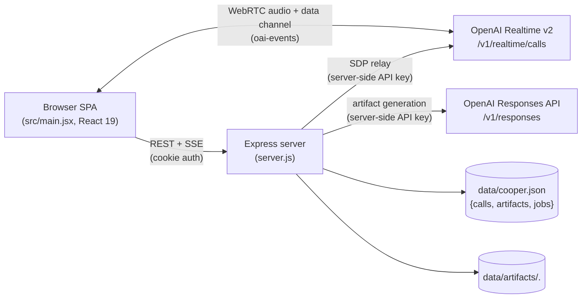
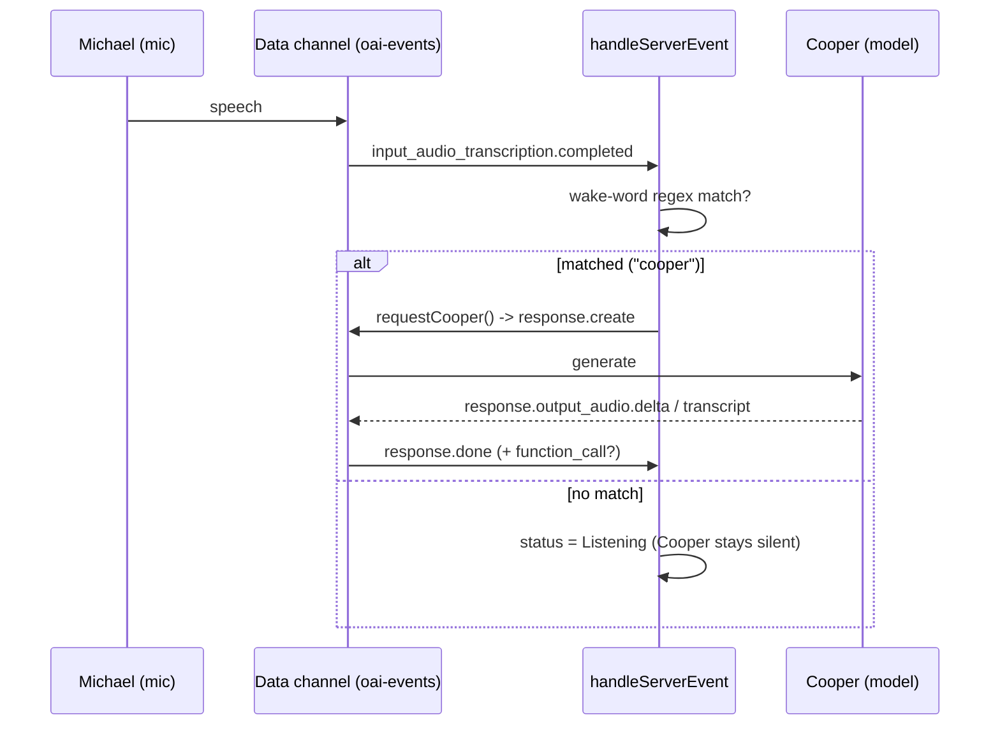
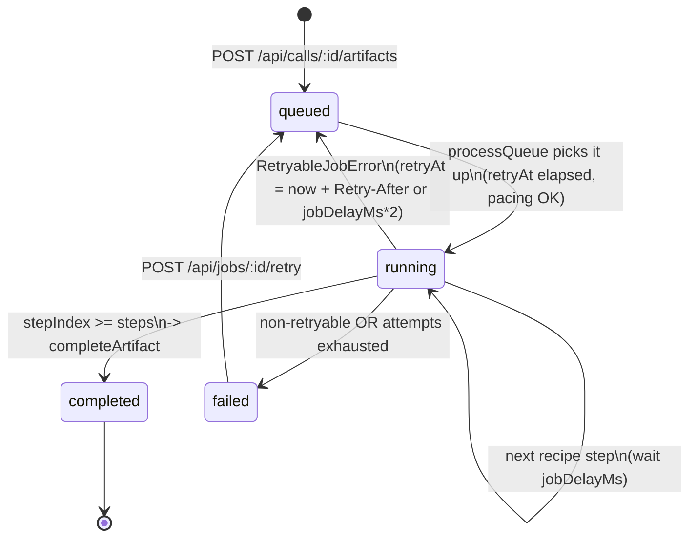

# Cooper — API & Data Model Reference

> Authoritative reference for every HTTP endpoint, the realtime data-channel
> protocol, the on-disk JSON structures, the SSE event stream, and the
> environment variables that configure the server.
>
> Cooper is a **local-first, single-user** React 19 + Express 4 app. There is no
> external database, no OAuth, no multi-tenancy, and the OpenAI API key never
> reaches the client. All citations are `file:line` against `server.js`
> (1110 lines) and `src/main.jsx` (1707 lines).

---

## Table of Contents

1. [Architecture overview](#architecture-overview)
2. [Authentication model](#authentication-model)
3. [HTTP endpoints](#http-endpoints)
   - [Auth routes](#auth-routes)
   - [Realtime session minting — `POST /session`](#realtime-session-minting--post-session)
   - [State & events](#state--events)
   - [Calls](#calls)
   - [Transcript](#transcript)
   - [Artifacts](#artifacts)
   - [Jobs](#jobs)
4. [The `check_calendar` tool schema](#the-check_calendar-tool-schema)
5. [Realtime data-channel events (`handleServerEvent`)](#realtime-data-channel-events-handleserverevent)
6. [Server-Sent Events (SSE) protocol](#server-sent-events-sse-protocol)
7. [On-disk data model (`data/cooper.json`)](#on-disk-data-model-datacooperjson)
8. [Environment variables](#environment-variables)

---

## Architecture overview



- Two trust boundaries leave the server: the **SDP relay** to OpenAI Realtime
  (`server.js:217`) and the **Responses API** call during artifact generation.
  Both use the server-held `OPENAI_API_KEY`; it is never sent to the browser.
- WebRTC media and the `oai-events` data channel connect the browser **directly**
  to OpenAI after the SDP handshake; only the offer/answer exchange transits
  the Express `/session` relay.

---

## Authentication model

Single shared password gate. There are no user accounts.

- **Password check** — `POST /api/auth/login` compares `req.body.password` to
  `appPassword` via `safeCompare` (`server.js:46`), which uses
  `timingSafeEqual` after a length check (`server.js:984-991`) — constant-time.
- **Session cookie** — on success the server mints `cooper_session`:
  `base64url(JSON{exp,nonce})` `.` `HMAC-SHA256(payload, sessionSecret)`
  (`signSession`, `server.js:972-982`). Cookie flags (`serializeCookie`,
  `server.js:1012-1020`): `HttpOnly`, `SameSite=Lax`, `Path=/`, `Max-Age` from
  the TTL, and `Secure` **only when `NODE_ENV=production`** — so in local/dev the
  cookie travels over plain HTTP.
- **Verification** — `isAuthenticated` (`server.js:954-970`) re-derives the HMAC,
  compares it with `safeCompare`, then checks `exp` is in the future.
- **Global gate** (`server.js:74-93`): `/api/auth/*` is open; **`/session` and all
  `/api/*` routes require both `appPassword` to be set AND a valid session**. If
  `COOPER_APP_PASSWORD` is unset, every gated route returns **500**.

> [!WARNING]
> **`sessionSecret` defaults to the app password** (`server.js:23`). If
> `COOPER_SESSION_SECRET` is unset, anyone who learns the password can forge
> sessions, and rotating the password silently invalidates all existing
> sessions. There is also **no login rate limiting / lockout** — the single
> shared password is brute-forceable.

---

## HTTP endpoints

> **Auth column legend:** *open* = no auth; *session* = requires valid
> `cooper_session` cookie **and** `COOPER_APP_PASSWORD` configured (else 500).

| Method | Path | Auth | Purpose |
|--------|------|------|---------|
| GET  | `/api/auth/session` | open | Report whether the caller is authenticated |
| POST | `/api/auth/login` | open | Exchange password for a session cookie |
| POST | `/api/auth/logout` | open | Clear the session cookie |
| POST | `/session` | session | Mint an OpenAI Realtime call (SDP relay) |
| GET  | `/api/state` | session | Full public app state snapshot |
| GET  | `/api/events` | session | SSE stream of state updates |
| GET  | `/api/calls` | session | List all calls |
| POST | `/api/calls` | session | Create a call |
| GET  | `/api/calls/:id` | session | Get one call + its artifacts |
| PATCH | `/api/calls/:id` | session | Partial update of a call |
| POST | `/api/calls/:id/transcript` | session | Upsert a transcript turn |
| POST | `/api/calls/:id/end` | session | End a call, enable suggestions |
| POST | `/api/calls/:id/artifacts` | session | Enqueue an artifact-generation job |
| GET  | `/api/artifacts/:id/content` | session | Stream a generated artifact file |
| POST | `/api/jobs/:id/retry` | session | Re-queue a failed job |

> **Note on the transcript route.** Transcript reads come from
> `GET /api/calls/:id` (which returns the call with its full `transcript[]`) and
> `GET /api/state`; there is no standalone transcript GET route. The only
> transcript route is **`POST /api/calls/:id/transcript`** (`server.js:323-349`),
> which upserts a single turn.

### Auth routes

#### `GET /api/auth/session` — `server.js:36-38`

- **Auth:** open.
- **Request body:** none.
- **Response 200:** `{ "authenticated": boolean }`.

#### `POST /api/auth/login` — `server.js:40-72`

- **Auth:** open.
- **Request body:** `{ "password": string }`.
- **Responses:**
  - **200** `{ "authenticated": true }` + `Set-Cookie: cooper_session=…`.
  - **401** `{ "error": "Invalid password." }` on mismatch (`server.js:46-49`).
  - **500** `{ "error": "Missing COOPER_APP_PASSWORD on the server." }` when the
    server has no password configured (`server.js:41-44`).

#### `POST /api/auth/logout` — `server.js`

- **Auth:** open.
- **Request body:** none.
- **Response 200:** `{ "authenticated": false }` and a cookie-clearing
  `Set-Cookie` header.

### Realtime session minting — `POST /session`

`server.js:200-243`

- **Auth:** session (gated by the global middleware).
- **Requires:** `OPENAI_API_KEY` on the server (else **500**, `server.js:201-204`).
- **Content-Type:** raw SDP — `application/sdp` or `text/plain` (parsed by the
  text body middleware, `server.js:33`, 2 MB limit).
- **Request body:** the WebRTC **offer SDP** as a plain string. A non-string body
  yields **400** `Expected raw SDP body.` (`server.js:207-210`).
- **Behaviour:** builds a multipart `FormData` with field `sdp` (the offer) and
  field `session` (`JSON.stringify(baseSession)`), then POSTs to
  `https://api.openai.com/v1/realtime/calls` with
  `Authorization: Bearer <OPENAI_API_KEY>` and
  `OpenAI-Safety-Identifier: cooper-local-dev` (`server.js:212-224`).
- **Responses:**
  - **200** `Content-Type: application/sdp` — the **answer SDP**. The upstream
    `Location` header is relayed as `X-OpenAI-Call-Location` (`server.js:233-238`).
  - **\<upstream status>** the raw upstream error text is forwarded verbatim when
    OpenAI returns non-2xx (`server.js:228-231`).
  - **500** `Failed to create Realtime session.` on fetch failure
    (`server.js:239-242`).

> This is **not** an ephemeral client-token flow — the standing server API key
> authorizes each call. The key never reaches the browser.

`baseSession` (`server.js:116-141`) configures: `type: "realtime"`, model
`gpt-realtime-2`, Cooper instructions, `reasoning.effort: "low"`, far-field
noise reduction, transcription model `gpt-4o-mini-transcribe`, `server_vad`
turn detection (threshold `0.5`, prefix padding `300ms`, silence `700ms`,
`create_response: false`, `interrupt_response: false`), and output voice
`cedar`. `create_response: false` means **Cooper stays silent by default** and
does not auto-respond to detected speech turns.

### State & events

#### `GET /api/state` — `server.js:245-248`

- **Auth:** session.
- **Response 200** (shape from `publicState`, `server.js:793-812`):

```json
{
  "calls": [ /* full call objects */ ],
  "artifacts": [ /* public artifact records */ ],
  "jobs": [ /* publicJob records: no draft, logs capped to last 40 */ ],
  "recipes": [
    { "kind": "post_call_kit", "title": "…", "outputType": "markdown", "stepCount": 3 }
  ],
  "limits": {
    "jobDelayMs": 15000,
    "workModel": "gpt-5.4",
    "fallbackWorkModel": "",
    "jobMaxAttempts": 3,
    "jobMaxOutputTokens": 6500
  }
}
```

#### `GET /api/events` (SSE) — `server.js:250-263`

- **Auth:** session.
- **Response:** `Content-Type: text/event-stream`. Emits a `connected` event
  immediately, then `state.updated` events on every DB write. The response
  socket is registered in the `eventClients` set and removed on `close`. See
  [SSE protocol](#server-sent-events-sse-protocol).

> SSE broadcasts go to **all** connected clients with no per-user scoping —
> harmless for a single user, a fan-out leak in any multi-user scenario.

### Calls

#### `GET /api/calls` — `server.js:265-268`

- **Auth:** session. **Response 200:** `{ "calls": [ /* all call objects */ ] }`.

#### `POST /api/calls` — `server.js:280-300`

- **Auth:** session.
- **Request body:** optional `{ "title": string, "startedAt": string }`.
- **Response 201:** the created call object (status `active`, fresh UUID, default
  suggestions).

#### `GET /api/calls/:id` — `server.js:270-278`

- **Auth:** session.
- **Response 200:** `{ "call": <call>, "artifacts": [ /* artifacts for this call */ ] }`.
- **Response 404:** when no call matches `:id`.

#### `PATCH /api/calls/:id` — `server.js:302-321`

- **Auth:** session.
- **Request body:** partial update — any of `title`, `status`, `durationSeconds`,
  `transcript`, `endedAt`.
- **Response 200:** the updated call. **Response 404:** unknown `:id`.

#### `POST /api/calls/:id/end` — `server.js:351-369`

- **Auth:** session.
- **Request body:** optional `{ "durationSeconds": number, "endedAt": string }`.
- **Behaviour:** sets `status: "ended"`, stamps `endedAt`, and flips each
  suggestion's `enabled` to `true` when the transcript is non-empty.
- **Response 200:** the ended call. **Response 404:** unknown `:id`.

### Transcript

#### `POST /api/calls/:id/transcript` — `server.js:323-349`

- **Auth:** session.
- **Request body:** a single transcript turn, e.g.
  `{ "at": string, "speaker": string, "text": string, "source": string, "responseId": string, "itemId": string }`.
- **Behaviour:** upserts the turn. If an existing entry is "the same turn"
  (`sameTranscriptTurn`, `server.js:866-871` — matched by `itemId`/`responseId`)
  it is replaced in place; otherwise it is appended. Speaker is normalized
  (`normalizeSpeaker`): blank / `"speaker"` / `"user"` → `"Michael"`;
  `"assistant"` → `"Cooper"`.
- **Response 200:** the updated call. **Response 404:** unknown `:id`.

### Artifacts

#### `POST /api/calls/:id/artifacts` — `server.js:371-382` → `enqueueArtifactJob` `server.js:424-471`

- **Auth:** session.
- **Request body:** `{ "kind": string, "customPrompt": string }` where `kind` is one
  of the six recipe kinds (see below). `customPrompt` is optional.
- **Preconditions:** the call must exist **and** have a non-empty transcript,
  else **400**.
- **Response 202:** the created job as `publicJob` (status `queued`,
  `stepCount` = recipe step count). Triggers `queueWorker` (`server.js:473-477`).
- **Response 404:** unknown call `:id`.

**Recipe kinds** (`artifactRecipes`, `server.js:143-198`) — each a fixed
multi-step prompt chain:

| Kind | Output | Steps | Description |
|------|--------|-------|-------------|
| `post_call_kit` | markdown | 3 | Executive operating brief |
| `execution_plan` | markdown | 3 | SDLC execution plan |
| `follow_up` | markdown | 3 | Follow-up memo + checklist |
| `code_sketch` | markdown | 3 | Technical implementation sketch |
| `product_requirements` | markdown | 3 | PRD + prototype brief |
| `html_prototype` | html | 3 | Standalone inline HTML/CSS/JS document |

#### `GET /api/artifacts/:id/content` — `server.js:384-398`

- **Auth:** session.
- **Behaviour:** looks up the artifact by `id` in the DB, resolves the on-disk
  file via `artifactFileName` (`server.js:873-878`), which takes `.pop()` of the
  path split — stripping any directory components, mitigating path traversal.
- **Response 200:** the raw file bytes with the artifact's `mimeType`.
- **Response 404:** artifact record missing or file missing.

### Jobs

#### `POST /api/jobs/:id/retry` — `server.js:400-422`

- **Auth:** session.
- **Behaviour:** resets a **failed** job back to `queued`, zeroing `attempts` and
  `failures`, and re-queues it (`queueWorker`).
- **Response 200:** the re-queued `publicJob`. **Response 404:** unknown job;
  **400** if the job is not in a retryable (`failed`) state.

---

## The `check_calendar` tool schema

Registered **client-side** in `toolDefinition` (`src/main.jsx:53-71`) and sent to
the model inside the `session.update` payload (`src/main.jsx:73-120`, `tools`
array at `:117`, `tool_choice: "auto"` at `:118`).

```json
{
  "type": "function",
  "name": "check_calendar",
  "description": "Check whether Michael is available at a requested date and time.",
  "parameters": {
    "type": "object",
    "properties": {
      "date": {
        "type": "string",
        "description": "Requested meeting date, ideally YYYY-MM-DD."
      },
      "time": {
        "type": "string",
        "description": "Requested meeting time, ideally HH:MM with timezone if known."
      }
    },
    "required": ["date", "time"]
  }
}
```

Execution is entirely local: `handleFunctionCall` (`src/main.jsx:371-392`) runs
`checkCalendar` against a hardcoded sample `busyBlocks` calendar — a client-side
stub, **no real calendar integration** — and replies over the data channel with
`conversation.item.create` (a `function_call_output`) followed by
`response.create`.

---

## Realtime data-channel events (`handleServerEvent`)

The browser opens a WebRTC data channel named `oai-events`. Inbound server
events are routed by `handleServerEvent` (`src/main.jsx:420-518`). The handler
accepts both the newer `output_audio*` event names and their legacy `audio*`
aliases.

| Event type | Line | Action |
|------------|------|--------|
| `session.created` | 421 | Status → "Session created" |
| `session.updated` | 426 | Status → "Listening"; logs "Cooper is online." |
| `input_audio_buffer.speech_started` | 432 | `hearing = true`; status "Listening" |
| `input_audio_buffer.speech_stopped` | 438 | `hearing = false`; status "Processing" |
| `conversation.item.input_audio_transcription.completed` | 444 | Commit a **Michael** turn; **wake-word** regex `/\b(cooper\|hey cooper\|ok cooper\|okay cooper)\b/i` → `requestCooper()` |
| `conversation.item.input_audio_transcription.failed` | 462 | Log transcription error |
| `response.created` | 468 | Status "Cooper preparing" |
| `response.output_audio.delta` / `response.audio.delta` | 473 | `speaking = true`; status "Cooper speaking" |
| `response.output_audio.done` / `response.audio.done` | 479 | `speaking = false` |
| `response.output_audio_transcript.delta` / `response.audio_transcript.delta` | 484 | Buffer a Cooper transcript delta |
| `response.output_audio_transcript.done` / `response.audio_transcript.done` | 489 | Finalize the Cooper transcript turn |
| `response.output_text.delta` | 494 | Buffer a text delta |
| `response.output_text.done` | 499 | Replace buffered text with the final text |
| `response.done` | 504 | `speaking = false`; collect `function_call` items → `handleFunctionCall`; transcript fallback |
| `error` | 513 | Status "Error"; log message |

Transcript deltas are buffered per response/item in
`outputTranscriptBuffersRef` and `textTranscriptBuffersRef`, then persisted to
the server via `POST /api/calls/:id/transcript`.

### How Cooper is made to speak

Because the session is **silent by default** (`create_response: false`), Cooper
only responds when triggered by `requestCooper` (`src/main.jsx:394-418`):
the wake word above, a typed "Call Cooper" prompt, or an explicit user request.
`requestCooper` optionally injects typed user text via
`conversation.item.create`, then issues `response.create` with
"you have been called on" instructions.



---

## Server-Sent Events (SSE) protocol

`GET /api/events` (`server.js:250-263`). The client (`src/main.jsx`) consumes
this via `EventSource` and refetches `/api/state` on each update.

| Event | When | Data payload |
|-------|------|--------------|
| `connected` | Immediately on stream open | A small ready/handshake payload |
| `state.updated` | On every successful DB write (`updateDb`, `server.js:781-791`) | Signals clients to refetch `/api/state` |

Wire format follows the standard `event: <name>\n` + `data: <json>\n\n` SSE
framing. Every write to `data/cooper.json` triggers a `state.updated` broadcast
to all members of the `eventClients` set; clients are removed on socket `close`.

---

## On-disk data model (`data/cooper.json`)

A single JSON file with shape `{ calls, artifacts, jobs }` (`readDbRaw`,
`server.js:770-779`; initialized at `server.js:758-763`). Writes are serialized
through an in-process promise chain (`writeQueue` / `updateDb`,
`server.js:781-791`) — there is **no cross-process locking**, and the whole file
is rewritten on every change.

### `call` object

| Field | Type | Notes |
|-------|------|-------|
| `id` | string (UUID) | Primary key |
| `title` | string | Display title |
| `status` | `"active"` \| `"ended"` | |
| `startedAt` | ISO string | |
| `endedAt` | ISO string \| null | Set on `/end` |
| `durationSeconds` | number | |
| `transcript` | array | Transcript entries (below) |
| `suggestions` | array | 6 fixed suggestion objects (below) |
| `createdAt` | ISO string | |
| `updatedAt` | ISO string | Bumped on every mutation |

### `transcript` entry — `normalizeTranscript` `server.js:844-856`

| Field | Type | Notes |
|-------|------|-------|
| `id` | string | |
| `at` | ISO string | Timestamp |
| `speaker` | string | Normalized: blank/`speaker`/`user` → `Michael`; `assistant` → `Cooper` |
| `text` | string | Turn text |
| `source` | string | e.g. `mic` |
| `responseId` | string | Realtime response id (for upsert matching) |
| `itemId` | string | Realtime item id (for upsert matching) |

### `suggestion` object — `defaultSuggestions` `server.js:833-842`

Six fixed entries; each `{ kind, label, enabled }`. `enabled` flips to `true`
once a call has a non-empty transcript and is ended.

### `job` object

| Field | Type | Notes |
|-------|------|-------|
| `id` | string (UUID) | |
| `callId` | string | Source call |
| `kind` | string | Recipe kind |
| `title` | string | |
| `status` | `queued` \| `running` \| `completed` \| `failed` | |
| `customPrompt` | string | Michael's extra instructions |
| `stepIndex` | number | Current step pointer |
| `stepCount` | number | = recipe step count |
| `attempts` | number | Run attempts |
| `failures` | number | Failure count |
| `maxAttempts` | number | From `COOPER_JOB_MAX_ATTEMPTS` |
| `draft` | string | Accumulated model output (**stripped** by `publicJob`) |
| `artifactId` | string \| null | Set on completion |
| `error` | string \| null | Last error |
| `retryAt` | ISO string \| null | Earliest next attempt time |
| `progress` | number | |
| `logs` | array | Capped to last 40 by `publicJob` (`server.js:814-817`) |
| `createdAt` / `updatedAt` / timestamps | ISO string | |

> `publicJob` (`server.js:814-817`) — emitted to clients via `/api/state` and the
> job endpoints — removes `draft` and truncates `logs` to the most recent 40
> entries.

### `artifact` object

| Field | Type | Notes |
|-------|------|-------|
| `id` | string (UUID) | |
| `callId` | string | Source call |
| `jobId` | string | Producing job |
| `kind` | string | Recipe kind |
| `title` | string | |
| `outputType` | `markdown` \| `html` | |
| `extension` | `md` \| `html` | |
| `mimeType` | string | Served by `/content` |
| `file` | string | `data/artifacts/<id>.<ext>` |
| `createdAt` | ISO string | |

### Job lifecycle



Worker details: a single in-process worker (`workerActive` flag) runs
`processQueue` (`server.js:479-514`), enforcing global pacing of
`lastGenerationAt + jobDelayMs` between model calls. `runJob`
(`server.js:516-611`) executes one recipe step per iteration, building each
prompt with `buildWorkPrompt` (`server.js:705-745`) — which concatenates the
call title/times, the current draft, the current step, Michael's `customPrompt`,
and the **full transcript** joined as `[at] speaker: text`. Model calls go
through `createResponse` (`server.js:658-703`) to
`https://api.openai.com/v1/responses` (model chosen by attempt index across
`workModels = [workModel, fallbackWorkModel]`; status `408/409/429/5xx` raise
`RetryableJobError` honoring `Retry-After`). `completeArtifact`
(`server.js:613-656`) writes the file to `data/artifacts/<uuid>.<ext>`. On boot,
jobs stuck in `running` are reset to `queued` with a recovery log
(`server.js:1063-1090`) and `queueWorker()` is kicked (`server.js:1091`).

> [!NOTE]
> The full untrusted transcript plus `customPrompt` are concatenated into the
> Responses prompt (`buildWorkPrompt`), so artifact content is a
> **prompt-injection** surface. Impact is bounded: the Responses side has no
> tool execution, and `html_prototype` output is rendered only inside a
> sandboxed `<iframe>` that omits `allow-same-origin`.

---

## Environment variables

Configuration is read at `server.js:11-25`.

| Name | Purpose | Default | Required? |
|------|---------|---------|-----------|
| `OPENAI_API_KEY` | Bearer token for the Realtime SDP relay and Responses API | — | **Yes** — `/session` and artifact generation 500 without it |
| `COOPER_APP_PASSWORD` | Shared login password; also gates all `/session` + `/api/*` routes | `""` | **Yes** — gated routes return 500 if unset |
| `COOPER_SESSION_SECRET` | HMAC key for signing/verifying session cookies | falls back to `appPassword` (`:23`) | No (but **strongly recommended** — see warning) |
| `COOPER_SESSION_TTL_HOURS` | Session cookie lifetime, in hours | `168` (7 days) | No |
| `PORT` | HTTP listen port | `3000` | No |
| `NODE_ENV` | `production` enables `Secure` cookies + static `dist/` serving; otherwise Vite middleware mode | unset (dev) | No |
| `COOPER_WORK_MODEL` | Primary model for Responses artifact generation | `"gpt-5.4"` | No |
| `COOPER_FALLBACK_WORK_MODEL` | Secondary model tried on a later attempt | `""` (none) | No |
| `COOPER_JOB_DELAY_MS` | Pacing delay between model calls / steps | `15000` | No |
| `COOPER_JOB_MAX_ATTEMPTS` | Max attempts before a job is marked `failed` | `3` | No |
| `COOPER_JOB_MAX_OUTPUT_TOKENS` | `max_output_tokens` per Responses call | `6500` | No |

**Body-size limits** (`server.js:33-34`): `application/sdp` + `text/plain` → 2 MB;
`application/json` → 4 MB.

---

*Grounded in `server.js` and `src/main.jsx`. No Arcade, OAuth, external DB,
multi-tenancy, or client-side API key exists in this codebase.*
