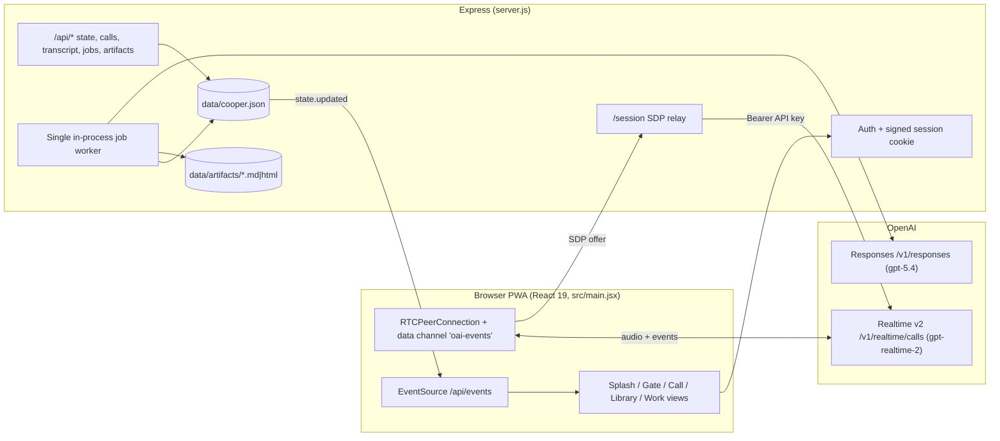
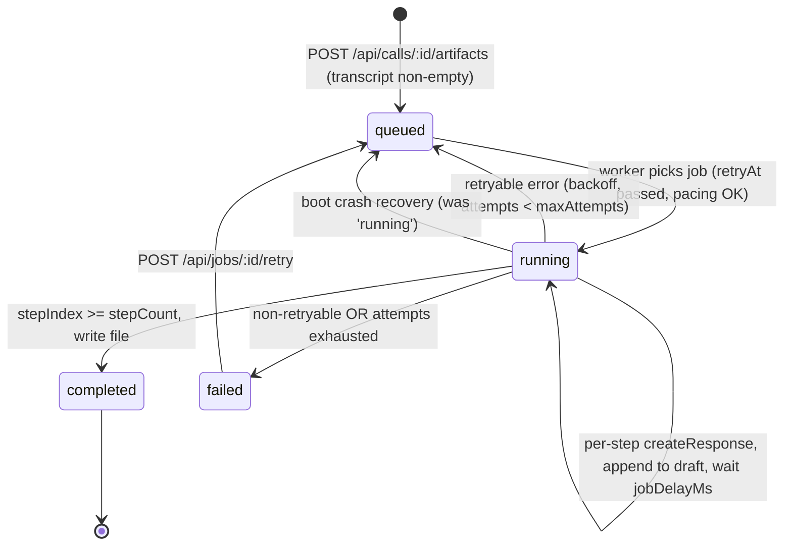

# Cooper — Product Requirements Document (Current Built State)

> **Status:** Reverse-engineered from the shipped implementation (`server.js`, `src/main.jsx`, `package.json`).
> This document describes **what exists today**, not a forward roadmap. Every requirement is grounded in the source and cited as `file:line`. Anything not in the code is captured under [Out of Scope / Not Built](#9-out-of-scope--not-built).

---

## Table of Contents

1. [Vision & Product Summary](#1-vision--product-summary)
2. [Problem Statement](#2-problem-statement)
3. [Target User & Persona](#3-target-user--persona)
4. [System Context](#4-system-context)
5. [Feature Set (User Stories & Acceptance Criteria)](#5-feature-set-user-stories--acceptance-criteria)
   - [5.1 Splash / Entry](#51-splash--entry)
   - [5.2 Password Gate](#52-password-gate)
   - [5.3 Live WebRTC Call](#53-live-webrtc-call)
   - [5.4 Cooper Voice Behavior (Silent-by-Default, Wake Word, Call Cooper, Typed Prompt)](#54-cooper-voice-behavior)
   - [5.5 check_calendar Sample Tool](#55-check_calendar-sample-tool)
   - [5.6 Transcript Capture](#56-transcript-capture)
   - [5.7 Saved Call Library](#57-saved-call-library)
   - [5.8 Post-Call Artifacts (Six Types)](#58-post-call-artifacts-six-types)
   - [5.9 Artifact Rendering & Sandboxed HTML Preview](#59-artifact-rendering--sandboxed-html-preview)
   - [5.10 Live Execution Feedback (SSE)](#510-live-execution-feedback-sse)
   - [5.11 PWA Install & Completion Notifications](#511-pwa-install--completion-notifications)
   - [5.12 Manual Job Retry](#512-manual-job-retry)
6. [Artifact Generation Lifecycle](#6-artifact-generation-lifecycle)
7. [Non-Functional Requirements (As Observed)](#7-non-functional-requirements-as-observed)
8. [Security Posture (As Observed)](#8-security-posture-as-observed)
9. [Out of Scope / Not Built](#9-out-of-scope--not-built)

---

## 1. Vision & Product Summary

**Cooper** is a local-first, single-user progressive web app that acts as an **AIRES executive voice assistant**. It joins live meetings as a silent listener over the OpenAI Realtime API (WebRTC), speaks only when explicitly called on, and after a call ends it turns the captured transcript into executive-grade work products (briefs, plans, PRDs, code sketches, follow-ups, and interactive HTML prototypes) via the OpenAI Responses API.

The vision: give one executive an always-available, judgment-grade chief-of-staff that listens in the room, stays quiet until summoned, and converts conversation into deliverables — without a backend platform, multi-tenant account system, or cloud database.

| Attribute | Current State |
|---|---|
| Product type | Local-first React + Express PWA |
| Frontend | React 19 + Vite 6, single `App` component (`src/main.jsx:122`) |
| Backend | Express 4.21, ESM (`server.js`) |
| Live voice | OpenAI Realtime v2 over WebRTC, model `gpt-realtime-2` (`server.js:116-141`) |
| Artifact generation | OpenAI Responses API, default model `gpt-5.4` (`server.js:18`, `658-703`) |
| Persistence | Single JSON file `data/cooper.json` + artifact files on disk (`server.js:13-15`) |
| Users | One — single shared password (`COOPER_APP_PASSWORD`) |

---

## 2. Problem Statement

An executive who leads both product and engineering sits in many meetings and produces follow-up artifacts from each one — operating briefs, execution plans, PRDs, technical sketches, follow-up memos, prototypes. Doing this manually is slow and lossy: notes are incomplete, context decays, and the highest-leverage next moves get dropped.

Cooper addresses this for a **single user, on their own machine**, by:

1. **Listening** to live meeting audio without interrupting (silent-by-default Realtime session).
2. **Capturing** an attributed transcript of both the human ("Michael") and Cooper.
3. **Converting** that transcript, on demand and after the call, into one of six fixed artifact types through a multi-step model prompt chain.

It deliberately avoids being a platform: no accounts, no real calendar, no cloud DB, no team features. The cost of those is removed in exchange for a fast, private, one-person tool.

---

## 3. Target User & Persona

### Primary (and only) persona — "Michael"

| Field | Detail |
|---|---|
| Name | Michael |
| Role | CTO and CPO at AIRES |
| Context | Leads product strategy, architecture, developer experience, delivery operations, roadmap prioritization, and team execution |
| Goals | Stay present in meetings while still producing executive deliverables; get a "second brain" recommendation on demand; convert conversation into action |
| Environment | Runs Cooper locally (single shared password gate); installs it as a PWA |
| Hard-coded into product | Cooper's instructions name Michael explicitly as AIRES CTO/CPO (`src/main.jsx:79`); transcript speakers normalize to "Michael" / "Cooper" (`server.js:844-856`) |

This is a **single-user product**. There is no second persona, no admin, no teammate, and no concept of accounts (see [Out of Scope](#9-out-of-scope--not-built)).

---

## 4. System Context



Key fact: **the OpenAI API key never reaches the client.** The server relays the WebRTC SDP offer to OpenAI with the standing `OPENAI_API_KEY` and returns the answer SDP (`server.js:200-243`).

---

## 5. Feature Set (User Stories & Acceptance Criteria)

### 5.1 Splash / Entry

**User story:** As Michael, when I first open Cooper, I see a splash/entry screen before the app starts so the experience feels deliberate rather than dropping me straight into a live mic.

**Acceptance criteria:**
- [ ] On load, the app checks `localStorage["cooper.entered"]`; if not set, the splash/entry screen is shown (`src/main.jsx`).
- [ ] Entering the app sets `cooper.entered` so the splash is not shown again on subsequent loads.
- [ ] Entry is independent of authentication — the splash is local UI state, the gate is server-verified.

### 5.2 Password Gate

**User story:** As Michael, I must enter a shared password before I can start a call or generate artifacts, so casual access to my meeting data is blocked.

**Acceptance criteria:**
- [ ] On entry, the client checks `GET /api/auth/session`, which returns `{ authenticated }` (`server.js`).
- [ ] If not authenticated, a password form is shown; submitting posts `POST /api/auth/login` with `{ password }` using same-origin credentials (`src/main.jsx`).
- [ ] The server compares the password to `COOPER_APP_PASSWORD` using a constant-time `safeCompare` (timing-safe equal after length check) (`server.js:984-991`).
- [ ] On success the server mints an HMAC-SHA256-signed `cooper_session` cookie (`HttpOnly`, `SameSite=Lax`, `Path=/`, `Max-Age` from TTL; `Secure` only in production) (`server.js:972-982`, `1012-1020`).
- [ ] All `/session` and `/api/*` routes (except `/api/auth/*`) require both that `COOPER_APP_PASSWORD` is configured **and** a valid, non-expired session (`server.js:74-93`, `954-970`).
- [ ] `POST /api/auth/logout` clears the cookie (`server.js`).
- [ ] **Known gap (built as-is):** there is no login rate-limiting/lockout, and `COOPER_SESSION_SECRET` defaults to the app password (`server.js:23`). See [Security Posture](#8-security-posture-as-observed).

### 5.3 Live WebRTC Call

**User story:** As Michael, I can start a live call where Cooper listens to my meeting audio in real time, and I see a live waveform indicating what Cooper is hearing/speaking.

**Acceptance criteria:**
- [ ] Connecting creates a new `RTCPeerConnection` (default ICE, no STUN/TURN configured), requests microphone audio via `getUserMedia` with `echoCancellation`, `noiseSuppression`, `autoGainControl`, and adds the track (`src/main.jsx:520+`).
- [ ] A data channel `oai-events` is opened; on open the client sends a `session.update` mirroring the server session config (instructions, audio config, tools) (`src/main.jsx:73-120`).
- [ ] The client creates an SDP offer, sets the local description, `POST`s the offer SDP to `/session`, and applies the returned answer SDP (`src/main.jsx:520+`).
- [ ] Remote Cooper audio is piped to an autoplay `Audio()` element via `ontrack` (`src/main.jsx`).
- [ ] A waveform / visual state reflects the live session: `hearing` while user speech is detected, `speaking` while Cooper responds (driven by Realtime events such as `input_audio_buffer.speech_started/stopped` and `response.output_audio.delta` in `handleServerEvent`, `src/main.jsx:420-518`).
- [ ] The server mints the realtime call by relaying the SDP to `https://api.openai.com/v1/realtime/calls` with the server's `OPENAI_API_KEY` and header `OpenAI-Safety-Identifier: cooper-local-dev`, returning the answer SDP and relaying the `Location` header as `X-OpenAI-Call-Location` (`server.js:200-243`).

### 5.4 Cooper Voice Behavior

> Silent-by-default + wake word "Cooper" + "Call Cooper" + typed prompt.

**User story:** As Michael, Cooper stays quiet during the meeting and only speaks when I clearly address it — by saying "Cooper", pressing a "Call Cooper" control, or typing a prompt — so it never talks over the room.

**Acceptance criteria:**
- [ ] The Realtime session uses `server_vad` turn detection with `create_response: false` and `interrupt_response: false`, so Cooper does **not** auto-respond to detected turns (silent by default) (`server.js:116-141`; mirrored client-side `src/main.jsx:104-111`).
- [ ] When a user turn transcription completes (`conversation.item.input_audio_transcription.completed`), the client commits a "Michael" transcript turn and tests it against the wake-word regex `/\b(cooper|hey cooper|ok cooper|okay cooper)\b/i`; a match calls `requestCooper()` (`src/main.jsx:420-518`).
- [ ] A "Call Cooper" control invokes `requestCooper()` directly without a wake word (`src/main.jsx:394-418`).
- [ ] A typed prompt path passes user text into `requestCooper(text)`, which first sends a `conversation.item.create` message then a `response.create` instructing Cooper "you have been called on" (`src/main.jsx:394-418`).
- [ ] Cooper's instructions explicitly tell it not to speak just because people are talking, and to answer with "recommendation, tradeoff, risk, and next move" when called on (`src/main.jsx:82-95`).
- [ ] Cooper's output voice is `cedar` (`src/main.jsx:113-115`; mirrored server-side `server.js:116-141`).

### 5.5 check_calendar Sample Tool

**User story:** As Michael, when I ask Cooper about my availability, it can check a calendar and tell me whether I'm free.

**Acceptance criteria:**
- [ ] `check_calendar(date, time)` is registered **client-side** as a function tool with `tool_choice: "auto"` (`src/main.jsx:53-71`, `117-118`).
- [ ] When Cooper emits a `check_calendar` function call (collected from `response.done` items), the client runs a **local** `checkCalendar` against a hard-coded sample `busyBlocks` calendar and returns availability (`src/main.jsx:371-392`).
- [ ] The result is returned to Cooper via `conversation.item.create` with `function_call_output`, followed by `response.create` (`src/main.jsx:371-392`).
- [ ] **Built as a stub:** this is a purely client-side sample. There is no real calendar integration (see [Out of Scope](#9-out-of-scope--not-built)).

### 5.6 Transcript Capture

**User story:** As Michael, both what I say and what Cooper says are captured into an attributed transcript tied to the call.

**Acceptance criteria:**
- [ ] User (microphone) turns are captured from `input_audio_transcription.completed` and attributed to "Michael" (`src/main.jsx:420-518`).
- [ ] Cooper output turns are captured by buffering `response.output_audio_transcript` deltas per response/item (`outputTranscriptBuffersRef`, `textTranscriptBuffersRef`) and committed on done (`src/main.jsx`).
- [ ] Turns are persisted via `POST /api/calls/:id/transcript`, which upserts a turn (dedupes via `sameTranscriptTurn`) (`server.js:323-349`, `866-871`).
- [ ] Each transcript entry is normalized to `{ id, at, speaker, text, source, responseId, itemId }`; speaker normalization maps blank/"speaker"/"user" → "Michael" and "assistant" → "Cooper" (`server.js:844-856`).

### 5.7 Saved Call Library

**User story:** As Michael, my calls are saved so I can revisit any past meeting, read its transcript, and generate artifacts from it later.

**Acceptance criteria:**
- [ ] A call is created via `POST /api/calls` (201) and listed via `GET /api/calls`; a single call (with its artifacts) is fetched via `GET /api/calls/:id` (`server.js:265-300`).
- [ ] Calls can be partially updated (`title`, `status`, `duration`, `transcript`, `endedAt`) via `PATCH /api/calls/:id` (`server.js:302-321`).
- [ ] `POST /api/calls/:id/end` sets the call to `ended`, records timing, and flips the six suggestion entries to `enabled` when the transcript is non-empty (`server.js:351-369`, `833-842`).
- [ ] A call record has shape `{ id, title, status(active|ended), startedAt, endedAt, durationSeconds, transcript[], suggestions[], createdAt, updatedAt }`.
- [ ] The library and a "work view" render from `GET /api/state` (`server.js:245-248`, `793-812`).

### 5.8 Post-Call Artifacts (Six Types)

**User story:** As Michael, after a call I can ask Cooper to produce one of six executive work products from the transcript, optionally with my own extra instruction.

**The six artifact types** (`artifactRecipes`, `server.js:143-198`):

| Kind | Title | Output | Steps | Purpose |
|---|---|---|---|---|
| `post_call_kit` | Post-call kit | markdown | 3 | Executive operating brief (Summary, Decisions, Risks, Actions, Owners, Product/Eng Notes, Calendar Follow-up, Cooper Recommendation) |
| `execution_plan` | Execution plan | markdown | 3 | Pragmatic SDLC execution plan (phases, milestones, acceptance criteria, dependencies, risks, cadence) |
| `follow_up` | Follow-up summary | markdown | 3 | Executive memo + post-meeting bullets + private next-action checklist |
| `code_sketch` | Code sketch | markdown | 3 | Technical implementation sketch (data flow, components, API surfaces, risks, test strategy, draft snippets) |
| `product_requirements` | Product requirements doc | markdown | 3 | PRD + prototype brief section |
| `html_prototype` | HTML prototype | html | 3 | Complete standalone, mobile-first HTML/CSS/JS document |

**Acceptance criteria:**
- [ ] Requesting an artifact posts `POST /api/calls/:id/artifacts`, which requires the call to exist **and** the transcript to be non-empty (else `400`), then enqueues a `queued` job and returns `202` with the public job (`server.js:371-382`, `424-471`).
- [ ] The job carries the recipe's `stepCount`, an optional `customPrompt` (Michael's extra instruction), `attempts`, `failures`, `maxAttempts`, and progress/log fields (`publicJob` strips `draft` and caps logs to the last 40, `server.js:814-817`).
- [ ] Each artifact recipe is a **fixed multi-step prompt chain**; the prompt for each step includes call title/times, the current draft, the current step, Michael's `customPrompt`, and the **full transcript** joined as `[at] speaker: text` (`buildWorkPrompt`, `server.js:705-745`).
- [ ] Completed artifacts are written to disk as `data/artifacts/<uuid>.<md|html>` and recorded as `{ id, callId, jobId, kind, title, outputType, extension, mimeType, file, createdAt }` (`completeArtifact`, `server.js:613-656`).

### 5.9 Artifact Rendering & Sandboxed HTML Preview

**User story:** As Michael, I can read generated markdown artifacts (with diagrams) and preview HTML prototypes safely, toggling between Mobile and Desktop layouts.

**Acceptance criteria:**
- [ ] Markdown artifacts are rendered with `markdown-it` then sanitized with `DOMPurify.sanitize` before injection (`src/main.jsx:1588`).
- [ ] Fenced ` ```mermaid ` blocks are rendered via a lazily-imported `mermaid` (`src/main.jsx:1594-1615`).
- [ ] HTML prototype artifacts are shown in an `<iframe sandbox="allow-forms allow-modals allow-popups allow-scripts">` — notably **without** `allow-same-origin`, so prototype scripts run isolated from the app origin and cookies (`src/main.jsx:1442`).
- [ ] The preview offers **Mobile / Desktop viewport toggles** (`src/main.jsx`).
- [ ] Artifact content is fetched via `GET /api/artifacts/:id/content`, which resolves the file by basename (path-traversal mitigated via `.pop()`) and serves it with the artifact's MIME type, or `404` if missing (`server.js:384-398`, `873-878`).

### 5.10 Live Execution Feedback (SSE)

**User story:** As Michael, while Cooper is generating an artifact, I see live progress (status, step, logs) without refreshing.

**Acceptance criteria:**
- [ ] The client opens an `EventSource` to `GET /api/events` (SSE, `text/event-stream`), which emits `connected` then `state.updated` events (`server.js:250-263`).
- [ ] Every DB write broadcasts `state.updated` to all connected clients; the client refetches `GET /api/state` on each broadcast (`server.js:781-791`, `src/main.jsx`).
- [ ] Job progress, `stepIndex`/`stepCount`, status transitions (`queued → running → completed|failed`), and the last 40 log lines are visible from public job state (`server.js:814-817`).

### 5.11 PWA Install & Completion Notifications

**User story:** As Michael, I can install Cooper as an app, and I get a notification when an artifact finishes.

**Acceptance criteria:**
- [ ] The app ships `public/manifest.webmanifest`, a service worker `public/sw.js` (simple cache-first), and an icon `public/icons/cooper.svg`, making it installable.
- [ ] On artifact completion, the client raises a completion notice via the Notification API (`src/main.jsx`).

### 5.12 Manual Job Retry

**User story:** As Michael, if an artifact job fails, I can manually retry it.

**Acceptance criteria:**
- [ ] A retry control posts `POST /api/jobs/:id/retry`, which resets a `failed` job to `queued`, zeroes `attempts`/`failures`, and re-queues it (`server.js:400-422`).
- [ ] Retryable model errors (HTTP `408/409/429/500/502/503/504`) are auto-retried with backoff honoring `Retry-After`, up to `maxAttempts` (default 3), before the job is marked `failed` (`server.js:588-610`, `658-703`).
- [ ] On boot, any job stuck in `running` is reset to `queued` with a recovery log (crash recovery) (`server.js:1063-1090`).

---

## 6. Artifact Generation Lifecycle



**Worker behavior (`server.js:473-611`):**
- A **single** in-process worker (`workerActive` flag) processes the queue (`processQueue`, `479-514`).
- Global pacing enforces `lastGenerationAt + jobDelayMs` (default 15000ms) between model calls (`server.js:20`).
- Each job runs its recipe one step at a time, appending each step's output to `job.draft` with an HTML-comment step marker, waiting `jobDelayMs` between steps (`runJob`, `516-611`).
- Model call: `POST https://api.openai.com/v1/responses` with `reasoning.effort: "medium"`, `max_output_tokens: jobMaxOutputTokens` (default 6500), `text.format.type: "text"`; model chosen by attempt index across `[workModel, fallbackWorkModel]` (`createResponse`, `658-703`).
- Completion writes the file: HTML artifacts run `extractHtmlDocument(draft)` (last fenced block or `<!doctype>/<html>` slice) else a fallback; markdown is normalized with a `# title` (`completeArtifact`, `613-656`, `899-916`).

---

## 7. Non-Functional Requirements (As Observed)

| Area | Observed requirement / behavior | Source |
|---|---|---|
| Runtime | Node ESM (`type: module`), Express 4.21; dev mounts Vite middleware (`appType: "spa"`), prod serves `dist/` with SPA fallback | `package.json`, `server.js:1093-1105` |
| Config | Driven by env: `OPENAI_API_KEY`, `COOPER_APP_PASSWORD`, `COOPER_SESSION_SECRET`, `COOPER_SESSION_TTL_HOURS` (168), `COOPER_WORK_MODEL` (`gpt-5.4`), `COOPER_FALLBACK_WORK_MODEL`, `COOPER_JOB_DELAY_MS` (15000), `COOPER_JOB_MAX_ATTEMPTS` (3), `COOPER_JOB_MAX_OUTPUT_TOKENS` (6500) | `server.js:11-25` |
| Body limits | `application/sdp`+`text/plain` 2mb, `json` 4mb | `server.js:33-34` |
| Persistence | Single JSON file `data/cooper.json` `{ calls, artifacts, jobs }`; writes serialized through an in-process promise chain (`writeQueue`); no cross-process locking; whole-file rewrite each change | `server.js:758-791` |
| Concurrency/scale | Single in-process job worker; no horizontal scale; jobs recovered from `running → queued` on boot | `server.js:479-514`, `1063-1090` |
| Real-time fan-out | SSE broadcasts to all connected clients (acceptable for single user) | `server.js:250-263` |
| Latency/pacing | Min `jobDelayMs` between model calls and between steps to pace the Responses API | `server.js:20`, `479-514` |
| API key handling | Server-side relay only; key never sent to client | `server.js:200-243` |
| Durability | Plaintext on local disk; no backups, no object storage, no DB | `server.js:13-15` |
| Observability | No health endpoint, no structured logging/metrics/tracing; console errors only | (absence) |

---

## 8. Security Posture (As Observed)

**Strengths (built correctly):**
- OpenAI API key never reaches the client — server relay (`server.js:200-243`).
- Constant-time password comparison (`safeCompare`, `server.js:984-991`).
- `HttpOnly` + `SameSite=Lax` HMAC-SHA256-signed session cookie (`server.js:972-982`, `1012-1020`).
- Artifact path-traversal mitigated by basename `.pop()` (`server.js:873-878`).
- HTML prototype iframe omits `allow-same-origin`, isolating prototype scripts from app cookies/origin (`src/main.jsx:1442`).
- Markdown sanitized via DOMPurify (`src/main.jsx:1588`).
- Job crash recovery + write serialization + Cooper silent-by-default.

**Real weaknesses (documented honestly, severity as observed):**

| Severity | Weakness | Source |
|---|---|---|
| HIGH | No login rate-limiting/lockout → brute-forceable single shared password | `server.js:954-1019` |
| HIGH/MED | `COOPER_SESSION_SECRET` defaults to the app password → weak key separation; password rotation breaks sessions; password leak enables session forgery | `server.js:23` |
| MED | `Secure` cookie flag only set in production (dev cookie sent over plain HTTP) | `server.js:1012-1020` |
| MED | No CSRF tokens on state-changing POST/PATCH (only `SameSite=Lax` partial mitigation) | `server.js` |
| MED | Prompt-injection: full untrusted transcript + `customPrompt` concatenated into Responses prompts; bounded by iframe sandbox + no tool execution on the Responses side | `server.js:705-745` |
| MED | Plaintext transcripts/artifacts at rest, unencrypted; no retention controls | `server.js:13-15` |
| MED | `html_prototype` iframe allows `allow-scripts`/`allow-popups`/`allow-modals` (popup/redirect surface, though origin-isolated) | `src/main.jsx:1442` |
| LOW | Single shared credential → no per-user accountability/audit | `server.js` |
| LOW | SSE broadcasts to all connected clients (no scoping) | `server.js:250-263` |
| LOW | No request logging/metrics/health endpoint | (absence) |

---

## 9. Out of Scope / Not Built

The following are **explicitly absent** from the current implementation. They are listed to prevent over-claiming; none of these exist in `server.js` or `src/main.jsx`.

- **Multi-user / multi-tenant accounts** — single shared password only; no user table, no roles, no per-user data scoping.
- **Real calendar integration** — `check_calendar` runs against a hard-coded client-side `busyBlocks` stub (`src/main.jsx:371-392`); no Google/Outlook/CalDAV.
- **Real database** — persistence is a single JSON file (`data/cooper.json`); no SQL/NoSQL/managed DB.
- **OAuth / SSO / third-party identity** — none.
- **Arcade integration, "projectSources", or a "toolCalls" table** — none of these exist.
- **Document/file ingestion** — Cooper works only from captured transcripts; no upload/import pipeline.
- **Object storage / cloud blob store** — artifacts live on local disk only.
- **Automated tests** — there are **no tests** in the repo.
- **CI / lint config** — none.
- **Health checks / structured logging / metrics / tracing** — none.
- **Ephemeral/short-lived client realtime tokens** — the standing `OPENAI_API_KEY` authorizes each call server-side; this is a relay, not an ephemeral-token flow (`server.js:200-243`).
- **Horizontal scaling / multiple worker processes** — single in-process worker only.
- **Backups / encryption at rest / data retention controls** — none.

---

*Document reverse-engineered from source. Citations refer to `server.js` (1110 lines) and `src/main.jsx` (1707 lines) as built.*
