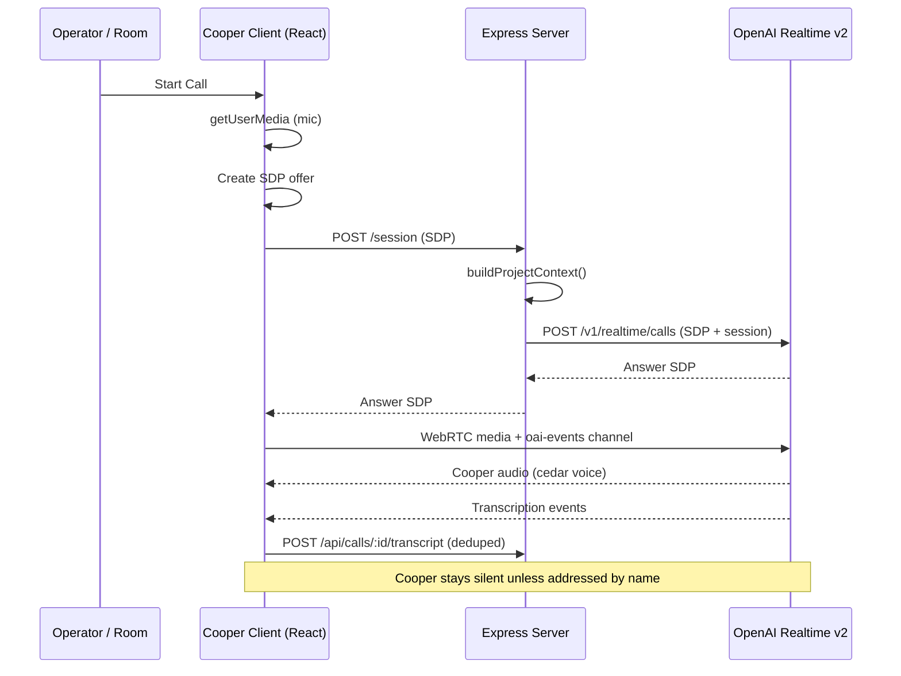
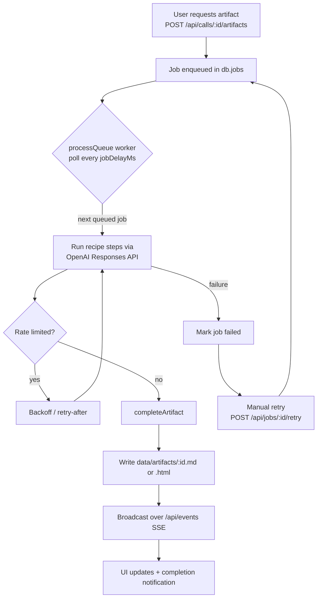

# Cooper — Product Requirements Document (Current State)

> **Document type:** Reverse-engineered product specification of Cooper *as built*.
> **Status:** Descriptive. Every requirement below is grounded in the existing implementation (primarily `server.js`, `src/main.jsx`, `cooperPrompt.js`, `cooperTools.js`, `server/tools/runGstackSkill.js`, `public/sw.js`, and `public/manifest.webmanifest`). Where behavior is intentionally absent, it is listed in [Out of Scope / Not Yet Built](#11-out-of-scope--not-yet-built).
> **Version basis:** `package.json` v0.1.0.

---

## Table of Contents

1. [Product Vision](#1-product-vision)
2. [Problem Statement](#2-problem-statement)
3. [Target User & Personas](#3-target-user--personas)
4. [System Overview](#4-system-overview)
5. [Feature Set (User Stories & Acceptance Criteria)](#5-feature-set-user-stories--acceptance-criteria)
   - [5.1 Splash & Entry](#51-splash--entry)
   - [5.2 Password Gate](#52-password-gate)
   - [5.3 Live WebRTC Call Mode](#53-live-webrtc-call-mode)
   - [5.4 "Call Cooper" / Address-by-Name Behavior](#54-call-cooper--address-by-name-behavior)
   - [5.5 Silence by Default](#55-silence-by-default)
   - [5.6 Transcript Capture](#56-transcript-capture)
   - [5.7 Saved Call Library](#57-saved-call-library)
   - [5.8 Post-Call Work Artifacts](#58-post-call-work-artifacts)
   - [5.9 Sandboxed HTML Preview](#59-sandboxed-html-preview)
   - [5.10 Live Execution Feedback](#510-live-execution-feedback)
   - [5.11 Project Context Library](#511-project-context-library)
   - [5.12 Tool Authorization (Arcade / Settings)](#512-tool-authorization-arcade--settings)
   - [5.13 PWA Install & Completion Notifications](#513-pwa-install--completion-notifications)
   - [5.14 Manual Retry](#514-manual-retry)
6. [Artifact Type Catalog](#6-artifact-type-catalog)
7. [Cooper Tool Catalog](#7-cooper-tool-catalog)
8. [Data Model (As Persisted)](#8-data-model-as-persisted)
9. [Non-Functional Requirements (As Observed)](#9-non-functional-requirements-as-observed)
10. [System Diagrams](#10-system-diagrams)
11. [Out of Scope / Not Yet Built](#11-out-of-scope--not-yet-built)

---

## 1. Product Vision

Cooper is an **ambient AI co-pilot for an AIRES executive's live calls**. It is a single-user, installable progressive web app (PWA) that sits quietly inside a meeting, listens, and — only when invited — speaks as a trusted advisor. After the call ends, Cooper turns the raw conversation into finished executive work product: operating briefs, execution plans, PRDs, technical sketches, diagrams, and interactive prototypes.

The product is built on **OpenAI Realtime v2 over WebRTC** for the live voice experience and the **OpenAI Responses API** for asynchronous artifact synthesis. It is designed to feel less like a chatbot and more like a chief of staff who knows the executive's context, stays silent until needed, and hands back polished deliverables.

---

## 2. Problem Statement

An AIRES executive (CTO/CPO) spends most of the day in calls where decisions, risks, product implications, and engineering follow-ups are generated faster than they can be captured. Conventional note-takers transcribe but do not *think*; chatbots think but interrupt the flow of a live human conversation and lack the executive's working context.

Cooper addresses three gaps:

1. **Ambient capture without disruption** — a participant that listens and transcribes continuously but does not interject unless explicitly addressed.
2. **Context-aware judgment** — an advisor primed with the executive's active project context (pasted notes, Markdown, PDFs) so its contributions are relevant, not generic.
3. **From conversation to deliverable** — automatic conversion of the transcript into the specific executive artifacts (briefs, plans, PRDs, prototypes) the user would otherwise have to write by hand.

---

## 3. Target User & Personas

Cooper is a **single-tenant, single-operator** application. There is no multi-user model in the current build — one shared app password gates the entire instance, and all data is stored in one JSON store with no tenant isolation (see [§11](#11-out-of-scope--not-yet-built)).

| Persona | Description | How Cooper serves them |
| --- | --- | --- |
| **Michael — AIRES CTO/CPO (primary)** | The executive who runs the calls. Named explicitly throughout the system prompt and tool definitions (e.g. `confirmed_by_michael`, "operating brief for Michael as AIRES CTO/CPO"). | Live advisory voice when addressed; post-call artifacts written from his CTO/CPO point of view; write-actions gated behind his explicit confirmation. |
| **Cooper — the AI advisor (the product persona)** | The agent identity. Speaks with the `cedar` voice, addresses the user by name, defaults to silence, and asks permission before taking write actions. | Embodies the assistant; transcribed as the "cooper" speaker turn in saved calls. |
| **Meeting counterparts (implicit)** | Other call participants whose speech is captured. Not authenticated; their audio is transcribed as `user` turns. | Their speech becomes part of the transcript and feeds artifact generation. |

> **Note:** Because authentication is a single shared password, "persona" here is a product role, not an enforced account boundary.

---

## 4. System Overview

Cooper is a single Node.js process (`server.js`) that serves both the React 19 / Vite frontend and the Express API. In development it mounts Vite as middleware; in production it serves the pre-built `dist/` with SPA fallback.

| Layer | Technology | Source |
| --- | --- | --- |
| Frontend | React 19, Vite 6, Lucide icons, `markdown-it`, `mermaid`, DOMPurify | `src/main.jsx` (~2.5k lines), `src/styles.css` |
| Live voice | OpenAI Realtime v2 (`gpt-realtime-2`, `cedar` voice) over WebRTC | `server.js` `/session`, `src/main.jsx` peer connection |
| Transcription | `gpt-4o-mini-transcribe` (within the Realtime session) | `server.js` session builder |
| Artifact synthesis | OpenAI Responses API (`gpt-5.4` / fallback), multi-step jobs | `server.js` job queue, `artifactRecipes` |
| Advisory skills | GStack skill runner via Responses API (read-only) | `server/tools/runGstackSkill.js` |
| External tools | Arcade SDK (`@arcadeai/arcadejs`) with OAuth pre-authorization | `server.js` Arcade router |
| Persistence | Single JSON file `data/cooper.json` + artifact files in `data/artifacts/` | `server.js` data layer |
| Real-time UI updates | Server-Sent Events at `/api/events` + 4s polling of `/api/state` | `server.js`, `src/main.jsx` |
| Install / offline | PWA manifest + service worker (network-first shell cache) | `public/manifest.webmanifest`, `public/sw.js` |

---

## 5. Feature Set (User Stories & Acceptance Criteria)

### 5.1 Splash & Entry

**User story:** As the operator, I want a branded entry screen on first load so the app feels intentional before I unlock it.

**As built:** The `Splash` component renders an AIRES-branded onboarding screen. Dismissing it sets the `cooper.entered` flag in `localStorage`, which gates whether the main app shell is shown.

**Acceptance criteria:**
- [x] On first load with no `cooper.entered` flag, the splash screen is displayed with AIRES branding.
- [x] Proceeding from the splash sets `localStorage["cooper.entered"]` and reveals the app (subject to the password gate).
- [x] The flag is removed on logout.
- [ ] *Known gap:* the flag persists indefinitely and is **not** cleared when the server session cookie expires, so the UI can appear "entered" after the session is invalid (see [§11](#11-out-of-scope--not-yet-built)).

### 5.2 Password Gate

**User story:** As the operator, I want the app protected by a password so that only I can start calls and read transcripts.

**As built:** The `LockScreen` component posts to `POST /api/auth/login`. The server compares the submitted value to `COOPER_APP_PASSWORD` using a timing-safe comparison and, on success, issues an **HMAC-SHA256 signed session token** stored in an `HttpOnly` cookie (`SameSite=Lax`, `Secure` in production). All `/api/*` and `/session` routes require a valid session via `isAuthenticated()` middleware. Session TTL defaults to 168 hours (configurable via `COOPER_SESSION_TTL_HOURS`).

**Acceptance criteria:**
- [x] An incorrect password is rejected; a correct password establishes a signed session cookie.
- [x] Password comparison is constant-time (`crypto.timingSafeEqual` via `safeCompare`).
- [x] The session token is signed (base64url JSON payload + HMAC signature) and verified on every request.
- [x] Cookie is `HttpOnly` and `SameSite=Lax`; `Secure` flag is set in production.
- [x] `POST /api/auth/logout` clears the session and the `localStorage` entry flag.
- [ ] *Known gaps:* no rate limiting / lockout on login attempts; the session signing secret defaults to `COOPER_APP_PASSWORD` if `COOPER_SESSION_SECRET` is unset; no CSRF token on mutations (relies on `SameSite=Lax`). See [§11](#11-out-of-scope--not-yet-built).

### 5.3 Live WebRTC Call Mode

**User story:** As the operator, I want to start a live call where Cooper hears the room, I hear Cooper, and I can see a waveform confirming audio is flowing.

**As built:** `CallScreen` opens a full-screen dark call UI. Clicking "Start Call":
1. Requests the microphone via `getUserMedia` with `echoCancellation`, `noiseSuppression`, and `autoGainControl`.
2. Creates an `RTCPeerConnection`, generates a local SDP offer, and posts the raw SDP to `POST /session`.
3. The server injects the active project context and relays the offer to OpenAI `/v1/realtime/calls` (multipart FormData: `sdp` + session JSON), returning the answer SDP.
4. The client sets the remote description and opens the `oai-events` data channel; on open it sends the session update (instructions + tools + project context).
5. Inbound audio is attached to an autoplaying `<audio>` element for Cooper's voice; a 31-bar animated `SoundWave` component reflects listening/speaking state.

The Realtime session uses **semantic VAD** turn detection and **far-field noise reduction**, suitable for capturing a room.

**Acceptance criteria:**
- [x] Starting a call obtains mic access and establishes a bidirectional WebRTC connection to OpenAI Realtime.
- [x] An animated waveform indicates active audio.
- [x] Cooper's spoken responses play back in real time through the audio element.
- [x] The call dock surfaces a live transcript view and an events view.
- [x] Connection failures (mic denied, SDP exchange, peer connection) produce user-friendly error messages (`describeConnectionError`).
- [x] A call record is created server-side so transcript and artifacts can be associated with it.

### 5.4 "Call Cooper" / Address-by-Name Behavior

**User story:** As the operator, I want Cooper to respond only when I address it by name (e.g. "Hey Cooper", "What do you think, Cooper?") so it never speaks over the meeting.

**As built:** The client implements **wake-phrase detection** (`cooperWakePhrase` regex patterns) over the live transcript, recognizing variants such as "Hey Cooper", "What do you think Cooper", and similar address-by-name forms. Cooper's system prompt (`cooperPrompt.js`) instructs the agent to engage when addressed and to stay quiet otherwise. The agent addresses the user by name (Michael).

**Acceptance criteria:**
- [x] Phrases that address Cooper by name trigger Cooper to respond.
- [x] General conversation that does not address Cooper does not trigger a spoken response.
- [x] Cooper refers to the user by name in its responses.

### 5.5 Silence by Default

**User story:** As the operator, I want Cooper to default to silence during a call so it behaves like a discreet participant, not a chatty assistant.

**As built:** Cooper is prompted to remain silent unless explicitly addressed (see [§5.4](#54-call-cooper--address-by-name-behavior)). The agent continues to listen and transcribe throughout; silence applies to *spoken output*, not to capture. Write-affecting tool actions are additionally gated (see [§5.12](#512-tool-authorization-arcade--settings)).

**Acceptance criteria:**
- [x] Cooper does not interject during normal conversation flow.
- [x] Listening and transcription continue regardless of whether Cooper is speaking.
- [x] Cooper asks permission before taking any write action rather than acting autonomously.

### 5.6 Transcript Capture

**User story:** As the operator, I want the full conversation captured turn-by-turn so I can review it and generate work from it later.

**As built:** Realtime events (`input_audio_transcription.completed`, `response.audio_transcript.delta` / `.done`) are accumulated into client-side buffers keyed by `responseId` / `itemId` for **deduplication**, then posted to `POST /api/calls/:id/transcript`. The server normalizes and persists each entry (speaker = `user` or `cooper`) into the call's `transcript` array in `data/cooper.json`.

**Acceptance criteria:**
- [x] Both the user/room speech and Cooper's speech are captured as distinct turns.
- [x] Duplicate transcript fragments are de-duplicated before persistence (by response/item id).
- [x] The full transcript is stored against the call and survives the call ending.
- [ ] *Known gap:* no per-entry size cap on transcript text (unbounded growth risk). See [§11](#11-out-of-scope--not-yet-built).

### 5.7 Saved Call Library

**User story:** As the operator, I want a library of past calls so I can revisit any conversation, read its transcript, and see what work it produced.

**As built:** `LibraryView` presents a left-rail list of saved calls with a detail pane showing the transcript, associated artifacts, and **post-call kit suggestions**. State is sourced from `GET /api/state` (polled every 4s) and `/api/events` SSE updates.

**Acceptance criteria:**
- [x] All saved calls appear in a browsable list.
- [x] Selecting a call shows its full transcript.
- [x] Artifacts generated from a call are listed with the call.
- [x] The detail pane suggests post-call artifacts the user can generate.

### 5.8 Post-Call Work Artifacts

**User story:** As the operator, after a call I want to turn the conversation into finished executive deliverables with one action.

**As built:** From the library or live canvas, the user requests an artifact via `POST /api/calls/:id/artifacts` with a `kind` and optional `customPrompt`. The server enqueues a **multi-step job** in `db.jobs`. A single in-process, rate-limited worker (`processQueue`, default `jobDelayMs = 15s`) executes each recipe step against the Responses API, respects `retry-after` headers with backoff, then writes the finished artifact to `data/artifacts/:id.{md|html}` and broadcasts completion over SSE.

Each artifact `kind` maps to a hard-coded **recipe** (`artifactRecipes`) of sequential reasoning steps that combine the transcript, active project context, and any custom prompt.

**Acceptance criteria:**
- [x] Requesting an artifact enqueues a job that is visible in the work queue with progress.
- [x] Jobs run one at a time, spaced by `jobDelayMs`, and back off on rate limits.
- [x] Markdown artifacts are normalized and stored; HTML artifacts are extracted/escaped and stored.
- [x] Completed artifacts are retrievable via `GET /api/artifacts/:id/content` with the correct MIME type.
- [x] Completion triggers a UI/SSE event (and notification — see [§5.13](#513-pwa-install--completion-notifications)).

> The complete catalog of artifact types is in [§6](#6-artifact-type-catalog). The user-facing **post-call kit** surfaces a focused subset of these as one-click suggestions; the full set of eight recipes is available via the canvas and artifact requests.

### 5.9 Sandboxed HTML Preview

**User story:** As the operator, I want to preview generated HTML prototypes safely and toggle between mobile and desktop framing.

**As built:** `HtmlPrototypeDocument` renders generated HTML inside an **`<iframe srcDoc>`** with a restrictive `sandbox` attribute (`allow-forms allow-modals allow-popups allow-scripts`). A **viewport toggle** switches the preview between **Mobile** and **Desktop** framing. Mermaid is disabled inside the sandbox. Markdown artifacts (`MarkdownArtifactDocument`) are rendered separately via `markdown-it` + **DOMPurify** sanitization with Mermaid diagram support, offering Read and Markdown tabs.

**Acceptance criteria:**
- [x] HTML artifacts render in an isolated iframe via `srcDoc` (no external origin).
- [x] The iframe sandbox restricts capabilities to the listed allow-flags.
- [x] A Mobile/Desktop toggle re-frames the preview.
- [x] Markdown artifacts are sanitized with DOMPurify before rendering and support Mermaid diagrams.
- [ ] *Known gap:* the sandbox permits `allow-scripts`; prototype JS executes within the iframe. See [§11](#11-out-of-scope--not-yet-built).

### 5.10 Live Execution Feedback

**User story:** As the operator, I want to watch jobs execute in real time — progress, step logs, and activity — so I know Cooper is working.

**As built:** `JobList` and `ActivityStream` render the queue with **progress bars, step tracking, and execution logs**. The worker emits per-step progress that is broadcast over SSE (`/api/events`) and merged into client state, alongside 4-second polling of `/api/state`. The call mode also keeps a rolling event buffer (most recent events) in the call dock.

**Acceptance criteria:**
- [x] Each running job shows current step and progress.
- [x] Execution logs/activity stream updates live as steps complete.
- [x] Updates arrive via SSE in near-real time, with polling as a consistency backstop.

### 5.11 Project Context Library

**User story:** As the operator, I want to feed Cooper my project context (notes, Markdown, PDFs) so its live advice and generated artifacts are grounded in my actual work.

**As built:** `ProjectsView` provides a project list and a detail pane for ingesting context: pasted text via `POST /api/projects/:id/sources`, or uploaded `.md` / `.pdf` / `.txt` files via `POST /api/projects/:id/uploads` (PDFs parsed with `pdf-parse`). Sources are stored (truncated to 250k chars each) and compacted by `buildProjectContext()` into a packet of up to **18k chars** (top sources) that is injected into the Realtime session instructions and into artifact job prompts. During a live call, `CallCanvas` can add context on the fly and refresh the live session.

**Acceptance criteria:**
- [x] The user can create projects and add context via paste or file upload (MD/PDF/TXT).
- [x] PDF text is extracted server-side before storage.
- [x] Active project context is injected into the live Realtime session and into artifact prompts.
- [x] Context added mid-call refreshes the live session via the data channel.
- [ ] *Known gaps:* project context is concatenated into instructions without escaping (prompt-injection surface); file validation is by MIME/extension only; no per-user isolation of projects. See [§11](#11-out-of-scope--not-yet-built).

### 5.12 Tool Authorization (Arcade / Settings)

**User story:** As the operator, I want to authorize external tools and review what Cooper has done so I stay in control of any action that touches my workspace.

**As built:** `SettingsView` manages **Arcade MCP tool authorization** (OAuth pre-authorization flow), shows recent tool-call history with status badges, and surfaces which write actions are enabled. Cooper can call read/advisory tools freely; **write actions** (e.g. `create_followup_action`) require both `COOPER_ENABLE_ARCADE_WRITES=true` and an explicit `confirmed_by_michael=true`, otherwise the server returns an `approval_required` status. Tools are risk-classified as read / advisory / write, and every tool call is logged (with sensitive-text redaction) to `db.toolCalls`.

**Acceptance criteria:**
- [x] The user can initiate and complete Arcade authorization for tools that require it.
- [x] Tool execution is blocked until authorization status is `completed`.
- [x] Write actions are disabled by default and require explicit confirmation.
- [x] Recent tool calls are auditable with status, risk level, and timing.
- [x] GStack advisory skills are read-only and cannot mutate code, deploy, or open PRs.

### 5.13 PWA Install & Completion Notifications

**User story:** As the operator, I want to install Cooper like an app and be notified when my requested work is finished, even if I've switched away.

**As built:** A web app manifest (`public/manifest.webmanifest`, `standalone` display) makes Cooper installable. The service worker (`public/sw.js`, `CACHE_NAME = cooper-shell-v1`) pre-caches the app shell with a network-first strategy and explicitly excludes `/api` routes from caching. On job completion, the client calls `notifyWorkDone(job)`, which raises a **Service Worker / Notification API** notification plus an in-app event-log entry; the service worker handles notification clicks.

**Acceptance criteria:**
- [x] Cooper is installable as a PWA (standalone display, icons, manifest).
- [x] The service worker caches the shell for offline launch and bypasses API routes.
- [x] Completed artifact jobs raise a system notification when permission is granted.
- [x] Notification clicks are handled by the service worker.
- [ ] *Known gaps:* `CACHE_NAME` is not versioned/incremented (stale-asset risk); caches are not cleared on logout. See [§11](#11-out-of-scope--not-yet-built).

### 5.14 Manual Retry

**User story:** As the operator, when an artifact job fails I want to retry it without re-entering anything.

**As built:** Failed jobs expose a **retry** control wired to `POST /api/jobs/:id/retry`, which re-queues the job for the worker. On server restart, jobs left in a `running` state are moved back to `queued` with a log entry so they are not lost.

**Acceptance criteria:**
- [x] A failed job shows a retry button.
- [x] Retrying re-queues the job through the normal worker path.
- [x] Jobs interrupted by a restart are recovered to the queue.
- [ ] *Known gap:* retry is manual only; there is no automatic retry of a permanently-failed job and no transactional guarantee for a job that fails mid-step. See [§11](#11-out-of-scope--not-yet-built).

---

## 6. Artifact Type Catalog

The server defines eight artifact recipes in `artifactRecipes` (`server.js`). Each is a hard-coded multi-step prompt sequence run against the Responses API. The "post-call kit" UI promotes a focused subset (post-call kit, execution plan, PRD, code sketch, plus prototype/diagram generators from the canvas); all eight are reachable through the canvas and artifact-request flows.

| Kind | Title | Output | What it produces |
| --- | --- | --- | --- |
| `post_call_kit` | Post-call kit | Markdown | Executive operating brief: Summary, Decisions, Risks, Actions, Owners, Product Notes, Engineering Notes, Calendar Follow-up, plus a Cooper Recommendation section. |
| `execution_plan` | Execution plan | Markdown | Pragmatic SDLC plan: goal, phases, milestones, acceptance criteria, dependencies, risks, review cadence, and suggested Cooper follow-up work. |
| `product_requirements` | Product requirements doc | Markdown | Practical PRD: Background, Goals, Non-goals, User Stories, Functional Requirements, Edge Cases, Data/Integration Needs, Analytics, Rollout, Acceptance Criteria, plus a prototype brief. |
| `code_sketch` | Code sketch | Markdown | Technical implementation sketch: data flow, components, API surfaces, risks, test strategy, and scoped draft code snippets. |
| `follow_up` | Follow-up summary | Markdown | Short executive memo with decisions/commitments, sendable follow-up bullets, and a private next-actions checklist. |
| `html_prototype` | HTML prototype | HTML | Complete standalone, mobile-first HTML document with inline CSS/JS and no external assets — rendered in the sandboxed preview. |
| `mermaid_diagram` | Mermaid diagram | Markdown | Title, one-paragraph explanation, one valid fenced Mermaid block (flowchart / sequence / state / journey / class), and a "How to read this" note. |
| `ui_wireframe` | UI wireframe | HTML | Mobile-first interface wireframe rendered as standalone HTML in the sandboxed preview. |

---

## 7. Cooper Tool Catalog

Cooper can invoke seven function tools during a live Realtime call (`cooperTools.js`); the server routes execution via `POST /api/tools/execute`.

| Tool | Risk class | Behavior |
| --- | --- | --- |
| `check_calendar` | read | Local calendar lookup. |
| `search_workspace_context` | read | Arcade-backed workspace search (requires authorization). |
| `get_customer_context` | read | Arcade-backed customer context lookup. |
| `inspect_engineering_context` | read | Arcade-backed engineering context lookup. |
| `run_gstack_skill` | advisory | Server-side GStack skill (CEO/eng/code/QA/design review, spec, office hours) via Responses API; returns structured JSON; never mutates code. |
| `create_canvas_artifact` | advisory | Enqueues an artifact job (diagram/wireframe/prototype/etc.) during the call. |
| `create_followup_action` | write | Creates a follow-up via Arcade; gated behind `COOPER_ENABLE_ARCADE_WRITES` and `confirmed_by_michael=true`. |

---

## 8. Data Model (As Persisted)

All state lives in a single JSON file, `data/cooper.json`, written through a serialized write queue (`updateDb` Promise chain). Generated artifact files live alongside it in `data/artifacts/`.

| Collection | Contents |
| --- | --- |
| `calls` | Call records with transcripts and metadata. |
| `artifacts` | Artifact metadata (kind, file, extension, status); content stored as files in `data/artifacts/`. |
| `jobs` | Artifact generation jobs with step state, status, and logs. |
| `toolCalls` | Audit log of tool executions (sanitized args, risk level, status, duration). |
| `gstackRuns` | GStack skill run records. |
| `projects` | Project metadata. |
| `projectSources` | Ingested context sources (pasted text / Markdown / extracted PDF), truncated. |
| `arcadeAuthorizations` | Arcade OAuth authorization records (tokens stored in plaintext — see [§11](#11-out-of-scope--not-yet-built)). |

---

## 9. Non-Functional Requirements (As Observed)

### 9.1 Latency & Responsiveness
- **Live voice** uses WebRTC + Realtime v2 with semantic VAD for low-latency, conversational turn-taking; Cooper audio streams back through the peer connection in real time.
- **UI freshness** is achieved with a hybrid model: SSE push (`/api/events`) for immediate job/state changes plus 4-second polling of `/api/state` as a backstop.
- **Artifact generation is deliberately not low-latency.** A single in-process worker spaces Responses API calls by `jobDelayMs` (default 15s) and backs off on rate limits, trading speed for quota safety. Each artifact is multi-step.

### 9.2 Privacy & Security
- Single shared **app password** with HMAC-SHA256 signed `HttpOnly` session cookies; timing-safe comparison.
- **Secrets redaction** in audit logging (`safeAuditObject` / `containsSensitiveText`) for API keys, tokens, bearer tokens, and private keys.
- **Write-action confirmation gates** disabled by default (`COOPER_ENABLE_ARCADE_WRITES=false`) and require explicit user confirmation.
- HTML artifacts are rendered in a sandboxed iframe; Markdown is DOMPurify-sanitized.
- Project context is size-capped (250k/source, 18k/session) to limit prompt bloat.
- **Known weaknesses** are enumerated in [§11](#11-out-of-scope--not-yet-built) (no login rate limiting, plaintext at-rest secrets, no CSRF tokens, no tenant isolation, prompt-injection surfaces).

### 9.3 Offline & PWA
- Installable (`standalone`) PWA with a network-first service worker that caches the app shell and excludes `/api` routes.
- Completion notifications via the Notification API / service worker.
- Offline support is limited to the app shell; live calls and artifact generation require connectivity.

### 9.4 Operability (Observed Posture)
- Single Node.js process serves dev (Vite middleware) and prod (`dist/` + SPA fallback) from the same codebase.
- Persistence is a single JSON file with no backup/replication and a single-threaded write bottleneck.
- No health-check endpoint, no process supervision, and minimal structured logging.
- In-process job queue; running jobs are recovered to `queued` on restart, but there are no transactional guarantees mid-step.

---

## 10. System Diagrams

### 10.1 Live Call Data Flow

### 10.2 Post-Call Artifact Generation

---

## 11. Out of Scope / Not Yet Built

The following are **intentionally or implicitly absent** from the current build and are documented so the spec accurately reflects "as built," not "as desired."

### 11.1 Authentication & Multi-User
- **No multi-user / multi-tenant model.** One shared app password; no per-user accounts, ownership, or row-level authorization. Any authenticated session can read/edit all calls, projects, and artifacts.
- **No login rate limiting, lockout, or audit of failed attempts** — brute-force is unthrottled.
- **No CSRF tokens** on state-mutating endpoints; protection relies on `SameSite=Lax`.
- **Session secret falls back to the app password** when `COOPER_SESSION_SECRET` is unset.
- **No SSE per-client filtering** — events broadcast to all connected clients (safe only because single-operator).

### 11.2 Data Protection
- **No encryption at rest.** Arcade authorization tokens, ingested project sources, and transcripts are stored in plaintext in `data/cooper.json`.
- **No backup, replication, or migration strategy** for the JSON store.
- **No size cap on transcript entries** (unbounded growth).

### 11.3 Prompt & Content Safety
- **Project context and transcript text are concatenated into model instructions without escaping or delimiters** — a prompt-injection surface.
- **File uploads are validated by MIME/extension only**, not by magic bytes / actual format.
- **HTML prototype sandbox permits `allow-scripts`** (and modals/popups); generated JS executes inside the iframe.

### 11.4 Generation & Reliability
- **No automatic retry** for permanently failed jobs (manual only) and **no transactional guarantee** for failures mid-step.
- **Artifact generation is rate-limited and serial**, not parallel or interactive — it is not a real-time experience.
- **No per-user API rate limiting or token-budget tracking** on artifact generation.

### 11.5 Operations
- **No health-check endpoint, process supervisor, or structured/aggregated logging.**
- **No horizontal scaling path** (single-threaded event loop, in-process queue, single-file DB).
- **No CORS configuration** — assumes same-origin frontend/backend.
- **Service worker cache is not versioned** and **not cleared on logout**.

### 11.6 UI State
- **`cooper.entered` localStorage flag does not expire with the server session**, so the UI can appear unlocked after the cookie is invalid until the next state fetch returns 401.
