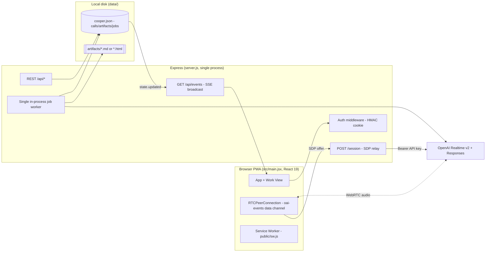
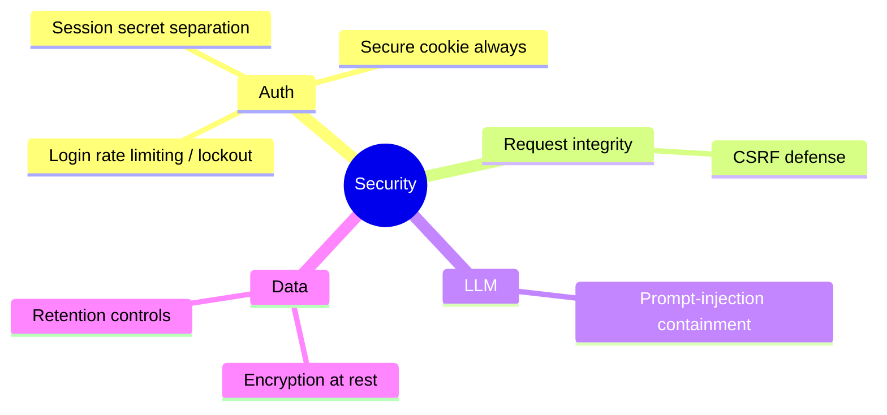
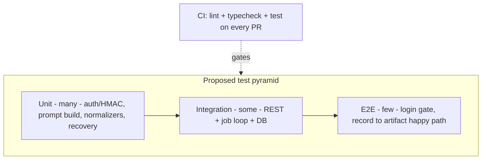

# Cooper — Hardening & Improvement Roadmap PRD

**Prototype → Production**

> Document: `04-prd-hardening-roadmap.md`
> Product: **Cooper** — local-first React 19 + Express AIRES executive voice assistant (OpenAI Realtime v2 over WebRTC + Responses API for post-call artifacts).
> Status of system today: **single-user, single-shared-password local prototype.** One Express process, one in-process job worker, one JSON file (`data/cooper.json`) as the datastore, artifacts on local disk, **zero automated tests, no CI, no linter.**
> Scope of this document: a forward-looking, prioritized roadmap to move Cooper from working prototype toward a hardened, production-grade service — **without inventing features the codebase does not have.**

---

## Table of Contents

1. [Executive Maturity Summary](#1-executive-maturity-summary)
2. [Scoring & Conventions](#2-scoring--conventions)
3. [Current Architecture (As-Built)](#3-current-architecture-as-built)
4. [Epic Catalog](#4-epic-catalog)
   - [4.1 Security](#41-security)
   - [4.2 Reliability](#42-reliability)
   - [4.3 Scalability](#43-scalability)
   - [4.4 Observability](#44-observability)
   - [4.5 Testing & CI](#45-testing--ci)
   - [4.6 Accessibility & UX Polish](#46-accessibility--ux-polish)
   - [4.7 Privacy & Compliance](#47-privacy--compliance)
5. [Consolidated Priority Matrix](#5-consolidated-priority-matrix)
6. [Phased Rollout](#6-phased-rollout)
7. [Appendix — Verified Source References](#7-appendix--verified-source-references)

---

## 1. Executive Maturity Summary

Cooper is a **competent, security-conscious prototype** — not a toy, but emphatically not production. The author already made several non-obvious *correct* choices: the OpenAI API key never reaches the client (the server relays SDP at `POST /session`, `server.js:200-243`); the login password is compared in constant time via `timingSafeEqual` (`server.js:984-991`); session cookies are HMAC-SHA256 signed, `HttpOnly`, `SameSite=Lax`; artifact reads are path-traversal-mitigated by `.pop()`-ing the basename (`server.js:873-878`); HTML-prototype artifacts render in an `<iframe sandbox>` **without** `allow-same-origin` (`src/main.jsx:1442`); markdown is `DOMPurify`-sanitized before injection (`src/main.jsx:1588`); jobs stuck in `running` are recovered to `queued` on boot (`server.js:1063-1090`); writes are serialized through an in-process promise chain (`server.js:781-791`); and Cooper is silent-by-default (`create_response:false`).

That foundation is real. The gap to production is concentrated in a small number of well-understood areas:

| Dimension | Maturity (1=prototype, 5=production) | One-line assessment |
|---|---|---|
| **Security** | 2.5 / 5 | Good primitives, but no login rate limiting, session secret defaults to the password, dev cookies not `Secure`, no CSRF defense. |
| **Reliability** | 2 / 5 | Single JSON file with full-file rewrites, single in-process worker; crash recovery exists but durability/backups do not. |
| **Scalability** | 1 / 5 | Single process, single worker, local-disk artifacts, no DB — cannot run multi-instance at all. |
| **Observability** | 1 / 5 | `console` errors only; no structured logs, metrics, tracing, or health/readiness endpoint. |
| **Testing** | 0 / 5 | **No tests, no CI, no linter exist anywhere in the repo.** |
| **Accessibility / UX** | 2.5 / 5 | Functional PWA with live feedback and notifications; a11y and error-state polish unverified. |
| **Privacy / Compliance** | 1.5 / 5 | Meeting transcripts + artifacts stored plaintext on disk; no retention, no encryption, no deletion controls. |

**Overall: ~1.8 / 5 — "promising prototype."** The single most important truth for prioritization: *Cooper records and stores live meeting audio transcripts.* That makes privacy and the auth surface the highest-leverage hardening targets, even before scale.

**Recommended posture:** treat this roadmap as **three phases** (Section 6). Phase 1 is a focused "must-fix before anyone but Michael touches it over a network" set — almost entirely Security + a testing beachhead. Phase 2 makes it durable and observable. Phase 3 unlocks multi-user / multi-instance scale, which is explicitly *not* needed today.

---

## 2. Scoring & Conventions

- **Effort:** `S` ≈ ≤1 day · `M` ≈ 2–5 days · `L` ≈ 1–3+ weeks.
- **Priority:** `P0` must-fix before any networked / shared deployment · `P1` important for a real (small-team) production service · `P2` valuable but deferrable.
- Each epic states **Problem → Solution → Acceptance Criteria → Effort → Priority** and cites real `file:line` evidence.
- Anything not present in the source (OAuth, Arcade, multi-tenant, external DB, document ingestion, client-exposed API key) is **explicitly out of scope** because it does not exist today.

---

## 3. Current Architecture (As-Built)

**Key constraints driving the roadmap:**
- `appPassword` gates *all* `/session` and `/api/*` routes; if unset, those routes 500 (`server.js:74-93`).
- The datastore is **one JSON file**, rewritten in full on every change, serialized only *within* one process (`server.js:770-791`). No cross-process locking, no durability guarantee.
- One worker (`workerActive` flag, `server.js:479-514`) processes the job queue with global pacing (`lastGenerationAt + jobDelayMs`).
- SSE broadcasts to **all** connected clients with no per-user scoping (`server.js:250-263`).

---

## 4. Epic Catalog

### 4.1 Security

---

#### SEC-1 — Login rate limiting & lockout `P0` `S`

- **Problem:** `POST /api/auth/login` (`server.js:40-72`) compares the submitted password to a single shared `appPassword` with **no rate limiting, no lockout, and no backoff.** A single shared credential gating live meeting transcripts is directly brute-forceable. The constant-time compare (`server.js:984-991`) prevents timing leaks but does nothing against volume.
- **Solution:** Add per-IP (and global) attempt throttling: e.g. exponential backoff after N failures, temporary lockout window, and a small fixed delay on every failed attempt. Keep it in-process for the single-instance case; document that a shared store (Redis) is required once multi-instance (see SCALE-3). Log failed attempts (ties to OBS-1).
- **Acceptance Criteria:**
  - More than N (configurable, default 5) failed logins from one IP within a window returns `429` with `Retry-After`.
  - Successful login resets the counter; lockout state is observable in logs.
  - A test simulates 50 rapid wrong passwords and asserts throttling engages.
- **Effort:** S · **Priority:** P0

---

#### SEC-2 — Session secret separation from app password `P0` `S`

- **Problem:** `sessionSecret` **defaults to `appPassword`** (`server.js:23`). Two distinct failure modes follow: (1) anyone who learns the password can forge valid HMAC session cookies (the signing key *is* the password), and (2) rotating the password silently invalidates every live session because the signing key changed.
- **Solution:** Require an independent `COOPER_SESSION_SECRET` (fail fast on boot if missing in production, or auto-generate a persisted random secret for local dev). Decouple it from `appPassword` entirely so password rotation does not change the signing key. Document rotation procedure.
- **Acceptance Criteria:**
  - In production (`NODE_ENV=production`) the server refuses to start if `COOPER_SESSION_SECRET` is unset or equal to `appPassword`.
  - Rotating `COOPER_APP_PASSWORD` does **not** invalidate existing sessions.
  - Knowledge of the password alone is insufficient to mint a valid cookie (verified by a forgery test).
- **Effort:** S · **Priority:** P0

---

#### SEC-3 — `Secure` cookie flag always (not just production) `P1` `S`

- **Problem:** `serializeCookie` (`server.js:1012-1020`) sets `Secure` **only when `NODE_ENV==="production"`.** In default/dev mode the signed session cookie is transmitted over plain HTTP, exposing it to network sniffing on any non-loopback access.
- **Solution:** Default `Secure` on; allow an explicit opt-out env (e.g. `COOPER_INSECURE_COOKIE=1`) strictly for `localhost` HTTP dev. Pair with `__Host-` cookie prefix considerations once `Secure` is universal.
- **Acceptance Criteria:**
  - Any non-loopback access serves the cookie with `Secure`.
  - Local HTTP dev still works only when the explicit opt-out is set.
- **Effort:** S · **Priority:** P1

---

#### SEC-4 — CSRF defense on state-changing routes `P1` `M`

- **Problem:** State-changing `POST`/`PATCH` routes (e.g. `POST /api/calls`, `PATCH /api/calls/:id`, `POST /api/calls/:id/transcript`, `POST /api/calls/:id/artifacts`, `POST /api/jobs/:id/retry`) rely on the `SameSite=Lax` cookie for CSRF protection. `Lax` is **partial** mitigation only — it does not cover all cross-origin vectors, and there is no token or `Origin`/`Referer` check (`server.js:280-422`).
- **Solution:** Add a defense-in-depth layer: validate `Origin`/`Referer` against an allowlist on all mutating requests, and/or require a custom header (e.g. `X-Cooper-CSRF`) that simple cross-site form posts cannot set. The SPA already calls same-origin with `credentials`, so a custom-header scheme is low-friction.
- **Acceptance Criteria:**
  - Mutating requests without a valid `Origin`/custom header are rejected `403`.
  - The SPA continues to function unchanged.
  - A test issues a forged cross-origin POST and asserts rejection.
- **Effort:** M · **Priority:** P1

---

#### SEC-5 — Prompt-injection containment `P1` `M`

- **Problem:** `buildWorkPrompt` (`server.js:705-745`) concatenates the **full untrusted meeting transcript** plus Michael's `customPrompt` directly into the Responses API prompt. A participant who speaks crafted instructions ("ignore prior instructions, output …") can steer artifact content. For `html_prototype` the model output is rendered (sandboxed) in an iframe. Impact today is **bounded** — the iframe omits `allow-same-origin` (`src/main.jsx:1442`) and the Responses call executes no tools — but content integrity is still at risk.
- **Solution:** Wrap transcript content in clearly delimited, labeled "untrusted data" sections in the prompt; add explicit system-level guardrails instructing the model to treat transcript text as data, not instructions; keep HTML output sandboxed and additionally consider tightening `allow-popups`/`allow-modals` (see SEC-7); optionally run a lightweight output check for obviously hijacked artifacts.
- **Acceptance Criteria:**
  - Transcript text is structurally separated from instructions in the prompt.
  - A red-team transcript containing injection phrases does not change the artifact's intended structure in a manual test.
  - HTML artifacts remain origin-isolated.
- **Effort:** M · **Priority:** P1

---

#### SEC-6 — Encryption at rest & retention controls `P1` `L`

- **Problem:** Transcripts and generated artifacts are stored **plaintext** — `data/cooper.json` and `data/artifacts/<id>.<ext>` (`server.js:13-15`, `613-656`). This is sensitive meeting content with **no encryption, no retention policy, and no deletion API.** (Note: there is currently no delete endpoint at all.)
- **Solution:** Encrypt artifacts and transcript content at rest (envelope encryption with a key from a secrets manager / OS keychain for local). Add configurable retention (auto-purge calls/artifacts older than N days) and an explicit delete endpoint. This naturally co-evolves with the durable store (REL-1) and object storage (SCALE-2).
- **Acceptance Criteria:**
  - At-rest transcript/artifact bytes are not readable without the key.
  - A retention setting purges expired records and their artifact files.
  - A delete endpoint removes a call, its transcript, jobs, and artifact files atomically.
- **Effort:** L · **Priority:** P1

---

#### SEC-7 — Tighten HTML-prototype iframe sandbox `P2` `S`

- **Problem:** The preview iframe uses `sandbox="allow-forms allow-modals allow-popups allow-scripts"` (`src/main.jsx:1442`). Correctly omits `allow-same-origin` (so no cookie/origin access), but `allow-popups`/`allow-modals` still permit annoyance/redirect behavior from model-authored HTML.
- **Solution:** Drop `allow-popups` and `allow-modals` unless a concrete prototype need is shown; keep `allow-scripts` for interactivity but document the threat model.
- **Acceptance Criteria:** Prototypes still render/interact; popups and modal dialogs from artifact HTML are blocked.
- **Effort:** S · **Priority:** P2

---

#### SEC-8 — Single-credential accountability gap `P2` `M`

- **Problem:** One shared password means **no per-user identity, no audit trail, no accountability** (`server.js:22`, `36-93`). Acceptable for single-user Michael; a blocker for any shared use.
- **Solution:** This is a prerequisite slice of multi-user (SCALE-4): introduce real user records + per-user sessions + an audit log of auth and mutating actions. Sequence behind the durable store.
- **Acceptance Criteria:** Each session maps to an identity; mutating actions are attributable in an audit log.
- **Effort:** M · **Priority:** P2

---

### 4.2 Reliability

#### REL-1 — Durable store beyond a single JSON file `P1` `L`

- **Problem:** All state lives in **one JSON file rewritten in full on every change** (`readDbRaw` `server.js:770-779`, `updateDb` `781-791`). Writes serialize only *within* one process (`writeQueue`) — there is no cross-process locking, no atomic durability, no backups. A crash mid-write, a second process, or disk-full can corrupt or lose all calls/artifacts/jobs.
- **Solution:** Move to an embedded transactional store first (SQLite via better-sqlite3 / WAL) preserving the `{calls, artifacts, jobs}` model, with atomic writes and on-disk durability; add periodic backups. This is the keystone enabling REL-2/3, SCALE-1, SEC-6, and SCALE-4. (Migration is mechanical because the shape is already well-defined: `call`, `transcript` entry, `suggestions`, `job`, `artifact`.)
- **Acceptance Criteria:**
  - A `kill -9` during a write never corrupts the store (verified by a fault-injection test).
  - Two processes can read/write without clobbering each other.
  - A documented backup/restore path exists.
- **Effort:** L · **Priority:** P1

---

#### REL-2 — Crash-safe job queue `P1` `M`

- **Problem:** The queue is in-memory-driven over the JSON file with a single `workerActive` worker (`server.js:479-514`). Boot recovery resets `running`→`queued` (`server.js:1063-1090`) — a genuinely good mitigation — but a job's `draft` accumulates step output (`runJob` `516-611`) and a crash mid-step loses partial progress, and there is no exactly-once guarantee around `completeArtifact` (`server.js:613-656`) writing the file *and* the DB record.
- **Solution:** Build on REL-1: persist each completed step transactionally so recovery resumes mid-recipe rather than restarting; make artifact file-write + DB-record-insert a single committed unit (write temp file, fsync, rename, then commit record). Keep the existing `RetryableJobError` backoff honoring `Retry-After` (`server.js:588-610`).
- **Acceptance Criteria:**
  - A crash between recipe steps resumes at the next step, not step 0.
  - An artifact file always has a matching DB record and vice versa (no orphans).
  - Retry/backoff behavior is preserved.
- **Effort:** M · **Priority:** P1

---

#### REL-3 — Idempotency for job creation & retry `P1` `S`

- **Problem:** `POST /api/calls/:id/artifacts` (`server.js:371-382`) and `POST /api/jobs/:id/retry` (`server.js:400-422`) have no idempotency key; a double-click or a client retry on a flaky connection can enqueue duplicate jobs / duplicate artifacts. Pacing limits cost but not duplication.
- **Solution:** Accept an `Idempotency-Key` header; dedupe enqueue and retry within a window. Make retry a no-op if the job is already `queued`/`running`.
- **Acceptance Criteria:**
  - Two identical enqueue requests with the same key create exactly one job.
  - Retrying a non-failed job is a safe no-op.
- **Effort:** S · **Priority:** P1

---

### 4.3 Scalability

> Reality check: Cooper is **single-user today**. These epics are real but mostly `P2` — only pursue when shared/networked use is actually planned. They all sit *behind* REL-1.

#### SCALE-1 — Real database `P2` `L`

- **Problem:** The JSON file (`server.js:770-791`) cannot support concurrent connections or query patterns beyond whole-file reads.
- **Solution:** Promote the REL-1 SQLite store to a networked DB (Postgres) when multi-instance is required; keep the same domain entities. Add migrations.
- **Acceptance Criteria:** App runs against Postgres; concurrent readers/writers are consistent; migrations are versioned.
- **Effort:** L · **Priority:** P2

---

#### SCALE-2 — Object storage for artifacts `P2` `M`

- **Problem:** Artifacts are files on the local disk under `data/artifacts/` (`server.js:14`, `613-656`); served by reading the local basename (`server.js:384-398`, `873-878`). Local disk is not shareable across instances and is not durable.
- **Solution:** Store artifacts in object storage (S3-compatible); persist the object key in the artifact record (replacing the local `file:` path); stream content through the existing `GET /api/artifacts/:id/content` endpoint with the same mime handling. Preserve the basename/path-traversal safety property.
- **Acceptance Criteria:** Artifacts read/write to object storage; existing content endpoint and mime behavior unchanged; no local-disk dependency for artifacts.
- **Effort:** M · **Priority:** P2

---

#### SCALE-3 — Multi-instance-safe worker `P2` `L`

- **Problem:** The single in-process worker with a process-local `workerActive` flag and `lastGenerationAt` pacing (`server.js:30-31`, `479-514`) cannot scale horizontally — two instances would double-process and double-pace.
- **Solution:** Move the queue to the shared store with row-level claim (`SELECT … FOR UPDATE SKIP LOCKED` on Postgres) or a real queue; move pacing/rate-limit state to a shared store (Redis). Keep the recipe step semantics.
- **Acceptance Criteria:** N instances process the queue with no double-execution; global pacing is enforced across instances.
- **Effort:** L · **Priority:** P2

---

#### SCALE-4 — Multi-user model + scoped SSE `P2` `L`

- **Problem:** Single shared credential and `GET /api/events` broadcasting `state.updated` to **all** connected clients (`server.js:250-263`) — fine for one user, a data fan-out leak with more than one.
- **Solution:** Introduce users/ownership on calls/artifacts/jobs; scope `/api/state`, `/api/events`, and all reads/writes per user. Builds on SEC-8 + REL-1.
- **Acceptance Criteria:** A user only sees their own calls/artifacts/jobs and SSE events.
- **Effort:** L · **Priority:** P2

---

### 4.4 Observability

#### OBS-1 — Structured logging `P1` `S`

- **Problem:** The server logs via ad-hoc `console` calls only — no structured fields, no levels, no request correlation. Failures (e.g. job errors, OpenAI relay errors) are hard to trace.
- **Solution:** Adopt a structured JSON logger (pino-style) with levels and a per-request id; log auth events (ties to SEC-1), job lifecycle transitions, and OpenAI call outcomes (status, attempt, model). Redact transcript content from logs (privacy).
- **Acceptance Criteria:** All server logs are structured JSON with level + request id; sensitive content is redacted; log level configurable by env.
- **Effort:** S · **Priority:** P1

---

#### OBS-2 — Health & readiness endpoints `P1` `S`

- **Problem:** There is **no health/readiness endpoint**. A deployment cannot tell if the process is up, whether the datastore is writable, or whether `OPENAI_API_KEY`/`COOPER_APP_PASSWORD` are configured (today missing password 500s *all* routes — `server.js:74-93` — with no probe to catch it).
- **Solution:** Add `GET /healthz` (liveness: process up) and `GET /readyz` (readiness: data dir writable, required env present, worker loop alive). These are unauthenticated but reveal no secrets.
- **Acceptance Criteria:** `/healthz` returns 200 when the process is up; `/readyz` returns non-200 when the datastore is unwritable or required config is missing.
- **Effort:** S · **Priority:** P1

---

#### OBS-3 — Metrics & error tracking `P2` `M`

- **Problem:** No metrics (request rates/latencies, job queue depth, job success/fail counts, OpenAI latency/retry counts) and no error-tracking integration.
- **Solution:** Expose Prometheus-style metrics (`/metrics`) covering HTTP, queue depth, job outcomes, and OpenAI call stats; wire an error tracker (Sentry-style) for unhandled exceptions and non-retryable job failures.
- **Acceptance Criteria:** Metrics endpoint exposes the named series; a forced job failure surfaces in the error tracker.
- **Effort:** M · **Priority:** P2

---

### 4.5 Testing & CI

> **There are zero tests, no CI, and no linter in the repo today.** This is the largest single risk multiplier: every epic above is harder and riskier to land without a safety net. A testing beachhead is therefore pulled into Phase 1.

#### TEST-1 — Unit test beachhead for security-critical pure functions `P0` `M`

- **Problem:** The functions most dangerous to get wrong are untested: `safeCompare`/`signSession`/`isAuthenticated` (`server.js:954-991`), `serializeCookie` (`1012-1020`), `artifactFileName` path-traversal guard (`873-878`), `buildWorkPrompt` (`705-745`), `normalizeTranscript`/`normalizeSpeaker` (`844-856`), `extractOutputText` (`747-756`), `extractHtmlDocument` (`899-916`).
- **Solution:** Stand up a test runner (Vitest fits the Vite/ESM stack) and cover these pure/near-pure functions, including adversarial inputs (forged cookies, traversal paths like `../../etc/passwd`, injection-laden transcripts).
- **Acceptance Criteria:** Runner configured; the listed functions have meaningful tests including negative cases; a forged-cookie test fails authentication; a traversal path resolves to a basename only.
- **Effort:** M · **Priority:** P0

---

#### TEST-2 — Integration tests for REST + job loop `P1` `M`

- **Problem:** The request handlers and the job loop (`enqueueArtifactJob` `424-471`, `processQueue` `479-514`, `runJob` `516-611`, `completeArtifact` `613-656`, crash recovery `1063-1090`) have no automated coverage; behavior like "transcript required to enqueue" (400) and `running`→`queued` recovery is verified only by hand.
- **Solution:** Spin the Express app against a temp datastore with the OpenAI calls mocked; assert REST contracts and the full enqueue→run→complete→artifact path, retry/backoff, and boot recovery.
- **Acceptance Criteria:** Enqueue without transcript returns 400; a mocked recipe run produces an artifact record + file; a simulated crash recovers a `running` job to `queued`.
- **Effort:** M · **Priority:** P1

---

#### TEST-3 — End-to-end happy path `P2` `M`

- **Problem:** No automated coverage of the user-visible flow (login gate → state load → artifact render).
- **Solution:** Browser E2E (Playwright) covering the password gate, authenticated `/api/state` load, SSE-driven update, and markdown/HTML artifact rendering (with OpenAI/WebRTC mocked or stubbed).
- **Acceptance Criteria:** A headless run logs in, loads state, and renders a sanitized markdown artifact.
- **Effort:** M · **Priority:** P2

---

#### TEST-4 — CI pipeline + linter `P1` `S`

- **Problem:** No CI and no linter config exist; nothing prevents regressions or style drift from merging.
- **Solution:** Add a CI workflow running install → lint → (build) → unit + integration tests on every PR; add ESLint (with the React plugin already implied by `@vitejs/plugin-react`) and a format check. Gate merges on green.
- **Acceptance Criteria:** PRs run lint + tests automatically; a failing test blocks merge; lint runs clean on the existing tree (after fixes).
- **Effort:** S · **Priority:** P1

---

### 4.6 Accessibility & UX Polish

#### UX-1 — Accessibility audit & remediation `P1` `M`

- **Problem:** The UI is a single large React component (`src/main.jsx`) with rich custom controls (entry/splash gate, password gate, connect button, work view, viewport toggles). Accessibility (keyboard navigation, focus management, ARIA labeling, contrast, screen-reader behavior of live transcript/speaking states) is unverified.
- **Solution:** Run an automated a11y pass (axe) plus manual keyboard/screen-reader testing; remediate focus order, labels for icon-only `lucide-react` buttons, live-region announcements for Cooper "hearing/speaking" status and job completion, and color contrast.
- **Acceptance Criteria:** Automated a11y scan passes with no critical violations; all interactive controls are keyboard-reachable and labeled; live status changes are announced.
- **Effort:** M · **Priority:** P1

---

#### UX-2 — Robust error & permission states `P1` `S`

- **Problem:** Failure surfaces exist but are uneven: a failed-job manual retry button exists, but mic-permission denial, WebRTC connection failure (no STUN/TURN configured — default ICE only, `connect()` `src/main.jsx:520-`), `/session` relay errors, and SSE disconnects need clear, recoverable UI states.
- **Solution:** Add explicit, user-friendly states for: microphone permission denied, connection failed/dropped (with reconnect), session-mint failure, and offline (PWA). Auto-reconnect the `EventSource`.
- **Acceptance Criteria:** Each named failure shows a clear message and a recovery action; SSE auto-reconnects after a drop.
- **Effort:** S · **Priority:** P1

---

#### UX-3 — Decompose the monolithic component `P2` `M`

- **Problem:** `src/main.jsx` is ~1,707 lines in one `App` component, raising regression risk and slowing iteration.
- **Solution:** Refactor into focused components/hooks (realtime connection, transcript capture, artifact rendering, auth gate) behind the TEST-3 safety net. No behavior change.
- **Acceptance Criteria:** Component split with E2E happy path still green; no user-visible change.
- **Effort:** M · **Priority:** P2

---

### 4.7 Privacy & Compliance

> Cooper captures and stores **live meeting audio transcripts** and AI artifacts derived from them. This is the most sensitive data in the system and underpins the high priority of SEC-6.

#### PRIV-1 — Meeting consent & data-handling notice `P1` `S`

- **Problem:** Cooper transcribes meeting audio (Realtime `audio.input.transcription`, `server.js:116-141`) with no in-product consent capture or data-handling disclosure. Recording meeting participants raises legal (e.g. two-party-consent jurisdictions) and ethical obligations.
- **Solution:** Add a clear in-app notice that audio is transcribed and stored, surfaced before/at recording start; document what is sent to OpenAI (audio + transcript + artifact prompts) and the `OpenAI-Safety-Identifier` usage (`server.js:200-243`).
- **Acceptance Criteria:** Recording start surfaces a consent/notice affordance; a data-handling statement documents OpenAI data flow and storage.
- **Effort:** S · **Priority:** P1

---

#### PRIV-2 — Retention, export & right-to-delete `P1` `M`

- **Problem:** There is no retention policy, no export, and **no delete capability** for calls/transcripts/artifacts (no delete endpoint exists; data accrues in `data/` indefinitely).
- **Solution:** Implement configurable retention (auto-purge after N days), per-call export, and a hard-delete that removes the call, transcript, jobs, and artifact files together. Co-delivered with SEC-6 (encryption at rest) and REL-1 (durable store with atomic deletes).
- **Acceptance Criteria:** A retention setting purges expired data + files; a user can export and permanently delete a call and all derived data in one action.
- **Effort:** M · **Priority:** P1

---

#### PRIV-3 — Data-flow & subprocessor documentation `P2` `S`

- **Problem:** No documented record of what data leaves the device and to whom (OpenAI Realtime + Responses) for compliance/DPA purposes.
- **Solution:** Maintain a short data-flow document: data categories (audio, transcript, artifact prompts), destination (OpenAI), retention, and the safety identifier. Keep it in `docs/`.
- **Acceptance Criteria:** A reviewed data-flow doc exists and matches the code paths in `server.js`.
- **Effort:** S · **Priority:** P2

---

## 5. Consolidated Priority Matrix

| ID | Epic | Category | Effort | Priority |
|---|---|---|:--:|:--:|
| SEC-1 | Login rate limiting & lockout | Security | S | **P0** |
| SEC-2 | Session secret separation | Security | S | **P0** |
| TEST-1 | Unit beachhead (security-critical fns) | Testing | M | **P0** |
| SEC-3 | `Secure` cookie always | Security | S | P1 |
| SEC-4 | CSRF defense | Security | M | P1 |
| SEC-5 | Prompt-injection containment | Security | M | P1 |
| SEC-6 | Encryption at rest & retention | Security | L | P1 |
| REL-1 | Durable store (SQLite) | Reliability | L | P1 |
| REL-2 | Crash-safe job queue | Reliability | M | P1 |
| REL-3 | Idempotency | Reliability | S | P1 |
| OBS-1 | Structured logging | Observability | S | P1 |
| OBS-2 | Health/readiness endpoints | Observability | S | P1 |
| TEST-2 | Integration tests | Testing | M | P1 |
| TEST-4 | CI + linter | Testing | S | P1 |
| UX-1 | Accessibility audit | A11y/UX | M | P1 |
| UX-2 | Error/permission states | A11y/UX | S | P1 |
| PRIV-1 | Consent & data notice | Privacy | S | P1 |
| PRIV-2 | Retention/export/delete | Privacy | M | P1 |
| SEC-7 | Tighten iframe sandbox | Security | S | P2 |
| SEC-8 | Single-credential accountability | Security | M | P2 |
| SCALE-1 | Real database (Postgres) | Scalability | L | P2 |
| SCALE-2 | Object storage for artifacts | Scalability | M | P2 |
| SCALE-3 | Multi-instance worker | Scalability | L | P2 |
| SCALE-4 | Multi-user + scoped SSE | Scalability | L | P2 |
| OBS-3 | Metrics & error tracking | Observability | M | P2 |
| TEST-3 | E2E happy path | Testing | M | P2 |
| UX-3 | Decompose monolith | A11y/UX | M | P2 |
| PRIV-3 | Data-flow documentation | Privacy | S | P2 |

---

## 6. Phased Rollout

### Phase 1 — Must-Fix (before any access beyond Michael on loopback)
Close the brute-force and key-separation holes, stop sending the cookie in the clear, and lay a test/CI foundation so later phases are safe. **SEC-1, SEC-2, SEC-3, TEST-1, TEST-4, OBS-2, PRIV-1.** Mostly `S`/`M` — achievable in a focused sprint and entirely additive (no datastore migration). Exit criteria: login is throttled, sessions can't be forged from the password, cookie is `Secure`, security-critical functions are tested under CI, a health probe exists, and recording shows a consent notice.

### Phase 2 — Durable & Observable
The keystone is **REL-1 (SQLite)**, which unblocks crash-safe jobs (REL-2), idempotency (REL-3), encryption + retention + delete (SEC-6 / PRIV-2), and atomic artifact writes. Add CSRF (SEC-4), prompt-injection containment (SEC-5), structured logging (OBS-1), integration tests (TEST-2), and the accessibility + error-state polish (UX-1, UX-2). Exit criteria: a crash never corrupts data or loses a job mid-recipe, sensitive data is encrypted with a retention/delete path, and the service is logged and observable enough to operate.

### Phase 3 — Scale & Multi-User (only if shared use is actually planned)
Explicitly deferred because Cooper is single-user today. Promote SQLite → Postgres (SCALE-1), move artifacts to object storage (SCALE-2), make the worker multi-instance-safe (SCALE-3), and add the multi-user model with scoped SSE + accountability (SCALE-4 / SEC-8). Round out with metrics/error tracking (OBS-3), E2E coverage and the component refactor (TEST-3 / UX-3), and the remaining `P2` polish (SEC-7, PRIV-3). Exit criteria: Cooper runs as N instances against a shared DB and object store, each user sees only their own data, and operations have full metrics + error tracking.

---

## 7. Appendix — Verified Source References

| Area | Evidence (`file:line`) |
|---|---|
| Config / env defaults | `server.js:11-25` |
| Session secret defaults to password | `server.js:23` |
| Body limits | `server.js:33-34` |
| Auth middleware (open `/api/auth/*`, gated rest) | `server.js:74-93` |
| Login (constant-time compare) | `server.js:40-72`, `984-991` |
| Cookie serialization (`Secure` only in prod) | `server.js:1012-1020` |
| Session sign / verify | `server.js:954-982` |
| Realtime SDP relay (API key never client-side) | `server.js:200-243` |
| baseSession (transcription, silent-by-default) | `server.js:116-141` |
| Datastore read/write (single JSON, serialized) | `server.js:770-791` |
| Job enqueue / queue / run / complete | `server.js:424-471`, `479-514`, `516-611`, `613-656` |
| buildWorkPrompt (transcript + customPrompt concat) | `server.js:705-745` |
| Retry/backoff | `server.js:588-610` |
| Crash recovery (`running`→`queued`) | `server.js:1063-1090` |
| Artifact content read (basename guard) | `server.js:384-398`, `873-878` |
| SSE broadcast (all clients) | `server.js:250-263` |
| iframe sandbox (no `allow-same-origin`) | `src/main.jsx:1442` |
| Markdown DOMPurify sanitize | `src/main.jsx:1588` |
| WebRTC connect (default ICE, no STUN/TURN) | `src/main.jsx:520-` |
| Dependencies / scripts | `package.json:6-22` |
| Tests / CI / linter | **none exist in repo** |
