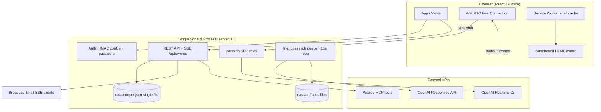
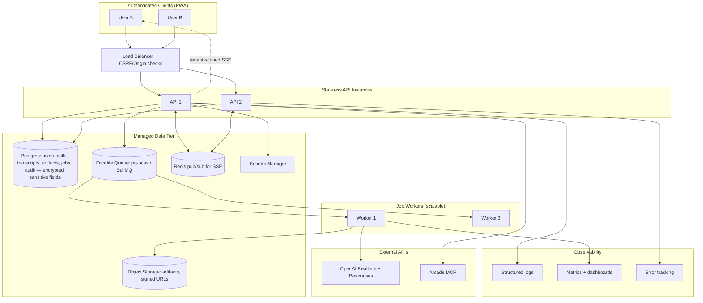

# Cooper — Hardening & Improvement Roadmap (Forward-Looking PRD)

> **Status:** Draft v1.0
> **Subject:** Cooper Realtime Voice Agent (AIRES executive voice assistant)
> **Stack:** React 19 + Vite frontend, Express backend, OpenAI Realtime v2 (WebRTC) + Responses API, Arcade MCP tools
> **Goal:** Take Cooper from a working single-user prototype to a production-grade, multi-user, observable, and compliant service.

---

## Table of Contents

1. [Executive Summary — Maturity Assessment](#1-executive-summary--maturity-assessment)
2. [Scope & Method](#2-scope--method)
3. [Current Architecture (As-Is)](#3-current-architecture-as-is)
4. [Prioritized Epics](#4-prioritized-epics)
   - [Epic A — Security Hardening](#epic-a--security-hardening-p0)
   - [Epic B — Reliability](#epic-b--reliability-p0)
   - [Epic C — Scalability](#epic-c--scalability-p1)
   - [Epic D — Observability](#epic-d--observability-p0)
   - [Epic E — Testing](#epic-e--testing-p0)
   - [Epic F — Accessibility & UX Polish](#epic-f--accessibility--ux-polish-p2)
   - [Epic G — Compliance & Privacy](#epic-g--compliance--privacy-p1)
5. [Consolidated Backlog](#5-consolidated-backlog)
6. [Phased Rollout Plan](#6-phased-rollout-plan)
7. [Target Architecture (To-Be)](#7-target-architecture-to-be)
8. [Appendix — Severity & Effort Legend](#8-appendix--severity--effort-legend)

---

## 1. Executive Summary — Maturity Assessment

Cooper is a feature-rich prototype that already demonstrates a thoughtful product surface: live meeting transcription over OpenAI Realtime v2 (WebRTC), post-call artifact synthesis (PRD, execution plan, code sketch, HTML prototype, Mermaid diagram, UI wireframe, follow-up kit), a live canvas, GStack advisory skills, and guarded Arcade tool execution. Notable security fundamentals are *already present and well-built* — HMAC-SHA256 signed HTTP-only session cookies, timing-safe password comparison, a write-action confirmation gate (`COOPER_ENABLE_ARCADE_WRITES=false` by default), DOMPurify sanitization, sandboxed HTML-prototype iframes, secrets redaction in audit logs, and context-size truncation to limit prompt-injection blast radius.

However, the system is **production-fragile**. Across four independent deep reads, the same structural gaps recur:

| Dimension | Maturity | Headline Gap |
|---|---|---|
| **Security** | 🟡 Partial | API keys in `.env` (and likely git history); no login rate limiting; no multi-user/tenant isolation; no CSRF; plaintext Arcade tokens at rest |
| **Reliability** | 🔴 Prototype | Single `data/cooper.json` file as the entire datastore; no backup; in-process job queue; no crash recovery guarantees; no process supervisor |
| **Scalability** | 🔴 Prototype | Single-threaded Node process; local-file DB and artifact storage prevent horizontal scaling |
| **Observability** | 🔴 Prototype | ~3 `console.*` statements; no health endpoint, metrics, error tracking, or request logging |
| **Testing** | 🔴 None | No tests of any kind exist |
| **Accessibility / UX** | 🟢 Decent | ARIA labels, semantic HTML, responsive breakpoints present; gaps in loading/error states, session-expiry UX, `getUserMedia` timeout |
| **Compliance / Privacy** | 🔴 Prototype | Meeting audio transcripts and ingested customer docs stored unencrypted; no retention, consent, or data-subject controls |

**Bottom line:** The product concept and much of the application logic are sound. What stands between Cooper and production is *operational and data-safety maturity*, not features. The highest-leverage, must-fix work (Phase 1) is: rotate/secure secrets, add auth rate limiting, replace the JSON file with a real database, add a health check + structured logging, and establish a baseline test suite. Multi-user isolation and durable queueing follow in Phase 2; horizontal scale and full compliance tooling in Phase 3.

---

## 2. Scope & Method

This roadmap is derived entirely from four structured deep-read analyses of the Cooper codebase covering: backend architecture & security, the React/Vite/WebRTC frontend, infrastructure & operations, and a focused Express+React security assessment. Every epic below traces to findings in those reads. No features beyond the analyzed codebase are proposed.

**Key source files referenced throughout:**

- `server.js` (~2,239 lines — backend, auth, Realtime proxy, job queue, persistence)
- `src/main.jsx` (~2,532 lines — React app and all components)
- `cooperTools.js`, `cooperPrompt.js` (tool definitions and Realtime system prompt)
- `server/tools/runGstackSkill.js` (advisory skill runner)
- `data/cooper.json` + `data/artifacts/` (datastore and generated artifact files)
- `public/sw.js`, `public/manifest.webmanifest` (PWA shell)
- `.env` / `.env.example` (configuration and secrets)

---

## 3. Current Architecture (As-Is)

**Critical structural facts:**

- **One process, one file.** All calls, transcripts, artifacts, jobs, tool-call logs, and Arcade authorizations live in `data/cooper.json`, written via a sequential `fs.writeFile` Promise chain.
- **In-process queue.** Artifact generation runs on a single `processQueue()` loop polling every `jobDelayMs` (default 15s). Running jobs are reset to `queued` on restart (basic recovery), but mid-step failures are not transactional.
- **No tenant model.** Authentication is a single shared app password; once authenticated, *any* user can read/write *all* calls, projects, and artifacts. The SSE stream broadcasts every event to every connected client.

---

## 4. Prioritized Epics

Each epic states the **problem**, **proposed solution**, **acceptance criteria**, rough **effort (S/M/L)**, and **priority (P0/P1/P2)**.

---

### Epic A — Security Hardening (P0)

Cooper has strong primitives but several P0/P1-severity gaps that block any deployment beyond a trusted localhost.

#### A1. Rotate and externalize secrets (P0, S)

- **Problem:** `OPENAI_API_KEY` and `ARCADE_API_KEY` live in `.env`, which is present in the working tree and likely in git history (`.env:1, :6`). Server code references `process.env.OPENAI_API_KEY` directly in fetch calls with no masking; a logged error payload could leak the bearer token (`server.js:248-274, 957-992`).
- **Proposed solution:** Immediately rotate `OPENAI_API_KEY` and `ARCADE_API_KEY`. Move secrets into a managed store (Railway/AWS SSM/Vault) injected at runtime. Confirm `.env` is gitignored and scrub history (`git log --all -p | grep -i 'sk-'`). Add secret-scanning to CI (pre-commit hook + provider secret detection). Mask bearer tokens in all error/log paths.
- **Acceptance criteria:**
  - Old keys revoked; new keys never committed.
  - CI fails on any committed secret pattern.
  - No raw `Authorization` header or `process.env.*_API_KEY` value appears in any log line or HTTP error response.
- **Effort:** S · **Severity:** Critical

#### A2. Independent session secret (P0, S)

- **Problem:** `COOPER_SESSION_SECRET` falls back to `COOPER_APP_PASSWORD` when unset (`server.js:32`), making session-token signing only as strong as the login password.
- **Proposed solution:** Require a distinct `COOPER_SESSION_SECRET`; fail startup if it is missing or equal to `COOPER_APP_PASSWORD`. Generate via `crypto.randomBytes(32)`.
- **Acceptance criteria:** Server refuses to boot without an independent ≥32-byte secret; documented in deploy setup.
- **Effort:** S · **Severity:** High

#### A3. Login rate limiting & lockout (P0, S)

- **Problem:** `POST /api/auth/login` accepts unlimited password attempts with no throttle or lockout (`server.js:63-84`) — brute-forceable.
- **Proposed solution:** Add sliding-window rate limiting (e.g., 5 attempts / 15 min per IP) with exponential backoff and temporary lockout. Log every attempt with IP + user-agent. Consider `bcrypt`-hashing the configured password instead of plaintext comparison.
- **Acceptance criteria:** 6th failed attempt within the window returns `429`; failed attempts are audit-logged; brute-force simulation is blocked.
- **Effort:** S · **Severity:** High

#### A4. Multi-user / tenant isolation (P0, L)

- **Problem:** No `userId`/tenant field on calls, projects, or artifacts. Any authenticated user can read/edit all data (`server.js:281-334, 540-553`). The SSE `/api/events` stream broadcasts all events to all clients (`server.js:525-538, 2146-2151`), leaking one user's job/call state to another.
- **Proposed solution:** Introduce a user model and ownership column on every resource. Enforce row-level authorization on all `GET/POST/PATCH/DELETE` endpoints (verify `req.userId` owns the resource). Scope `/api/state` to the current user. Key the SSE `eventClients` map by `userId` and filter broadcasts.
- **Acceptance criteria:** User B receives `403`/`404` for User A's call, project, or artifact; SSE delivers only the requesting user's events; integration tests cover cross-tenant denial.
- **Effort:** L · **Severity:** High · *(Depends on Epic B real DB)*

#### A5. CSRF protection (P0→P1, M)

- **Problem:** State-mutating endpoints rely solely on `SameSite=Lax` cookies; no CSRF tokens (`server.js:281, 555, 638, 658, 687`).
- **Proposed solution:** Add a CSRF token (double-submit cookie or session nonce echoed in `X-CSRF-Token`) validated on all `POST/PATCH/DELETE`, and/or strict `Origin` allow-listing. Tighten `SameSite` where possible.
- **Acceptance criteria:** Forged cross-origin mutation returns `403`; legitimate same-origin requests unaffected.
- **Effort:** M · **Severity:** High

#### A6. Encrypt sensitive data at rest (P1, M)

- **Problem:** Arcade authorization tokens and ingested project sources (customer docs, PRDs, code) are stored as plaintext in `data/cooper.json` (`server.js:1334-1357, 1575-1593`).
- **Proposed solution:** Encrypt sensitive fields (Arcade tokens, project source text) at rest using libsodium/`crypto` secretbox with a key held separately from the datastore. Decrypt only at point of use.
- **Acceptance criteria:** Datastore inspection reveals no plaintext tokens or ingested document bodies; key rotation procedure documented.
- **Effort:** M · **Severity:** High *(Folds into Epic B DB migration)*

#### A7. Prompt-injection isolation (P1, M)

- **Problem:** Untrusted inputs — meeting transcripts (`buildWorkPrompt`, `server.js:994-1037`), live "Add Context" text, and project context — are concatenated directly into Realtime instructions and Responses prompts (`server.js:145-152`) with only size truncation as a guard. Crafted text ("ignore previous instructions…") can steer the model.
- **Proposed solution:** Wrap all untrusted content in explicit delimiters (e.g., `[TRANSCRIPT_START]…[TRANSCRIPT_END]`, `--- UNTRUSTED PROJECT CONTEXT ---`), strip control characters, and keep transcript/context in separate message slots from system instructions. Audit `cooperPrompt.js` for injection resistance.
- **Acceptance criteria:** Injection regression suite (e.g., "ignore above instructions") fails to alter Cooper's behavior or tool-calling.
- **Effort:** M · **Severity:** High

#### A8. Path-traversal & artifact serving hardening (P1, S)

- **Problem:** `artifactFileName()` derives a filename via `split().pop()` (`server.js:1964`); if `artifact.file` were ever attacker-influenced, traversal is possible. Artifact content is served without `X-Content-Type-Options` or `Content-Disposition` and with weak format validation (`server.js:671-685`).
- **Proposed solution:** Construct paths only from `artifact.id` + an enum-validated extension via `path.basename`; reject anything not matching `^[a-f0-9-]+\.(html|md)$`. Serve with `X-Content-Type-Options: nosniff` and a restrictive CSP; render markdown server-side through DOMPurify where feasible.
- **Acceptance criteria:** Traversal payloads (`../`, absolute paths) are rejected; responses carry hardening headers.
- **Effort:** S · **Severity:** Medium

#### A9. Client-side artifact rendering hardening (P1, S)

- **Problem:** DOMPurify config only whitelists `target`/`rel` (`src/main.jsx:2329-2331`), enabling tabnabbing via `target="_blank"`. The HTML-prototype iframe uses `sandbox="allow-forms allow-modals allow-popups allow-scripts"` (`src/main.jsx:2156-2162`), permitting `alert()`/`window.open()` and `postMessage` exfiltration.
- **Proposed solution:** Force `rel="noopener noreferrer"` on all rendered links. Drop `allow-modals`/`allow-popups` from the iframe sandbox; add a CSP inside generated HTML; validate parent-side `postMessage` origins.
- **Acceptance criteria:** Tabnabbing and modal/popup payloads neutralized; XSS regression payloads contained.
- **Effort:** S · **Severity:** Medium

#### A10. Input limits, CORS, and error-message hygiene (P1/P2, M)

- **Problem:** No size cap on transcript entries (unbounded DB growth, `server.js:610-636`); no explicit CORS config (defaults permissive); error responses leak OpenAI model names and API structure (`server.js:979-983`); file uploads validate MIME but not magic bytes (`server.js:359-385`).
- **Proposed solution:** Cap transcript entry size (e.g., 10k chars) and total call transcript size; add restrictive CORS via env-driven allow-list; return generic client errors while logging detail server-side; validate upload magic bytes with `file-type` and enforce size/timeout on PDF parsing.
- **Acceptance criteria:** Oversized inputs rejected; cross-origin requests gated; client never sees raw provider errors; spoofed-extension uploads rejected.
- **Effort:** M · **Severity:** Low–Medium

---

### Epic B — Reliability (P0)

#### B1. Replace the single JSON file with a real database (P0, L)

- **Problem:** All state lives in `data/cooper.json`, written via `fs.writeFile` (`server.js:1503-1534`). No replication, no backup, no transactional guarantees; concurrent writes risk file corruption; ~488 KB and growing in dev.
- **Proposed solution:** Migrate to a managed relational DB (Postgres). Model `users`, `calls`, `transcripts`, `artifacts`, `jobs`, `tool_calls`, `projects`, `project_sources`, `arcade_authorizations`. Provide a one-time migration importing existing `cooper.json`. Use transactions for multi-row writes.
- **Acceptance criteria:** Zero data lost on concurrent writes; automated daily backups with tested restore; `cooper.json` no longer load-bearing.
- **Effort:** L · **Severity:** Critical (foundational for A4, A6, C1)

#### B2. Durable job queue with crash recovery (P0, M)

- **Problem:** The in-process `processQueue`/`runJob` loop (`server.js:762-900`) loses in-flight step state if the process dies mid-step; recovery only resets `running → queued` with no transactional checkpointing; mid-generation Responses API failures require manual retry.
- **Proposed solution:** Move to a persistent queue (DB-backed e.g. `pg-boss`, or Redis/BullMQ). Persist per-step progress so recovery resumes or cleanly restarts a job. Add a dead-letter path and automatic bounded retries with backoff (respecting OpenAI `retry-after`, already partially implemented).
- **Acceptance criteria:** Killing the process mid-job leaves no stuck `running` jobs; jobs resume/restart automatically; failed jobs land in a visible dead-letter state.
- **Effort:** M · **Severity:** High

#### B3. Process supervision & graceful shutdown (P0, S)

- **Problem:** No supervisor; an uncaught exception or OOM takes the whole app down with no restart (infra read).
- **Proposed solution:** Run under a supervisor (systemd, PM2, or platform-managed restarts on Railway). Add `process.on('uncaughtException'/'unhandledRejection')` handlers, graceful SIGTERM draining (finish in-flight DB writes, close SSE), and a restart policy.
- **Acceptance criteria:** Process auto-restarts within seconds of a crash; in-flight writes complete on graceful shutdown.
- **Effort:** S · **Severity:** High

#### B4. Service worker cache versioning & logout invalidation (P1, S)

- **Problem:** `CACHE_NAME='cooper-shell-v1'` is hardcoded and never bumped (`public/sw.js`), so stale assets persist; caches are not cleared on logout, potentially exposing cached sensitive shell content.
- **Proposed solution:** Derive cache name from build hash/version; bust on deploy. Clear caches on `/api/auth/logout`. Add `Cache-Control: no-store` to sensitive endpoints.
- **Acceptance criteria:** New deploys serve fresh assets; logout purges caches.
- **Effort:** S · **Severity:** Medium

---

### Epic C — Scalability (P1)

#### C1. Stateless multi-instance backend (P1, L)

- **Problem:** Single-threaded event loop + in-process queue + local-file DB prevent horizontal scaling (infra read).
- **Proposed solution:** With B1 (Postgres) and B2 (shared queue) in place, make the API tier stateless behind a load balancer. Move SSE fan-out to a shared pub/sub (Redis) so any instance can deliver events. Run job workers as separate horizontally scalable processes.
- **Acceptance criteria:** ≥2 API instances serve traffic behind an LB with no session/data affinity; workers scale independently.
- **Effort:** L · **Severity:** Medium

#### C2. Object storage for artifacts (P1, M)

- **Problem:** Generated markdown/HTML artifacts are written to the local `data/artifacts/` directory, tying artifacts to one host (`server.js:910-912`).
- **Proposed solution:** Store artifacts in object storage (S3-compatible / Railway bucket). Serve via signed, expiring URLs scoped to the owning user.
- **Acceptance criteria:** Artifacts readable from any instance; access requires a valid scoped URL; local disk no longer required.
- **Effort:** M · **Severity:** Medium

#### C3. Per-user API rate limiting & token budgeting (P1, M)

- **Problem:** Rate limiting exists only on the job-queue spacing (`jobDelayMs`); there is no per-user cap on artifact requests or OpenAI token consumption, allowing quota exhaustion / DoS (`server.js:661-669`).
- **Proposed solution:** Add per-user/per-IP limits (e.g., N artifact requests/hour, queue-length ceiling returning `429`), and track token spend per user against a daily budget.
- **Acceptance criteria:** A single user cannot monopolize the queue or exhaust the OpenAI quota; limits are configurable and observable.
- **Effort:** M · **Severity:** Medium

---

### Epic D — Observability (P0)

#### D1. Structured logging (P0, S)

- **Problem:** Only ~3 `console.*` statements; no request logging, no durations, no persisted stack traces (infra read).
- **Proposed solution:** Adopt a structured logger (pino/winston) emitting JSON with request id, route, latency, status, user id — and **never** secrets/transcript bodies. Ship to a log aggregator.
- **Acceptance criteria:** Every request produces one structured log line; logs are queryable centrally; no sensitive payloads in logs.
- **Effort:** S · **Severity:** High

#### D2. Health & readiness endpoints (P0, S)

- **Problem:** No health endpoint; orchestrators cannot detect degraded state before timeout (infra read).
- **Proposed solution:** Add `/healthz` (process liveness) and `/readyz` (DB connectivity, queue worker heartbeat, OpenAI reachability check). Wire to the LB/orchestrator.
- **Acceptance criteria:** Health checks reflect real dependency state; unhealthy instances are removed from rotation.
- **Effort:** S · **Severity:** High

#### D3. Metrics (P1, M)

- **Problem:** No metrics on job throughput, latency, queue depth, or error rates.
- **Proposed solution:** Emit Prometheus/OpenTelemetry metrics: request latency histograms, job duration, queue depth, retry counts, OpenAI call latency/error rate, active WebRTC sessions. Build a dashboard.
- **Acceptance criteria:** Dashboard shows live queue depth, job success rate, and p95 latencies; alerts on thresholds.
- **Effort:** M · **Severity:** Medium

#### D4. Error tracking (P1, S)

- **Problem:** No centralized error capture; failures surface only as ad-hoc console output.
- **Proposed solution:** Integrate Sentry (or equivalent) on both server and client, with release tagging and PII scrubbing (strip transcripts, tokens).
- **Acceptance criteria:** Unhandled errors create deduplicated, release-tagged issues with safe context.
- **Effort:** S · **Severity:** Medium

#### D5. Authentication & tool-call audit trail (P1, S)

- **Problem:** No auth-event audit logging / brute-force detection (`server.js:63-84`). Tool-call audit exists but redaction is partial (`safeAuditObject` covers only `password`/`token`/`secret`/`api_key`; fields like `query`/`input`/`context`/`prompt` may carry PII — `server.js:1899-1925`).
- **Proposed solution:** Log all auth events (success/failure, IP, UA) to a queryable audit store with alerting on failure spikes. Extend redaction to value-pattern matching (`containsSensitiveText`) and truncate audit string values.
- **Acceptance criteria:** Auth events queryable; brute-force pattern triggers an alert; no PII/credentials in audit records.
- **Effort:** S · **Severity:** Medium

---

### Epic E — Testing (P0)

> **Current state: there are no tests of any kind.** This is the single largest barrier to safe iteration.

#### E1. Test infrastructure & CI gate (P0, S)

- **Problem:** No test runner, no CI, no coverage.
- **Proposed solution:** Stand up Vitest (unit/integration) + Supertest (API) + Playwright (E2E). Add a CI pipeline (lint → typecheck → unit → integration → E2E smoke) blocking merge.
- **Acceptance criteria:** `npm test` runs locally and in CI; merges blocked on red.
- **Effort:** S · **Severity:** High

#### E2. Security & auth regression tests (P0, M)

- **Problem:** Security-critical logic (HMAC token verify, timing-safe compare, write-confirmation gate, redaction) has no automated coverage.
- **Proposed solution:** Unit-test token signing/verification and expiry, `safeCompare`, login rate limiting (A3), CSRF (A5), cross-tenant authorization denial (A4), path-traversal rejection (A8), and prompt-injection isolation (A7).
- **Acceptance criteria:** Each security control has at least one passing test and one attack-payload negative test.
- **Effort:** M · **Severity:** High

#### E3. API & job-queue integration tests (P1, M)

- **Problem:** Artifact generation, transcript persistence, and Arcade authorization flows are untested.
- **Proposed solution:** Integration tests against a test DB and mocked OpenAI/Arcade: enqueue → process → complete artifact lifecycle, retry/backoff behavior, transcript dedup, and authorization gating. Include a crash-recovery test (B2).
- **Acceptance criteria:** Full job lifecycle and recovery covered with mocked external APIs; flake-free in CI.
- **Effort:** M · **Severity:** Medium

#### E4. Frontend & E2E tests (P2, M)

- **Problem:** No coverage of auth flow, rendering, or WebRTC error handling.
- **Proposed solution:** Component tests for `MarkdownArtifactDocument`/`HtmlPrototypeDocument` (sanitization), and Playwright E2E for login → (mocked) call → artifact view. Mock `getUserMedia`/`RTCPeerConnection`.
- **Acceptance criteria:** E2E smoke passes in CI; sanitization components have XSS-payload tests.
- **Effort:** M · **Severity:** Medium

---

### Epic F — Accessibility & UX Polish (P2)

Cooper already has ARIA labels, semantic HTML, dark-mode contrast, and responsive breakpoints (820px/520px). Remaining items are polish.

#### F1. Session-expiry UX (P2, S)

- **Problem:** `localStorage 'cooper.entered'` persists indefinitely; when the server cookie expires, the UI still appears "entered" (`src/main.jsx:99, 246`). The 401 path on `/api/state` polling may not promptly return the user to the lock screen.
- **Proposed solution:** On any `401`, clear `cooper.entered`, drop the SSE connection, and redirect to the lock screen. Re-authenticate SSE on reconnect.
- **Acceptance criteria:** Expired session reliably returns the user to login within one polling cycle.
- **Effort:** S

#### F2. Loading & error states for artifact/content fetches (P2, S)

- **Problem:** Artifact content fetch has no visible loading/error state; on failure the UI shows the previous artifact (frontend read).
- **Proposed solution:** Add explicit loading skeletons and error states for artifact content and state fetches; clear stale content on error.
- **Acceptance criteria:** Failed fetches show an error affordance, not stale content.
- **Effort:** S

#### F3. Call-initiation robustness (P2, S)

- **Problem:** `getUserMedia` has no explicit timeout (`src/main.jsx:524`); a dismissed mic prompt can hang call start. Data-channel JSON parse failures fail silently with a generic message.
- **Proposed solution:** Wrap `getUserMedia` in a timeout with a clear retry prompt; surface (logged) data-channel parse errors gracefully without breaking the call.
- **Acceptance criteria:** Mic-permission hang resolves with a user-actionable message; malformed events do not crash the call UI.
- **Effort:** S

---

### Epic G — Compliance & Privacy (P1)

Cooper records **meeting audio transcripts** and ingests **customer documents** — both high-sensitivity. The prototype has no privacy controls.

#### G1. Encryption & access controls for transcripts and sources (P1, M)

- **Problem:** Transcripts and ingested project sources are stored unencrypted in `data/cooper.json` (`server.js:1575-1593`); Arcade tool responses (potential PII) are stored in `db.toolCalls` (`server.js:468-523`).
- **Proposed solution:** Combine A4 (tenant isolation) + A6 (encryption at rest). Filter/limit PII stored in tool-call logs (metadata only by default; full responses encrypted and time-bounded).
- **Acceptance criteria:** Transcripts/sources encrypted at rest and access-scoped to owner; tool-call logs free of unencrypted PII by default.
- **Effort:** M · **Severity:** Medium

#### G2. Consent & meeting-recording notice (P1, S)

- **Problem:** No consent capture for recording/transcribing meeting participants — a legal requirement in many jurisdictions for audio capture.
- **Proposed solution:** Add an explicit consent/notice step before a call begins recording; record consent state with the call. Document the data-processing basis.
- **Acceptance criteria:** No transcript is persisted without a recorded consent flag; notice is shown at call start.
- **Effort:** S · **Severity:** Medium

#### G3. Retention & deletion (data-subject) controls (P1, M)

- **Problem:** No retention policy or deletion path; transcripts and sources accumulate indefinitely with no purge.
- **Proposed solution:** Add configurable retention windows with automatic purge of calls/transcripts/artifacts, and a user-initiated "delete this call and its artifacts" action (cascading across DB + object storage).
- **Acceptance criteria:** Expired data is purged on schedule; user deletion removes all associated records and artifact files.
- **Effort:** M · **Severity:** Medium

#### G4. Data-handling documentation (P2, S)

- **Problem:** No documented record of what data Cooper collects, where it is sent (OpenAI, Arcade), and how long it is kept.
- **Proposed solution:** Produce a data-flow/processing register and privacy notice covering audio, transcripts, and ingested docs and their third-party sub-processors.
- **Acceptance criteria:** Published data-handling doc reviewed and kept current with code.
- **Effort:** S · **Severity:** Low

---

## 5. Consolidated Backlog

| ID | Epic | Item | Priority | Effort | Severity |
|----|------|------|----------|--------|----------|
| A1 | Security | Rotate & externalize secrets | P0 | S | Critical |
| A2 | Security | Independent session secret | P0 | S | High |
| A3 | Security | Login rate limiting & lockout | P0 | S | High |
| A4 | Security | Multi-user / tenant isolation | P0 | L | High |
| A5 | Security | CSRF protection | P0→P1 | M | High |
| A6 | Security | Encrypt sensitive data at rest | P1 | M | High |
| A7 | Security | Prompt-injection isolation | P1 | M | High |
| A8 | Security | Path-traversal & artifact-serving hardening | P1 | S | Medium |
| A9 | Security | Client artifact rendering hardening | P1 | S | Medium |
| A10 | Security | Input limits, CORS, error hygiene, magic-byte upload check | P1/P2 | M | Low–Med |
| B1 | Reliability | Replace JSON file with real DB | P0 | L | Critical |
| B2 | Reliability | Durable job queue + crash recovery | P0 | M | High |
| B3 | Reliability | Process supervision & graceful shutdown | P0 | S | High |
| B4 | Reliability | SW cache versioning + logout invalidation | P1 | S | Medium |
| C1 | Scalability | Stateless multi-instance backend | P1 | L | Medium |
| C2 | Scalability | Object storage for artifacts | P1 | M | Medium |
| C3 | Scalability | Per-user rate limiting & token budgeting | P1 | M | Medium |
| D1 | Observability | Structured logging | P0 | S | High |
| D2 | Observability | Health & readiness endpoints | P0 | S | High |
| D3 | Observability | Metrics & dashboard | P1 | M | Medium |
| D4 | Observability | Error tracking | P1 | S | Medium |
| D5 | Observability | Auth + tool-call audit trail | P1 | S | Medium |
| E1 | Testing | Test infra & CI gate | P0 | S | High |
| E2 | Testing | Security & auth regression tests | P0 | M | High |
| E3 | Testing | API & job-queue integration tests | P1 | M | Medium |
| E4 | Testing | Frontend & E2E tests | P2 | M | Medium |
| F1 | UX | Session-expiry UX | P2 | S | Low |
| F2 | UX | Loading/error states | P2 | S | Low |
| F3 | UX | Call-initiation robustness | P2 | S | Low |
| G1 | Compliance | Encrypt/scope transcripts & sources | P1 | M | Medium |
| G2 | Compliance | Consent & recording notice | P1 | S | Medium |
| G3 | Compliance | Retention & deletion controls | P1 | M | Medium |
| G4 | Compliance | Data-handling documentation | P2 | S | Low |

---

## 6. Phased Rollout Plan

```mermaid
gantt
    title Cooper Hardening Roadmap
    dateFormat X
    axisFormat %s
    section Phase 1 — Must-Fix
    Secrets rotation (A1)            :p1a, 0, 1
    Session secret (A2)              :p1b, 0, 1
    Login rate limit (A3)            :p1c, 0, 1
    Real DB migration (B1)           :p1d, 0, 3
    Durable queue + recovery (B2)    :p1e, 1, 3
    Supervision (B3)                 :p1f, 0, 1
    Structured logs + health (D1,D2) :p1g, 0, 2
    Test infra + sec tests (E1,E2)   :p1h, 0, 3
    section Phase 2 — Hardening & Multi-User
    Tenant isolation (A4)            :p2a, 3, 6
    CSRF (A5)                        :p2b, 3, 4
    Encrypt at rest (A6,G1)          :p2c, 3, 5
    Prompt-injection (A7)            :p2d, 3, 4
    Artifact hardening (A8,A9)       :p2e, 3, 4
    Consent + retention (G2,G3)      :p2f, 4, 6
    Metrics + errors + audit (D3-D5) :p2g, 3, 5
    Integration tests (E3)           :p2h, 4, 6
    section Phase 3 — Scale & Polish
    Multi-instance (C1)              :p3a, 6, 9
    Object storage (C2)              :p3b, 6, 8
    Per-user limits (C3)             :p3c, 6, 7
    UX polish (F1-F3)                :p3d, 6, 7
    E2E tests (E4)                   :p3e, 6, 8
    Data-handling docs (G4)          :p3f, 7, 8
```

### Phase 1 — Must-Fix (production blockers)

**Theme: stop the bleeding and create a safe foundation.** Nothing should be deployed beyond trusted localhost until these land.

- **A1** Rotate & externalize secrets · **A2** independent session secret · **A3** login rate limiting
- **B1** Postgres migration (foundational) · **B2** durable queue + crash recovery · **B3** process supervision
- **D1** structured logging · **D2** health/readiness endpoints
- **E1** test infra + CI gate · **E2** security/auth regression tests
- *(Pull in **A5** CSRF if it can be done cheaply alongside auth work.)*

**Exit criteria:** No secrets in repo/history; brute-force blocked; durable datastore with backups; jobs survive crashes; process auto-restarts; basic health + logs in place; CI gate enforcing security tests.

### Phase 2 — Hardening & Multi-User

**Theme: make it safe for more than one trusted user and protect sensitive data.**

- **A4** tenant isolation (incl. SSE filtering) · **A5** CSRF · **A6**/**G1** encryption at rest for tokens, transcripts, sources
- **A7** prompt-injection isolation · **A8**/**A9** artifact serving + rendering hardening · **A10** input limits/CORS/error hygiene
- **G2** consent/recording notice · **G3** retention & deletion controls
- **D3** metrics · **D4** error tracking · **D5** audit trail
- **E3** API/job-queue integration tests · **B4** SW cache versioning

**Exit criteria:** Per-user data isolation enforced and tested; sensitive data encrypted; injection regression suite green; recording consent + retention live; metrics/error tracking operational.

### Phase 3 — Scale & Polish

**Theme: horizontal scale, cost controls, and final UX/compliance polish.**

- **C1** stateless multi-instance backend · **C2** object storage for artifacts · **C3** per-user rate limiting & token budgeting
- **F1** session-expiry UX · **F2** loading/error states · **F3** call-initiation robustness
- **E4** frontend & E2E tests · **G4** data-handling documentation

**Exit criteria:** ≥2 instances behind an LB with shared queue/pub-sub and object-stored artifacts; per-user quotas enforced; UX polish shipped; E2E smoke in CI; published data-handling register.

---

## 7. Target Architecture (To-Be)

---

## 8. Appendix — Severity & Effort Legend

| Effort | Meaning |
|--------|---------|
| **S** | Small — hours to ~2 days; localized change |
| **M** | Medium — several days to ~1.5 weeks; cross-cutting but bounded |
| **L** | Large — multi-week; architectural or migration-scale |

| Priority | Meaning |
|----------|---------|
| **P0** | Must-fix before any non-localhost deployment |
| **P1** | Required for safe multi-user / production operation |
| **P2** | Polish and maturity; schedule after P0/P1 |

| Severity | Meaning |
|----------|---------|
| **Critical** | Active exposure (e.g., leaked keys, data-loss risk) |
| **High** | Exploitable or operationally dangerous in production |
| **Medium** | Meaningful risk; mitigated by current single-user posture |
| **Low** | Minor / defense-in-depth |
