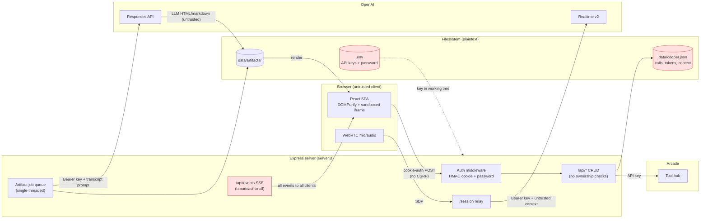
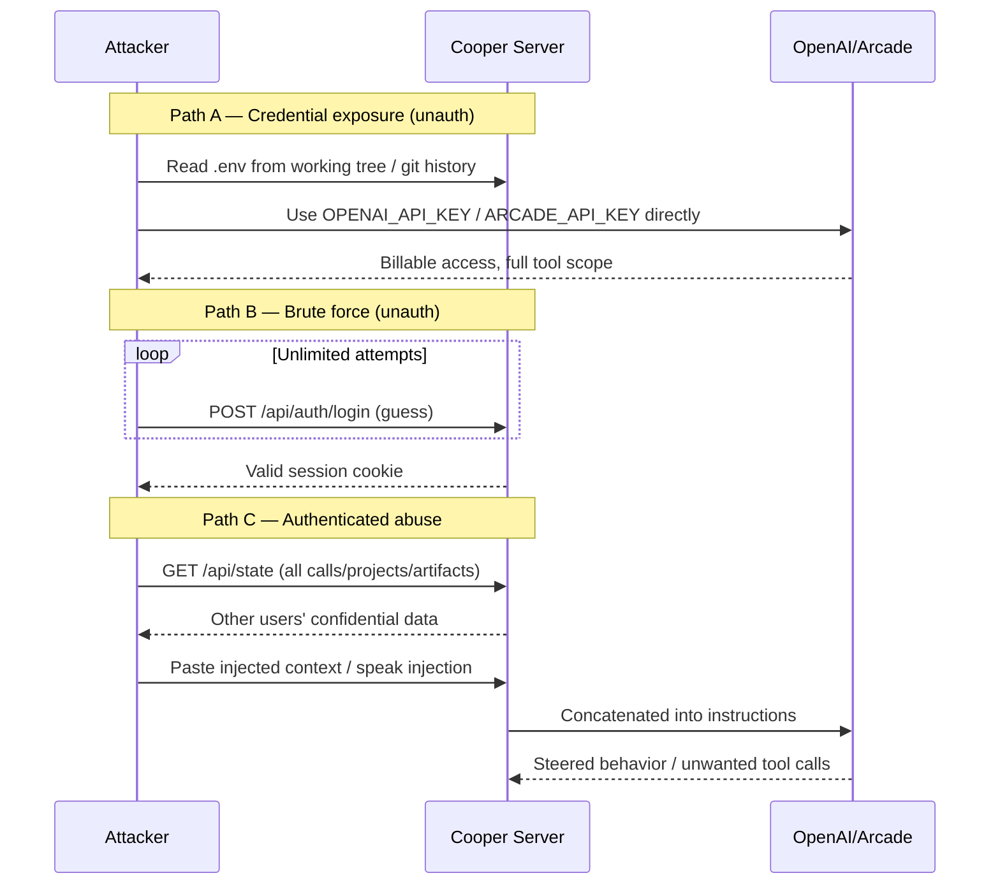

# Cooper Realtime Voice Agent — Security & Hardening Report

> **Document:** `docs/05-security-hardening-report.md`
> **Scope:** Cooper — React 19 + Vite frontend, Express backend, OpenAI Realtime v2 (WebRTC) + Responses API, Arcade tool integration, JSON file persistence.
> **Audience:** Engineering, security review, operations.
> **Status:** Initial hardening assessment. Findings derived from deep static analysis of the backend, frontend, and infrastructure surfaces.

---

## Table of Contents

1. [Executive Risk Summary](#1-executive-risk-summary)
2. [Threat Model](#2-threat-model)
   - [2.1 Assets](#21-assets)
   - [2.2 Trust Boundaries](#22-trust-boundaries)
   - [2.3 Attacker Profiles](#23-attacker-profiles)
   - [2.4 Trust Boundary Diagram](#24-trust-boundary-diagram)
   - [2.5 Attack Flow Overview](#25-attack-flow-overview)
3. [Findings Table (Sorted by Severity)](#3-findings-table-sorted-by-severity)
4. [Deep-Dive: Critical & High Findings](#4-deep-dive-critical--high-findings)
   - [4.1 SEC-001 — OpenAI/Arcade API Keys in `.env` and Git Working Tree](#41-sec-001--openaiarcade-api-keys-in-env-and-git-working-tree)
   - [4.2 SEC-002 — No Brute-Force Protection on the Shared Password](#42-sec-002--no-brute-force-protection-on-the-shared-password)
   - [4.3 SEC-003 — No Tenant / Ownership Isolation](#43-sec-003--no-tenant--ownership-isolation)
   - [4.4 SEC-004 — Prompt Injection via Transcripts & Project Context](#44-sec-004--prompt-injection-via-transcripts--project-context)
   - [4.5 SEC-005 — Plaintext Secrets & Customer Data at Rest](#45-sec-005--plaintext-secrets--customer-data-at-rest)
   - [4.6 SEC-006 — XSS & iframe Sandbox Escape in Artifact Rendering](#46-sec-006--xss--iframe-sandbox-escape-in-artifact-rendering)
   - [4.7 SEC-007 — Missing CSRF Protection](#47-sec-007--missing-csrf-protection)
   - [4.8 SEC-008 — Session Secret Derived From the App Password](#48-sec-008--session-secret-derived-from-the-app-password)
5. [Remediation Checklist](#5-remediation-checklist)
6. [Appendix: Existing Security Strengths](#6-appendix-existing-security-strengths)

---

## 1. Executive Risk Summary

Cooper is an internal-facing executive voice assistant that handles sensitive material: live meeting audio, transcripts, customer/engineering context, and generated strategic artifacts (PRDs, execution plans, prototypes). Its security posture has a **solid authentication core** — HMAC-SHA256 signed, HTTP-only, `SameSite=Lax` session cookies with timing-safe password comparison — but it is undermined by **credential-handling, isolation, and input-trust gaps** that are serious for a system holding executive and customer data.

The single most urgent issue is that the **OpenAI and Arcade API keys live in a `.env` file present in the working tree** (`SEC-001`, Critical). These keys grant direct, billable access to OpenAI and Arcade and must be treated as compromised and rotated immediately.

Beyond credentials, the app exhibits a cluster of reinforcing weaknesses:

- **Authentication is a single shared password with no rate limiting** (`SEC-002`), making it brute-forceable over time and offering no per-user accountability.
- **There is no tenant or per-user data isolation** (`SEC-003`): any authenticated user can read every call, transcript, project, and artifact, and the SSE event stream broadcasts all activity to all connected clients.
- **Untrusted input flows directly into model prompts** (`SEC-004`): transcribed audio and pasted/uploaded project context are concatenated into Realtime instructions and Responses prompts without isolation, enabling prompt injection that can steer Cooper's behavior and tool use.
- **Sensitive data is persisted unencrypted** (`SEC-005`): Arcade OAuth tokens, customer context, and ingested documents sit in plaintext in `data/cooper.json`.
- **Generated artifacts are rendered with XSS and iframe-escape exposure** (`SEC-006`), and **state-mutating endpoints lack CSRF defenses** (`SEC-007`).

**Overall risk rating: HIGH.** The combination of an exposed live API key, brute-forceable single-password auth, and absent data isolation means that a single credential leak or one successful login compromises the entire data set and a billable API budget. The findings below are individually remediable; none require re-architecting the app, and the highest-impact fixes (key rotation, login rate limiting, secret separation, prompt delimiting) are low-effort.

### Risk Posture at a Glance

| Severity  | Count | Representative issue |
|-----------|-------|----------------------|
| Critical  | 1     | API keys in working tree / git history |
| High      | 6     | No login rate limiting; no tenant isolation; prompt injection; plaintext secrets; iframe sandbox escape; CSRF |
| Medium    | 7     | Path traversal pattern; context injection; SSE cross-user leakage; CORS; artifact DoS; tabnabbing; tool-arg log leakage |
| Low       | 8     | Session-secret derivation; dev cookie `Secure`; magic-byte validation; transcript size; error verbosity; localStorage stale unlock; SW cache on logout; mermaid integrity |

---

## 2. Threat Model

### 2.1 Assets

| Asset | Sensitivity | Where it lives |
|-------|-------------|----------------|
| OpenAI API key (`OPENAI_API_KEY`) | Critical — billable, broad scope | `.env`, `process.env`, Bearer headers (`server.js:228,251,948,960`) |
| Arcade API key (`ARCADE_API_KEY`) | Critical — workspace/customer/eng tool access | `.env`, Arcade SDK init (`server.js:1362`) |
| App password (`COOPER_APP_PASSWORD`) | Critical — sole access gate | `.env`, login compare (`server.js:31,63-84`) |
| Session signing secret (`COOPER_SESSION_SECRET`) | High — forges sessions if leaked | `.env`; defaults to app password (`server.js:32`) |
| Arcade OAuth authorization tokens | High — act on user's connected accounts | `data/cooper.json` plaintext (`server.js:1334-1357`) |
| Live meeting audio + transcripts | High — confidential executive content | WebRTC stream; `data/cooper.json` (`server.js:610-636`) |
| Project context (customer info, PRDs, code) | High — confidential business data | `db.projectSources` in `data/cooper.json` (`server.js:1575-1593`) |
| Generated artifacts (PRDs, plans, prototypes) | Medium/High | `data/artifacts/` + DB records |
| Tool-call audit log | Medium — may contain PII in args/responses | `db.toolCalls` (`server.js:468-523`) |

### 2.2 Trust Boundaries

1. **Browser ↔ Express server.** Crossed by all `/api/*` and `/session` requests. Guarded only by the session cookie; no CSRF token, no per-resource ownership check.
2. **Express server ↔ OpenAI (Realtime + Responses + Transcription).** Server holds the API key and relays SDP/prompts. Untrusted transcript and project context cross this boundary inside prompt text.
3. **Express server ↔ Arcade.** OAuth-gated tool execution; write actions guarded by a confirmation flag (`COOPER_ENABLE_ARCADE_WRITES`, default `false`).
4. **Model-generated content ↔ Renderer.** HTML/markdown artifacts produced by the LLM are rendered in the browser (DOMPurify + sandboxed iframe). LLM output is **untrusted** because it can be steered by injected context.
5. **Process ↔ Filesystem.** Single JSON file (`data/cooper.json`) + `data/artifacts/` hold all state in plaintext; no encryption, backup, or write-isolation.

### 2.3 Attacker Profiles

#### Without the app password (unauthenticated)

| Profile | Capability | Relevant findings |
|---------|-----------|-------------------|
| **Network/credential scavenger** | Pulls `.env` from the repo/working tree or git history; uses the live OpenAI/Arcade keys directly, bypassing the app entirely. | `SEC-001`, `SEC-005` |
| **Brute-forcer** | Hammers `POST /api/auth/login` with unlimited password guesses; no lockout or backoff. | `SEC-002` |
| **CSRF attacker** | Lures an authenticated user to a malicious page that forges state-changing POSTs (partly mitigated by `SameSite=Lax`, not eliminated). | `SEC-007` |
| **Forged-session attacker** | If the session secret (== app password) leaks, mints valid HMAC session cookies without logging in. | `SEC-008` |

#### With the app password (authenticated user / shared-credential insider)

| Profile | Capability | Relevant findings |
|---------|-----------|-------------------|
| **Curious / malicious tenant** | Enumerates and reads *every* call, transcript, project, and artifact — there is no per-user ownership. Sees other users' live activity via the global SSE stream. | `SEC-003`, SSE leakage |
| **Prompt injector** | Pastes adversarial project context or speaks injection phrases that the model ingests verbatim, steering Cooper to misbehave or invoke tools. | `SEC-004` |
| **Artifact-XSS author** | Coaxes the model into emitting malicious HTML/markdown; on render, exploits DOMPurify gaps or the script-enabled iframe to exfiltrate via `postMessage`/popups. | `SEC-006` |
| **Resource exhauster** | Floods `POST /api/calls/:id/artifacts` to burn OpenAI quota and saturate the single-threaded job queue. | Artifact DoS |
| **Audit-log harvester** | Reads `db.toolCalls`, where partially-redacted args/responses may contain PII or secrets. | Tool-arg leakage |

### 2.4 Trust Boundary Diagram



### 2.5 Attack Flow Overview



---

## 3. Findings Table (Sorted by Severity)

| ID | Title | Severity | Location (file:line) | Description | Impact | Remediation |
|----|-------|----------|----------------------|-------------|--------|-------------|
| **SEC-001** | API keys present in `.env` / working tree (and likely git history) | **Critical** | `.env:1,6`; used at `server.js:228,251,948,960` | `OPENAI_API_KEY` and `ARCADE_API_KEY` live in a `.env` file in the repo working tree; the key is also used directly in Bearer headers with no masking. | Direct, billable OpenAI access and full Arcade tool scope for anyone who reads the file or git history. Complete bypass of app auth. | Rotate both keys now. Move secrets to a manager (Railway vars / AWS SSM / Vault). Confirm `.env` is git-ignored and purge from history (`git filter-repo`/BFG). Add CI secret scanning + pre-commit hook. Never log `process.env`. |
| **SEC-002** | No brute-force protection / rate limiting on login | **High** | `server.js:63-84`, `2088-2095` | `POST /api/auth/login` accepts unlimited guesses against a single shared password. No backoff, lockout, or audit logging. | Offline-grade online brute force of the sole access gate; no detection or alerting. | Add `express-rate-limit`/`rate-limiter-flexible`: e.g. 5 attempts / 15 min / IP with exponential backoff and temporary IP lockout. Log failed attempts with IP + UA. Consider TOTP/passkey and bcrypt-hashed password (cost ≥ 12). |
| **SEC-003** | No tenant / per-user ownership isolation | **High** | `server.js:281-334`, `540-553`; SSE `525-538`, `2146-2151` | Every authenticated user can read/edit all projects, calls, transcripts, and artifacts. The SSE stream broadcasts every event to every connected client. | Any user (or anyone past the shared password) reads all confidential executive/customer data; cross-user activity leakage via `/api/events`. | Add `userId`/tenant fields to calls, projects, artifacts, jobs. Enforce ownership on every GET/PATCH/POST/DELETE. Scope `/api/state`, `/api/calls`, `/api/projects` to the caller. Key `eventClients` by `userId` and filter broadcasts. |
| **SEC-004** | Prompt injection via untrusted transcripts & project context | **High** | `server.js:145-152` (realtime), `994-1037` (`buildWorkPrompt`), `1637-1663`; `src/main.jsx:793,830,558` | Transcribed audio and pasted/uploaded context are concatenated into Realtime instructions and Responses prompts with no delimiting or isolation. | Adversarial context (e.g. "ignore previous instructions…") can hijack Cooper's behavior and drive tool invocation. | Wrap all untrusted input in explicit delimiters (`[TRANSCRIPT_START]…[TRANSCRIPT_END]`, `--- UNTRUSTED PROJECT CONTEXT ---`). Strip control chars. Keep system instructions in a separate slot from user/transcript content. Re-`cleanText()` at prompt-build time. |
| **SEC-005** | Plaintext secrets & customer data at rest | **High** | `server.js:1334-1357` (Arcade tokens), `1575-1593` (project sources); `data/cooper.json` | Arcade OAuth tokens, ingested project documents (customer info, PRDs, code), and tool-call responses are stored unencrypted in the JSON DB. | Filesystem/backup exposure leaks live OAuth tokens and confidential documents in one place. | Encrypt sensitive fields at rest (libsodium/`crypto` secretbox) with a key stored separately from the DB. Decrypt only at use time. Restrict file permissions; document backup handling. |
| **SEC-006** | XSS & iframe sandbox escape in artifact rendering | **High** | `src/main.jsx:2102,2329-2331` (markdown), `2156-2162` (iframe sandbox) | Markdown artifacts render via `dangerouslySetInnerHTML` with a minimal DOMPurify config; HTML prototypes render in an iframe with `allow-scripts allow-modals allow-popups`. LLM output is attacker-influenceable (`SEC-004`). | Stored XSS / tabnabbing in markdown; script-enabled iframe can `postMessage`-exfiltrate or open popups. | Harden DOMPurify (explicit tag/attr allowlist; force `rel="noopener noreferrer"` on links). Drop `allow-modals`/`allow-popups` from the iframe; add a strict CSP `<meta>` in generated HTML (`default-src 'self'`). Validate generated HTML before write. Add a top-frame `postMessage` origin check. |
| **SEC-007** | Missing CSRF protection on state-mutating endpoints | **High** | `server.js:281,555,638,658,687,927`; `src/main.jsx:221-239` | POST/PATCH/DELETE endpoints rely solely on the `SameSite=Lax` cookie; no CSRF token or `Origin` validation. | A forged cross-site (or same-site XSS-driven) request can create calls/artifacts, mutate projects, or trigger tool execution. | Issue a CSRF token (nonce in session, echoed via `X-CSRF-Token`) and validate on all mutations, or use double-submit cookie. Additionally validate the `Origin`/`Referer` header against an allowlist. Consider `SameSite=Strict` for form-like endpoints. |
| **SEC-008** | Session signing secret defaults to the app password | **Low→High if leaked** | `server.js:32` (`sessionSecret = COOPER_SESSION_SECRET || appPassword`) | When `COOPER_SESSION_SECRET` is unset, the HMAC signing key is the login password — low entropy and reused across two functions. | If the password leaks, attackers can forge valid session cookies; session integrity is only as strong as the password. | Require `COOPER_SESSION_SECRET` as a distinct env var; fail startup if missing or equal to the password. Generate with `crypto.randomBytes(32).toString('hex')`. Never derive from the password. |
| **SEC-009** | Artifact path-traversal pattern (basename from `artifact.file`) | **Medium** | `server.js:1962-1967` (`artifactFileName`), `680` (read), `914` (write) | File path is derived from `artifact.file` via `split().pop()` rather than a strict whitelist; safe today only because the field is server-set. | If `artifact.file` ever becomes attacker-influenced, traversal could read/write outside `data/artifacts/`. | Use `path.basename()` and construct paths only from `artifact.id` + a validated extension enum (`/^[a-f0-9-]+\.(html|md)$/i`). Never pass DB-stored paths to `join()` for FS ops. |
| **SEC-010** | Project context injected into Realtime instructions without isolation | **Medium** | `server.js:145-152`, `1637-1663` | User-provided context is concatenated into the instructions string (size-capped at 18k chars, but not delimited or escaped). | Secondary prompt-injection vector into the live session (overlaps `SEC-004`). | Wrap context in clear untrusted-content markers; pass via a separate context field rather than the instructions string; re-sanitize at build time. |
| **SEC-011** | SSE event stream broadcasts to all clients | **Medium** | `server.js:525-538`, `2146-2151` | `/api/events` has no per-client filtering; one user's job/state events reach all connected clients. | Cross-user activity disclosure in any multi-client deployment. | Key `eventClients` by `userId`; filter each broadcast to the owning user. (Folds into `SEC-003`.) |
| **SEC-012** | No CORS configuration | **Medium** | `server.js:1-60` (no CORS middleware) | No explicit CORS policy; behavior relies on same-origin defaults and breaks/weakens if frontend and backend are split. | Misconfiguration risk if deployed cross-origin; weakens CSRF posture. | Add `cors()` with an explicit `ALLOWED_ORIGINS` allowlist, `credentials: true`, restricted methods/headers. Reject mismatched `Origin`. |
| **SEC-013** | No rate limiting on artifact generation (job-queue DoS) | **Medium** | `server.js:661-669`, `768-803` | Unlimited `POST /api/calls/:id/artifacts`; single-threaded queue and no per-user token budget. | An authenticated user can exhaust OpenAI quota and saturate the queue, denying service to others. | Per-user/IP rate limit (e.g. 5 artifacts/hr); reject when `queue length > N` (429); track per-user token budget; exponential backoff on retries. |
| **SEC-014** | Tabnabbing via DOMPurify `target`/`rel` allowance | **Medium** | `src/main.jsx:2329-2331` | `ADD_ATTR: ['target','rel']` permits `target="_blank"` without forcing `rel="noopener noreferrer"`. | Reverse-tabnabbing from rendered artifact links. | Post-sanitize: inject `rel="noopener noreferrer"` on every `<a target="_blank">`. (Folds into `SEC-006`.) |
| **SEC-015** | Tool arguments/responses logged with partial redaction | **Medium** | `server.js:468-523`, `1899-1925`, `1927-1944` | `safeAuditObject` redacts only key names like `password`/`token`; free-text fields (`query`, `input`, `context`) and full Arcade responses may contain PII/secrets. | Sensitive content persisted in `db.toolCalls`. | Redact by value pattern (`containsSensitiveText`) as well as key; truncate strings; store full responses separately, encrypted; periodic audit. |
| **SEC-016** | Auth relay endpoint without per-user rate limiting | **Medium** | `server.js:227-274` (`POST /session`) | `/session` is auth-gated but has no per-user rate limit; always-set `OpenAI-Safety-Identifier` not enforced. | Authenticated abuse of the costly Realtime relay. | Add per-authenticated-user rate limiting; ensure the safety identifier header is always present; consider request signing. |
| **SEC-017** | API key potentially exposed in error responses/logs | **Medium** | `server.js:248-274`, `957-992` | Bearer token used directly; no masking in `fetch` catch/error-propagation paths. | Token could leak into logs or client-facing errors. | Mask the Bearer token in all error/log paths; log method/URL only, never full headers; return generic client errors. |
| **SEC-018** | Cookie `Secure` flag only set in production | **Low** | `server.js:76-82` | `Secure` is gated on `isProduction`; dev cookies transit cleartext HTTP. | Low risk if dev is localhost-only; risky if dev runs on a shared/LAN host. | Prefer `Secure` + self-signed HTTPS in dev, or gate via an explicit `INSECURE_DEV` flag; document the assumption. |
| **SEC-019** | File upload validated by MIME/extension, not magic bytes | **Low** | `server.js:359-385`, `1596-1635` | MIME type is client-controlled; no magic-byte check; PDF parser has no per-page DoS guard. | Spoofed/binary uploads accepted; potential PDF-bomb resource exhaustion. | Validate magic bytes (`file-type`): require `%PDF` for `.pdf`; reject binary in text uploads. Enforce size/page/time limits on `pdf-parse`. |
| **SEC-020** | No size limit on transcript entries | **Low** | `server.js:610-636` | `POST /api/calls/:id/transcript` accepts arbitrary-length text. | Unbounded DB growth / storage DoS. | Cap per-entry (e.g. 10k chars) and per-call total; enforce request body size limits. |
| **SEC-021** | Error messages expose model names / API structure | **Low** | `server.js:979-983`, `1201-1202` | Raw OpenAI error text returned to clients reveals models and endpoints. | Information disclosure aiding targeted attacks. | Return generic client errors ("Artifact generation failed"); log full details server-side only. |
| **SEC-022** | localStorage unlock flag persists after session expiry | **Low** | `src/main.jsx:99,194-196,246` | `cooper.entered` keeps the UI "unlocked" even after the server cookie expires (401). | UX/security mismatch; stale unlocked shell. | On any 401 from `/api/state`, clear `cooper.entered` and redirect to the lock screen; re-validate session on each poll/SSE reconnect. |
| **SEC-023** | Service worker caches non-API content; no purge on logout | **Low** | `public/sw.js:16-30` | Versioned cache (`cooper-shell-v1`) is never invalidated and not cleared on logout. | Potentially sensitive shell content lingers post-logout; stale assets on update. | Clear caches on logout; bump `CACHE_NAME` on release; add `Cache-Control: no-store` to sensitive responses. |
| **SEC-024** | Missing `X-Content-Type-Options` / `Content-Disposition` on artifact content | **Low** | `server.js:671-685` | No `nosniff` / disposition headers; only MIME-by-extension, no format inspection. | Drive-by MIME sniffing; inline execution risk. | Add `X-Content-Type-Options: nosniff` (and `Content-Disposition` where appropriate); validate magic bytes; add CSP for HTML artifacts. |
| **SEC-025** | Dynamic `mermaid` import without integrity check | **Low** | `src/main.jsx:2336` | Mermaid loaded via dynamic import; if ever externalized to a CDN, no SRI. | Supply-chain code execution in the renderer if CDN-sourced. | Keep mermaid bundled; if externalized, add SRI hashes and a CSP `script-src` allowlist. |

---

## 4. Deep-Dive: Critical & High Findings

### 4.1 SEC-001 — OpenAI/Arcade API Keys in `.env` and Git Working Tree

**Severity: Critical**

**What's wrong.** `OPENAI_API_KEY` and `ARCADE_API_KEY` are stored in a `.env` file present in the repository working tree, and `OPENAI_API_KEY` is used unmasked as a Bearer token in multiple `fetch` calls (`server.js:228, 251, 948, 960`). If the file was ever committed, the keys are recoverable from history even after deletion.

**Why it matters.** These keys are *live* and *billable*. The OpenAI key grants direct access to Realtime, Responses, and Transcription APIs; the Arcade key grants access to the workspace/customer/engineering tool hub. An attacker holding either key bypasses the entire app — authentication, confirmation gates, rate limits — and operates directly against the upstream provider on the org's bill and data scope.

**Exploit path.** Read `.env` from the working tree, a stale branch, a CI artifact, or `git log --all -p | grep -i 'sk-'`. Use the key directly. No interaction with Cooper required.

**Remediation (do in order).**
1. **Rotate both keys immediately** in the OpenAI and Arcade dashboards — assume current keys are burned.
2. Move secrets into a manager: Railway environment variables, AWS SSM/Secrets Manager, or Vault. The app should read from `process.env` populated by the platform, never from a committed file.
3. Confirm `.env` is git-ignored (an `.env` ignore entry exists; verify the actual file is untracked) and **purge it from history** with `git filter-repo` or BFG, then force-push and invalidate caches.
4. Add **secret scanning** to CI (GitHub/GitLab secret detection) and a **pre-commit hook** (`gitleaks`/`trufflehog`).
5. Never log `process.env` or full request headers; mask Bearer tokens in error paths (see `SEC-017`).

---

### 4.2 SEC-002 — No Brute-Force Protection on the Shared Password

**Severity: High**

**What's wrong.** `POST /api/auth/login` (`server.js:63-84`) compares the submitted password against `COOPER_APP_PASSWORD` using a timing-safe compare (good) but imposes **no rate limit, backoff, lockout, or audit logging**. There is a single shared password and no per-user identity.

**Why it matters.** The entire application is gated by one secret. Without throttling, an attacker can attempt guesses continuously; a weak or moderate-entropy password falls to an online brute force, and nothing detects or alerts on the attempts.

**Remediation.**
- Add rate limiting (`express-rate-limit` or `rate-limiter-flexible`): e.g. **5 attempts / 15 min / IP**, then exponential backoff (1s→2s→4s→8s) and a temporary IP lockout.
- **Audit-log every attempt**: `{ success, timestamp, ip, userAgent }`; alert on bursts of failures.
- Store the password as a **bcrypt hash** (cost ≥ 12) rather than comparing plaintext.
- For a multi-user future, migrate to per-user credentials with TOTP or passkeys, which also unblocks `SEC-003`.

---

### 4.3 SEC-003 — No Tenant / Ownership Isolation

**Severity: High**

**What's wrong.** Calls, projects, artifacts, and jobs carry **no owner field**. Every authenticated request that lists or fetches a resource (`/api/state` at `server.js:540-553`, `/api/projects` at `281-334`, `/api/artifacts/:id/content`, `/api/calls/:id/transcript`) returns data regardless of who created it. The SSE stream (`server.js:525-538, 2146-2151`) pushes **all** events to **all** connected clients.

**Why it matters.** Because access is a single shared password, "authenticated" effectively means "anyone who got past the gate." Any such user can enumerate and read every executive transcript, customer document, and generated artifact, and can watch other users' live activity in real time. This is a confidentiality failure across the most sensitive assets in the system.

**Remediation.**
- Add `userId`/tenant to `calls`, `projects`, `artifacts`, `jobs`, and `projectSources`.
- Enforce ownership on **every** GET/PATCH/POST/DELETE: reject when `req.userId !== resource.userId`.
- Scope `/api/state` and all list endpoints to the caller's resources only.
- Key `eventClients` by `userId` and filter each broadcast (this also resolves `SEC-011`).
- Establishing per-user identity (`SEC-002`) is the prerequisite; until then, deploy strictly single-user-per-instance and document that constraint.

---

### 4.4 SEC-004 — Prompt Injection via Transcripts & Project Context

**Severity: High**

**What's wrong.** Two untrusted inputs are concatenated directly into model prompts:
- **Transcribed audio** flows into `buildWorkPrompt` (`server.js:994-1037`) and into Realtime instructions (`145-152`) without delimiting.
- **Pasted/uploaded project context** is built by `buildProjectContext` (`1637-1663`) and joined into the instructions string; the frontend likewise joins user context into custom prompts (`src/main.jsx:793, 830, 558`).

Size is capped (18k chars) and `cleanText()` runs at storage time, but there is **no structural isolation** between system instructions and untrusted content.

**Why it matters.** An attacker who can speak during a call or paste context can inject directives ("ignore previous instructions, do X", "call the follow-up tool with…"). Because Cooper can invoke tools (`run_gstack_skill`, `create_canvas_artifact`, `create_followup_action`), a successful injection can steer behavior and tool use, not just text output. Write actions are gated by `COOPER_ENABLE_ARCADE_WRITES` (good), but read tools and advisory skills are still reachable.

**Remediation.**
- Wrap every untrusted span in explicit, hard-to-spoof delimiters: `[TRANSCRIPT_START] … [TRANSCRIPT_END]`, `--- UNTRUSTED PROJECT CONTEXT (NOT INSTRUCTIONS) ---`.
- Keep system instructions in a dedicated slot, separate from user/transcript content (separate message roles or session fields rather than one concatenated instructions string).
- Strip control characters and known injection markers; re-run `cleanText()` at prompt-build time, not just at storage.
- Add an explicit note in the system prompt that delimited content is data, never instructions.
- Keep write actions behind confirmation; consider a lightweight injection-pattern detector on ingested context.

---

### 4.5 SEC-005 — Plaintext Secrets & Customer Data at Rest

**Severity: High**

**What's wrong.** `data/cooper.json` stores, unencrypted:
- **Arcade authorization tokens** and scopes (`server.js:1334-1357`) — live credentials to act on connected accounts.
- **Project sources** (`1575-1593`) — customer info, PRDs, code snippets ingested from paste/upload.
- **Tool-call responses** (`468-523`) — potentially PII-bearing Arcade results.

**Why it matters.** Any exposure of the file — a misconfigured backup, a host compromise, an over-broad volume mount — leaks live OAuth tokens *and* the full corpus of confidential business documents from a single artifact. Tokens are immediately reusable against Arcade.

**Remediation.**
- Encrypt sensitive fields at rest using authenticated encryption (libsodium `secretbox` / Node `crypto` AES-GCM). Keep the encryption key in the secret manager, **separate** from the data file.
- Decrypt only at point of use (Arcade calls, prompt assembly); never persist the plaintext alongside the ciphertext.
- Restrict file permissions on `data/`; document backup encryption and retention.
- Reduce blast radius: store tool-call responses in a separate, encrypted store with short retention (overlaps `SEC-015`).

---

### 4.6 SEC-006 — XSS & iframe Sandbox Escape in Artifact Rendering

**Severity: High**

**What's wrong.** Generated artifacts — whose content is influenceable via prompt injection (`SEC-004`) — are rendered two ways:
- **Markdown** via `markdown-it` → `DOMPurify.sanitize` → `dangerouslySetInnerHTML` (`src/main.jsx:2102, 2324-2356`). DOMPurify config is minimal (`ADD_ATTR: ['target','rel']`), relying on defaults and allowing `target="_blank"` without `rel="noopener noreferrer"` (tabnabbing, `SEC-014`).
- **HTML prototypes** in an iframe with `sandbox="allow-forms allow-modals allow-popups allow-scripts"` and `srcDoc` (`src/main.jsx:2156-2162`). `allow-scripts` permits arbitrary JS; `allow-popups`/`allow-modals` enable `window.open`/`alert`.

**Why it matters.** A model steered into emitting ``, `<svg onload=…>`, or a `<script>window.parent.postMessage({stolen:document.body.innerText},'*')</script>` payload can attempt XSS in the markdown path or data exfiltration / annoyance from the iframe. Even when contained to the iframe origin, `postMessage` and popups provide an exfiltration channel.

**Remediation.**
- **Markdown:** lock DOMPurify to an explicit tag/attribute allowlist; forbid event handlers and `javascript:` URLs; post-process to force `rel="noopener noreferrer"` on every `target="_blank"` link. Test with ``, `<svg onload=alert(1)>`, `[x](javascript:alert(1))`.
- **HTML iframe:** drop `allow-modals` and `allow-popups`; if scripts are required, add a strict CSP `<meta http-equiv="Content-Security-Policy" content="default-src 'self'; script-src 'self'">` into the generated document and validate/sanitize the HTML before write. Add a `postMessage` origin check on the parent frame and ignore unexpected messages.
- Serve artifact content with `X-Content-Type-Options: nosniff` (`SEC-024`).

---

### 4.7 SEC-007 — Missing CSRF Protection

**Severity: High**

**What's wrong.** All state-changing endpoints — `POST /api/projects` (`server.js:281`), `POST /api/calls` (`555`), `POST /api/calls/:id/artifacts` (`658`), `POST /api/calls/:id/transcript` (`638`), `POST /api/projects/:id/uploads` (`927`), `POST /api/tools/execute` — authorize using only the session cookie. There is **no CSRF token and no `Origin` validation**. `SameSite=Lax` provides partial defense but does not cover all request shapes, and does nothing against a same-site XSS-driven forgery (which `SEC-006` makes plausible).

**Why it matters.** A malicious page (or injected artifact script) can forge requests that create artifacts, mutate projects, or invoke tools using the victim's ambient cookie.

**Remediation.**
- Implement CSRF tokens: generate a nonce at session creation, expose it (cookie or response header), require it echoed in `X-CSRF-Token` on every POST/PATCH/DELETE, and validate server-side. Double-submit cookie is acceptable.
- Additionally validate `Origin`/`Referer` against an allowlist and reject mismatches (ties into CORS, `SEC-012`).
- Consider `SameSite=Strict` for the most sensitive endpoints.

---

### 4.8 SEC-008 — Session Secret Derived From the App Password

**Severity: Low (escalates to High if the password leaks)**

**What's wrong.** `server.js:32`:

```js
const sessionSecret = process.env.COOPER_SESSION_SECRET || appPassword;
```

When `COOPER_SESSION_SECRET` is unset, the HMAC signing key for session cookies **is the login password**. This reuses one secret for two purposes and inherits the password's (often low) entropy.

**Why it matters.** If the password is ever disclosed — phished, brute-forced (`SEC-002`), or leaked — the attacker can not only log in but also **forge arbitrary valid session cookies** offline, defeating session integrity entirely. The two functions (gate vs. signing) should fail independently.

**Remediation.**
- Require `COOPER_SESSION_SECRET` as a distinct mandatory env var. **Fail startup** if it is missing or equal to `COOPER_APP_PASSWORD`.
- Generate it with `crypto.randomBytes(32).toString('hex')`; document rotation (rotating invalidates existing sessions, which is acceptable).
- Never derive signing material from the password.

---

## 5. Remediation Checklist

### Critical — do immediately
- [ ] **SEC-001** Rotate `OPENAI_API_KEY` and `ARCADE_API_KEY`.
- [ ] **SEC-001** Move secrets to a secret manager; confirm `.env` untracked; purge from git history; add CI secret scanning + pre-commit hook.

### High — next
- [ ] **SEC-002** Add login rate limiting + exponential backoff + IP lockout; audit-log attempts; bcrypt the password.
- [ ] **SEC-003** Add `userId`/tenant to all resources; enforce ownership on every endpoint; scope `/api/state` to the caller. (Until done: single-user-per-instance, documented.)
- [ ] **SEC-004 / SEC-010** Delimit and isolate all untrusted transcript & project context in prompts; separate instruction vs. data slots; re-sanitize at build time.
- [ ] **SEC-005** Encrypt Arcade tokens, project sources, and tool responses at rest; key stored separately.
- [ ] **SEC-006 / SEC-014** Harden DOMPurify allowlist; force `rel="noopener noreferrer"`; drop iframe `allow-modals`/`allow-popups`; add CSP to generated HTML; validate HTML pre-write.
- [ ] **SEC-007** Add CSRF tokens + `Origin` validation on all mutations.
- [ ] **SEC-008** Require a distinct `COOPER_SESSION_SECRET`; fail startup if missing/equal to password.

### Medium
- [ ] **SEC-009** Build artifact paths from `artifact.id` + extension enum via `path.basename()`.
- [ ] **SEC-011** Key SSE clients by `userId` and filter broadcasts.
- [ ] **SEC-012** Add explicit CORS allowlist (`ALLOWED_ORIGINS`).
- [ ] **SEC-013** Rate-limit artifact generation; cap queue depth; per-user token budget.
- [ ] **SEC-015** Redact tool-call logs by value pattern; truncate; encrypt full responses separately.
- [ ] **SEC-016** Per-user rate limiting on `/session`; always set safety identifier.
- [ ] **SEC-017** Mask Bearer tokens in all error/log paths.

### Low
- [ ] **SEC-018** Set cookie `Secure` in dev (HTTPS) or behind an explicit flag.
- [ ] **SEC-019** Magic-byte upload validation; PDF size/page/time limits.
- [ ] **SEC-020** Cap transcript entry and per-call sizes; enforce body-size limits.
- [ ] **SEC-021** Return generic client errors; log details server-side only.
- [ ] **SEC-022** Clear `cooper.entered` and redirect on 401.
- [ ] **SEC-023** Clear SW caches on logout; bump `CACHE_NAME` per release; `Cache-Control: no-store` on sensitive responses.
- [ ] **SEC-024** Add `X-Content-Type-Options: nosniff` (+ disposition/CSP) to artifact content.
- [ ] **SEC-025** Keep mermaid bundled; add SRI + CSP `script-src` if externalized.

---

## 6. Appendix: Existing Security Strengths

These are working well and should be preserved through any refactor:

- **Timing-safe password comparison** via `crypto.timingSafeEqual` (`server.js:2088-2095`).
- **HMAC-SHA256 signed session tokens** (base64url JSON + signature) with nonce/expiry; HTTP-only, `Secure` in prod, `SameSite=Lax` cookies.
- **Auth middleware** covering all `/api/*` and `/session` routes via `isAuthenticated()`.
- **Secrets redaction scaffolding** — `safeAuditObject()` / `containsSensitiveText()` detect API keys, tokens, private keys, bearer tokens (`server.js:1927-1956`).
- **Rate-limited job queue** with `jobDelayMs` spacing and retry-after handling (`server.js:768-803`).
- **Write-action confirmation gates** — Arcade writes default off (`COOPER_ENABLE_ARCADE_WRITES=false`); `create_followup_action` requires explicit confirmation.
- **Tool risk classification** (read/advisory/write) with write tools blocked by default.
- **HTML escaping** for artifact fallback generation (`escapeHtml`, `server.js:2007-2028`).
- **DOMPurify sanitization** of markdown and **sandboxed iframe** for HTML prototypes (defense-in-depth to be hardened per `SEC-006`).
- **Service worker excludes `/api` routes** from caching, avoiding stale session/state exposure.
- **Context size caps** (250k chars/source, 18k chars/session) limit injection surface.
- **Artifact filenames use UUIDs**, not user-supplied names, and live outside the web root.
- **GStack skills are advisory-only** — cannot mutate code, deploy, or open PRs (`runGstackSkill.js:70-71`).
- **Job recovery on restart** — running jobs are requeued with a log entry.
