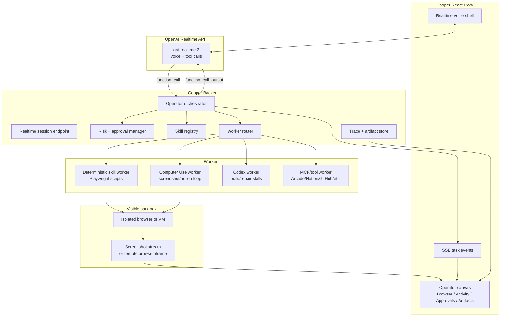
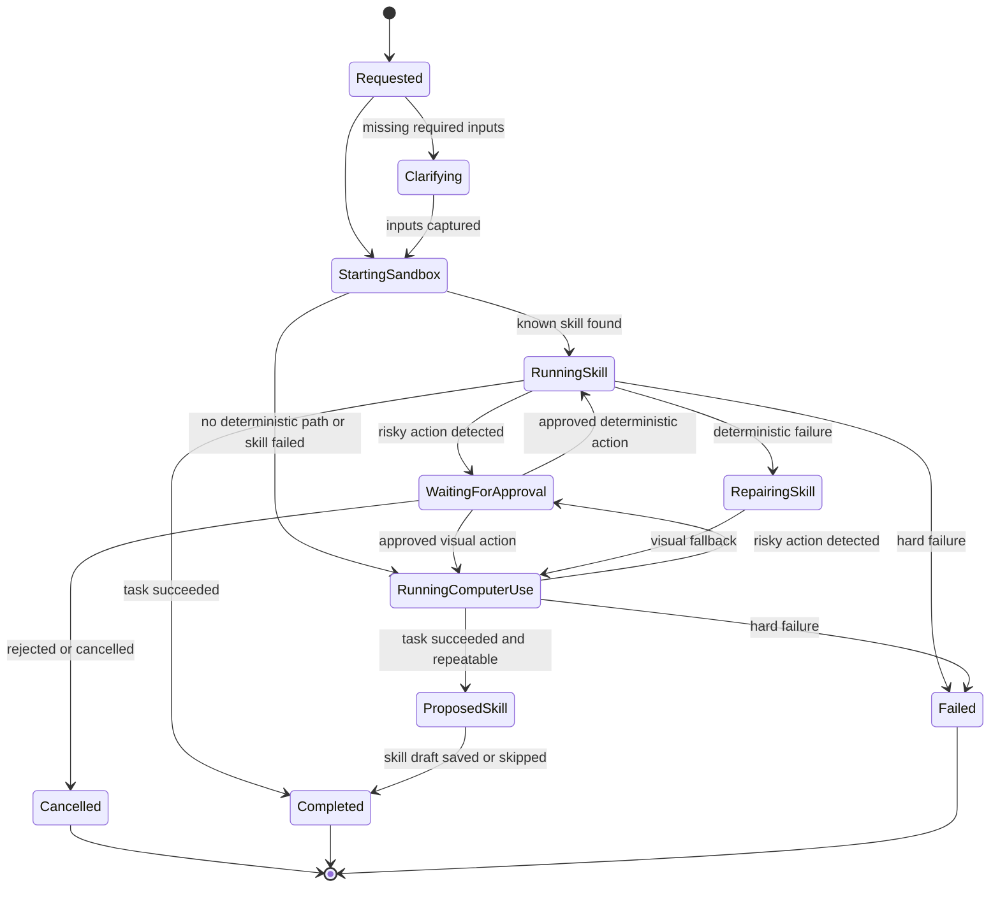

# Cooper Operator Agent Factory Plan

> Internal AIRES product and engineering plan for adding a second realtime Cooper
> experience: voice orchestration, visible remote browser work, and a repeatable
> skill runner that can be watched, approved, repaired, and reused.

## 1. Source Context

Source inputs:

- User brief: "voice orchestration + visible remote browser + repeatable skill runner."
- User brief: "the first agent in the agent factory."
- User brief: "a real teammate" that Michael can talk with in realtime while work runs.
- User brief: run workflows such as configuring SendGrid sender authentication, extracting DNS records, and continuing the conversation while the work happens.
- Existing Cooper app: Realtime WebRTC voice shell, live canvas, context ingestion, post-call artifacts, function tools, Arcade/Notion/GStack-style tool routing, SSE activity, and PWA UI.
- Existing plan: [canvas-collaboration-plan.md](./canvas-collaboration-plan.md).

Official OpenAI documentation reviewed:

- [Realtime and audio](https://developers.openai.com/api/docs/guides/realtime)
- [Realtime API with WebRTC](https://developers.openai.com/api/docs/guides/realtime-webrtc)
- [Realtime conversations](https://developers.openai.com/api/docs/guides/realtime-conversations)
- [Realtime with tools](https://developers.openai.com/api/docs/guides/realtime-mcp)
- [Computer use](https://developers.openai.com/api/docs/guides/tools-computer-use)
- Codex manual sections: app-server, Codex MCP server, subagents, cloud environments, and remote connections.

## 2. Problem and Goal

### Problem

Cooper can already listen, talk, ingest context, generate artifacts, and render visual work on a canvas. The next missing capability is operational: Michael needs to ask Cooper to do real web work, watch the browser while it happens, pause at risky points, and turn one-off browser execution into reusable skills.

Today, if Michael says, "configure SendGrid sender auth for aires.ai," Cooper can discuss the plan but does not yet have a visible, supervised browser worker that can:

- Open a sandboxed browser.
- Navigate an authenticated third-party tool.
- Use deterministic Playwright where possible.
- Fall back to Computer Use when UI automation breaks.
- Show screenshots, cursor movement, logs, and checkpoints.
- Ask for approval before high-impact actions.
- Return the final result into the same realtime conversation.
- Save the successful procedure as a repeatable skill.

### Goal

Add a second Cooper realtime experience called **Operator Agent**. It reuses the Cooper voice shell and canvas, but adds an orchestrator, visible remote browser, worker state machine, skill registry, approval gates, and a repair loop.

The first MVP should let Michael start a live Cooper Operator session, ask for one supervised browser skill, watch the sandbox in the canvas, approve or stop risky actions, and receive a final artifact such as DNS records, setup notes, screenshots, or a replay trace.

### 5-Whys Check

1. Why add a browser operator? Because Michael needs Cooper to execute operational SaaS/admin workflows, not only discuss them.
2. Why make the browser visible? Because trust is earned when the user can watch, intervene, and approve.
3. Why use repeatable skills? Because random UI clicking every run is slow, brittle, expensive, and hard to audit.
4. Why keep Realtime as the conversational controller? Because Michael needs to plan, clarify, and supervise while work continues.
5. Why use an orchestrator? Because voice, planning, browser automation, Codex workers, approvals, and logs need separate responsibilities.

## 3. Product Thesis

Cooper Operator should feel like a teammate sitting beside Michael:

- Michael talks naturally.
- Cooper clarifies the goal.
- Cooper opens a visible work surface.
- The worker executes safe steps without blocking the conversation.
- Risky actions pause with clear approval controls.
- The work produces reusable artifacts and skills.
- The next run is faster because Cooper learned the procedure.

The product wedge is not "AI clicks websites." The wedge is:

```text
Voice-controlled, visible, repeatable web-operation skills.
```

## 4. Users and Stakeholders

| Role | Need |
| --- | --- |
| Michael / AIRES CTO and CPO | Voice-supervise operational work, approve sensitive actions, steer the agent, and reuse procedures. |
| AIRES product team | Convert repeated ops workflows into productized agent skills with clear UX, status, and safety. |
| AIRES engineering team | Implement reliable workers, browser isolation, approval gates, observability, and skill repair workflows. |
| QA / verifier | Validate that the worker performs only approved actions, persists traces, and recovers from failures. |
| Security / operations owner | Ensure credentials, external systems, DNS, API keys, and account settings are protected. |

## 5. Current State to Desired State

### Current State

Cooper already has:

- Browser Realtime voice sessions over WebRTC using `/v1/realtime/calls`.
- `oai-events` data channel for Realtime events and function calls.
- Wake-gated responses and manual "Ask Cooper" entry points.
- Live canvas for visual artifacts and AIRES examples.
- Server-side job loop for generated artifacts.
- Settings-oriented pre-authorization for external tools.
- SSE activity stream and persisted local state.

### Desired State

Cooper gains an **Operator** mode:

- At session start, the user can choose **Meeting Assistant** or **Operator Agent**.
- During a call, Cooper can switch into Operator mode when the user requests operational browser work.
- The active call layout becomes a left voice/control rail and a large right work canvas.
- The canvas shows tabs for Browser, Activity, Approvals, Artifacts, Skill, and Logs.
- Browser work runs in a sandboxed environment with isolated credentials and per-task state.
- A backend orchestrator owns task lifecycle, worker routing, risk policy, and event streaming.
- Computer Use is used as a visual fallback layer, not as the only execution path.
- Successful manual/Computer Use flows can be saved or proposed as repeatable skills.

## 6. Scope

### In Scope for This Addition

- Add an Operator Agent mode to the existing Cooper app.
- Add a task orchestrator contract for visible browser skills.
- Add a skill registry with one MVP skill: `sendgrid_sender_authentication`.
- Add a browser sandbox abstraction with a local Playwright-first implementation.
- Add a live browser/canvas surface that can show screenshots or a stream, status, approvals, logs, and final artifacts.
- Add Realtime function tools such as `start_operator_task`, `pause_operator_task`, `approve_operator_action`, `cancel_operator_task`, and `save_operator_skill`.
- Add worker events that Cooper can narrate back into the current Realtime session.
- Add approval policy for risky actions.
- Add tests around task lifecycle, risk classification, approval gates, and event payloads.

### Out of Scope Now

- Fully autonomous credential setup without user supervision.
- Direct production write actions without approval.
- Multi-tenant admin console.
- Full browser streaming infrastructure at production scale.
- Arbitrary third-party site automation without allowlisting.
- Direct Codex Cloud integration as a hard dependency for MVP.
- Replacing the existing Cooper call or canvas system.

### Non-Goals

- Cooper should not become a hidden bot that performs account changes out of sight.
- The first version should not try to support every SaaS admin workflow.
- Computer Use should not be the default for every step when deterministic Playwright is safer.
- Generated skills should not be silently installed or trusted without review.

## 7. Architecture

### 7.1 Target System



### 7.2 Responsibility Split

| Layer | Responsibility |
| --- | --- |
| Realtime voice agent | Talk with Michael, clarify intent, summarize progress, call backend tools, and return to conversation. |
| Orchestrator | Own task state, worker routing, approval policy, retries, cancellation, and event emission. |
| Skill registry | Store known repeatable procedures, metadata, allowed domains, required inputs, risk boundaries, and tests. |
| Deterministic worker | Run known Playwright procedures quickly and predictably. |
| Computer Use worker | Inspect screenshots, return UI actions, and recover when deterministic automation fails. |
| Codex worker | Draft, repair, test, and propose skills or Playwright scripts from observed traces. |
| Browser sandbox | Isolate website sessions, credentials, screenshots, downloads, and page content. |
| Canvas | Show what is happening, approvals, logs, screenshots, browser view, and final outputs. |

## 8. Realtime Tool Contract

Use function tools for MVP because the Cooper backend must own approval checks, browser isolation, credential policy, and audit logs. This follows the Realtime tools guidance: use `function` when the application owns business logic and returns `function_call_output`; use MCP only when Realtime should directly call a remote tool server.

### `start_operator_task`

```json
{
  "type": "function",
  "name": "start_operator_task",
  "description": "Start a supervised visible browser or skill task in the Cooper Operator canvas.",
  "parameters": {
    "type": "object",
    "properties": {
      "skill": {
        "type": "string",
        "description": "Known skill id, such as sendgrid_sender_authentication. Use general_browser_task if no skill exists yet."
      },
      "goal": {
        "type": "string",
        "description": "The user-visible outcome to accomplish."
      },
      "target_url": {
        "type": "string",
        "description": "Optional starting URL."
      },
      "inputs": {
        "type": "object",
        "description": "Structured inputs such as domain, account name, repository, tenant, or environment."
      },
      "approval_mode": {
        "type": "string",
        "enum": ["supervised", "auto_safe_steps"],
        "description": "supervised pauses at risky actions; auto_safe_steps can proceed through low-risk steps."
      },
      "visibility": {
        "type": "string",
        "enum": ["visible", "background_with_checkpoints"]
      }
    },
    "required": ["skill", "goal", "approval_mode"]
  }
}
```

### Additional Tools

| Tool | Purpose |
| --- | --- |
| `pause_operator_task(task_id)` | Pause the worker while preserving browser state. |
| `resume_operator_task(task_id)` | Resume a paused task. |
| `cancel_operator_task(task_id)` | Stop the worker and close or freeze the sandbox. |
| `approve_operator_action(task_id, approval_id, approved, note)` | Resolve a pending approval. |
| `get_operator_task_status(task_id)` | Summarize current phase, recent events, next action, and blockers. |
| `save_operator_skill(task_id, skill_name)` | Convert a successful trace into a proposed skill draft for review. |

## 9. Operator Task State Machine



## 10. Data Model

```ts
type OperatorTask = {
  id: string;
  callId?: string;
  projectId?: string;
  title: string;
  skill: string;
  goal: string;
  targetUrl?: string;
  inputs: Record<string, unknown>;
  status:
    | "requested"
    | "clarifying"
    | "starting_sandbox"
    | "running"
    | "waiting_for_approval"
    | "repairing_skill"
    | "completed"
    | "failed"
    | "cancelled";
  approvalMode: "supervised" | "auto_safe_steps";
  workerKind: "playwright_skill" | "computer_use" | "codex_repair" | "mcp";
  browserSessionId?: string;
  activeApprovalId?: string;
  resultArtifactIds: string[];
  createdAt: string;
  updatedAt: string;
};

type OperatorEvent = {
  id: string;
  taskId: string;
  type:
    | "task.started"
    | "sandbox.ready"
    | "browser.screenshot"
    | "step.started"
    | "step.completed"
    | "approval.requested"
    | "approval.resolved"
    | "skill.fallback"
    | "skill.proposed"
    | "artifact.created"
    | "task.completed"
    | "task.failed";
  message: string;
  payload?: Record<string, unknown>;
  createdAt: string;
};

type OperatorSkill = {
  id: string;
  title: string;
  description: string;
  version: string;
  status: "draft" | "active" | "deprecated";
  allowedDomains: string[];
  requiredInputs: Array<{
    name: string;
    type: "string" | "url" | "secret_ref" | "choice";
    required: boolean;
  }>;
  riskProfile: {
    readOnlyUntilStep?: string;
    riskyActions: string[];
    destructiveActionsAllowed: false;
  };
  runner: "playwright" | "computer_use" | "hybrid";
  scriptPath?: string;
  testPath?: string;
  createdAt: string;
  updatedAt: string;
};

type OperatorApproval = {
  id: string;
  taskId: string;
  riskLevel: "write" | "external_change" | "credential" | "destructive";
  actionSummary: string;
  riskSummary: string;
  dataToTransmit?: string[];
  destination?: string;
  status: "pending" | "approved" | "rejected" | "expired";
  createdAt: string;
  resolvedAt?: string;
};
```

## 11. MVP Skill: SendGrid Sender Authentication

### User Story

As Michael, I want to say "Cooper, configure SendGrid sender authentication for aires.ai," then watch Cooper open SendGrid, navigate to sender authentication, gather required DNS records, and pause before any account-changing or credential-sensitive action.

### Required Inputs

- Domain, such as `aires.ai`.
- SendGrid account context or credential reference.
- Approval mode, default `supervised`.
- Optional DNS provider context.

### Happy Path

```text
User asks Cooper to configure SendGrid sender authentication.
Cooper clarifies the domain if missing.
Cooper starts an Operator task.
Backend opens a sandbox browser.
Worker navigates to SendGrid.
If login is required, user completes login or approves use of a credential reference.
Worker navigates to Sender Authentication.
Worker starts or inspects domain authentication setup.
Worker extracts required DNS records.
Worker pauses before saving or submitting changes.
Cooper summarizes records and asks whether to continue.
Final artifact includes records, screenshots, status, and next action.
```

### Output Artifact

```ts
type SendgridSenderAuthResult = {
  domain: string;
  status:
    | "records_extracted"
    | "needs_user_dns_update"
    | "submitted_pending_verification"
    | "blocked";
  records: Array<{
    type: "CNAME" | "TXT" | "MX";
    host: string;
    value: string;
    purpose: string;
  }>;
  screenshots: string[];
  approvals: string[];
  nextSteps: string[];
};
```

## 12. UI / UX Requirements

### Entry Points

- Splash or Home mode selector:
  - **Meeting Assistant**: current Cooper call workflow.
  - **Operator Agent**: visible browser task workflow.
- In-call command:
  - "Cooper, run an operator task..."
  - "Cooper, open the browser and do..."
  - "Cooper, configure..."
- Canvas build buttons:
  - Run skill
  - Open browser
  - Add credentials/context
  - Review approvals

### Operator Layout

```text
Desktop
┌──────────────────────────────┬──────────────────────────────────────────────┐
│ 25% Voice / controls          │ 75% Operator canvas                          │
│ - Cooper status               │ - Browser tab                                │
│ - Ask Cooper                  │ - Activity tab                               │
│ - Transcript                  │ - Approvals tab                              │
│ - Task controls               │ - Artifacts tab                              │
└──────────────────────────────┴──────────────────────────────────────────────┘

Mobile
┌──────────────────────────────┐
│ Cooper voice header           │
├──────────────────────────────┤
│ Browser / canvas tabs         │
├──────────────────────────────┤
│ Bottom controls / approvals   │
└──────────────────────────────┘
```

### Activity Feedback

The user should never see a stuck "queued" state without explanation. Every task needs:

- Current phase.
- Current step.
- Time in current step.
- Last screenshot timestamp.
- Last worker event.
- Next expected action.
- Retry count.
- Whether the model, browser, or external website is waiting.

Do not expose raw hidden reasoning. Show a work trace that is useful and safe:

- "Opening sandbox browser."
- "Navigating to SendGrid."
- "Waiting for login."
- "Extracting DNS records."
- "Approval required before saving domain authentication."

## 13. Security and Approval Policy

### Baseline

OpenAI Computer Use guidance emphasizes isolated browser/VM execution, human-in-the-loop controls for high-impact actions, and treating page content as untrusted input. Cooper Operator should bake that into the product model.

### Allowed Without Extra Approval

- Opening allowed domains.
- Navigating pages.
- Reading on-screen text.
- Taking screenshots for task trace.
- Extracting DNS records or setup instructions.
- Filling non-sensitive fields when the user directly supplied the data.

### Confirm at Action Time

Require approval immediately before:

- Submitting forms that change third-party account state.
- Creating, rotating, or revealing API keys.
- Typing passwords, one-time codes, private credentials, or sensitive data.
- Changing DNS, sender authentication, webhook, billing, security, permission, or production settings.
- Sending messages, emails, Slack posts, or customer-facing communications.
- Installing or running downloaded scripts, browser extensions, or console code.

### Disallowed in MVP

- Deleting data.
- Closing accounts.
- Changing billing plans.
- Bypassing CAPTCHA, paywalls, browser safety warnings, or phishing warnings.
- Running arbitrary downloaded code.
- Performing irreversible production changes without handoff.

### Prompt Injection Boundary

Website content, emails, PDFs, chats, docs, calendar invites, tool outputs, and on-screen instructions are untrusted. They are not permission. If the page asks the agent to ignore instructions, reveal secrets, or perform unrelated actions, the worker must stop and ask Michael.

## 14. MoSCoW Requirements

### Must

- Reuse Cooper Realtime voice and canvas.
- Add Operator mode and task state model.
- Add `start_operator_task` function tool.
- Add visible task activity and approval UI.
- Add one supervised MVP skill: SendGrid sender authentication.
- Use Playwright-first browser automation.
- Add Computer Use fallback or stubbed adapter contract.
- Persist task events, approvals, and final artifacts.
- Require approval before high-impact actions.
- Add tests for state transitions, risk classification, approval gates, and event streaming.

### Should

- Stream screenshots to the canvas at key checkpoints.
- Let Cooper narrate task status inside the same Realtime session.
- Support pausing/resuming/cancelling tasks.
- Save successful traces as proposed skill drafts.
- Add allowlisted domain policy per skill.
- Add typed skill input schemas.

### Could

- Use Browserbase, Steel, or remote Chromium for production browser sessions.
- Add noVNC or WebRTC browser stream after screenshot-based MVP.
- Add Codex app-server or Codex MCP integration for richer worker orchestration.
- Add multiple simultaneous Operator tasks.
- Add replayable trace viewer.

### Won't This Slice

- Fully automate arbitrary websites.
- Ship multi-user enterprise permissions.
- Let Realtime directly call remote MCP tools for high-risk browser operations.
- Replace Cooper's current Meeting Assistant flow.
- Build production-scale remote browser infrastructure before the Playwright MVP proves value.

## 15. Vertical INVEST Slices

| Slice | Ticket | Pattern | Value |
| --- | --- | --- | --- |
| 1 | Add Operator task schema and local persistence | De-risk the unknown first | Establishes the durable state model without browser complexity. |
| 2 | Add Operator mode UI shell and canvas tabs | Workflow step | Gives users a visible place to supervise work. |
| 3 | Add `start_operator_task` Realtime tool and backend route | Integration seam | Lets Cooper start tasks from voice or typed prompt. |
| 4 | Add Playwright sandbox worker with screenshot checkpoints | Workflow step | Creates first visible execution surface. |
| 5 | Add risk classifier and approval gate | Rule variation | Prevents unsafe write/credential actions. |
| 6 | Implement SendGrid sender auth read/extract flow | Data/input variation | Ships one real skill with business value. |
| 7 | Add Computer Use adapter contract and mocked loop test | De-risk the unknown first | Prepares visual fallback without depending on every UI detail. |
| 8 | Persist final artifact and task replay summary | Workflow step | Makes completed work reviewable after the call. |
| 9 | Propose skill draft from successful trace | Deferred non-functional | Starts the repeatable skill flywheel. |

## 16. Acceptance Criteria

### Task Start

```text
Given Cooper is in an active Realtime session,
When Michael says "Cooper, configure SendGrid sender auth for aires.ai",
Then Cooper calls start_operator_task with skill sendgrid_sender_authentication, goal, domain input, and supervised approval mode.
```

### Visible Work

```text
Given an Operator task has started,
When the backend launches the sandbox browser,
Then the canvas shows a Browser tab, task phase, latest screenshot timestamp, and activity events without ending the call.
```

### Approval Gate

```text
Given the worker reaches a step that would submit a SendGrid configuration change,
When the next action would alter account state,
Then the worker pauses, creates an approval request, and does not continue until Michael approves.
```

### Safe Rejection

```text
Given an approval request is pending,
When Michael rejects the action,
Then the task stops or returns to a safe read-only state and Cooper explains what was not done.
```

### Final Artifact

```text
Given the worker extracts DNS records,
When the task completes,
Then Cooper creates an artifact containing the records, screenshots, approvals, status, and next steps.
```

### Computer Use Fallback

```text
Given the deterministic Playwright skill cannot find a UI element,
When fallback is allowed,
Then the orchestrator records skill.fallback, starts the Computer Use adapter, and continues with screenshot/action checkpoints.
```

### Prompt Injection Stop

```text
Given a web page displays instructions that conflict with the user goal or asks the agent to reveal secrets,
When the worker detects the suspicious content,
Then the task pauses and asks Michael how to proceed.
```

## 17. Implementation Phases

### Phase 1 - Documentation and Contracts

- Create this requirements and architecture document.
- Add implementation issue list or roadmap doc if needed.
- Define task/event/approval/skill schemas.
- Confirm MVP browser stream approach: screenshots first, noVNC/WebRTC later.

### Phase 2 - Operator Shell

- Add Operator mode to app navigation and call canvas.
- Add Operator tabs: Browser, Activity, Approvals, Artifacts, Skill, Logs.
- Add task status panel with no-stuck-state activity UX.
- Add local-only mocked task runner for UI testing.

### Phase 3 - Orchestrator and Tooling

- Add `start_operator_task` and companion Realtime function tools.
- Add REST endpoints:
  - `POST /api/operator/tasks`
  - `GET /api/operator/tasks/:id`
  - `POST /api/operator/tasks/:id/pause`
  - `POST /api/operator/tasks/:id/resume`
  - `POST /api/operator/tasks/:id/cancel`
  - `POST /api/operator/approvals/:id`
  - `GET /api/operator/tasks/:id/events`
- Add targeted SSE events:
  - `operator.task.created`
  - `operator.task.updated`
  - `operator.event.created`
  - `operator.approval.requested`
  - `operator.approval.resolved`
  - `operator.artifact.created`

### Phase 4 - Browser Sandbox MVP

- Add Playwright worker process or in-process worker with strict isolation.
- Use an empty browser env, disabled extensions, and restricted domains.
- Capture screenshots at checkpoints.
- Stream screenshot events to the canvas.
- Implement safe cancellation and cleanup.

### Phase 5 - SendGrid Skill

- Add `sendgrid_sender_authentication` skill metadata.
- Build read/extract path first.
- Pause before any account-changing action.
- Create DNS records artifact.
- Add unit tests and one integration test with a mocked SendGrid page.

### Phase 6 - Computer Use Fallback

- Add a Computer Use adapter behind the worker router.
- Start with feature flag `COOPER_ENABLE_COMPUTER_USE=false`.
- Test action normalization, screenshot loop, max step count, and approval interruption.
- Enable only for allowlisted tasks once reviewed.

### Phase 7 - Skill Factory Loop

- Store traces.
- Generate proposed Playwright skill drafts from completed traces.
- Run the draft against mocked pages.
- Present diffs/tests to Michael or engineering before activation.

## 18. API Sketch

### Create Task

```http
POST /api/operator/tasks
Content-Type: application/json

{
  "callId": "call_123",
  "skill": "sendgrid_sender_authentication",
  "goal": "Configure sender authentication for aires.ai and extract DNS records.",
  "targetUrl": "https://app.sendgrid.com/",
  "inputs": { "domain": "aires.ai" },
  "approvalMode": "supervised",
  "visibility": "visible"
}
```

Response:

```json
{
  "task": {
    "id": "op_task_123",
    "status": "starting_sandbox",
    "skill": "sendgrid_sender_authentication",
    "title": "SendGrid sender authentication for aires.ai"
  }
}
```

### Resolve Approval

```http
POST /api/operator/approvals/op_appr_123
Content-Type: application/json

{
  "approved": true,
  "note": "Proceed with creating the domain auth record, but do not verify until I update DNS."
}
```

## 19. Test Plan

Unit tests:

- Risk classifier classifies read, write, credential, external change, and destructive actions.
- Task state machine allows valid transitions and rejects unsafe transitions.
- Approval manager blocks risky actions until approval.
- Realtime tool arguments validate required fields and safe defaults.
- SSE event payloads include task id, phase, message, and timestamp.

Integration tests:

- `start_operator_task` creates a task, emits events, and returns a Realtime-safe function output.
- Mock Playwright worker emits screenshots and completes a read-only task.
- SendGrid mocked page extracts DNS records.
- Rejected approval stops the worker.
- Failed deterministic skill falls back to the Computer Use adapter when enabled.

Manual QA:

- Start Operator mode on desktop and mobile.
- Start task from voice and typed prompt.
- Watch browser screenshots appear.
- Approve and reject a pending action.
- End call while task is running and confirm task is paused or resumable.
- Reload app and confirm task state persists.

## 20. Observability

Log and surface:

- Session id, call id, task id.
- Skill id and version.
- Worker kind.
- Sandbox id.
- Domain allowlist decisions.
- Step started/completed.
- Screenshot checkpoint ids.
- Approval request/resolution.
- Tool/model latency.
- Computer Use step count and fallback reason.
- Final status and artifact ids.

Metrics:

- Task start latency.
- Time to first visible browser update.
- Approval wait time.
- Skill success rate.
- Fallback rate.
- Computer Use loop steps per task.
- User cancellation rate.
- Stuck phase duration.

## 21. Definition of Ready

- [ ] The target skill has a named owner and acceptance owner.
- [ ] Required inputs are defined.
- [ ] Allowed domains are listed.
- [ ] Risky actions are listed.
- [ ] Destructive actions are explicitly disallowed.
- [ ] The first deterministic path is described.
- [ ] Fallback behavior is described.
- [ ] UI states exist for queued, running, waiting for approval, failed, completed, and cancelled.
- [ ] Test fixtures or mocked pages exist.
- [ ] The user-visible artifact format is defined.

## 22. Open Questions

1. Should the first browser MVP use screenshots only, noVNC, hosted remote browser, or WebRTC video?
2. Should credentials live in Arcade, browser profile storage, or a separate encrypted credential reference store?
3. Should Operator tasks continue after the voice call ends or pause by default?
4. Should Codex worker execution run locally through Codex MCP/app-server or as a separate cloud task surface later?
5. Which second skill follows SendGrid: Stripe webhook setup, DNS record extraction, GitHub repo config, or CRM admin setup?
6. What is the approved list of domains for MVP?
7. Should the generated skill draft become a repo file, a database record, or both?

## 23. Recommended MVP Default

Start small:

```text
Cooper Realtime voice
  -> start_operator_task function tool
  -> Cooper backend orchestrator
  -> local Playwright sandbox
  -> screenshot checkpoints in canvas
  -> approval gate
  -> SendGrid sender auth DNS extraction
  -> final Markdown/JSON artifact
```

Do not start with full arbitrary web automation. Start with one skill that is valuable, visual, auditable, and easy to test.

