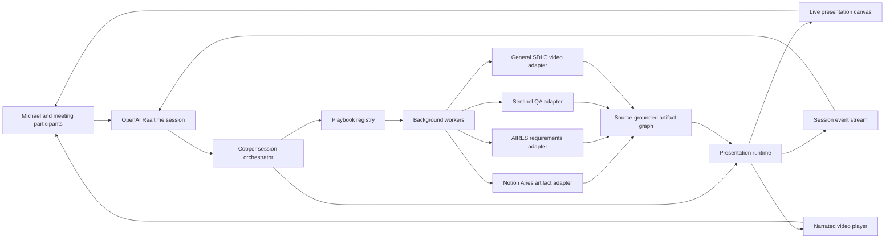
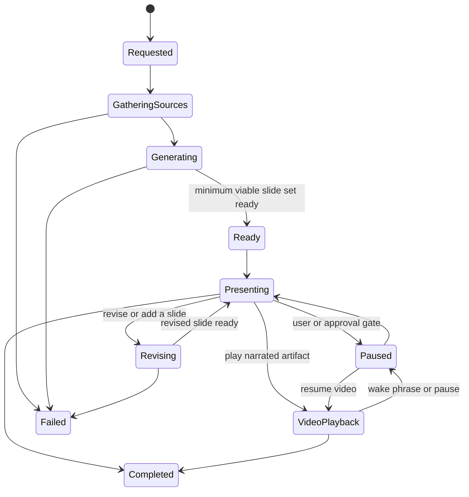

# Cooper presentation runtime and SDLC playbooks

## Status

Architecture proposal for the next Cooper capability layer. This document defines how a
live Realtime session can present generated HTML slides, play narrated video, and launch
repeatable software-development playbooks without ending the conversation.

## Product decision

Presentation is not a separate export screen. It is a live session mode.

Cooper remains the conversational orchestrator while background workers gather context,
create artifacts, validate them, and publish ready slides or video into the session canvas.
The user can keep talking while work runs, ask Cooper to advance or revise the narrative,
and interrupt a video to discuss the material.

The core interaction should feel like this:

```text
Michael: "Cooper, kick us off with the sprint recap."
Cooper:  "I am pulling the completed Notion work and merged GitHub changes now."
Canvas:  Generates the first two slides and begins presenting.
Cooper:  Speaks from source-linked presenter notes while the remaining slides finish.
Michael: "Pause. Open the authentication PR and explain the risk."
Cooper:  Pauses, loads the PR evidence, creates a focused slide, and discusses it.
```

## Outcomes

1. Start meetings with a concise, source-grounded presentation.
2. Turn live conversation into slides while the meeting continues.
3. Present requirements, solution proposals, PR reviews, QA reports, and sprint recaps.
4. Produce an async narrated video from the same validated source model.
5. Preserve a trace from source evidence to slide, narration, video scene, and decision.
6. Reuse the local AIRES skills as governed playbooks instead of copying their prompts.

## Non-goals

- Cooper should not improvise unsupported delivery claims, metrics, or QA results.
- The Realtime model should not render HTML, run QA, or produce video in the voice loop.
- Video audio should not be sent back through the microphone as new meeting speech.
- A presentation is not considered publishable until source, layout, and link checks pass.
- Write-backs to Notion, GitHub, Slack, or external systems still require policy checks.

## Existing foundation

The application already has important parts of this system:

- `present_aires_example` renders an AIRES example as an MCP App-style canvas artifact.
- `generate_aires_template_artifact` queues background generation from the live call.
- Artifact jobs persist progress and appear while Cooper continues speaking.
- The canvas can render sandboxed HTML and AIRES template examples.
- The Requirements Framework and Sentinel QA already create AIRES HTML artifacts.

The next step is to turn these individual operations into a versioned presentation runtime
with navigation, speaker notes, playback state, source anchors, and reusable playbooks.

## System architecture



### Ownership boundaries

| Layer | Owns | Must not own |
|---|---|---|
| Realtime model | Conversation, tool selection, concise narration, follow-up questions | Long-running rendering, browser automation, video encoding |
| Session orchestrator | Call state, wake gate, tool routing, approvals, event delivery | Artifact-specific business logic |
| Playbook runtime | Workflow state, budgets, retries, checkpoints, adapter invocation | Voice connection |
| Skill adapters | Requirements, QA, presentation, and video contracts | Session UI state |
| Presentation runtime | Slide order, stage, notes, playback, revisions, audience mode | Source collection and QA execution |
| Source ledger | Evidence identity, timestamps, hashes, anchors, uncertainty | Presentation styling |

## Artifact graph

Every playbook should write to the same graph rather than producing isolated files:

```text
Context bundle
  -> Source ledger
  -> Normalized brief
  -> Working documents
  -> Decisions and open questions
  -> Build or QA artifacts
  -> Presentation
  -> Narration and video
  -> Published package
```

An artifact can be presented before every downstream lane is complete. Its readiness must
be explicit: `draft`, `source_checked`, `layout_checked`, `presentation_ready`, or
`published`.

## Source bundle

The source bundle is the common input to every playbook:

```ts
type SourceBundle = {
  id: string;
  sessionId: string;
  projectId?: string;
  title: string;
  sources: SourceRef[];
  transcriptSlices: TranscriptSlice[];
  decisions: Decision[];
  openQuestions: OpenQuestion[];
  constraints: string[];
  requestedAudience?: string;
  freshnessCutoff: string;
};

type SourceRef = {
  id: string;
  kind: "notion" | "github" | "transcript" | "file" | "artifact" | "qa_run";
  label: string;
  url?: string;
  path?: string;
  externalId?: string;
  version?: string;
  capturedAt: string;
  contentHash?: string;
  confidence: number;
};
```

The source bundle must distinguish fact, inference, and assumption. A slide claim should
resolve to one or more `SourceRef` records through stable anchors.

## Presentation data model

```ts
type Presentation = {
  id: string;
  sessionId: string;
  projectId?: string;
  playbookId: string;
  title: string;
  audience: string;
  status: "queued" | "generating" | "ready" | "presenting" | "paused" | "completed" | "failed";
  slideIds: string[];
  currentSlideId?: string;
  sourceBundleId: string;
  version: number;
  validation: ValidationState;
  createdAt: string;
  updatedAt: string;
};

type Slide = {
  id: string;
  presentationId: string;
  order: number;
  label: string;
  title: string;
  htmlArtifactId: string;
  presenterNotes: string;
  narrationSegmentIds: string[];
  sourceAnchors: string[];
  status: "draft" | "ready" | "revising" | "failed";
};

type NarrationSegment = {
  id: string;
  slideId: string;
  script: string;
  captionText: string;
  targetDurationMs: number;
  sourceAnchors: string[];
  audioArtifactId?: string;
};

type PlaybackState = {
  presentationId: string;
  mode: "live" | "video";
  state: "idle" | "playing" | "paused" | "seeking" | "ended";
  currentSlideId?: string;
  currentTimeMs: number;
  mediaArtifactId?: string;
  interruptedByUser: boolean;
};
```

Persist these records server-side. Browser local storage may cache view state but must not
be the source of truth.

## Presentation state machine



`Ready` requires only the cover, framing, and first content slide. This lets Cooper begin
presenting while later slides continue to generate.

## Realtime tool surface

Expose a small presentation vocabulary to Cooper. Keep individual renderer and connector
details behind the server.

### Discovery and start

- `list_presentation_playbooks(query?, source_types?)`
- `start_presentation(playbook_id, goal, audience?, source_selection?, mode?)`
- `get_presentation_status(presentation_id)`

### Live control

- `present_artifact(artifact_id, narration_intent?)`
- `next_slide(presentation_id)`
- `previous_slide(presentation_id)`
- `go_to_slide(presentation_id, slide_id_or_number)`
- `pause_presentation(presentation_id)`
- `resume_presentation(presentation_id)`
- `finish_presentation(presentation_id)`

### Collaborative editing

- `generate_slide(presentation_id, instruction, after_slide_id?)`
- `request_slide_revision(presentation_id, slide_id, instruction)`
- `answer_from_sources(presentation_id, question)`
- `save_presentation_decision(presentation_id, decision, source_slide_id?)`

### Video

- `generate_presentation_video(presentation_id, style?, voice?)`
- `start_video_playback(media_artifact_id)`
- `pause_video_playback(media_artifact_id)`
- `seek_video_playback(media_artifact_id, time_ms)`
- `stop_video_playback(media_artifact_id)`

The model should receive compact tool results. Large HTML, code, screenshots, and source
documents stay behind artifact IDs and retrieval tools.

## Session events

The UI should subscribe to server events, preferably over the existing persistent event
transport rather than polling each job independently.

```text
presentation.requested
presentation.source_progress
presentation.generating
presentation.ready
presentation.started
slide.generating
slide.ready
slide.changed
slide.revision_requested
slide.revised
narration.started
narration.completed
video.generating
video.ready
video.started
video.timeupdate
video.paused
presentation.approval_required
presentation.completed
presentation.failed
```

Every event carries `sessionId`, `presentationId`, `sequence`, and `createdAt`. Clients use
`sequence` to reconnect without losing stage state.

## Live presentation UI

### Session capability

Add `Present` beside the existing call and build capabilities. It can be entered by UI or
voice. Cooper may also switch to it automatically after `start_presentation` succeeds.

### Presentation stage

- Full-width 16:9 stage for one HTML slide or visual artifact.
- Sandboxed iframe for generated HTML.
- Stable dimensions so generation and narration do not resize the session.
- Audience mode that hides editing chrome and expands the stage.
- Source indicator that opens the evidence drawer without covering the slide.

### Cooper rail

- Current spoken point, not the full hidden reasoning trace.
- Presenter notes and the next intended point.
- Work status such as "Pulling merged PRs" or "Rendering QA evidence."
- Approval requests and unresolved questions.
- Transcript and typed fallback at the bottom.

### Filmstrip and controls

- Slide filmstrip with ready, generating, revising, and failed states.
- Previous, next, pause, present, revise, add slide, and play video controls.
- Reorder only in edit mode.
- Current slide is keyboard and screen-reader observable.

### Source drawer

- Source ledger grouped by Notion, GitHub, transcript, files, artifacts, and QA.
- Freshness, version, and confidence markers.
- Click a claim to see its source anchors.
- Unverified assumptions are visually distinct from facts.

### Video player

- Captions and chapter markers derived from narration segments.
- Current slide and source anchors stay synchronized with playback time.
- Wake phrase or explicit pause interrupts playback and returns control to Cooper.
- Resuming restores the exact timecode.

## Video audio coordination

Do not make Cooper re-hear the video through the microphone. That creates acoustic echo,
duplicate transcripts, false wake events, and avoidable token cost.

Instead:

1. Load the canonical narration script, captions, source anchors, and timecodes into the
   presentation runtime before playback.
2. Mark the session `presentation_media_active`.
3. Suppress normal turn creation while video is playing.
4. Keep local wake detection or push-to-talk available for interruption.
5. On interruption, pause media first, then send the user's utterance and the current
   chapter/timecode to Cooper.
6. Let Cooper answer from the source model and presenter notes.
7. Resume only after explicit user intent.

The experience is that Michael and Cooper are watching together; technically Cooper
tracks the authoritative script and playback timeline.

## Skill adapter contract

Skills remain independently usable. The adapter makes their outputs available to the
playbook runtime without rewriting the skill instructions.

```ts
type SkillAdapter = {
  id: string;
  version: string;
  capabilities: string[];
  preflight(input: PlaybookInput): Promise<PreflightResult>;
  plan(input: PlaybookInput): Promise<ExecutionPlan>;
  runStep(step: ExecutionStep, context: RunContext): Promise<StepResult>;
  normalize(result: StepResult): Promise<ArtifactNode[]>;
  validate(nodes: ArtifactNode[], context: RunContext): Promise<ValidationResult>;
};
```

Adapters must report missing connectors, credentials, runtime URLs, templates, and source
gaps during preflight. They must never expose secret values.

### `notion-aries-artifacts` adapter

Use this exact skill for the `async-video-presentation` playbook and for polished reports,
presentations, product updates, sprint updates, issue reports, QBRs, and async meetings.

Contract mapping:

- `preflight` -> connector, auth, runtime URL, renderer, and publish-target checks.
- `sourceLedger` -> the presentation runtime's source bundle and stable anchors.
- `pages` -> ordered slide records.
- voiceover blocks -> narration segments and captions.
- Remotion output -> media artifact and playback chapters.
- manifest -> artifact graph versions, validation, and blocked lanes.
- publish targets -> Notion backlinks, Vercel URL, Slack/share packet.

### `aires-requirements-framework` adapter

Use for feature discovery, feature requests, solution proposals, and scope workshops.

The adapter preserves the skill's required pipeline:

```text
Capture -> Distill -> Scope -> Slice -> Verify
```

It emits:

- Scoped requirements Markdown and self-contained AIRES HTML.
- A presentation outline based on problem, scope, slices, and readiness.
- Explicit assumptions and missing facts for Cooper's interview questions.
- MoSCoW, INVEST slices, Given/When/Then criteria, and Definition of Ready.

### `aires-sentinel-qa` adapter

Use for ticket QA, PR QA, preview validation, regression reports, and release readouts.

It emits:

- Deterministic run metadata and evidence.
- Step results, screenshots, console/network observations, and findings.
- Verdict: `PASS`, `PASS WITH FINDINGS`, `FAIL`, or `BLOCKED`.
- Markdown and self-contained AIRES HTML reports.
- A presentation summary ordered by severity and decision impact.

The presentation must never imply a pass without the corresponding QA evidence.

### General SDLC video adapter

This adapter is a composition layer, not a replacement for the exact artifact skill.
It accepts any selected artifact graph, builds a concise slide sequence and narration, and
then invokes the same Aries HTML, voiceover, Remotion, validation, and manifest lanes.

Default sequence:

1. Why this work exists.
2. Source truth and current state.
3. The important decision or change.
4. Evidence, design, code, or QA proof.
5. Risks and unresolved questions.
6. What happens next and who owns it.

## SDLC playbook catalog

| Playbook | Primary inputs | Core outputs | Skill adapters | Default presentation |
|---|---|---|---|---|
| Meeting kickoff | Calendar, Notion, prior calls, open work | Agenda, context brief, decisions needed | Notion/Aries | 3-5 live slides |
| Context briefing | Selected pages, files, transcript, project | Source ledger, executive brief | Notion/Aries | Briefing deck |
| Feature request | Transcript, Notion ticket, customer evidence | Scoped requirements, slices, acceptance criteria | Requirements | Proposal deck |
| Product discovery | Research, interviews, thesis, JTBD | Thesis, JTBD, personas, service blueprint | Requirements + template suite | Workshop deck |
| Bug triage | Ticket, logs, repro, PR, transcript | Repro, impact, hypothesis, fix path, test plan | Sentinel + SDLC | Triage readout |
| Refactor proposal | Repo context, architecture, pain points | Current/target state, migration slices, risks | Requirements + SDLC | Architecture deck |
| PR review | PR metadata, diff, comments, tests, code | Change map, risks, test gaps, recommendation | GitHub context + Sentinel | Review deck |
| QA report | Ticket, acceptance criteria, preview, evidence | Verdict, findings, screenshots, next steps | Sentinel | Evidence readout |
| Release readiness | Requirements, PRs, CI, QA, rollout plan | Gate status, blockers, rollback and owners | Sentinel + Notion/Aries | Go/no-go deck |
| Sprint recap | Notion sprint, GitHub activity, calls, QA | Delivered, changed, blocked, learned, next | Notion/Aries + Sentinel | Live deck + video |
| Architecture decision | Context, options, constraints, repo | ADR, tradeoffs, selected option, migration | Requirements + SDLC | Decision deck |
| Async video presentation | Any validated artifact graph | HTML deck, voiceover, captions, MP4, manifest | Exact Notion/Aries | Narrated video |
| Stakeholder update | Artifacts, decisions, metrics, risks | Executive summary, asks, share packet | Notion/Aries | Short update deck |

## Detailed workflow paths

### Feature request

```text
Capture meeting and selected Notion/customer context
  -> Distill the job and desired outcome
  -> Ask only scope-changing interview questions
  -> Produce scoped requirements
  -> Split into vertical INVEST slices
  -> Add Given/When/Then acceptance criteria
  -> Present the proposed scope and explicit non-goals
  -> Approve, revise, or publish back to Notion
```

### Bug triage

```text
Load ticket, affected release, logs, repro notes, and related code
  -> Separate observed facts from hypotheses
  -> Reproduce with the safest available driver
  -> Capture evidence and impact
  -> Propose root cause and smallest safe fix
  -> Create regression criteria
  -> Present severity, evidence, fix path, and owner
```

### Refactor proposal

```text
Load current architecture and repeated delivery pain
  -> State the measurable reason to refactor
  -> Map current and target states
  -> Identify compatibility and migration boundaries
  -> Slice the migration so each step remains deployable
  -> Define verification and rollback
  -> Present tradeoffs and decision request
```

### Pull request review

```text
Connect PR and repository context
  -> Load metadata, files, commits, checks, comments, and requested code on demand
  -> Map change intent to requirements or ticket
  -> Identify behavioral risk, security risk, and missing tests
  -> Run selected QA when a target is available
  -> Present change map, findings, and recommendation
  -> Draft review comments only after approval
```

### QA report

```text
Load ticket acceptance criteria and target environment
  -> Normalize deterministic QA steps
  -> Run Puppeteer, Browser/Chrome, or Computer Use fallback
  -> Capture screenshot, assertion, console, and network evidence
  -> Apply visual judgment
  -> Generate Markdown and AIRES HTML report
  -> Present verdict and highest-impact findings first
  -> Write back to Notion only after policy approval
```

### Sprint recap

```text
Select Notion sprint and date range
  -> Load assigned, completed, blocked, and carried work
  -> Load merged PRs, releases, review activity, and CI/QA state from GitHub
  -> Link tickets to code and validation evidence
  -> Include meeting decisions and changed commitments
  -> Reconcile discrepancies and label unmatched records
  -> Build delivered / changed / blocked / learned / next narrative
  -> Present live or render the async recap video
  -> Publish canonical links and action owners
```

Sprint recap default slides:

1. Sprint thesis and intended outcome.
2. Commitments versus delivered work.
3. Product and customer impact.
4. Notable GitHub changes linked to Notion work.
5. QA and release confidence.
6. Blockers, carryover, and reasons.
7. Decisions and learning.
8. Next sprint focus and asks.

## Approval policy

| Action | Policy |
|---|---|
| Read selected Notion/GitHub/session context | Allowed after connector authorization |
| Generate local slides, reports, or video | Allowed |
| Present an existing artifact | Allowed |
| Add or revise a draft slide | Allowed |
| Publish to the work library | Confirm when it changes canonical state |
| Write back to Notion or GitHub | Explicit confirmation |
| Send Slack/email or customer communication | Explicit confirmation with preview |
| Merge, deploy, delete, or alter production | Separate explicit approval; existing safety policy applies |

## Project structure

Do not add another presentation subsystem to `src/main.jsx`. Extract the capability behind
clear ownership boundaries.

```text
src/presentation/
  PresentationStage.jsx
  PresentationShell.jsx
  PresenterRail.jsx
  SlideFilmstrip.jsx
  PresenterNotes.jsx
  SourceDrawer.jsx
  VideoPlayer.jsx
  ApprovalGate.jsx
  hooks/
    usePresentationEvents.js
    usePresentationPlayback.js
  presentation.css

server/presentations/
  playbookRegistry.js
  presentationOrchestrator.js
  presentationRepository.js
  sourceBundle.js
  slideCompiler.js
  narrationCompiler.js
  playbackCoordinator.js
  eventStream.js
  skillAdapters/
    notionAriesArtifacts.js
    airesRequirements.js
    airesSentinelQa.js
    sdlcVideo.js

server/playbooks/
  meeting-kickoff.json
  context-briefing.json
  feature-request.json
  product-discovery.json
  bug-triage.json
  refactor-proposal.json
  pr-review.json
  qa-report.json
  release-readiness.json
  sprint-recap.json
  architecture-decision.json
  async-video-presentation.json

shared/
  presentationSchema.js
  playbookSchema.js
  sourceLedgerSchema.js

test/presentation/
  playbookRegistry.test.js
  presentationOrchestrator.test.js
  presentationTools.test.js
  playbackCoordinator.test.js
  sourceTraceability.test.js
  sprintRecapPlaybook.test.js

docs/presentation-system/
  README.md
  runtime.md
  playbook-contract.md
  sdlc-catalog.md
  video-playback.md
  data-model.md
  security-and-approvals.md
  operating-runbook.md
```

## Playbook file contract

Playbooks should be data-driven and versioned:

```json
{
  "id": "sprint-recap",
  "version": 1,
  "label": "Sprint recap",
  "intentExamples": [
    "Kick off with the sprint recap",
    "Show us what shipped this sprint",
    "Create an async sprint update"
  ],
  "requiredSources": ["notion_sprint", "github_activity"],
  "optionalSources": ["meeting_memory", "qa_runs", "release_notes"],
  "adapters": ["notion-aries-artifacts", "aires-sentinel-qa"],
  "minimumReadySlides": 3,
  "outputs": ["presentation", "sprint_update", "async_meeting"],
  "approvalGates": ["publish_notion", "share_external"],
  "budgets": {
    "maxSteps": 12,
    "maxRetriesPerStep": 2,
    "maxRuntimeMinutes": 20
  }
}
```

## Implementation phases

### Phase 1: Present existing artifacts

- Add the presentation records and event contract.
- Wrap existing AIRES examples and generated HTML artifacts as single-slide presentations.
- Add stage, filmstrip, presenter notes, and voice navigation tools.
- Persist current slide and reconnect state.

Acceptance: Cooper can say "I put the scoped requirements on screen," present it, navigate,
and recover after a page refresh.

### Phase 2: Streaming slide generation

- Add playbook registry and source bundle.
- Generate the minimum ready slide set first.
- Stream subsequent slides and visible activity events.
- Add source drawer, revisions, and assumption markers.

Acceptance: Cooper begins a meeting kickoff while remaining slides are still running.

### Phase 3: Requirements and QA adapters

- Integrate the exact Requirements Framework contract.
- Integrate Sentinel QA reports and evidence.
- Add feature, bug, refactor, PR review, and QA playbooks.
- Add approval gates for external write-back.

Acceptance: a conversation can become scoped requirements, then a QA readout, with every
major slide claim traceable to a source or evidence artifact.

### Phase 4: Sprint recap

- Connect selected Notion sprint/database context.
- Connect GitHub PR, commit, review, checks, and release context.
- Reconcile ticket-to-code links and unmatched items.
- Add live deck and async recap outputs.

Acceptance: the recap accurately distinguishes planned, delivered, blocked, and unmatched
work and can open the source item behind any claim.

### Phase 5: Narrated video

- Use the exact Notion/Aries artifact pipeline for HTML, notes, voiceover, captions,
  Remotion, manifest, and publishing.
- Add synchronized playback, interruption, resume, and chapter-aware questions.
- Add the general SDLC video composition adapter.

Acceptance: Michael can play a generated recap, interrupt Cooper to ask about the current
chapter, then resume at the same timecode without duplicate transcription.

### Phase 6: Publishing and collaboration

- Notion version/write-back, private Vercel artifact URLs, and Slack share packets.
- Presenter handoff and audience mode.
- Human comments, approvals, and presentation version history.

## Verification contract

### Unit tests

- Playbook intent resolves to the correct playbook and adapters.
- Required sources and approval gates are enforced.
- Slide order and current-slide state survive reconnects.
- Source anchors resolve from slide claim to source record.
- Duplicate or out-of-order events do not corrupt playback state.
- Video wake interruption pauses before creating a Cooper response.
- Secrets never appear in events, manifests, or tool results.

### Integration tests

- Existing `present_aires_example` migrates to a presentation without regression.
- Background generation produces `slide.ready` events before the full deck completes.
- Requirements output includes all nine required sections.
- Sentinel output cannot surface `PASS` without supporting run evidence.
- Sprint recap reconciles Notion tickets and GitHub changes with unmatched records shown.
- Video playback follows canonical narration timecodes rather than microphone transcript.

### Browser QA

- Desktop stage, presenter rail, filmstrip, source drawer, and audience mode.
- Mobile collapses to stage first, then notes and controls without overlap.
- Generated HTML remains sandboxed and responsive.
- Keyboard navigation, focus order, labels, and reduced-motion behavior.
- Reconnect during generation, live presentation, paused video, and revision.
- Visual check against the AIRES rules: warm neutral canvas, soft black, sparse Volt,
  Urbanist/Inter/Instrument Serif/IBM Plex Mono, restrained radii, no gradients.

### Operational checks

- Worker runtime and retry budgets are visible.
- A failed slide does not terminate the call or discard ready slides.
- A blocked connector identifies only the affected lane.
- Published URLs are opened/read back before being marked ready.
- Every run leaves a manifest with outputs, validation, blocked lanes, and next action.

## Recommended defaults

- Begin live presentation when three useful slides are ready.
- Keep spoken slide narration under 75 seconds unless Michael asks for depth.
- Prefer one decision per slide.
- Generate presenter notes for Cooper and concise visible copy for the room.
- Source-link every material claim.
- Use the selected project and explicit context first, recent transcript second, broader
  memory only as supporting context.
- Keep all publish and external communication actions behind confirmation.
- Make Sprint recap the first multi-source flagship playbook.

## First implementation slice

Build the smallest vertical slice that proves the product:

1. Add presentation persistence and events.
2. Convert `present_aires_example` and one completed HTML artifact into presentations.
3. Add stage, two-slide filmstrip, presenter notes, next/previous, and audience mode.
4. Add `start_presentation`, `next_slide`, `go_to_slide`, and
   `request_slide_revision` tools.
5. Implement `meeting-kickoff` and `feature-request` playbooks.
6. Verify reconnect, source anchors, sandboxed rendering, and mobile layout.

This slice reuses what already works, proves the live presentation interaction, and creates
the contract required for Sprint recap and narrated video without prematurely coupling the
voice session to a specific renderer or connector.
