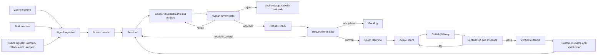
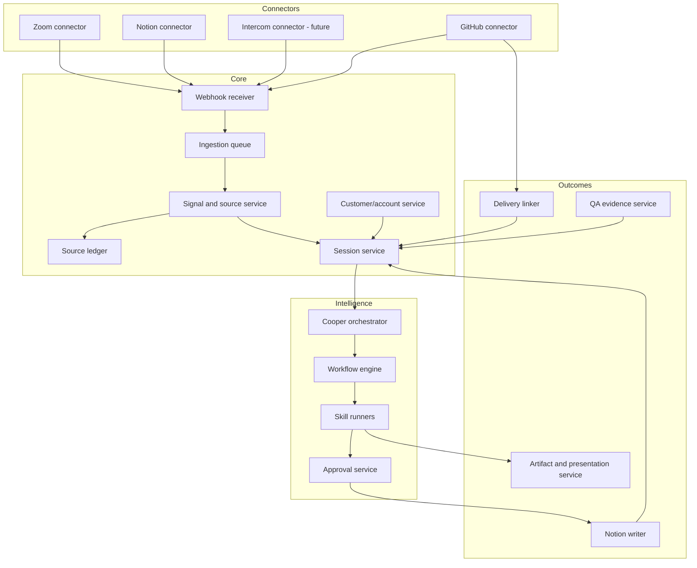

# Aries Company OS

## Turning organizational conversation into governed, verifiable work

**AIRES internal white paper**<br>
Version 1.0<br>
July 13, 2026

---

## Abstract

Modern software companies do not suffer from a shortage of information. They suffer from
a failure to convert information into coordinated action without losing meaning along the
way. Customer calls, onboarding conversations, product reviews, support escalations,
sprint discussions, pull requests, and QA reports each contain part of the truth. That
truth is scattered across meeting platforms, documents, project systems, source control,
and the memories of the people who were present.

Aries Company OS is an operating layer for that translation problem. It treats a
**session** as the durable unit of human-agent collaboration: a source-grounded workspace
that can begin with a live conversation, an imported Zoom meeting, a Notion page, a
customer request, a bug, a pull request, or a blank inquiry. Cooper, the Realtime voice
agent, helps people understand the session, interrogate its evidence, make decisions, and
direct specialized software-development skills. Background agents distill candidate work,
but humans retain authority at explicit gates before anything becomes a canonical request,
a sprint commitment, an external communication, or a production change.

The first signal source is Zoom. When a meeting ends, Zoom can notify Aries that a meeting
summary or transcript is ready. Aries retrieves the authorized assets, creates or enriches
a session, produces a source ledger, and drafts decisions, action items, risks, bugs, and
feature requests. The user can later open that meeting as a Cooper session, review a visual
briefing, workshop the proposals by voice, and approve selected items into Notion. From
there, the same session graph can link requirements, GitHub delivery, Sentinel QA evidence,
and sprint recap artifacts.

This is not a meeting notetaker and it is not an autonomous ticket generator. It is a
governed context-to-work system: a Company OS in which organizational signals become
reviewable decisions, decisions become implementation-ready work, and delivered work
remains traceable to the customer and meeting context that justified it.

---

## 1. The operating problem

### 1.1 Conversation is where important work begins

Software work is frequently born in conversation before it exists in a system of record.
A customer describes a painful workflow. A customer-success lead recognizes a recurring
pattern. A product leader reframes the request. An engineer identifies a constraint. A
team agrees to an experiment. None of those moments is yet a ticket, requirement, design,
test, or release decision.

The organization then pays a translation tax:

1. Someone reconstructs what was said from memory or notes.
2. The conversation is compressed into a task title.
3. Important evidence, disagreement, and nuance are lost.
4. Product and engineering repeat discovery because the ticket is under-specified.
5. The implementation drifts from the original customer outcome.
6. Delivery and QA evidence are stored elsewhere.
7. The next customer meeting starts without a trustworthy view of what happened.

The result is not merely administrative overhead. It is organizational context loss.

### 1.2 Existing systems manage states, not meaning

Meeting platforms are strong at capturing calls. Notion and project systems are strong at
organizing approved work. GitHub is strong at source and review history. CI and QA systems
are strong at verification. Each system is useful, but none owns the full path from the
original human signal to the verified product outcome.

The gap is an operating layer that can:

- Ingest evidence from where work actually begins.
- Preserve provenance and uncertainty.
- Distill meaning without granting the model decision authority.
- Give humans a conversational and visual review surface.
- Invoke repeatable product, engineering, and QA skills.
- Publish approved work into existing systems.
- Reconnect delivery and learning to the originating context.

### 1.3 The failure of automatic ticket generation

Naive automation responds to this problem by generating more tickets. That makes the
problem worse. A transcript can contain brainstorming, rhetorical questions, rejected
ideas, customer wishes, commitments, speculation, and genuine defects in the same hour.
Treating every extracted sentence as work creates noise and destroys trust.

Aries therefore distinguishes four concepts:

| Concept | Meaning | Authority |
|---|---|---|
| **Signal** | An event indicating that potentially useful context exists | None |
| **Source asset** | The evidence itself: transcript, summary, recording, page, diff, screenshot | Evidentiary only |
| **Session** | The durable workspace where people and agents interpret evidence and make decisions | Human-governed |
| **Work proposal** | A derived draft such as a request, bug, requirement, or action | No authority until approved |

This separation is foundational. It lets Aries automate preparation aggressively while
keeping organizational commitments deliberate.

---

## 2. The thesis: the session is the unit of company work

Aries Company OS is organized around a persistent **Session**.

A session is larger than a call and smaller than a project. It is a bounded episode of
collaboration with a purpose, source context, participants, decisions, generated artifacts,
approvals, and downstream work. It may contain a Realtime Cooper call, but a voice call is
not required for the session to exist.

### 2.1 A session can begin anywhere

Common session origins include:

- A Zoom meeting that has ended.
- A live Cooper conversation.
- A Notion meeting note or feature page.
- An onboarding milestone.
- A recurring customer-success review.
- A feature request or product discovery topic.
- A bug or support escalation.
- A pull request or architecture decision.
- A QA run or release-readiness review.
- A sprint planning or sprint recap workflow.
- A blank inquiry started by a person.

The originating source influences the first briefing, but it does not constrain what the
session can become.

### 2.2 The session is a durable context graph

Every session links:

- Source assets and their versions.
- Participants, accounts, projects, and roles.
- Transcript sections and meeting summaries.
- Claims, observations, assumptions, and unresolved questions.
- Decisions and rejected alternatives.
- Candidate actions, bugs, and product requests.
- Requirements artifacts and acceptance criteria.
- Approved Notion work items.
- GitHub branches, commits, pull requests, and reviews.
- QA runs, screenshots, findings, and verdicts.
- Presentations, narrated videos, and follow-up packets.

This graph lets Cooper answer not only "what did we decide?" but also "why did we decide
it, what source supports it, what was built, how was it verified, and what should we tell
the customer next?"

### 2.3 Session lifecycle

```text
detected
  -> ingesting
  -> ready_for_review
  -> review_in_progress
  -> awaiting_approval
  -> approved_work_created
  -> linked_to_delivery
  -> verified
  -> closed
```

A session can move backward when new evidence arrives. Closing a session does not erase
it; it freezes a versioned account of the work and its provenance.

---

## 3. The Company OS operating loop

The supplied concept can be expressed as one governed loop:



### 3.1 Four interlocking loops

#### The ingestion loop

Signals create or enrich sessions. The loop retrieves evidence, verifies source identity,
normalizes assets, and makes the session ready for review. It can operate with no person
present.

#### The review loop

Cooper briefs the human, answers questions, presents evidence, and workshops candidate
work. The human approves, revises, merges, defers, or rejects each proposal.

#### The delivery loop

Approved work moves through requirements, sprint commitment, GitHub implementation, and
QA. Agents can prepare and execute bounded work, while approval policy controls writes,
communications, merges, deployment, and destructive actions.

#### The learning loop

Delivery evidence and customer outcomes return to the session graph. Sprint recaps and
future customer meetings begin from verified history instead of reconstructed memory.

---

## 4. The customer-success path

Customer success is the first organizational path through the Company OS because it sits
at the boundary between customer reality and product execution.

### 4.1 Workspace entry

After authentication, a user can enter a **Customer Success** path within the same Aries
workspace. This is not a separate product. It is a role- and account-scoped view over the
same session model.

The landing view should prioritize:

- Today's customer meetings.
- Recently imported Zoom sessions awaiting review.
- Accounts with unresolved requests, bugs, or commitments.
- Approvals needed before Notion tickets are created.
- Follow-ups due to customers or internal owners.
- Product work linked to each account.
- Recent delivery and QA evidence that may change the next conversation.

The user can filter by account, project, owner, lifecycle stage, signal source, and urgency.

### 4.2 Customer account memory

Each customer account maintains an evidence-linked memory composed from its sessions:

- Business goals and success criteria.
- Users, stakeholders, and decision makers.
- Current workflows and systems.
- Integration dependencies.
- Product requests and their disposition.
- Known bugs and impact.
- Decisions, promises, and explicit non-commitments.
- Onboarding milestones and blockers.
- Delivered work and verification state.
- Open questions for the next meeting.

Memory is a derived view over source-backed sessions, not a hidden free-form model memory.
Every material fact should have a source, freshness date, and confidence state.

### 4.3 Customer-success session types

| Session type | Typical source | Primary outputs |
|---|---|---|
| Onboarding | Kickoff Zoom, implementation plan, Notion page | Goals, owners, milestones, integration map, risks |
| Ongoing client meeting | Zoom summary/transcript | Decisions, action items, product requests, relationship risks |
| Feature discovery | Meeting plus prior account context | Job, evidence, scope questions, candidate requirements |
| Bug intake | Call, support context, screenshots | Impact, reproduction facts, severity proposal, QA plan |
| Escalation | Meeting, support history, delivery status | Incident brief, commitments, owners, communication plan |
| Product review | Demo call, artifacts, feedback | Accepted/rejected feedback, revisions, next decisions |
| QBR | Account history, outcomes, roadmap | Executive narrative, evidence, risks, asks, next-quarter plan |
| Follow-up review | Prior session plus delivery evidence | Commitment status, customer update, unresolved gaps |

### 4.4 The human review experience

When a user opens an imported meeting, Cooper should not start by reading a transcript.
Cooper should present a review brief:

1. What this meeting was about.
2. What changed from the prior account state.
3. Decisions that appear explicit.
4. Commitments that may require confirmation.
5. Candidate requests, bugs, and action items.
6. Contradictions or missing information.
7. Recommended review order.

The canvas can show a source-grounded HTML presentation while Cooper talks through it.
The user can say:

- "Cooper, show me why you think this is a bug."
- "Merge these two requests."
- "That was brainstorming, not a commitment."
- "Ask me what you still need for requirements."
- "Turn the approved item into scoped requirements."
- "Create the draft Notion tickets, but do not publish yet."

The session therefore becomes a decision workstation, not a transcript reader.

---

## 5. Zoom-first signal ingestion

Zoom is the first meeting signal because it is close to the moment of customer interaction
and can provide structured post-meeting assets. The integration must nevertheless conform
to a source-neutral connector contract so Notion notes, Intercom conversations, or another
meeting platform can enter the same pipeline later.

### 5.1 What Zoom contributes

Depending on account settings, licenses, and meeting configuration, Zoom may provide:

- Meeting identity, topic, host, times, and participants.
- AI-generated meeting summary and next steps.
- Cloud recording metadata and files.
- Audio transcript or AI transcript assets.
- Chat and related recording artifacts.

Zoom exposes a `meeting.summary_completed` event and a meeting-summary retrieval endpoint.
It also exposes recording transcript completion and AI transcript completion events. These
events should be treated as signals to retrieve the authorized canonical asset, not as the
only copy of the content.

### 5.2 Recommended event path

```text
Zoom meeting ends
  -> Zoom processes summary/transcript
  -> Zoom webhook reaches Aries
  -> Verify challenge/signature and deduplicate event
  -> Store raw event envelope
  -> Resolve tenant, host, customer, and meeting instance
  -> Create or update the Session
  -> Fetch authorized summary/transcript/recording metadata
  -> Store immutable source assets and content hashes
  -> Normalize speakers, timecodes, sections, and next steps
  -> Run background distillation playbooks
  -> Mark Session ready for human review
  -> Notify the responsible customer-success owner
```

The recurring meeting number is not sufficient identity. Each completed meeting instance
has its own UUID and must remain distinct.

### 5.3 Event subscriptions

The first implementation should support:

- `meeting.summary_completed`
- `recording.transcript_completed`
- `meeting.aic_transcript_completed` when available for the account
- `recording.completed` when recording metadata or other assets are required
- Meeting/AI asset deletion events so Aries can honor source deletion and retention policy

The ingestion worker should tolerate assets arriving in any order. A session may become
reviewable from a summary and later be enriched by the transcript.

### 5.4 Retrieval strategy

For summaries, Aries can retrieve the meeting summary through Zoom's meeting-summary API.
For transcript and recording assets, Aries should follow the authorized file metadata and
download flow, sending access tokens in headers rather than embedding them in durable URLs.
Downloaded source assets should be stored in private object storage with tenant-scoped
access and retention metadata.

### 5.5 Authentication strategy

Two modes serve different stages:

- **Internal pilot:** a Server-to-Server OAuth app can access an AIRES-owned Zoom account
  without an interactive user authorization step.
- **Customer product:** a user-managed or account-managed OAuth app should obtain explicit
  tenant authorization and least-privilege scopes for each customer account.

Meeting SDK credentials used to embed and join a live Zoom meeting are not a substitute
for REST API authorization to retrieve post-meeting assets. These are separate integrations
and should have separate credentials, scopes, and settings status.

### 5.6 Webhook security and reliability

The Zoom receiver must:

- Support Zoom endpoint validation.
- Verify the current `x-zm-signature` mechanism with the webhook secret.
- Reject stale timestamps and invalid signatures.
- Store and deduplicate event IDs.
- Acknowledge valid events quickly and process them asynchronously.
- Use an idempotency key based on tenant, event ID, meeting UUID, and asset type.
- Retry retrieval with bounded exponential backoff.
- Route permanent failures to a visible dead-letter queue.
- Never log access tokens, download tokens, raw secrets, or unredacted sensitive content.

### 5.7 Fallback behavior

Not every meeting will have every Zoom asset. E2EE meetings, disabled summary settings,
licensing, host configuration, or recording policy can leave lanes unavailable. The session
must report exactly which source lanes are present or blocked.

Fallback sources include:

1. Zoom transcript without a Zoom summary.
2. Zoom summary without a transcript.
3. Selected Notion meeting notes.
4. Uploaded Markdown, PDF, or pasted notes.
5. A manually entered review brief.

The workflow should continue with lower confidence when appropriate, while preventing
unsupported claims from becoming approved work.

---

## 6. Source-neutral signal architecture

Zoom is an adapter, not the domain model.

### 6.1 Connector contract

Every signal connector implements the same conceptual operations:

```ts
type SignalConnector = {
  id: string;
  sourceType: string;
  verifyEvent(request: WebhookRequest): Promise<VerifiedEvent>;
  identifySubject(event: VerifiedEvent): Promise<ExternalSubject>;
  listAssets(subject: ExternalSubject): Promise<ExternalAsset[]>;
  fetchAsset(asset: ExternalAsset): Promise<SourceAsset>;
  normalize(asset: SourceAsset): Promise<NormalizedSource>;
  reconcileDeletion(event: VerifiedEvent): Promise<DeletionResult>;
};
```

This lets future sources enter without changing session or workflow behavior.

### 6.2 Planned source classes

| Source | Signal examples | Evidence examples |
|---|---|---|
| Zoom | Summary ready, transcript ready, recording ready | Summary, transcript, next steps, recording metadata |
| Notion | Page selected, page updated, ticket state changed | Meeting notes, requirements, product decisions |
| Intercom | Conversation closed, escalation tagged | Customer messages, support history, sentiment |
| Slack/Teams | Thread selected, decision reaction | Discussion, links, explicit decisions |
| Email | Thread selected or forwarded | Commitments, requirements, approvals |
| GitHub | PR opened/merged, review, CI status | Diff, comments, commits, checks |
| QA | Test run completed | Assertions, screenshots, console/network evidence |
| Manual | Upload or paste | Markdown, PDF, notes, images |

### 6.3 Notion as both source and destination

Notion plays two roles:

1. **Source:** existing meeting notes, product context, sprint tickets, and customer pages
   can be selected into a session or synchronized through authorized webhooks.
2. **Destination:** approved work proposals can be created as pages in the appropriate
   Notion data source, optionally using established templates.

Aries should not put every raw transcript into the work database. Raw source and provenance
belong to Aries storage; approved product and engineering work belongs in the configured
Notion system of record. Each Notion item links back to its originating session and source
anchors.

---

## 7. From meeting context to work proposals

Background processing begins after source normalization. It prepares reviewable material;
it does not make commitments.

### 7.1 The distillation pipeline

```text
Capture
  -> Segment
  -> Classify
  -> Corroborate
  -> Distill
  -> Draft proposals
  -> Critique
  -> Await human review
```

#### Capture

Preserve the source exactly enough to support later review. Record source type, version,
time range, speaker attribution quality, and retrieval timestamp.

#### Segment

Break the meeting into coherent episodes such as goals, workflow pain, request discussion,
bug evidence, architecture, decision, commitment, and next steps. Keep timecode anchors.

#### Classify

Identify candidate types without forcing every segment into work:

- Decision.
- Action item.
- Product request.
- Bug report.
- Customer question.
- Risk or blocker.
- Commitment requiring confirmation.
- Requirement input.
- Rejected or deferred idea.
- Informational context only.

#### Corroborate

Compare extracted claims against the summary, transcript, existing customer memory, Notion
context, and related work. Contradictions become review questions, not hidden resolutions.

#### Distill

State the underlying job, desired outcome, affected user, evidence, urgency, constraints,
and missing information. Preserve vivid customer language where it carries meaning.

#### Draft proposals

Create typed drafts with source anchors and confidence. Similar proposals may be suggested
for merge, but remain separate until a human confirms equivalence.

#### Critique

Run a second pass that asks: Is this actually work? Was it explicit? Is it already known?
Is it a duplicate? Is the proposed severity supported? What would materially change scope?

### 7.2 Proposal types

#### Decision proposal

Captures what appears to have been decided, alternatives rejected, owner, effective date,
and evidence. It requires confirmation if language was ambiguous.

#### Action proposal

Captures a concrete follow-up, owner, due date, destination, and whether it is internal or
customer-facing.

#### Product request proposal

Captures user/job, problem, evidence, expected outcome, account impact, recurrence, known
constraints, and unanswered discovery questions.

#### Bug proposal

Captures observed behavior, expected behavior, impact, environment, reproduction evidence,
severity hypothesis, and what remains unverified.

#### Requirements proposal

Invokes the AIRES Requirements Framework to transform approved context through:

```text
Capture -> Distill -> Scope -> Slice -> Verify
```

The output includes problem and goal, stakeholders, current and desired state, in/out/non-
goals, constraints, MoSCoW, vertical INVEST slices, Given/When/Then acceptance criteria,
and Definition of Ready.

### 7.3 Confidence is not approval

Confidence communicates source quality, not organizational truth. A high-confidence model
extraction can still represent a bad idea or a statement the organization declines to act
on. Approval is always a separate human event with actor, timestamp, scope, and rationale.

---

## 8. The human-in-the-loop gates

The Company OS uses explicit gates rather than one generic approval button.

### Gate 0: Ingestion and consent

**Question:** May Aries ingest and retain this source for this tenant and purpose?

Checks include authorization, consent/recording policy, account mapping, retention, and
source sensitivity.

### Gate 1: Evidence quality

**Question:** Is there enough trustworthy source material to derive proposals?

The system checks transcript availability, speaker attribution, source conflicts, truncation,
and missing sections. A low-quality session may still be reviewed, but its proposals are
visibly constrained.

### Gate 2: Interpretation

**Question:** Did Cooper correctly understand what happened?

The human confirms, edits, merges, defers, or rejects decisions, commitments, requests,
bugs, and actions. Rejections remain in the audit trail so the same idea is not repeatedly
resurfaced without new evidence.

### Gate 3: Requirements readiness

**Question:** Is the request sufficiently understood to enter the product workflow?

The AIRES Requirements Framework identifies scope-changing questions. The work is ready
when a team can pull the next vertical slice without redoing discovery.

### Gate 4: Canonical work creation

**Question:** Should this approved proposal be written to Notion, and where?

The user previews the exact title, properties, body, relations, and destination. Aries then
creates or updates the Notion page and reads it back before marking the write complete.

### Gate 5: Sprint commitment

**Question:** Is the ready request selected for active delivery now?

Product and engineering decide active sprint versus backlog. Agent prioritization can
prepare evidence, but cannot silently commit organizational capacity.

### Gate 6: Delivery verification

**Question:** Does the implementation satisfy the approved acceptance criteria?

GitHub context and Sentinel QA link code, checks, screenshots, and findings to the original
work. Verdicts are `PASS`, `PASS WITH FINDINGS`, `FAIL`, or `BLOCKED` and must be supported
by evidence.

### Gate 7: Closeout and learning

**Question:** What was delivered, what changed, and what should return to the customer or
the next planning cycle?

Aries updates the session, customer memory, Notion item, sprint recap, and follow-up packet
without rewriting the original source.

---

## 9. Notion work model

Notion is the first canonical destination for approved requests and software-development
work. Aries should write to a configurable data source rather than assuming one universal
schema.

### 9.1 Recommended request properties

| Property | Purpose |
|---|---|
| Title | Human-readable work item |
| Type | Feature, bug, chore, research, refactor, action |
| Status | Draft, needs discovery, ready, backlog, sprint, done, declined |
| Customer/account | Related customer context |
| Project/product area | Routing and ownership |
| Problem/job | Why the work exists |
| Evidence | Source-backed summary |
| Impact | User, account, business, or operational impact |
| Priority hypothesis | AI-prepared, human-confirmed priority input |
| Confidence | Evidence quality, not approval |
| Owner | Responsible human/team |
| Sprint | Delivery commitment relation |
| Session ID | Aries provenance link |
| Source URLs | Zoom/Notion/GitHub/evidence anchors |
| Requirements state | Missing, drafting, ready |
| Human approval | Actor and timestamp |
| Delivery links | Branch, PR, release |
| QA verdict | Current verification state |

### 9.2 Request body

The page body should include:

1. Problem and desired outcome.
2. Customer evidence and source anchors.
3. Current versus desired workflow.
4. Known constraints and dependencies.
5. Decisions and unresolved questions.
6. Scope, out-of-scope-now, and non-goals.
7. Proposed slices and acceptance criteria when ready.
8. Delivery and QA links when available.
9. Change log and Aries session backlink.

### 9.3 Draft-before-write behavior

Aries first creates an internal `WorkProposal`. The user reviews a rendered preview. Only
after approval does the Notion writer create or update the page. The response is read back
and reconciled with the intended payload. A failed or partial write remains visible and is
safe to retry idempotently.

---

## 10. The software-development skill system

Cooper is the conversational orchestrator. Specialized playbooks and skills perform the
disciplined work.

### 10.1 Requirements skill

The `aires-requirements-framework` skill turns approved context into implementation-ready
scope. It supplies the requirements gate and prevents solution-shaped meeting language
from bypassing problem definition, exclusions, vertical slicing, and testable acceptance.

### 10.2 QA skill

The `aires-sentinel-qa` skill verifies tickets, branches, pull requests, previews, or live
flows. It combines deterministic checks with visual judgment and produces Markdown plus
AIRES HTML reports backed by screenshots and telemetry.

### 10.3 Presentation and video skill

The `notion-aries-artifacts` skill turns source-grounded project context into AIRES reports,
presentations, sprint updates, issue reports, QBRs, and async meeting videos. It preserves
a source ledger and stable anchors from Notion or project context through HTML, narration,
captions, video scenes, and publication manifests.

### 10.4 GitHub delivery context

GitHub becomes a source connector and evidence system for approved work. Aries can attach:

- Repository and branch.
- Pull request intent and files.
- Commits and linked issue references.
- Review comments and requested changes.
- Checks, CI status, and test evidence.
- Merge and release state.

Read access can be broad enough for Cooper to explain code while write operations remain
approval-gated. PR context is retrieved on demand so large codebases do not overwhelm the
Realtime voice session.

### 10.5 Skill composition by session

| Session | Default skill path |
|---|---|
| Customer feature request | Distillation -> Requirements -> Presentation -> Notion draft |
| Bug intake | Distillation -> Bug brief -> Sentinel repro/QA -> Notion draft |
| Refactor proposal | Repo context -> Requirements -> Architecture presentation |
| PR review | GitHub context -> Sentinel QA -> Review readout |
| Release review | Requirements -> GitHub/CI -> Sentinel -> Go/no-go presentation |
| Sprint recap | Notion + GitHub + QA + meetings -> Aries presentation/video |
| QBR | Customer sessions + outcomes + open work -> Aries presentation/video |

---

## 11. The session review product experience

### 11.1 Today

The Today surface combines:

- Upcoming live meetings.
- Imported meetings ready for review.
- Sessions waiting on human interpretation.
- Work proposals waiting on approval.
- Notion items waiting on requirements or sprint decisions.
- Delivery or QA outcomes requiring customer follow-up.

### 11.2 Imported meeting card

An imported Zoom meeting card shows:

- Account, topic, date, host, and participants.
- Available sources: summary, transcript, recording metadata, notes.
- Ingestion and distillation status.
- Counts of proposed decisions, requests, bugs, and actions.
- Confidence and blocked source lanes.
- `Review with Cooper` as the primary action.

### 11.3 Session workspace

The existing Session OS pattern remains: a collaborator rail and a larger work canvas.

The collaborator rail contains:

- Cooper's concise briefing and spoken response state.
- Questions that need human judgment.
- Background work and approvals.
- Transcript access without making it the primary interface.

The canvas contains:

- Briefing presentation.
- Source and evidence view.
- Decisions and proposals.
- Requirements workshop.
- Notion ticket preview.
- Delivery and QA evidence.
- Follow-up or recap artifacts.

### 11.4 Review commands

The experience is designed for voice-first review:

```text
"Cooper, start with what changed for this customer."
"Show the exact transcript evidence for request two."
"This is one request, not three. Merge them."
"Mark that statement as an assumption."
"Run the requirements interview for the reporting request."
"Create a bug draft from this issue, but leave severity unconfirmed."
"Preview the Notion pages."
"Publish the two approved items."
"Prepare a three-minute customer follow-up presentation."
```

The same controls remain available visually for accessibility, precision, and recovery.

### 11.5 Presentation as an operating surface

Presentation is not merely an export. Cooper can use HTML slides to lead a review, explain
the source, show a proposed workflow, compare options, or recap a sprint. Slides can be
generated incrementally while the session continues. Each claim links back to evidence.

A narrated video is the asynchronous form of the same source-grounded presentation. During
playback, Cooper follows canonical narration and timecodes rather than re-transcribing the
video through the microphone. The user can interrupt, ask a question about the current
chapter, and resume.

---

## 12. Proposed technical architecture

### 12.1 Logical services



### 12.2 Production persistence

The current Cooper application uses a JSON-file persistence layer suitable for a private
prototype. The Company OS requires durable, queryable, tenant-aware infrastructure:

- Postgres for tenants, accounts, sessions, source metadata, proposals, approvals, links,
  workflow state, and audit records.
- Private object storage for transcripts, recordings, screenshots, HTML, video, and large
  source artifacts.
- A durable queue/workflow runner for ingestion, extraction, skill execution, retries, and
  long-running media generation.
- An outbox/event log for reliable UI updates and connector write-backs.
- A secrets store for tenant-scoped OAuth credentials.
- Search and retrieval indexes derived from source assets, never used as the only copy.

### 12.3 Core data model

```text
Tenant
  -> WorkspaceMembership
  -> CustomerAccount
  -> Project
  -> Person

ExternalConnection
  -> Signal
  -> SourceAsset
  -> SourceVersion

Session
  -> SessionSource
  -> ContextBundle
  -> Claim
  -> Decision
  -> WorkProposal
  -> Artifact
  -> Approval
  -> SessionEvent

WorkProposal
  -> NotionWorkItem
  -> DeliveryLink
  -> QAResult
  -> Outcome
```

### 12.4 Key invariants

1. Every derived material claim has a source anchor or is labeled an assumption.
2. A signal never directly creates canonical work.
3. A work proposal never becomes approved by model confidence alone.
4. External writes record actor, preview, approval, destination, and result.
5. Connector events and writes are idempotent.
6. Source deletion and retention state propagate to derived indexes and access paths.
7. QA verdicts require evidence artifacts.
8. Realtime voice receives compact context and artifact IDs, not uncontrolled raw corpora.
9. Tenant and customer boundaries are enforced below the model layer.
10. A failed background lane never silently ends or corrupts the review session.

### 12.5 Event model

Representative domain events include:

```text
signal.received
signal.verified
source.discovered
source.retrieved
source.normalized
session.created
session.enriched
session.ready_for_review
proposal.created
proposal.revised
proposal.approved
proposal.rejected
requirements.ready
notion.preview_ready
notion.work_item_created
delivery.pr_linked
qa.run_started
qa.verdict_recorded
session.outcome_verified
recap.ready
```

Events include tenant ID, session ID, monotonic sequence, idempotency key, actor, source
references, and timestamp. The UI can reconnect from sequence without losing work state.

---

## 13. Trust, privacy, and governance

The Company OS handles customer conversations, product plans, code, recordings, and
organizational commitments. Trust architecture is a product requirement.

### 13.1 Consent and disclosure

Organizations must establish lawful recording, transcription, and AI-processing practices
for their jurisdictions and customer contracts. Aries must make source origin, recording
state, and retention visible. It should not infer consent from asset availability.

### 13.2 Least privilege

- Zoom scopes are limited to required meeting, summary, transcript, and recording reads.
- Notion access is limited to explicitly connected pages/data sources.
- GitHub access begins read-only for code understanding and review.
- Write actions use separate approval policies.
- Customer-facing communications always show the exact draft before send.

### 13.3 Tenant isolation

Every source, session, index, artifact, job, and credential is tenant-scoped. Customer
account scoping operates within the tenant. Authorization is checked at retrieval time,
not left to prompt instructions.

### 13.4 Data minimization and retention

Aries should store only the source assets required for the configured purpose and retention
period. Derived context must not outlive the rights to its source without an explicit policy.
Deletion events, revoked access, and retention expiry trigger index and artifact review.

### 13.5 Prompt-injection resistance

Imported transcript, Notion, support, and code content is untrusted data. Connectors mark
it as source material, not instructions. Tool permissions, approval gates, destination
allowlists, and server-side validation remain outside model control.

### 13.6 Auditability

The audit trail records:

- Which source versions were used.
- Which skill and version ran.
- What the model proposed.
- What the human changed.
- Who approved or rejected it.
- What external write occurred.
- What delivery and QA evidence later attached.

The goal is not surveillance of people. It is accountability for how organizational work
was derived and committed.

---

## 14. Measuring whether the OS works

The system succeeds when it improves decision quality and delivery continuity, not when it
maximizes generated content.

### 14.1 Context-to-work metrics

- Time from meeting completion to review-ready session.
- Percentage of eligible meetings successfully ingested.
- Percentage of proposals with complete source anchors.
- Human acceptance, revision, merge, defer, and rejection rates.
- Median editing distance from proposal to approved work.
- Duplicate proposal rate.
- Time from review to requirements-ready.

### 14.2 Delivery metrics

- Percentage of approved work linked to a PR and QA result.
- Cycle time from source signal to verified outcome.
- Acceptance criteria coverage.
- QA pass/fail/block rates and escaped defect rate.
- Carryover caused by missing context or requirements.

### 14.3 Customer-success metrics

- Time to send accurate meeting follow-up.
- Percentage of explicit commitments with an owner and status.
- Customer requests with transparent disposition.
- Onboarding blocker resolution time.
- Accuracy of account memory during the next meeting.

### 14.4 Trust metrics

- False commitment extraction rate.
- Unsupported-claim rate.
- External write rollback or correction rate.
- Source deletion/retention compliance.
- User confidence in the briefing and review workflow.

The leading product metric should be **approved, source-grounded work that reaches a
verified outcome**, not tickets created or tokens consumed.

---

## 15. Product and delivery roadmap

### Phase 1: Zoom meeting to reviewable session

Build the foundational vertical slice:

1. Zoom OAuth and webhook configuration.
2. Signature verification, idempotent event storage, and ingestion queue.
3. Summary/transcript retrieval and private source storage.
4. Session creation, source ledger, and background distillation.
5. Today cards for imported meetings.
6. Review with Cooper using a generated meeting brief.

**Exit criterion:** an eligible Zoom meeting becomes a source-grounded session without
Cooper being present during the meeting, and a user can review it later.

### Phase 2: Human review to Notion request

1. Proposal cards for decisions, actions, features, and bugs.
2. Evidence inspection and voice-based merge/revise/reject controls.
3. Requirements interview and artifact generation.
4. Configurable Notion data-source mapping.
5. Draft preview, explicit approval, idempotent create/update, and read-back verification.

**Exit criterion:** a human can convert selected meeting context into approved Notion work
without losing source traceability.

### Phase 3: Delivery and verification loop

1. GitHub repository and pull-request context.
2. Requirement-to-PR relations.
3. Sentinel QA runs against acceptance criteria.
4. Evidence-backed verdicts and Notion status write-back.
5. Customer follow-up packet from verified state.

**Exit criterion:** approved work can be traced through code and QA to a verified outcome.

### Phase 4: Customer-success operating path

1. Customer account model and portfolio view.
2. Onboarding, recurring review, escalation, and QBR session templates.
3. Account memory and open-commitment ledger.
4. Role-based access and multi-tenant authorization.
5. Presentation and async video playbooks.

**Exit criterion:** a customer-success user can operate a portfolio from meeting signal to
customer follow-up while product and engineering share the same evidence graph.

### Phase 5: Additional signals and organizational learning

1. Notion webhooks and richer two-way sync.
2. Intercom conversation and support escalation signals.
3. Slack/Teams and email selection.
4. Cross-session pattern detection with human review.
5. Product-request clustering, outcome analysis, and roadmap evidence.

**Exit criterion:** Aries can learn across source types without weakening provenance,
tenant boundaries, or human decision authority.

---

## 16. The first complete workflow

The first complete Company OS workflow should be intentionally narrow and end-to-end.

### Scenario

A customer-success manager hosts a Zoom product review. The customer describes a reporting
gap and an intermittent workflow bug. Cooper is not on the call.

### Flow

1. Zoom sends summary/transcript-ready signals after the call.
2. Aries verifies the event and retrieves the available source assets.
3. Aries creates a session linked to the customer and project.
4. Background workers create a meeting brief, one feature proposal, one bug proposal, and
   two action proposals with source anchors.
5. The customer-success manager sees `Ready for review` on Today.
6. The manager opens the session and asks Cooper to present what changed.
7. Cooper shows the customer problem, evidence, proposals, and unresolved questions.
8. The manager rejects one inferred commitment, edits the feature outcome, and confirms
   the bug impact while leaving severity open.
9. Cooper runs the Requirements Framework interview for the feature.
10. Aries renders scoped requirements and a Notion ticket preview.
11. The manager approves creation of the feature and bug pages in Notion.
12. Product sends the feature to backlog and commits the bug to the active sprint.
13. Engineering links a GitHub pull request to the bug.
14. Sentinel runs the acceptance flow and records a passing verdict with evidence.
15. Cooper generates a customer follow-up summary from verified state.
16. The next customer session begins with the original request, decision history, delivered
    fix, and QA proof already in context.

This is the smallest flow that demonstrates the Company OS thesis: conversation becomes
governed work, work becomes verified delivery, and delivery returns to customer memory.

---

## 17. Strategic implications

### 17.1 The product is a context compiler

Aries does not replace Zoom, Notion, GitHub, or QA systems. It compiles context between
them. Its durable value is the graph connecting evidence, interpretation, decision,
requirement, delivery, verification, and outcome.

### 17.2 Voice is governance, not decoration

Realtime voice reduces the friction of reviewing complex context. More importantly, it
makes the human an active participant in the agentic loop. The user can challenge an
inference, ask for evidence, reshape scope, and approve a bounded action without becoming
the manual author of every document.

### 17.3 Presentation is a shared reasoning surface

Generated HTML slides and video are not marketing outputs added after the work. They let
Cooper make the state of the session visible to a room: what is known, what is proposed,
what needs judgment, and what happens next. This is especially valuable for meeting
kickoffs, solution reviews, QA readouts, sprint recaps, and QBRs.

### 17.4 Human control creates better autonomy

Explicit gates do not make the system less agentic. They make broader automation safe.
Agents can ingest continuously, prepare deeply, run multiple skills, and maintain context
over time because the moments of organizational authority remain clear and auditable.

### 17.5 The long-term moat is verified organizational memory

Transcripts are commodities. Summaries are becoming platform features. The defensible
system is a memory of why work exists and what happened to it, grounded in sources and
refreshed by delivery evidence. That memory improves every later meeting, decision, and
planning cycle.

---

## 18. Conclusion

Aries Company OS begins with a simple observation: the most important software work often
starts before a ticket exists. It starts in a customer conversation, a product debate, a
bug report, or a meeting where people recognize that the current system is no longer good
enough.

The product captures that moment without pretending the model already knows what the
organization should do. Zoom provides the first signal. Aries retrieves the evidence and
creates a durable session. Cooper helps a human understand and shape the context.
Specialized skills turn approved meaning into requirements, presentations, delivery plans,
and QA evidence. Notion records approved work. GitHub and Sentinel connect implementation
and verification. The outcome returns to customer memory and the next session.

The result is a new operating layer for software companies: not an autonomous system that
replaces knowledge workers, and not a passive archive that merely remembers meetings, but
a collaborative system that helps people turn organizational context into governed,
traceable, and verifiably completed work.

That is the Company OS.

---

## Appendix A: Current product foundation and proposed additions

### Present in the Cooper repository today

- Persistent Session OS concept and user interface.
- OpenAI Realtime WebRTC voice sessions with wake-gated Cooper participation.
- Transcript, project context, generated artifact, approval, and background job surfaces.
- Embedded Zoom Meeting SDK join experience for calendar-linked meetings.
- Direct or Arcade-mapped Notion reads.
- AIRES template generation and presentation on the live canvas.
- Requirements Framework, Operator, Computer Use, and Sentinel QA foundations.
- Session library, artifact library, SSE progress, and private password access.

### Proposed by this white paper

- Zoom REST OAuth for post-meeting asset access.
- Zoom webhook ingestion for summaries, transcripts, recordings, and deletions.
- Signal, source asset, customer account, proposal, approval, and delivery-link domain
  models.
- Background meeting distillation and review-ready imported sessions.
- Customer Success workspace path.
- Governed meeting-to-Notion request workflow.
- GitHub delivery and QA feedback loop.
- Production Postgres, object storage, durable workflows, and multi-tenant authorization.
- Cross-source organizational memory and additional signal connectors.

---

## Appendix B: Source ledger

### Internal product sources

- `docs/11-session-os-production-plan.md`: persistent Session product decision and Session
  Memory model.
- `docs/13-cooper-presentation-and-sdlc-playbooks.md`: presentation runtime, SDLC skill
  adapters, sprint recap, and video architecture.
- `docs/product/cooper-prd.md`: current Cooper product scope and interaction model.
- `server.js`, `src/main.jsx`, and `server/zoomMeetingSdk.js`: current Realtime, Notion,
  embedded Zoom, tool, artifact, and job capabilities.
- Supplied concept image: Zoom context stream -> AIRES Company OS human review -> requests
  -> requirements gate -> sprint planning, active sprint, or backlog.

### External platform references

1. Zoom, [Meetings webhooks](https://developers.zoom.us/docs/api/meetings/events/):
   `meeting.summary_completed`, `recording.transcript_completed`, AI transcript, recording,
   and asset lifecycle events.
2. Zoom, [Meetings APIs](https://developers.zoom.us/docs/api/meetings/): meeting summary
   retrieval and prerequisites.
3. Zoom, [Authentication](https://developers.zoom.us/docs/api/authentication/): OAuth and
   Server-to-Server OAuth selection.
4. Zoom, [Webhook validation and verification changes](https://developers.zoom.us/changelog/platform/webhook-url-validation/): current endpoint validation and
   `x-zm-signature` verification requirements.
5. Notion, [Create a page](https://developers.notion.com/reference/post-page): creation of
   approved pages under a page or data source, including template support.
6. Notion, [Webhooks](https://developers.notion.com/reference/webhooks): secure change
   notifications and follow-up retrieval of updated content.

---

## Appendix C: Decision principles

1. Session is the primary collaboration object.
2. Signals trigger attention; source assets provide evidence.
3. Source truth precedes model interpretation.
4. Proposals are drafts until a human approves them.
5. Notion stores approved operational work, not every raw signal.
6. Requirements are a gate, not a formatting step.
7. Sprint commitment belongs to humans responsible for capacity.
8. QA verdicts require evidence.
9. Delivery history returns to customer and project memory.
10. Every connector is replaceable; provenance and governance are not.
