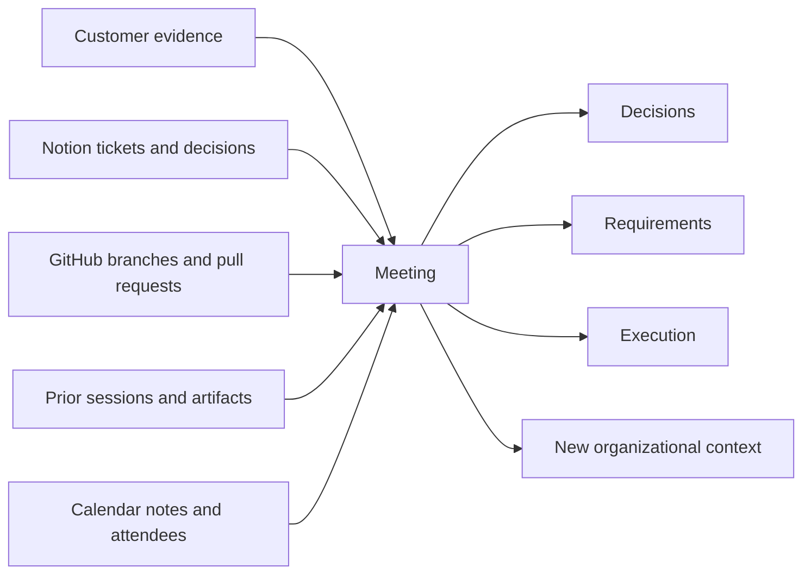
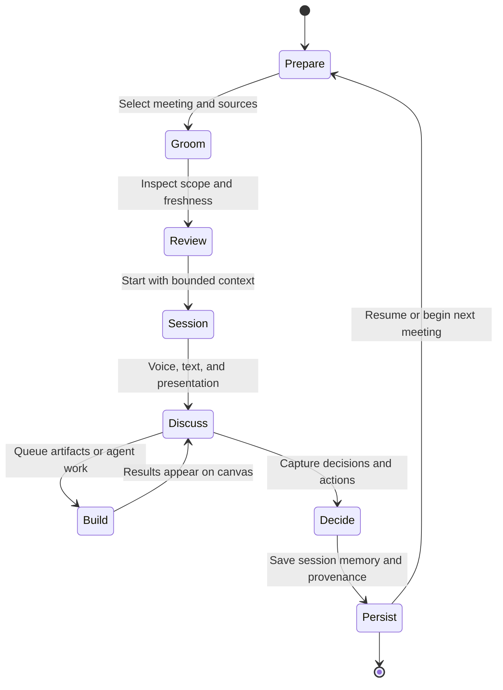
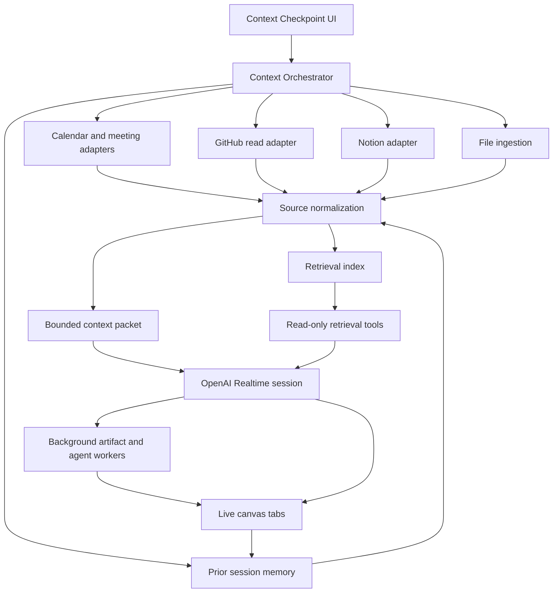

# The Context Checkpoint

## A meeting-first entry point for human-agent product work

**Product:** Cooper Session OS<br>
**Audience:** AIRES product, design, engineering, and agent-platform teams<br>
**Status:** Concept white paper and prototype specification<br>
**Date:** July 2026

---

## Abstract

Most AI collaboration begins with an empty prompt. Most consequential organizational work does not.

Decisions about products, customers, software, and operations emerge from meetings connected to a much larger evidence base: tickets, pull requests, branches, research, prior decisions, operating documents, customer notes, and unfinished work. The meeting is often the last mile where that context is interpreted, challenged, and converted into action. Yet the agent entering the meeting usually sees only the latest utterance or a flat transcript.

The **Context Checkpoint** is a new-session preparation surface for Cooper. It begins with a meeting, lets a person explicitly compose the organizational sources relevant to that room, exposes freshness and uncertainty, and produces a bounded context packet for a realtime human-agent session. Once the session starts, Cooper can discuss the evidence, identify conflicts, recommend the right product artifact, and launch background work while the conversation continues.

This is more than a voice-assistant setup modal. It is a controlled boundary between organizational knowledge and an agentic execution environment.

---

## 1. The Problem

### AI sessions begin too empty

Knowledge workers spend the opening minutes of an AI interaction reconstructing context the organization already has. They paste a ticket, paraphrase a meeting, explain a repository, and then correct the model when those fragments conflict.

The resulting failure modes are predictable:

- The agent optimizes for the most recent message rather than the complete decision context.
- Meeting notes are treated as truth even when the implementation has changed.
- Pull requests are discussed without the product requirement that motivated them.
- Product requirements are generated without the customer evidence behind them.
- Old context silently outranks newer evidence.
- A transcript becomes a large undifferentiated prompt rather than a set of attributable sources.
- The person cannot tell what the agent knows, what it inferred, or what remains missing.

### Meetings are the last mile of context

A meeting is rarely an isolated event. It is a convergence point.



The meeting is where incomplete sources become shared meaning. Cooper should enter that room with the evidence already assembled, but only after the human has inspected and bounded it.

---

## 2. Product Thesis

**The highest-leverage moment in an agentic workflow is not the first prompt. It is the checkpoint where a human decides what context the agent may treat as relevant.**

The Context Checkpoint turns session setup into a small act of product judgment:

1. What room are we entering?
2. Which evidence belongs in the room?
3. Which sources are current, stale, conflicting, or incomplete?
4. What should the agent be prepared to discuss or build?
5. What is explicitly outside this session?

This improves both intelligence and trust. Cooper receives richer context, while the user retains legibility and control.

---

## 3. The Proposed Experience

When a user starts a new Cooper session, the application opens a three-stage checkpoint.

### Stage 1: Meeting

The first object is the meeting, not a generic project picker.

The user can:

- Select an upcoming, current, recent, or unscheduled meeting.
- Search calendar events and prior sessions.
- Inspect participants, time, conferencing details, agenda, and meeting intent.
- Start a fresh session with no meeting when appropriate.
- Resume a prior meeting thread with its durable session summary.

The selected meeting becomes the **context spine**. Supporting sources are attached to it rather than presented as an unstructured library.

### Stage 2: Sources

The user adds relevant evidence:

- **GitHub:** pull requests, branches, issues, commits, repository paths, and selected files.
- **Notion:** tickets, epics, databases, product documents, decisions, and sprint views.
- **Meeting intelligence:** prior notes, transcripts, attendees, decisions, and related sessions.
- **Files:** Markdown, PDF, HTML, images, structured exports, and code bundles.
- **Direct context:** pasted text, goals, constraints, questions, and meeting intent.
- **Future organizational sources:** Slack, support, CRM, analytics, incidents, and internal APIs.

Each source shows identity, provenance, update time, selection scope, and removal controls. Adding a repository does not imply unrestricted ingestion of the repository. Adding a Notion workspace does not imply all pages are in context. Selection is explicit.

### Stage 3: Review

Before starting, the user sees a plain-language briefing:

- The meeting Cooper is joining.
- The sources Cooper can use.
- Context that may be stale.
- Missing or conflicting evidence.
- The agent posture: listen, workshop, decide, build, or present.
- The likely first artifacts Cooper may recommend.

The final action is **Start session**. It creates a durable context packet and opens the realtime workspace.

---

## 4. What Happens After Start

The checkpoint is the beginning of a continuous collaboration loop.



During the session:

- Cooper listens silently until invoked.
- Cooper can answer questions against the selected evidence.
- Cooper distinguishes source facts, transcript statements, and inferred hypotheses.
- Cooper can recommend a Jobs to be Done canvas, product thesis, workflow, service blueprint, data flywheel, scoped requirements, wireframe, prototype, or another artifact.
- The user can ask for one artifact or a complete requirements suite by voice.
- Background jobs appear immediately as loading canvas tabs.
- Completed HTML artifacts open automatically without ending the call.
- Cooper can query progress and explain what is ready, blocked, or stale.
- Decisions and artifacts become durable session memory for the next checkpoint.

---

## 5. Context Is a Product Object

The checkpoint should not concatenate source text into one enormous prompt. It should create a structured, inspectable context packet.

```ts
type SessionContextPacket = {
  id: string;
  sessionId: string;
  meeting?: {
    provider: "google_calendar" | "outlook" | "zoom" | "manual";
    externalId?: string;
    title: string;
    startsAt?: string;
    attendees: ContextPerson[];
    agenda?: string;
    meetingUrl?: string;
  };
  intent: string;
  sources: ContextSource[];
  freshness: {
    current: number;
    stale: number;
    unknown: number;
  };
  conflicts: ContextConflict[];
  exclusions: string[];
  retrievalPolicy: {
    mode: "selected_only" | "selected_plus_retrieval";
    maxSourceChars: number;
    allowLiveRefresh: boolean;
  };
  createdAt: string;
};

type ContextSource = {
  id: string;
  type: "github_pr" | "github_branch" | "notion_page" | "notion_database" |
    "meeting_notes" | "transcript" | "file" | "pasted_text";
  title: string;
  canonicalUrl?: string;
  provider: string;
  updatedAt?: string;
  fetchedAt: string;
  digest: string;
  evidenceRefs: string[];
  scope: "full" | "summary" | "selected_sections" | "retrieval";
  trust: "primary" | "supporting" | "unverified";
};
```

This structure creates four important capabilities:

1. **Provenance:** Cooper can explain where an assertion came from.
2. **Freshness:** the system can warn when a source may no longer represent reality.
3. **Selective retrieval:** large sources can remain indexed while only relevant excerpts enter the active turn.
4. **Durability:** resumed sessions can reconstruct context without replaying an unlimited transcript.

---

## 6. Context Grooming

The user should not have to manually audit every source. Cooper can help groom the packet before entering the room.

### Suggested context

Based on the meeting title, attendees, calendar description, prior sessions, and explicit project, Cooper may suggest:

- The Notion epic discussed in the last meeting.
- An open pull request linked from the ticket.
- The latest scoped requirements artifact.
- A prior decision that conflicts with the proposed change.
- A customer transcript mentioned in the meeting notes.

Suggestions are not silently attached. The user accepts or dismisses them.

### Freshness and conflict checks

The system can flag:

- A requirements page older than the implementing pull request.
- A branch whose latest commit postdates the meeting brief.
- A ticket marked complete while the PR remains open.
- Two documents that define different success metrics.
- A transcript claim unsupported by the current code or system of record.

These checks become visible decision gates rather than hidden prompt instructions.

### Context budget

The checkpoint should show semantic scope, not token trivia. A useful summary is:

- **Loaded:** concise source digests and selected evidence.
- **Retrievable:** indexed material available when Cooper needs it.
- **Excluded:** connected systems or documents not authorized for this session.

---

## 7. Headless Capability and Customer UI

The Context Checkpoint should exist as both a first-party Cooper interface and a headless platform capability.

### First-party Cooper UI

The Cooper Session OS provides the opinionated meeting-first modal, source selectors, freshness review, and live canvas handoff demonstrated in the prototype.

### Headless context API

Other AIRES products or customer applications can embed the same capability:

```text
POST /v1/context-packets/draft
POST /v1/context-packets/:id/sources
POST /v1/context-packets/:id/groom
POST /v1/context-packets/:id/confirm
POST /v1/sessions
```

The host application owns presentation. The Cooper platform owns source normalization, provenance, retrieval policy, session injection, agent tools, and durable continuity.

This creates an extensible pattern for:

- Product-development workrooms.
- Customer implementation sessions.
- Support escalations.
- Executive operating reviews.
- Design critiques.
- Incident response.
- Sales and onboarding calls.

---

## 8. System Architecture



### Realtime layer

The realtime model receives a concise session briefing and source catalog. Large source bodies remain behind tools or retrieval. Cooper can cite and fetch additional evidence as the conversation demands.

### Source adapters

Arcade MCP is a strong authorization and tool hub for Notion, Calendar, GitHub, Gmail, Slack, and other user-connected systems. Direct provider integrations may still be appropriate where Cooper needs specialized semantics, high-volume indexing, webhooks, or strict control over API behavior.

The context model should be provider-neutral so the product can mix Arcade, direct APIs, Codex connectors, and local files without exposing those differences to the session UX.

### Agent workers

Realtime Cooper should orchestrate rather than perform long document generation inside the voice turn. Tool calls enqueue durable work. Workers use the selected context packet, stream understandable activity, and publish artifacts back into the same session.

---

## 9. Trust, Privacy, and Control

The checkpoint should make the agent boundary obvious.

### Principles

- **Selected-only by default:** connected does not mean loaded.
- **Read access before write access:** context gathering is read-only unless the user explicitly approves an action.
- **Visible provenance:** generated requirements should reference the source packet and evidence window.
- **No hidden transcript authority:** statements made in a meeting remain attributed statements, not system facts.
- **Freshness is explicit:** old evidence is labeled rather than discarded or silently trusted.
- **Secrets stay out of model context:** credentials remain in provider runtimes and backend tool execution.
- **Session-bounded memory:** users can inspect what persists beyond the meeting.

### Approval boundaries

Reading selected context and generating advisory artifacts require no additional confirmation. Creating tickets, publishing Notion pages, modifying code, sending messages, or changing external systems requires the existing Cooper approval policy.

---

## 10. The New-Session Modal

The requested prototype defines the first implementation surface.

### Required components

1. **Meeting picker**
   - Upcoming, recent, and unscheduled sessions.
   - Search, date, participants, duration, location, and meeting link.
   - Calendar and Zoom-derived meeting intelligence.

2. **Meeting brief**
   - Intent, agenda, unresolved questions, and expected outcome.
   - Editable before launch.

3. **Source composer**
   - GitHub branch and pull-request selector.
   - Notion ticket, page, and database selector.
   - Prior meeting notes and session selector.
   - File upload and pasted text.
   - Per-source remove, scope, and freshness metadata.

4. **Context summary**
   - What Cooper will know.
   - Current versus stale source count.
   - Missing evidence and conflicts.
   - Explicit session-only access note.

5. **Review and launch**
   - Meeting spine.
   - Evidence packet.
   - Agent posture.
   - Freshness gate.
   - Start session.

### Design direction

- Warm-white canvas, white surfaces, soft black type, sparse Volt yellow.
- No marketing hero, decorative art, gradients, or dashboard metrics.
- Meeting list, source rows, and reading surfaces remain lists rather than card grids.
- Surfaces use radii of 8px or less.
- The modal is dense enough for expert work but remains calm and legible.
- Mobile collapses to meeting picker followed by source composition with a stable start action.

---

## 11. Example User Flow

### Sprint review to requirements suite

1. Michael selects **Rep velocity sprint review**.
2. Cooper suggests the Sprint 14 Notion view, two related pull requests, the latest JTBD canvas, and the previous session decision.
3. Michael removes an outdated product thesis and attaches a customer discovery transcript.
4. The checkpoint flags that the current service blueprint predates the latest implementation branch.
5. Michael starts the session.
6. Cooper opens by confirming the meeting intent and the stale blueprint.
7. During discussion, Michael says, “Cooper, suggest the right requirements document.”
8. Cooper recommends a service blueprint followed by scoped requirements.
9. Michael asks for the gist, then says, “Build both.”
10. Two loading tabs appear on the live canvas while the conversation continues.
11. Cooper presents the completed blueprint and asks one decision question about the fallback owner.
12. At the end, Cooper saves the decision, artifacts, source provenance, and unresolved question into durable session memory.

This is the core product loop: **bring context together, reason in the room, produce work, and carry the resulting state forward.**

---

## 12. Success Measures

### Product outcomes

- Time from session start to first useful decision.
- Percentage of sessions launched with at least one attributable organizational source.
- Percentage of generated artifacts accepted without major context correction.
- Number of context conflicts surfaced before generation.
- Artifact generation initiated by voice during active sessions.
- Sessions resumed with durable context rather than manual reconstruction.
- Reduction in repeated context-setting across meetings.

### Quality measures

- Source citation accuracy.
- Freshness warning precision.
- Context suggestion acceptance rate.
- Unauthorized-source inclusion rate, targeted at zero.
- Agent claims explicitly labeled as evidence, statement, or inference.
- Background job completion and recovery rate.

---

## 13. Delivery Path

### Phase 1: Local checkpoint

- Build the modal on top of existing Today and New session flows.
- Use current calendar fixtures, project context, file ingestion, and prior sessions.
- Add GitHub PR/branch and Notion page selectors through existing provider configuration.
- Persist a context packet with each call.
- Inject a bounded briefing into the Realtime session.

### Phase 2: Context grooming

- Add source freshness calculation.
- Detect cross-source conflicts and missing evidence.
- Add Cooper-suggested context with explicit acceptance.
- Add selected-only retrieval over large repositories and databases.

### Phase 3: Organizational context graph

- Connect meetings, decisions, tickets, code, people, customers, and artifacts.
- Use prior session memory to suggest the next context packet.
- Support headless embedding in AIRES and customer products.
- Introduce policy-aware team and workspace scopes.

### Phase 4: Agentic operating environment

- Let Cooper assemble and propose the checkpoint before the meeting.
- Launch specialized product, engineering, QA, and presentation workers.
- Publish approved outcomes back to Notion, GitHub, and operating systems.
- Measure decision lineage from evidence through artifact to implementation.

---

## Conclusion

Voice is an important medium for Cooper because conversation is how teams expose nuance, disagreement, and tacit knowledge. But voice alone is not the product.

The product is a content-rich environment where humans and agents can enter a room with shared evidence, reason together, make decisions, generate durable work, and return later without losing the thread.

The Context Checkpoint makes that environment possible. It gives the user one calm moment to define the room before the agent begins acting inside it. Meetings provide the spine. Organizational sources provide the evidence. Cooper provides the reasoning and orchestration. The canvas makes work visible. Durable session memory carries the result forward.

That is the foundation of an agentic human-collaboration operating system.

---

## Artifacts

- Visual concept: [`cooper-context-checkpoint-concept.png`](./cooper-context-checkpoint-concept.png)
- Interactive prototype: [`cooper-context-checkpoint-prototype.html`](./cooper-context-checkpoint-prototype.html)
- Existing Session OS product plan: [`11-session-os-production-plan.md`](./11-session-os-production-plan.md)
