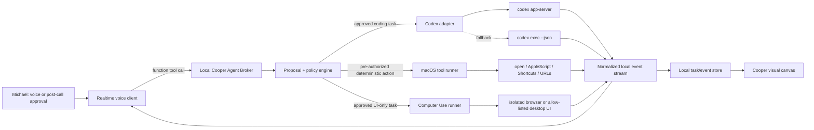

# Cooper voice control for Codex and macOS

Implementation plan grounded in current OpenAI documentation and the existing Cooper codebase.

Date: July 16, 2026

Companion architecture page: [cooper-codex-voice-architecture.html](./cooper-codex-voice-architecture.html)

## Executive recommendation

Build a local **Cooper Agent Broker** between the Realtime voice client and every execution runtime.

The broker should own five responsibilities:

1. Turn spoken intent or post-call suggestions into typed, inert task proposals.
2. Route each proposal to the simplest capable execution lane.
3. Enforce approval policy before starting or continuing consequential work.
4. Normalize runtime-specific events into one task/event model for the visual canvas.
5. Persist task IDs, Codex thread/turn IDs, approvals, artifacts, and results locally.

Use these execution lanes:

- **Codex app-server** as the primary rich integration for local coding tasks.
- **`codex exec --json`** as the stable one-shot and recovery fallback.
- **Deterministic macOS tools** for opening apps, URLs, Finder locations, Terminal workspaces, and named routines.
- **Responses API Computer Use or a custom Computer Use harness** only when the work genuinely depends on perceiving and manipulating a UI.

Do not control Codex by clicking around its desktop UI. OpenAI documents local programmatic surfaces for threads, turns, events, approvals, and non-interactive execution; those surfaces produce much better state and control for Cooper.

## What is already built

The repository is closer to this architecture than the product UI currently suggests.

| Capability | Current evidence | Status |
| --- | --- | --- |
| Realtime voice client | `src/main.jsx` configures Realtime sessions, WebRTC events, semantic VAD, transcription, and client-side tool dispatch. | Built |
| Voice tool definitions | `cooperTools.js` exposes Operator, Computer Use, and deterministic local tools to the Realtime session. | Built |
| Deterministic Mac actions | `server/localComputerTools.js` can open allow-listed local apps, web apps, Finder, and Terminal; it also supports browser search and a vision-assisted click. | Built |
| Visual task and approval surface | `src/main.jsx`, `server/operatorRuntime.js`, and `server.js` already model tasks, approval records, logs, artifacts, statuses, and the Operator canvas. | Built |
| Post-call/canvas work model | Existing call, canvas, suggestion, artifact, and job code can produce and display follow-up work. | Built |
| Codex runtime lane | `server/codexAppServerClient.js` now starts or reconnects a persistent local app-server, performs the JSON-RPC handshake, creates/resumes threads and turns, persists runtime IDs, maps activity, routes approvals, supports follow-up turns and interrupts, and reconciles active work after Cooper restarts. | **Built — first vertical slice** |
| Computer Use lane | The task contract, allow-list concepts, UI, and approval checkpoints exist, but the screenshot/action execution loop is not attached. | Scaffold only |
| Morning routine | Individual app launch exists; named multi-target routines and phrase mapping do not. | Not built |

The simulated `codex_app_server` path has now been replaced. The remaining work is to link post-call action items directly to this runner, add the deterministic workday routine, and then attach the Computer Use screenshot/action loop.

## Implementation checkpoint — July 16, 2026

The first Codex orchestration release is implemented in this repository:

- `operator` is migrated to a backward-compatible first-class `codex` session mode in local storage and the workspace picker.
- Voice-created Codex tasks use only the `codex_app_server` lane and ask for visible task-start approval.
- Each task persists `threadId`, `turnId`, transport, connection state, workspace, model, last event, last reconciliation, and last agent message.
- App-server command, file-change, and permission requests become task-scoped approval cards and are answered on the original JSON-RPC request ID.
- Cancel and stop-all interrupt the active Codex turn.
- `GET /api/codex/runtime` exposes credential-free runtime health and durable task state; `POST /api/codex/tasks/:id/continue` starts a follow-up turn in the same thread.
- The current npm-installed Codex cannot use the managed `codex app-server daemon` command because that command requires OpenAI's standalone Codex installer. Cooper therefore launches app-server as a detached local Unix-socket service and connects through a WebSocket-over-Unix client. Managed daemon mode remains preferred automatically when available; direct stdio is the final compatibility fallback.
- Active tasks retry interrupted connections with bounded backoff. Pending runtime approval IDs are invalidated across a Cooper restart and must be re-issued by Codex before the user can approve them, avoiding a false approval against an obsolete JSON-RPC connection.
- The detached socket service records its owner PID. If a replaced socket leaves an old listener behind, Cooper validates the recorded command before terminating that stale process and starting one replacement.
- Real-runtime verification created a thread, started a turn, closed the first client, connected a fresh client, and recovered the completed answer from the same thread over the detached socket.

## Documented OpenAI capabilities used by this plan

### Realtime voice and tools

OpenAI documents WebRTC as the preferred browser/client connection for Realtime. A backend mints an ephemeral client secret with the standard API key kept on the server, and the browser exchanges audio plus other events over WebRTC and its data channel. When minting ephemeral tokens, the backend should set `OpenAI-Safety-Identifier`. See [Connect with WebRTC](https://developers.openai.com/api/docs/guides/realtime-webrtc).

A Realtime session can expose function tools. For application-owned tools, the client or server executes the function, adds a `function_call_output` conversation item using the original call ID, and creates the next response. See [Realtime with tools](https://developers.openai.com/api/docs/guides/realtime-mcp) and [Provide function-call results](https://developers.openai.com/api/docs/guides/realtime-conversations#provide-the-results-of-a-function-call-to-the-model).

This matches Cooper’s current implementation: Realtime decides when to call a tool; Cooper’s application owns the local execution and returns the structured result.

### Codex app-server

The [Codex app-server](https://learn.chatgpt.com/docs/app-server) is a local JSON-RPC protocol available over stdio, WebSocket, or Unix socket. It exposes the primitives Cooper needs:

- `thread/start`, `thread/resume`, `thread/fork`, `thread/read`, `thread/list`, `thread/name/set`, `thread/archive`, and related thread operations.
- `turn/start`, `turn/steer`, and `turn/interrupt`.
- Streamed item lifecycle for agent messages, plans, commands, file changes, MCP tool calls, and other work.
- Server-initiated approval requests for command execution, file changes, requested permissions, and some app/MCP tool calls.
- `threadId` and `turnId` on approval requests so Cooper can bind every approval card to the correct visible task.

The same docs currently label app-server **experimental** and say it may change without notice. Cooper should therefore isolate it behind one versioned adapter and pin the Codex CLI version tested by the app.

### Codex alternatives

- [Non-interactive mode](https://learn.chatgpt.com/docs/non-interactive-mode) and the [developer command reference](https://learn.chatgpt.com/docs/developer-commands) document `codex exec` for non-interactive work, structured JSONL output, and resumable sessions. The command reference currently labels it stable.
- The [Codex SDK](https://learn.chatgpt.com/docs/codex-sdk) provides a TypeScript API that can start a thread, run a prompt, continue the same thread, or resume one by thread ID. Evaluate it after the app-server spike if its event and approval coverage is sufficient for Cooper’s UI.
- `codex mcp-server` is documented as a stable stdio MCP surface for letting another agent consume Codex. It is a good future fit for multi-agent orchestration, not a requirement for the first single-user vertical slice.

### Computer Use

The [Computer Use guide](https://developers.openai.com/api/docs/guides/tools-computer-use) supports three integration shapes: the built-in `computer` tool loop, a custom tool/harness, or a code-execution harness. In the built-in loop, the model requests a screenshot or returns actions, the application executes every action in order, and then sends a new screenshot as `computer_call_output` until the model stops returning computer calls.

The guide also requires the product to treat on-screen and third-party content as untrusted, keep a human in the loop for high-impact actions, and prefer an isolated browser or VM. Cooper’s local desktop use cannot always be isolated, so its policy must be stricter than the minimum: app allow-lists, visible foreground operation, screenshot redaction where practical, and confirmation before consequential steps.

## Target architecture



### Trust boundaries

“Local-first” does not mean “offline.” The product should tell the truth about each boundary:

- Microphone audio and Realtime conversation context are sent to the OpenAI Realtime API.
- Codex runs against the local workspace, but model inference still uses the configured OpenAI/Codex service.
- Deterministic app-launch commands execute locally and do not require screenshots.
- Computer Use screenshots and relevant task context are sent to the selected model unless an entirely local visual model is introduced later.
- Task metadata, approval records, runtime IDs, replay logs, and user routine configuration remain local by default.

## Product behavior

### Live Codex delegation

1. Michael says: “Cooper, have Codex add offline retry to the active project. Run the tests but do not commit.”
2. Realtime calls `propose_agent_task` with a structured intent.
3. The broker resolves the active project and builds a proposal containing workspace, prompt, acceptance checks, budget, permission profile, and prohibited actions.
4. Cooper displays the proposal on the canvas and asks for approval.
5. Approval calls `approve_agent_task`; the UI button is authoritative even if Cooper also accepts a clear voice confirmation.
6. The Codex adapter starts or resumes app-server, calls `thread/start`, stores the returned thread ID, and calls `turn/start`.
7. App-server notifications become normalized Cooper events and update the existing Operator view.
8. A Codex command, file-change, network, or permission approval creates another task-scoped approval card. Do not auto-select `acceptForSession` by default.
9. Completion stores the final message, changed files, test status, and artifacts. Cooper speaks a short summary and the canvas retains full detail.

### Post-call dispatch

1. The existing post-call pipeline creates **suggestions**, not executable tasks.
2. Each suggestion is converted to a proposal with `lane`, `risk`, `scope`, and `expectedResult`.
3. Michael selects one or more proposals and approves them.
4. The broker dispatches each approved proposal through the same runner used during a live voice call.
5. The original action item links to its task ID and eventually to its result or blocker.

There should be no special “post-call execution” implementation. It is another source of the same typed proposal.

### “Cooper, I’m ready to work”

Use a deterministic routine, not Computer Use.

Recommended first routine:

```json
{
  "id": "start-workday",
  "name": "Start my workday",
  "phrases": [
    "Cooper, I'm ready to work",
    "Cooper, start my day"
  ],
  "approvalPolicy": "preauthorized_open_only",
  "targets": [
    { "type": "app", "name": "Safari" },
    { "type": "app", "name": "Slack" },
    { "type": "app", "name": "Notion" },
    { "type": "app", "name": "Visual Studio Code" },
    { "type": "url", "browser": "safari", "url": "http://localhost:5000/" }
  ]
}
```

Behavior:

- The user approves the routine definition when it is created or edited.
- A matching wake phrase may subsequently run it immediately.
- The runner resolves every target against the existing app and URL allow-list.
- Targets open concurrently with a bounded concurrency limit and per-target timeout.
- The visual canvas shows a receipt: opened, already open, blocked, or failed.
- A routine with typing, sending, shell execution, account changes, or external writes must not use `preauthorized_open_only`; it becomes a normal approval-gated task.

## Unified data contracts

Use one task model across voice, post-call, Codex, deterministic tools, and Computer Use.

```ts
type AgentLane = "codex" | "deterministic" | "computer_use";
type TaskSource = "voice" | "post_call" | "canvas" | "routine";
type TaskStatus =
  | "proposed"
  | "waiting_approval"
  | "queued"
  | "running"
  | "blocked"
  | "completed"
  | "failed"
  | "cancelled";

interface AgentTask {
  id: string;
  source: TaskSource;
  sourceRef?: string;
  lane: AgentLane;
  title: string;
  goal: string;
  workspace?: string;
  acceptanceCriteria: string[];
  prohibitedActions: string[];
  status: TaskStatus;
  risk: "open_only" | "read" | "write" | "high_impact";
  budget: {
    maxWallClockMs: number;
    maxTurns: number;
    maxToolCalls?: number;
  };
  runtime: {
    adapter: "codex_app_server" | "codex_exec" | "macos" | "computer";
    threadId?: string;
    turnId?: string;
    processId?: number;
    callId?: string;
  };
  approvals: AgentApproval[];
  artifactIds: string[];
  createdAt: string;
  updatedAt: string;
}

interface AgentApproval {
  id: string;
  taskId: string;
  runtimeRequestId?: string;
  type:
    | "task_start"
    | "command"
    | "file_change"
    | "permission"
    | "external_write"
    | "high_impact";
  title: string;
  description: string;
  preview?: unknown;
  options: Array<"approve" | "approve_for_session" | "decline" | "cancel">;
  status: "pending" | "approved" | "declined" | "cancelled";
  requestedAt: string;
  resolvedAt?: string;
}

interface AgentEvent {
  id: string;
  taskId: string;
  runtime: AgentTask["runtime"]["adapter"];
  runtimeEvent: string;
  phase: "proposal" | "approval" | "execution" | "result";
  summary: string;
  payload?: unknown;
  createdAt: string;
}
```

Keep raw runtime payloads for debugging, but render the UI from normalized events. This prevents app-server protocol changes from spreading through React components.

## Codex bridge design

### Process manager

Use one local client/manager that owns the Codex protocol connection and a restart-safe local service.

Responsibilities:

- Verify the configured Codex binary and version at startup.
- Prefer the managed Codex daemon when the standalone installer is present. Otherwise start a detached `codex app-server --listen unix://PATH` service. Both choices avoid a TCP listening port and survive Cooper UI/server restarts.
- Use direct `stdio://` only as the compatibility fallback; it preserves thread history but an in-flight turn cannot outlive the Cooper server process.
- Send the app-server initialization handshake and record advertised capabilities.
- Maintain request IDs, pending JSON-RPC promises, thread subscriptions, and server-initiated request handlers.
- Restart with bounded exponential backoff when the process exits unexpectedly.
- Reconcile active tasks after restart using stored thread IDs and `thread/read` or `thread/resume`.
- Never read, return, or log `~/.codex/auth.json`; let the Codex process use its normal authenticated local environment/keyring.
- Expose health without exposing credentials or raw prompts.

Current module split for the first vertical slice:

```text
server/codexAppServerClient.js  # transport, JSON-RPC, thread/turn helpers, approval mapping
server.js                       # durable task runner, event persistence, APIs, reconciliation
server/operatorRuntime.js       # persisted task/runtime/approval shape
```

### App-server event mapping

| App-server message | Cooper update |
| --- | --- |
| `thread/started` | Store `threadId`; task becomes `queued` or `running`. |
| `turn/started` | Store `turnId`; append a visible turn-start event. |
| `item/started` | Create or update the activity row for a command, file change, message, plan, or tool call. |
| Item delta notifications | Update the existing row; rate-limit UI broadcasts to avoid rendering every token/chunk. |
| `item/completed` | Store final item payload, exit code, diff, or result. |
| `item/commandExecution/requestApproval` | Create a task-scoped command approval and pause local dispatch until resolved. |
| `item/fileChange/requestApproval` | Create a task-scoped file-change approval with change preview. |
| `item/permissions/requestApproval` | Render requested network/filesystem permissions and grant only an approved subset. |
| `serverRequest/resolved` | Close the matching pending approval if the runtime cleared it. |
| `turn/completed` | Compute task result, changed files, tests, and final status. |
| Thread status notifications | Update running/waiting/idle status without inventing progress percentages. |

### Approval responses

The task-start approval is Cooper’s product boundary. Runtime approvals are Codex boundaries. Keep both.

- Default command/file response: `accept` or `decline` for one request.
- Expose `acceptForSession` only behind an explicit secondary action.
- Treat network approvals separately and show host/protocol/port rather than only shell text.
- For requested permissions, send only the user-approved subset and default to turn scope.
- Decline or cancel all unresolved runtime requests if the user cancels the Cooper task.

### `codex exec` fallback

Use the fallback when app-server fails health checks, the pinned protocol version is unsupported, or the task explicitly requests one-shot non-interactive execution.

Rules:

- Always use structured JSONL output.
- Do not parse human-formatted terminal prose.
- Use the same workspace, task brief, sandbox, and approval configuration as the app-server lane.
- Record the session ID when available so a later run can resume it.
- Mark the task’s adapter as `codex_exec` so the UI can explain why some rich events or approvals are unavailable.

## Computer Use design

### Routing policy

Use the following order and stop at the first adequate option:

1. Purpose-built API or authorized connector.
2. Existing deterministic Cooper local tool.
3. Structured browser automation such as Playwright/DOM control in an isolated profile.
4. Responses API Computer Use or a custom screenshot/action harness.

This routing policy is both safer and faster than turning every desktop action into a visual reasoning loop.

### Runner loop

1. Validate app/domain allow-lists and risk classification.
2. Acquire the target environment and current screenshot.
3. Send the goal, computer tool, and current visual state to the model.
4. Validate returned actions before executing them.
5. Execute actions in order.
6. Capture and return the new screenshot as `computer_call_output`.
7. Repeat until there is no next `computer_call`, the user cancels, a policy checkpoint is reached, or a budget expires.
8. Store a compact replay: screenshots at checkpoints, action list, approvals, result, and errors.

### Required safety behavior

- Treat page text, PDFs, emails, chats, calendar items, and tool output as untrusted input, never as user permission.
- Stop for suspected prompt injection, phishing, or unexpected security warnings.
- Require explicit confirmation immediately before external communication, purchases, destructive changes, account changes, sensitive-data disclosure, production writes, downloads from unknown sources, commits, and pushes.
- Run browser Computer Use in a dedicated profile with empty inherited environment where practical.
- Keep desktop Computer Use on an allow-list and visible to the user.
- Add a universal stop action that interrupts the model loop and releases input control.

## API and tool changes

### Realtime tools

Add or consolidate these application tools:

```text
propose_agent_task
approve_agent_task
edit_agent_task_proposal
cancel_agent_task
get_agent_task_status
run_routine
list_routines
```

Do not expose low-level `thread/start` or mouse actions directly to the Realtime model. The local broker should translate the higher-level tool into runtime calls after policy checks.

### Local HTTP endpoints

Reuse the existing authenticated Express application and `/api/events` stream.

```text
POST   /api/agent-tasks
GET    /api/agent-tasks/:id
POST   /api/agent-tasks/:id/approve
POST   /api/agent-tasks/:id/decline
POST   /api/agent-tasks/:id/cancel
POST   /api/agent-tasks/:id/steer
GET    /api/codex/health
GET    /api/routines
POST   /api/routines
PATCH  /api/routines/:id
POST   /api/routines/:id/run
```

Every mutation should require the existing Cooper session authentication and loopback/local-host protections. Do not add a separate unauthenticated bridge port.

### Environment configuration

Suggested additions:

```env
COOPER_CODEX_BRIDGE_ENABLED=true
COOPER_CODEX_BIN=codex
COOPER_CODEX_TRANSPORT=stdio
COOPER_CODEX_CWD=/absolute/default/workspace
COOPER_CODEX_EXEC_FALLBACK=true
COOPER_ROUTINES_PATH=/absolute/local/path/routines.json
COOPER_COMPUTER_USE_RUNNER_ENABLED=false
```

Keep the current app/domain allow-list environment variables. Do not put OpenAI keys, Codex tokens, or routine secrets into generated prompts, task events, or the browser bundle.

## File-level implementation plan

### Add

- `server/codex/CodexProcessManager.js` — child-process lifecycle, stdio framing, version/health.
- `server/codex/CodexAppServerClient.js` — JSON-RPC request, notification, and server-request handling.
- `server/codex/codexEventMapper.js` — raw app-server to `AgentEvent` mapping.
- `server/codex/codexApprovalMapper.js` — runtime request to Cooper approval and response mapping.
- `server/codex/codexTaskRunner.js` — start/resume/steer/interrupt task orchestration.
- `server/codex/codexExecFallback.js` — structured one-shot fallback.
- `server/agentTaskStore.js` — task, event, and approval persistence helpers around the current data store.
- `server/routineRunner.js` — named routine validation and bounded parallel execution.
- `src/agentTasks.js` — shared task status and rendering helpers.
- `test/codexAppServerClient.test.js`
- `test/codexEventMapper.test.js`
- `test/codexApprovalMapper.test.js`
- `test/codexTaskRunner.test.js`
- `test/routineRunner.test.js`
- `test/agentTaskApi.test.js`

### Modify

- `server.js` — initialize/close the bridge, add authenticated task/routine endpoints, broadcast normalized events, and replace simulated Codex task advancement.
- `server/operatorRuntime.js` — keep presets and visual metadata, but delegate Codex and Computer Use skills to real runner interfaces.
- `server/localComputerTools.js` — expose a reusable allow-list validator and a non-shell routine target executor.
- `cooperTools.js` — move from overlapping Operator/Computer Use task-start tools toward one typed proposal/status tool family while maintaining backward compatibility during migration.
- `src/main.jsx` — map real AgentTask events into the existing Operator workspace, approval popover, canvas, and spoken status responses.
- `src/computerUseTasks.js` — make routing return the unified lane/task contract.
- `.env.example` — document the bridge and routine flags without adding secrets.
- `README.md` — document setup, Codex authentication, app allow-lists, and known maturity constraints.

## Delivery phases

### Phase 0 — lock the contract — **complete**

- Finalize `AgentTask`, `AgentApproval`, and `AgentEvent` shapes.
- Decide the pinned Codex CLI version and record protocol fixtures from that version.
- Define the task-start, runtime, and high-impact approval copy.
- Add feature flags; enable the durable local Codex lane by default and leave later Computer Use execution behind its own controls.

Exit criteria: fixture-driven tests can render a proposed task and each approval type without a running Codex process.

### Phase 1 — real Codex bridge spike — **complete for app-server; exec fallback deferred**

- Start app-server through managed daemon, detached Unix socket, or direct stdio fallback.
- Complete initialization and health reporting.
- Create one thread and one turn in a test repository.
- Stream agent messages, command items, file changes, and turn completion.
- Interrupt a running turn.
- Implement `codex exec --json` fallback after the durable app-server lane has accumulated real usage evidence.

Exit criteria: a voice-created test task edits a disposable fixture repository, runs a test, streams visible events, and can be cancelled.

### Phase 2 — approval and canvas vertical slice — **core complete**

- Replace the simulated `codex_app_server` Operator path with `codexTaskRunner`.
- Persist runtime IDs and reconcile after server restart.
- Map command, file-change, network, and permission approvals.
- Show changed files, test result, final message, and next actions.
- Route one post-call suggestion through the same proposal/approval path. **Next remaining slice.**

Exit criteria: no part of the UI claims completion until a real runtime event establishes it; every pending Codex approval is visible and task-scoped.

### Phase 3 — workday routine (2–3 days) — **next**

- Add routine configuration and UI.
- Add `run_routine` to the Realtime tool set.
- Seed a `start-workday` routine using the user’s chosen five targets.
- Record per-target outcomes and support one universal stop/cancel action.

Exit criteria: the approved phrase opens all allow-listed targets in under three seconds on the test Mac, produces a visible receipt, and cannot execute arbitrary commands.

### Phase 4 — Computer Use runner (1–2 weeks)

- Start with an isolated local browser profile, not the full desktop.
- Implement the screenshot/action/output loop and normalized events.
- Add domain validation, confirmation boundaries, action budgets, and replay.
- Add desktop apps one at a time behind explicit app allow-listing and OS permissions.

Exit criteria: an approved UI-only test can complete a benign multistep flow, stop on a simulated prompt injection, and pause before a mocked external submission.

### Phase 5 — hardening and polish (ongoing)

- Protocol contract tests against the pinned and candidate Codex CLI versions.
- Crash/restart recovery, orphan process cleanup, and stale approval cleanup.
- Metrics for proposal-to-approval time, task duration, failure mode, and fallback use.
- Retention controls for transcripts, screenshots, task events, and artifacts.
- Voice phrasing and interruption refinements.
- Optional Codex SDK or MCP/Agents SDK evaluation only after the vertical slice is reliable.

## Verification plan

### Unit tests

- JSON-RPC framing supports fragmented and multiple stdio messages.
- Request IDs resolve once and time out cleanly.
- Every app-server item fixture maps to one stable Cooper event shape.
- Approval response mapping never grants permissions that were not requested.
- Routine validation rejects unknown apps, non-HTTP URLs, command targets, and write actions under `preauthorized_open_only`.
- Task state transitions reject impossible regressions such as `completed → running` without an explicit resumed turn.

### Integration tests

- Start app-server, create a thread, run a harmless read-only turn, and interrupt it.
- Run against a disposable Git fixture for file-change and test execution.
- Simulate command and file-change approvals with accept, decline, cancel, and session acceptance.
- Kill the bridge process mid-turn and verify restart/reconciliation behavior.
- Force app-server health failure and verify the structured `codex exec` fallback.
- Run a routine with one valid, one already-open, and one blocked target.

### End-to-end user flows

1. Voice → proposal → approve → Codex run → result.
2. Voice → proposal → edit scope → approve → run.
3. Post-call suggestion → selected approval → Codex run.
4. Codex asks for command approval → user declines → task explains the blocked result.
5. “I’m ready to work” → five approved targets open → receipt appears.
6. Computer Use encounters untrusted instructions → stops and asks.
7. User says “Cooper, stop” during Codex or Computer Use → active loop interrupts and input control is released.

## Acceptance criteria for the first release

- Michael can create a real local Codex task entirely through Cooper voice and the existing visual approval surface.
- The task is not started until the visible proposal is approved.
- Cooper stores and displays the actual Codex thread and turn state.
- Commands, file changes, and requested permissions that require runtime approval appear in the correct task.
- The user can interrupt or cancel work at any time.
- Final status is derived from runtime events, never from a timer or simulated step progression.
- Post-call suggestions use the same proposal and execution path as live voice delegation.
- A pre-approved “start my workday” phrase opens only configured allow-listed apps/URLs and records every outcome.
- Computer Use is not invoked for an action that the deterministic tool runner can satisfy.
- Credentials, raw auth cache contents, and secrets never enter task logs, prompts, screenshots, or the browser bundle.

## Risks and mitigations

| Risk | Mitigation |
| --- | --- |
| App-server protocol changes | Pin Codex CLI; isolate one adapter; keep fixtures; maintain `codex exec` fallback. |
| Duplicate overlapping task systems | Migrate Operator and Computer Use onto one `AgentTask` contract; do not add another independent queue. |
| Voice ambiguity starts wrong work | Create an inert proposal first; require visible approval for task start. |
| Approval fatigue | Pre-authorize only narrow open-only routines; keep consequence-based approval tiers; do not ask for perception-only steps. |
| Computer Use prompt injection | Treat screen content as untrusted; stop on suspicious instructions; validate every action against policy. |
| Sensitive screen capture | Prefer APIs/deterministic tools; isolate browser profiles; restrict apps; redact and retain screenshots minimally. |
| Orphaned Codex processes | One process manager, shutdown hooks, heartbeats, bounded restart, and process cleanup. |
| UI overstates progress | Render event-derived states and descriptive activity; avoid invented percentages. |
| Local service exposure | Prefer stdio; keep Express authenticated and loopback-bound; do not expose an unauthenticated bridge socket. |

## Immediate next move

The thin Codex vertical slice is now live. The next two slices are:

1. Link approved post-call action items to `codex_app_server` tasks and show the resulting task/thread relationship on both records.
2. Add the small `run_routine` wrapper over the existing deterministic app-launch tools for “Cooper, I’m ready to work.”

Only after those are stable should the full Computer Use screenshot/action runner be attached.
