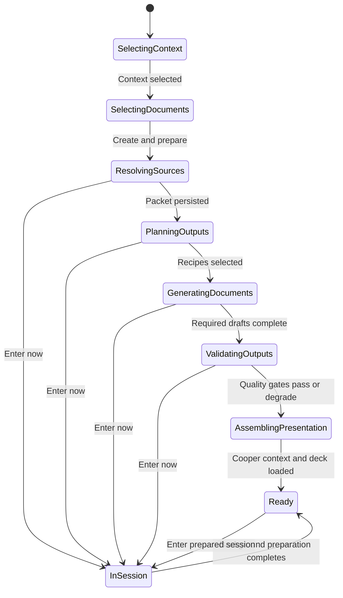

# Cooper session preparation: current state and target flow

**Evidence snapshot:** July 16, 2026 
**Scope:** What happens after a person selects context and starts a Cooper session, why the transition can feel like a crash, and the target preparation experience.

## Repository grounding

- `main` is at `f72a43b` and has a substantial uncommitted application/design-system change set.
- One detached worktree exists at `.claude/worktrees/nifty-yalow-783daa` on `a39d775`.
- That detached worktree has no unmerged diff against `main`; its history is already represented by the merge at `f72a43b`.
- The active session preparation behavior is therefore defined by the modified main worktree, especially:
  - `src/contextCheckpoint.jsx`
  - `src/sessionPreparation.js`
  - `src/main.jsx`
  - `server/contextCheckpoint.js`
  - `server.js`

## What happens today

### 1. Cooper resolves the selected context before creating the session

`SessionContextCheckpoint.startSession()` sends the selected meeting, intent, and sources to `POST /api/context-packets`.

The server resolves each selected Notion, GitHub, prior-meeting, pasted-text, or uploaded-file source into one bounded context packet. If any selected remote source cannot be resolved, the checkpoint stays open and asks the user to remove or reconnect that source.

This part is synchronous. A slow or unavailable Notion source can make **Start session** feel stalled before the call workspace appears.

### 2. Four preparation documents are selected by default

The current fixed preparation set is:

| Document | Recipe | Purpose |
| --- | --- | --- |
| Shared context brief | `executive_report` | Facts, hypotheses, citations, and missing context |
| Decision map | `mermaid_diagram` | Choices, dependencies, and unresolved gates |
| Requirements first pass | `aires_requirements` | Scoped AIRES requirements draft |
| QA checklist | `qa_checklist` | Acceptance evidence and regression coverage |

All four checkboxes initialize as selected. The user can uncheck them or choose **Enter without prep**, but there is no **Let Cooper decide** mode today.

### 3. The checkpoint closes before preparation begins

`startContextCheckpointSession()` immediately:

1. closes the context checkpoint;
2. stores the packet in browser session state;
3. opens the call workspace;
4. creates the opening presentation from the context packet;
5. starts document preparation without awaiting it.

The application does not currently show a dedicated preparation interstitial. The person lands in the call UI while call-record creation and job creation are still happening.

### 4. Cooper creates one durable call record

`prepareContextCheckpointSession()` calls `ensureActiveSessionCall()` with the packet ID. This prevents the preparation loop and voice connection from intentionally creating separate active calls, although repeated user attempts can still create multiple session records and duplicate sets of documents.

### 5. The selected documents enter one background queue

Each selected recipe is posted to `POST /api/calls/:id/artifacts` with `workstream: "session_preparation"`.

The server persists each job in `data/cooper.json`, then `processQueue()` runs one job at a time. Every recipe may contain multiple OpenAI generation steps, followed by deterministic quality checks and an optional repair pass. The queue supports retry, pause, resume, and cancel at safe checkpoints.

### 6. The presentation is available before the documents are ready

The first presentation is generated locally from the packet, session intent, evidence excerpts, open questions, and recommended flow. As jobs finish, the same presentation recomputes its `documents ready` count and the generated documents appear as canvas tabs.

The opening presentation therefore summarizes the selected context immediately, but it does **not** initially summarize completed generated documents because those documents do not exist yet.

### 7. Voice is optional and starts separately

The session workspace starts in typed-chat-ready mode. Microphone and Realtime voice are only connected after **Add voice** or another explicit voice action. The context packet is included when that Realtime session is created.

## What the latest real run shows

The latest preparation run in `data/cooper.json` queued all four documents at `07:36:25Z` and completed them in this order:

| Document | Completed | Elapsed from queue |
| --- | --- | ---: |
| Shared context brief | `07:38:32Z` | about 2m 07s |
| Decision map | `07:39:40Z` | about 3m 15s |
| Requirements first pass | `07:43:15Z` | about 6m 50s |
| QA checklist | `07:44:47Z` | about 8m 22s |

All four completed and passed the quality path. The observed problem is primarily **latency visibility and orchestration**, not failed generation.

## Why it can feel like the session crashed

1. **Abrupt transition:** the checkpoint disappears before the call record and preparation jobs are visibly established.
2. **No preparation screen:** several minutes of work are reduced to small `running quietly` rows after the user has already entered the session.
3. **Single-worker latency:** four multi-step documents run serially, so the last artifact may arrive many minutes after the first.
4. **Presentation mismatch:** the initial deck is ready quickly, but its document summary is necessarily incomplete until the background jobs finish.
5. **Remote-source instability:** the server log contains intermittent Notion timeouts and connection errors. These can block packet creation before the workspace opens.
6. **Historical frontend failures:** the server log records earlier blank-page failures while `src/aires-redesign.css` was referenced but missing. That file exists now and the current live app reload has no browser console errors.
7. **Development-process collisions:** the launch agent is configured with `KeepAlive`, and manually starting another server causes `EADDRINUSE` on ports `5000` and `24678`. This is a server-management issue, separate from document generation.

## Target experience

The preparation checkpoint should become an explicit contract: **what context is loaded, what Cooper will prepare, and what must be ready before the room opens**.

### Document selection

Offer two modes:

- **Let Cooper decide:** Cooper evaluates source types, session intent, gaps, audience, and likely decision, then selects a small justified set of documents.
- **Choose documents:** the host explicitly selects from recommended and optional outputs.

The document catalog should include at least:

- Session brief
- Decision map
- AIRES scoped requirements
- QA checklist
- Product requirements document
- Architecture decision record
- Prototype or wireframe
- Sprint recap
- Release brief
- No documents

Each selection must show why it is useful, whether it is required for readiness, and an estimated relative effort. The UI should not promise a precise completion time from model work.

### Preparation interstitial

After **Create and prepare session**, move to a full preparation screen instead of directly opening the call workspace.

Show public, auditable activity only:

1. Resolve selected sources.
2. Build and persist the bounded context packet.
3. Let Cooper select or confirm document recipes.
4. Create the durable session and generation pipeline.
5. Generate each selected document.
6. Run quality and source-lineage checks.
7. Assemble a presentation that includes the generated-document summaries.
8. Load the same packet, presentation, and artifact manifest into Cooper.

Never display hidden chain-of-thought. Show stage names, tool/API status, source counts, retries, quality checks, and outputs.

### Readiness and skip behavior

- **Enter session now** is always available after the durable session record exists.
- Skipping does not cancel background work. The call canvas opens with live progress tabs.
- The normal automatic transition waits until:
  - all required sources are resolved or explicitly marked unavailable;
  - the opening presentation is ready;
  - required documents are ready or visibly degraded with a reason;
  - Cooper's Realtime context references the same packet and artifact manifest.
- Optional documents may continue in the background after entry.

### Ready handoff

The final screen should make readiness legible:

- what Cooper knows;
- which sources were used;
- which documents are ready, degraded, or still running;
- the opening presentation preview;
- the questions Cooper recommends resolving;
- **Enter prepared session** and **Add voice after entry** actions.

## Proposed state machine

## Acceptance criteria for the future implementation

1. Given selected context, when the host starts a session, then the UI shows source-resolution progress before entering the call workspace.
2. Given **Let Cooper decide**, when context analysis completes, then each selected document has a short source-grounded rationale.
3. Given manual selection, when the session is created, then only those recipes are queued.
4. Given a required document failure, when retries are exhausted, then the preparation screen shows a degraded result and allows retry, remove, or enter anyway.
5. Given **Enter session now**, when background work is active, then the session opens and all active jobs continue with visible canvas tabs.
6. Given normal completion, when the opening presentation is assembled, then it includes the selected context plus summaries and links for every ready generated document.
7. Given a Realtime voice connection, when Cooper responds, then Cooper can reference the same packet and artifact manifest shown in the UI.
8. Given a refresh or reconnect, when preparation is still running, then the preparation state restores from the server rather than restarting duplicate jobs.
