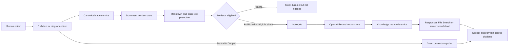

# Cooper Knowledge Studio build plan

Scoped requirements and vertical implementation plan.

Date: July 16, 2026

Companion index: [19-cooper-knowledge-studio-index.md](./19-cooper-knowledge-studio-index.md)

Prototype: [cooper-knowledge-studio-prototype.html](./cooper-knowledge-studio-prototype.html)

## 1. Problem and goal

### Problem

Cooper currently centers context around meetings, sessions, and generated artifacts. Human writing is not yet a first-class workflow: the existing Library is primarily a generated-output workbench, document views are largely read-oriented, and opening a canvas implies active agent/session context.

This leaves a gap for people who want to think privately, start from a blank page, develop original thought, and decide later whether to invite Cooper or publish the work as shared knowledge.

### Goal

Ship one coherent Knowledge Studio in which a user can create, edit, save, version, share, publish, search, and retrieve documents and diagrams. Cooper must remain optional during authoring and gain access only through explicit session or publication state.

### Success measures

Establish baselines before setting numerical targets. Track:

- Document creation-to-first-save completion.
- Weekly return-to-document rate.
- Search-to-open success rate.
- Percentage of Cooper knowledge answers with visible source attribution.
- Retrieval relevance from a maintained evaluation set.
- Autosave failure and version-restore rates.
- Private or unauthorized document retrieval incidents, with a target of zero.

### Five-whys check

1. Why build a WYSIWYG editor? People need to create and revise content directly.
2. Why not rely on Cooper-generated artifacts? Human-authored thinking is itself valuable context and gives people ownership of the work.
3. Why separate private writing from a session? An always-on agent can create pressure and violates the desired “private moment.”
4. Why index published documents? Future sessions need to find relevant prior thought without loading the entire knowledge base.
5. Why keep the source separate from embeddings? Editing, portability, versioning, permissions, and deletion require a durable canonical document; embeddings are only a retrieval derivative.

## 2. Users and stakeholders

### Primary user

An individual contributor or leader who writes briefs, decisions, notes, plans, and diagrams and may later collaborate with Cooper.

### Secondary users

- Teammates who search, read, and reuse published knowledge.
- Session participants who turn live context into editable documents.
- Workspace administrators responsible for permissions, retention, and provider policy.

### Decision and acceptance roles

- Product/design sign-off: product owner for Cooper.
- Engineering sign-off: owner of the React application, document pipeline, and agent context service.
- QA/verifier: validates privacy boundaries, editing round trips, version restore, indexing, retrieval attribution, responsive behavior, and accessibility.

## 3. Current state to desired state

| Current state | Desired state |
| --- | --- |
| Library is organized around generated artifacts and sessions. | Docs is organized around human-readable documents and diagrams. |
| Markdown is rendered or revised through background generation. | Rich text is directly editable in a full-screen WYSIWYG surface. |
| Session canvas content reads like an output preview. | The same editor component is available inside Session Canvas and Docs. |
| Starting work is closely associated with starting a Cooper session. | New documents open privately; Cooper is invited explicitly. |
| Artifact metadata references its source session. | Documents have durable identity, versions, visibility, projects, and optional session lineage. |
| Agent context is primarily session/project input. | Published human writing is retrieval-eligible, attributable knowledge. |
| Diagram output is visual/markup. | A diagram has editable graph JSON and an agent-readable text projection. |

## 4. Scope

### In scope

- On-demand workspace navigation: naked Cooper mark, hover/focus lockup, and click-open drawer.
- Searchable Docs library.
- Blank document and starter-template creation.
- Full-screen rich-text editor using Inter.
- Sparse formatting toolbar and reusable content blocks.
- Autosave, durable versions, and restore.
- Private, session-only, shared, published, and archived states.
- Explicit Start with Cooper / End session transitions.
- Direct current-document context for an active session.
- One shared editor component for Docs and Session Canvas.
- Diagram document type with editable node/edge JSON.
- Deterministic text/Markdown projection for documents and diagrams.
- OpenAI vector-store ingestion for retrieval-eligible versions.
- Permission-aware semantic/keyword retrieval with document/version citations.
- Index status, retry, unpublish, and delete behavior.
- Desktop and mobile-responsive document workflows.

### Out of scope now

- Real-time multiplayer editing and CRDT infrastructure.
- Full Microsoft Word feature parity.
- Full Figma/Miro diagram feature parity.
- Arbitrary plugins or third-party block marketplace.
- Advanced print layout, page breaks, headers/footers, and mail merge.
- Automatic ingestion of every private autosave into the global knowledge index.
- Cross-workspace or cross-tenant retrieval.
- A custom vector database before hosted retrieval is evaluated.

### Non-goals

- Making chat the dominant authoring interface.
- Replacing Projects or Sessions with Docs.
- Treating embeddings as the canonical source of content.
- Allowing the model to decide whether a user is authorized to retrieve a document.
- Starting a Cooper session whenever a document opens.
- Generating model summaries on every keystroke.

## 5. Data, edge cases, and constraints

### Core data

Add durable entities for:

- `knowledge_documents`
- `document_versions`
- `document_permissions` or visibility grants
- `knowledge_index_records`
- `session_document_bindings`
- optional `document_comments` after the first editor slice

Each document version should store structured editor JSON plus normalized Markdown and plain text. Diagram versions should store graph JSON plus deterministic text.

### Source of truth

- Rich text: editor JSON.
- Diagram: graph JSON.
- Retrieval: derived text file linked to one exact document version.
- OpenAI vector-store record: derivative index metadata, never the only copy.

### Edge cases and failure modes

- Browser closes during an autosave.
- Two tabs edit the same document.
- Session begins while the latest save is still pending.
- Session ends while Cooper is applying a revision.
- A document is unpublished while an index deletion is eventually consistent.
- A document is deleted but stale retrieval results remain briefly available.
- The editor cannot round-trip a pasted structure to Markdown without loss.
- Large pasted documents exceed editor, model-context, or file limits.
- Diagram nodes have no labels or disconnected groups.
- Indexing fails after the canonical version has saved successfully.
- Retrieval returns an older version than the one the user is viewing.
- User loses permission after a session bound the document.
- Search returns semantically similar but low-authority or stale work.
- Mobile toolbar and side rail obscure the editable page.

### Constraints and non-functionals

- Privacy enforcement occurs server-side before retrieval.
- Private drafts must never enter shared vector stores.
- Canonical saves must not depend on OpenAI availability.
- Indexing is asynchronous, retryable, idempotent, and observable.
- Editor input must be sanitized before rendering or export.
- Document operations require optimistic concurrency or version preconditions.
- Keyboard navigation, visible focus, semantic headings, and screen-reader labels are required.
- Mobile must have no horizontal document overflow outside intentional diagram canvas panning.
- The editor engine must preserve the supported document schema across reload and export/import.
- Provider IDs and raw retrieval scores remain server-side unless intentionally exposed for diagnostics.

## 6. MoSCoW prioritization

### Must

- Private-by-default document creation and editing.
- Autosave and version history.
- Searchable Docs library.
- Blank document plus one template.
- Explicit Start with Cooper and session-only context binding.
- Shared editor component in Docs and Session Canvas.
- Canonical structured JSON plus Markdown/plain-text projection.
- Server-enforced visibility and project/tenant filters.
- Publish/unpublish and asynchronous index lifecycle.
- File Search or Retrieval integration with source/version attribution.
- Deletion and index-removal workflow with visible status.

### Should

- Format, Blocks, and Details utility rail.
- Document comments and suggestion anchors.
- Diagram documents with graph JSON and text projection.
- Hybrid semantic and lexical retrieval.
- Template gallery and project-scoped templates.
- Retrieval evaluation set and score-threshold tuning.
- Version compare and one-click restore.

### Could

- Inline AI suggestion mode with tracked accept/reject.
- Collaborative cursors and multiplayer editing.
- Custom reusable blocks.
- Repository-backed Markdown synchronization.
- Local-only search over private drafts.
- Mermaid import/export for compatible diagrams.

### Won't in the first release

- Full office-suite parity.
- Always-on Cooper in the editor.
- Indexing every keystroke.
- Global cross-tenant retrieval.
- Custom vector infrastructure before hosted retrieval is measured.
- Model-controlled authorization.

## 7. Target architecture



### Recommended OpenAI lane

Use OpenAI-hosted vector stores for the MVP. The [Retrieval guide](https://developers.openai.com/api/docs/guides/retrieval) documents semantic search, vector-store search, attribute filtering, query rewriting, ranking options, and automatic file chunking/embedding/indexing. The [File Search guide](https://developers.openai.com/api/docs/guides/tools-file-search) documents model access to those stores. The [embeddings guide](https://developers.openai.com/api/docs/guides/embeddings) explains the semantic representation that makes similarity search possible.

The application should own a `KnowledgeRetrievalService` interface so Realtime Cooper, Responses-based workers, and future providers use the same authorization and citation contract.

Suggested server interface:

```ts
interface KnowledgeRetrievalService {
  indexVersion(input: IndexDocumentVersionInput): Promise<IndexReceipt>;
  removeVersion(input: RemoveIndexedVersionInput): Promise<void>;
  search(input: AuthorizedKnowledgeQuery): Promise<KnowledgeHit[]>;
}
```

Use Responses `file_search` when the model should decide whether and how to search during a Responses task. For the Realtime voice session, expose an application-owned `search_knowledge` function tool that calls the same service and returns authorized hits with citations.

### Retrieval policy

1. Authorize workspace, user, project, and visibility.
2. Apply attribute filters before semantic ranking.
3. Prefer the current project and recent authoritative versions.
4. Combine exact-term and semantic ranking where possible.
5. Limit results and include only useful chunks.
6. Preserve document ID, version ID, title, and source URL.
7. Show citations in the Cooper UI.
8. Log query, filters, returned sources, latency, and user feedback for evaluation.

## 8. Vertical INVEST slices

Epic: make human-authored work a private-first, editable, retrievable knowledge source for Cooper.

| Slice | Observable value | Pattern | Expected size |
| --- | --- | --- | --- |
| KS-01: document schema and private save | A user can create a private blank document, reload it, and keep editing. | Workflow step | 1–2 days |
| KS-02: Docs library and on-demand shell | A user can reveal workspace navigation on demand, then list, search, filter, select, and reopen documents without a persistent side or top nav. | Workflow step | 1–2 days |
| KS-03: WYSIWYG core | A user can type, format headings/emphasis/lists/links, paste safe content, and save structured JSON. | De-risk the unknown first | 2 days |
| KS-04: version restore | A user can see saved versions and restore one without losing the current version. | Failure mode | 1–2 days |
| KS-05: blank and template starts | A user can choose blank or one starter structure without beginning a session. | Data/input variation | 1 day |
| KS-06: explicit Cooper binding | A user can start/end Cooper and the active session receives the exact current snapshot. | Integration seam | 1–2 days |
| KS-07: editable Session Canvas | A session can create/open the same document editor and save to the same document ID. | Persona/workflow slice | 2 days |
| KS-08: publish and index job | A published version is uploaded, indexed, retryable, and visibly ready; private versions are excluded. | Integration seam | 1–2 days |
| KS-09: authorized retrieval | Cooper can retrieve published documents with project/visibility filters and return citations. | Integration seam | 2 days |
| KS-10: unpublish/delete | Removing eligibility queues index removal and blocks the document at authorization time immediately. | Failure mode | 1–2 days |
| KS-11: diagram source and projection | A user can save nodes/edges and inspect deterministic agent-readable text. | Data/input variation | 2 days |
| KS-12: diagram retrieval | Published diagram text is indexed and cited like a document. | Workflow step | 1 day |
| KS-13: retrieval evaluation | The team can replay representative queries and inspect relevance, citations, filters, latency, and failures. | Deferred non-functional | 1–2 days |

### Thinnest useful first slice

KS-01 + the smallest editor portion of KS-03:

- Add document and version persistence.
- Add Docs navigation with one “New blank document” action.
- Open a full-screen editor with title and paragraph support.
- Autosave structured JSON and reload it.
- Display “Private draft — not available to Cooper.”
- Do not add chat, indexing, templates, diagrams, or sharing yet.

This proves the central product behavior—private human writing—without waiting on retrieval or agent integration.

## 9. Sample acceptance criteria

### On-demand workspace navigation

```text
Given I am working in Docs,
Then no top navigation or persistent left navigation occupies the canvas,
And only the Cooper mark is visible by default,
When I hover or focus the mark,
Then the Cooper / AIRES WORKSPACE lockup is revealed,
When I activate the launcher,
Then the full left navigation opens as an overlay without shifting the document list.
```

### Private document creation

```text
Given I am in Docs,
When I create a blank document,
Then a full-screen editable page opens without starting a Cooper session,
And the document visibility is Private,
And no index job is created.
```

### Autosave and reload

```text
Given I changed the document,
When the autosave debounce completes,
Then a durable version is stored,
And the UI reports Saved,
And reopening the document restores the same supported structure and text.
```

### Start with Cooper

```text
Given a private document is open,
When I choose Start with Cooper,
Then a session begins with the current document snapshot attached directly,
And the document remains unpublished,
And the UI distinguishes Session-only context from Published knowledge.
```

### End session

```text
Given Cooper is active with the current document,
When I end the session,
Then the session binding closes,
And document editing and autosave continue,
And the document does not become retrieval-eligible unless I separately publish it.
```

### Publish and retrieve

```text
Given I am authorized to publish a document,
When I publish its current version,
Then an idempotent index job uploads the normalized derivative,
And the document shows an indexing status until ready,
And later authorized searches may return that exact version with a source citation.
```

### Private retrieval boundary

```text
Given a document is Private,
When any user or Cooper session searches workspace knowledge,
Then that document and all of its private versions are absent from the authorized retrieval candidates and results.
```

### Permission change

```text
Given a published document was indexed,
When the current user loses permission to it,
Then authorization excludes it immediately even if index deletion is still pending,
And the stale vector-store record cannot be surfaced to that user.
```

### Diagram projection

```text
Given a diagram has labeled nodes and edges,
When it saves,
Then the graph JSON remains the editable source,
And a deterministic text projection records groups, node labels, edge direction, and notes,
And the user can inspect the projection before publication.
```

### Mobile editor

```text
Given the editor is opened at a 390px viewport,
When I write, format text, or open the utility rail,
Then the document remains readable,
And the page does not create accidental horizontal overflow,
And the side rail can be dismissed without losing the selection or draft.
```

## 10. Verification plan

### Editor contract tests

- Structured JSON round trip for headings, paragraphs, emphasis, lists, links, callouts, and supported pasted content.
- Markdown/plain-text projection fixtures.
- Sanitization of pasted HTML and links.
- Concurrency/version-precondition behavior.

### Privacy and retrieval tests

- Private versions never enqueue index jobs.
- Session-only snapshots are attached only to the named session.
- Workspace/project/visibility filters are server-built and logged.
- Unpublished/deleted documents are blocked before provider search results are returned.
- Citation document/version IDs match the indexed derivative.

### Retrieval evaluation

Maintain a small versioned set containing:

- Semantic paraphrase queries.
- Exact ID/name queries.
- Stale-version traps.
- Cross-project ambiguity.
- Unauthorized/private distractors.
- Questions with no supported answer.

Measure retrieval relevance separately from final-answer quality.

### UX and accessibility

- Desktop at 1536×1024 and laptop at 1280×720.
- Mobile at 390×844.
- Keyboard-only editor and library workflow.
- Screen-reader labels for toolbars, tabs, dialogs, save state, and retrieval state.
- Reduced-motion behavior.
- No accidental horizontal overflow outside the intentional diagram canvas.

## 11. Rollout sequence

### Phase 1: private writing

KS-01 through KS-05. Ship private documents, editor, autosave, versions, library, and a minimal starter template.

### Phase 2: human + Cooper collaboration

KS-06 and KS-07. Bind a current document to a session and use the same editor in Session Canvas.

### Phase 3: published knowledge and RAG

KS-08 through KS-10 and KS-13. Add index lifecycle, authorized retrieval, citations, deletion behavior, and evaluation.

### Phase 4: diagrams

KS-11 and KS-12. Add the node canvas, deterministic text projection, and retrieval.

### Phase 5: richer collaboration

Consider suggestions, comments, multiplayer, custom blocks, and repository synchronization only after core writing and retrieval behavior is measured.

## 12. Definition of Ready

- [ ] Product owner confirms `Docs` as the navigation label.
- [ ] Editor engine spike proves structured JSON save, paste sanitization, and Markdown/plain-text projection for the supported schema.
- [ ] Document visibility states and publish semantics are approved.
- [ ] Workspace/project authorization rules are written and testable.
- [ ] Data retention and deletion expectations for OpenAI Files/vector stores are agreed.
- [ ] Current database and migration approach is selected.
- [ ] Session context contract accepts an exact document snapshot plus document/version IDs.
- [ ] Index job contract is idempotent and observable.
- [ ] Retrieval result and citation UI contract is approved.
- [ ] QA has representative private/public permission fixtures and retrieval queries.
- [ ] Mobile editor and side-rail behavior is accepted from the prototype.

## 13. Prototype completion checkpoint

The integrated localhost prototype now covers KS-01 through KS-12 at prototype fidelity. It includes the private-first WYSIWYG flow, on-demand shell, library, templates, versions, sharing, explicit Cooper binding, Session Canvas Write, publish/index/remove lifecycle, permission-filtered File Search, citations, diagram source/projection, responsive behavior, and automated regression coverage.

Implementation-specific notes:

- Rich text uses sanitized HTML as the prototype canonical source; production should migrate to a structured editor JSON schema after the editor-engine spike.
- Persistence is a durable local JSON store; production needs database migrations and row-level authorization.
- OpenAI indexing is observable and retryable in the prototype, including completion polling; production should move provider work to a durable asynchronous queue.
- Application-side document authorization is enforced before File Search candidate selection, but production permissions need real workspace/user/project grants.
- KS-13 remains an operational evaluation activity: build and maintain the representative retrieval dataset before rollout.

## Recommended production decision

Approve the private editor and lifecycle interaction from the completed prototype, then run the editor-engine/schema spike and database/authorization design in parallel. Keep the knowledge-service interface and retrieval policy intact while replacing prototype persistence with production infrastructure.
