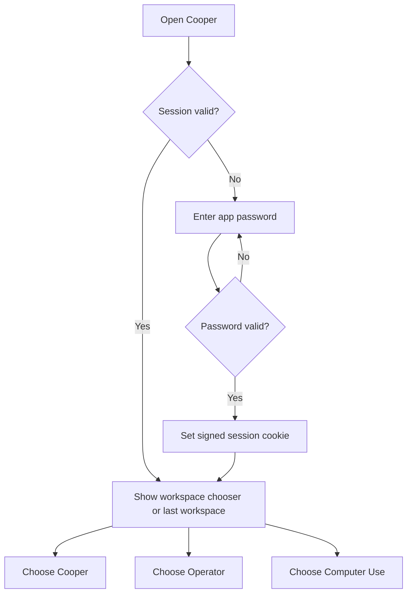
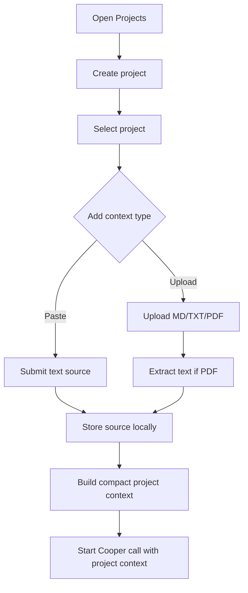
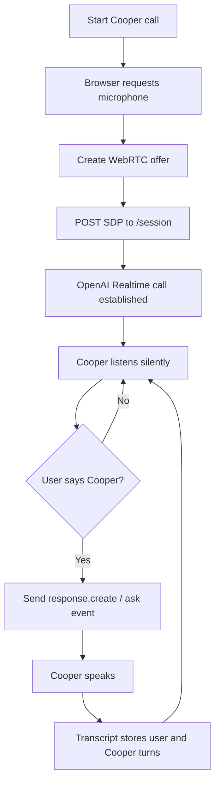
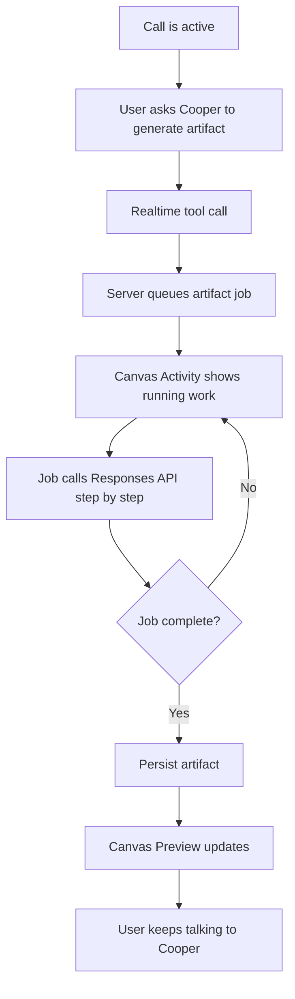
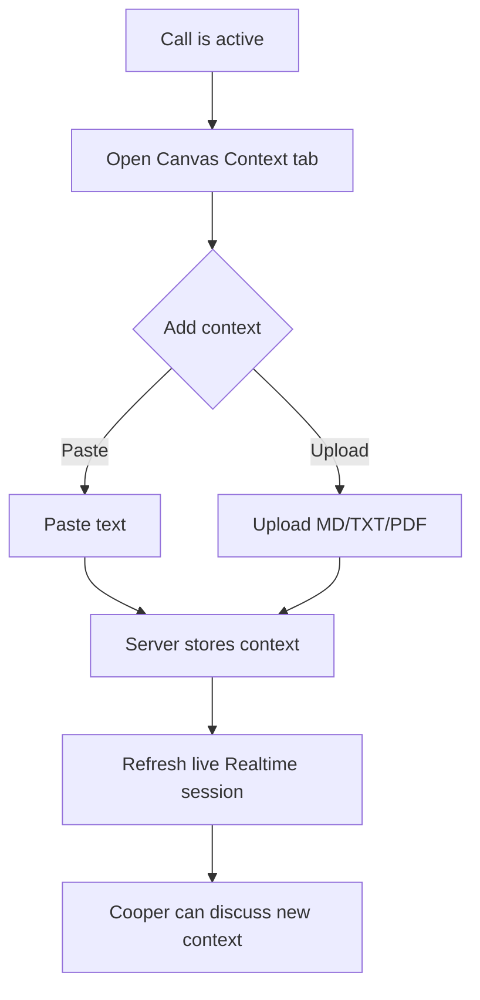
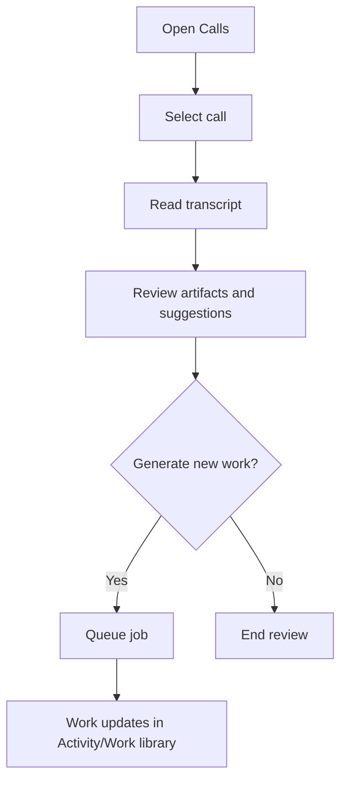
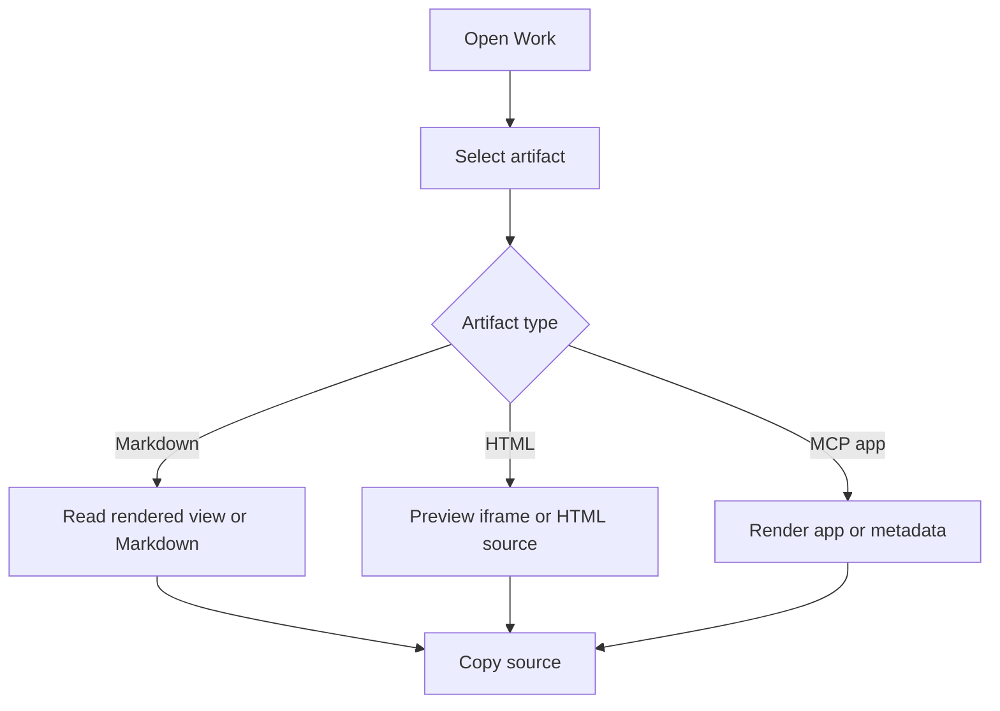
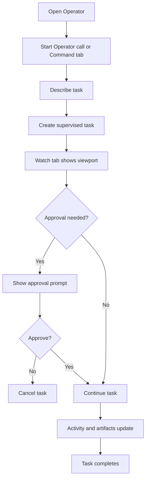
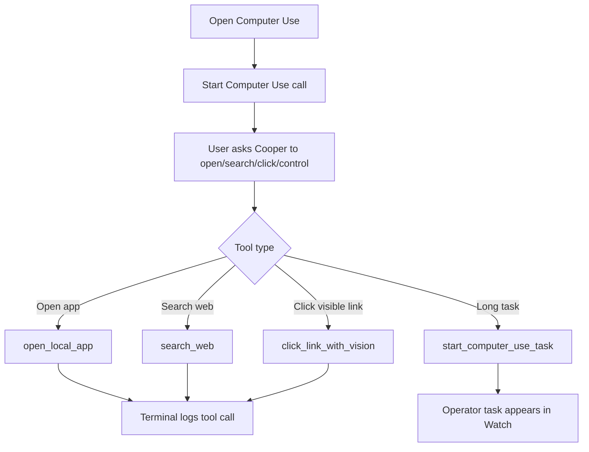
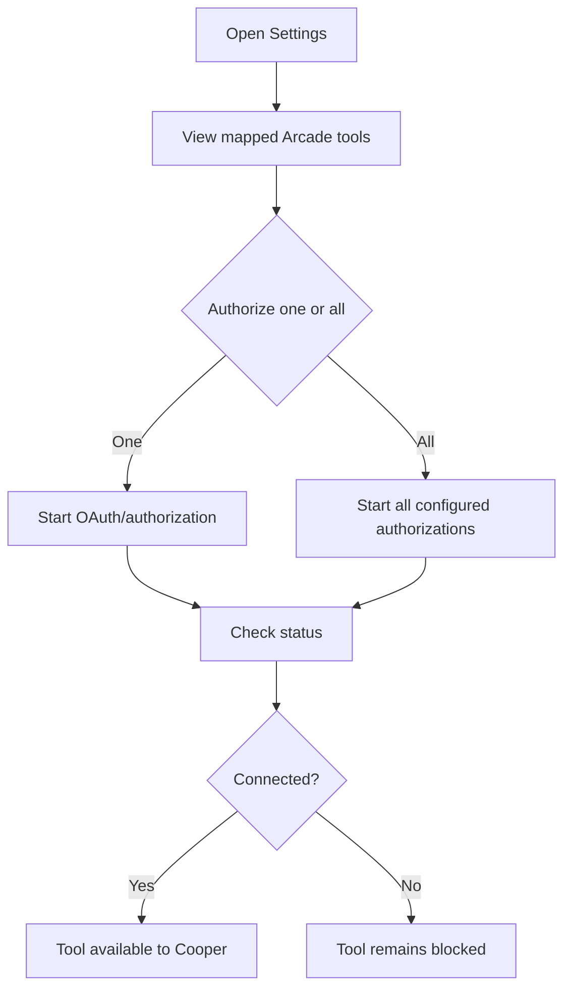

# Cooper Key User Flows

## 1. Unlock and Choose Workspace

### Happy Path

1. User opens `localhost:5000`.
2. User enters the private app password.
3. App stores authenticated session cookie.
4. User chooses Cooper, Operator, or Computer Use.
5. App loads the selected workspace.

### Failure States

- Missing server password config.
- Incorrect password.
- Expired session cookie.
- Network/server unavailable.

## 2. Create Project and Add Context

### Happy Path

1. User creates a project for a sprint, epic, customer workflow, or product area.
2. User pastes agent output or uploads Markdown/PDF/text files.
3. Server stores sources with previews and character counts.
4. User starts a call from the project.
5. Cooper receives a compact project context packet when the call starts.

### Design Principle

Context must be explicit. The app should not silently select unrelated project context.

## 3. Start Cooper Call and Ask for Strategic Input

### Wake Examples

- "Cooper, what do you think?"
- "Hey Cooper, summarize this."
- "Cooper, what are we missing?"
- "Cooper, generate the requirements for this."

### Success Criteria

- Cooper does not speak during normal room conversation.
- Cooper wakes reliably when addressed by name.
- Both the user's words and Cooper's answer are stored in transcript.

## 4. Generate a Live Canvas Artifact by Voice

### Example Prompts

- "Cooper, create the jobs to be done canvas for what we are discussing."
- "Cooper, draw a Mermaid diagram of this workflow."
- "Cooper, build a mobile-first HTML prototype from this plan."
- "Cooper, generate AIRES scoped requirements from this conversation."

### Success Criteria

- User does not need to leave the call.
- Canvas shows that work is running.
- Completed artifact appears in Preview and Work library.

## 5. Add Context During a Call

### Success Criteria

- Context can be added without ending the call.
- Cooper's active session is refreshed.
- Later generated artifacts can use the new context.

## 6. Review Past Call and Generate Follow-Up Work

### Common Outputs

- Post-call kit.
- Execution plan.
- Product requirements document.
- Follow-up summary.
- Code sketch.
- Mermaid diagram.
- HTML prototype.
- AIRES scoped requirements.

## 7. Use Work Library

### Success Criteria

- The artifact is readable by default.
- Source can be copied.
- HTML prototypes can be viewed safely in a sandbox.

## 8. Operator: Delegate and Watch Work

### Success Criteria

- Work is visible while it runs.
- User can stop all active work.
- Risky actions pause for approval.
- Results are queryable by Cooper.

## 9. Computer Use: Voice-Control Local Apps and Browser

### Success Criteria

- Cooper can open allowed apps/sites.
- Web search and vision-click tools log every call.
- Longer work becomes a supervised task.
- User can stop/cancel/status-check active work by voice.

## 10. Settings: Authorize Tools

### Success Criteria

- Cooper cannot use external tools until connected.
- Write tools remain gated.
- Tool call history remains visible for audit.

